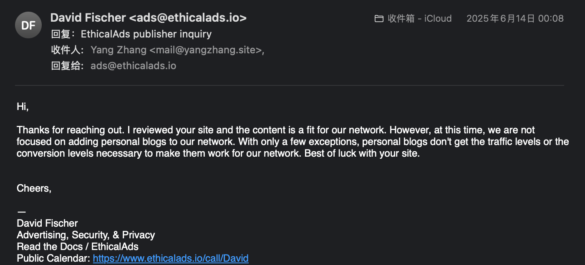
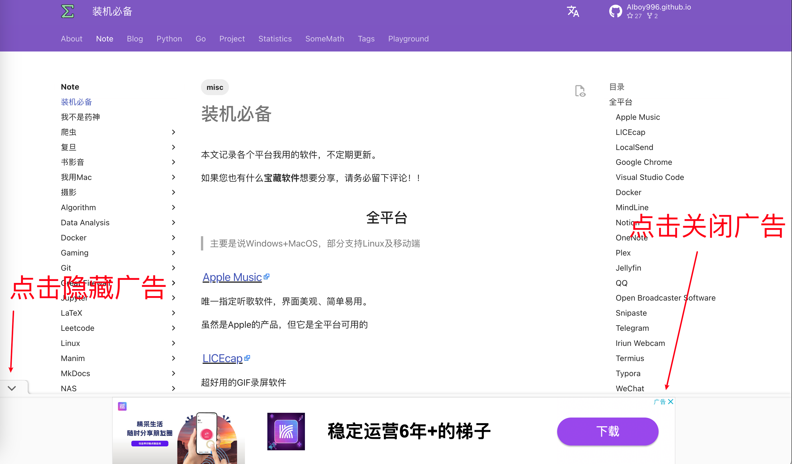
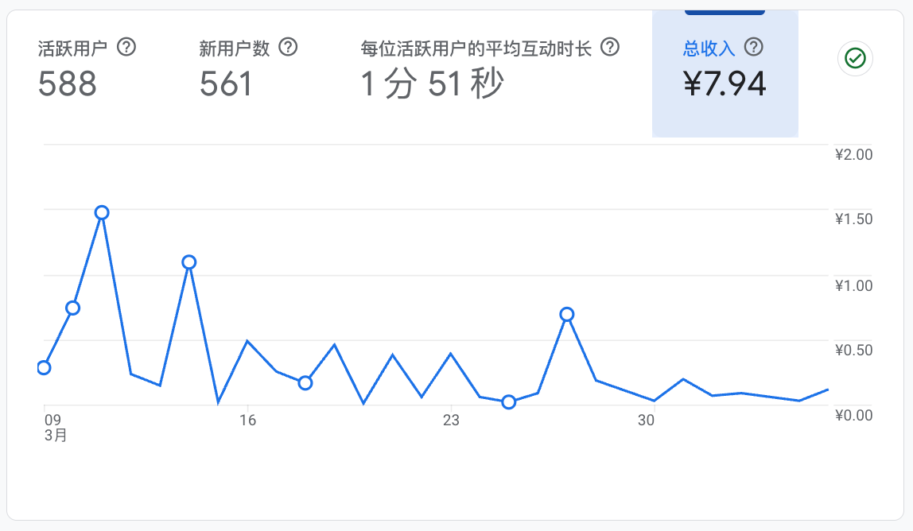
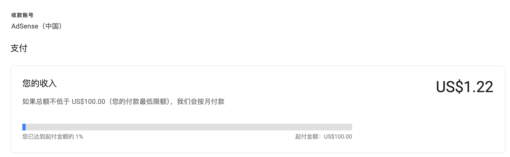

# 广告

是的，我厚颜无耻地在在本站插入了广告。

!!! info "Ads free"
    当然，本站提供了一个**无广告**域名：[yangz.site](https://yangz.site)。不过我还是希望您能从**主域名**（[yangzhang.site](https://yangzhang.site)）访问本站、或者将本站加入白名单，万分感谢🙏

本站自2025年3月7日开始，引入了Google Adsense广告。

!!! warning "请勿轻信广告内容"
    广告的内容由Google Adsense自动插入，我无法控制🤷，并且广告内容大多数和本站内容不相关。

    > 据我观察，梯子广告占比很高😭
    
    我也一直在找质量高一些的广告平台，之前看到了针对开发者的[EthicalAds](https://www.ethicalads.io/)感觉不错，但是他们不接受个人网站：

    

为了降低对用户体验的影响，我只开启了锚定广告，你可以很轻松地隐藏/关闭它：

<figure markdown>

{width=600}

</figure>

不过在移动平台，它总是会**意外地变得很大**，目前我还没找到解决方法：

    <figure style="width: 32%; text-align: center;">
        
        <figcaption>默认大小</figcaption>
    </figure>
    <figure style="width: 32%; text-align: center;">
        
        <figcaption>点击一次隐藏按钮</figcaption>
    </figure>
    <figure style="width: 32%; text-align: center;">
        
        <figcaption>点击两次隐藏按钮</figcaption>
    </figure>

!!! note "2025年6月23日更新"
    最近正在测试各种各样的广告方式。最新测试版本是：在评论区上方插入固定广告，并且插入**半小时最多出现一次**的站内跳转广告。

    上面提到的锚定广告暂时关掉了，确实有点丑。

目前，本站的收入情况如下：

<figure markdown>

{width=400}

<figurecaption>图一乐</figurecaption>
</figure>

距离100$的小目标还有很远：

<figure markdown>

<figurecaption>急急急</figurecaption>
</figure>
