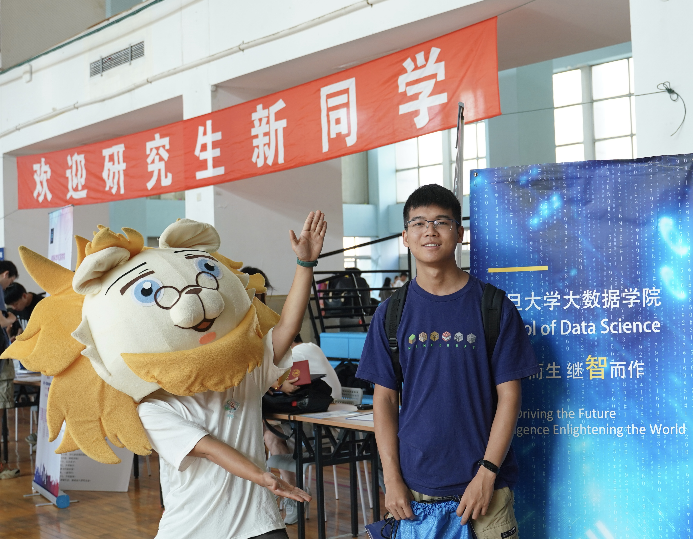

---
tags:
- About
icon: material/file-account
hide:
- comments
---

# 张杨

<figure markdown>
{width=400}
</figure>

## 个人经历

!!! info
    这个人正在找*数据分析师* / *数据科学家* / *算法工程师* 等方向的工作；

    如果有合适的工作机会请务必联系<mailto:mail@yangzhang.site>。

### 教育

- 小学（2007 - 2013）：**村小**(1)
    { .annotate }
    1. 在爷爷奶奶的监护下我度过了狂野快乐的童年；另外特别感谢我在村小遇到的启蒙老师们，尤其是几位刚毕业参加工作的青年教师，给我的村小生活带来了许多色彩。

- 中学（2013 - 2019）：**江苏省致远中学**(1)
    { .annotate }
    1. 是的，这个人的初中和高中是在同一所学校读的

- 大学（2019 - 2023）：**复旦大学，管理学院**，统计与数据科学系
    - 曾获2020年度复旦大学本科优秀学生奖学金三等奖(1)
        { .annotate }
        1. 是的，就这一次三等奖

    - 主要课程：统计推断、回归分析、时间序列分析、多元分析、非参数统计、随机过程(1)
        { .annotate }
        1. GPA：3.4/4.0

- 研究生（2023 - 2026）：**复旦大学，大数据学院**，统计机器学习方向硕士
    - 由[庄吓海](https://zmiclab.github.io/zxh/)教授和[李雷](https://lileitech.github.io/)教授共同指导
    - 研究方向：深度视觉模型，医学影像计算，心脏磁共振图像分析

### 工作/实习

- 中国市场营销研究中心(1)（2021.7 - 2021.9）：**RA**
    { .annotate }
    1. 其实就是在复旦大学-管理学院-李达三楼-某办公室，给一位老师打打工

- 上海正也科技(1)（2023.1 - 2023.4）：**数据仓库**
    { .annotate }
    1. 小厂，做的是医药流向数据SaaS

- 睹煜上海信息服务有限公司(1)（2025.06 - 2025.08）：**数据分析**
    { .annotate }
    1. 得物，终于找了个大家听过的公司

### 项目/论文

- 基于文本挖掘方法的数据科学人才招聘信息分析（本科毕设）
- [npnn](https://github.com/AIboy996/npnn)：纯NumPy实现的，支持自动梯度反向传播的神经网络库
- Xicheng Sheng†, **Yang Zhang**†, Lei Li, Bailiang Chen, Freddy Odille, Xiahai Zhuang: Automated Characterization of Myocardial Scar Topological Patterns for Ventricular Tachycardia Screening, **MICCAI, 2025, Oral**.
