---
tags:
- blog
- 回忆
---

# 请回答2019

2019是我人生的第十九年，发生了很多不可思议的事情。高中毕业，似乎我的人生才刚刚开始。

## 在那之前

2019是我中学时代的终点，也是我认真记录自己生活的起点。

在那之前，我似乎不是那么热衷于记下自己每一年做了什么。
> 大概有一部分原因是，我那时候还能记得住。现在我已经二十四岁了，啥也记不住。

我也不爱拍照，尤其是自拍，那似乎有点“娘们了”。
> 现在我的想法则完全不同，我乐意拍照。不论美丑，记录就好。

所以，凭借着模糊的记忆，和零零碎碎的几张照片。我来为你讲述我人生的前十八年。

### 幼年

<figure markdown>
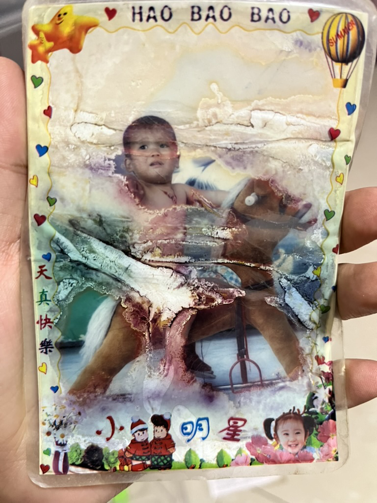{width=300 loading=lazy}
<figurecaption>绝对穿了衣服的！</figurecaption>
</figure>

在我上小学之前，爸妈似乎都还陪在我身边。我对我的**幼儿园**也还有那么点印象：

从大门进去，左手边是三间屋子，右手边是一片空地（或许有一些游乐设施，肯定有一个秋千）。三间屋子里中间那个是看电视的地方，我最爱的就是黑猫警长！右手边的屋子是写字的地方，我写的很差经常被骂。左手边屋子的记不清了，可能是看书的地方，我不是很爱看书。

这就是我对幼儿园仅存的记忆了。据我妈所说，那会儿我经常被丢在幼儿园很晚她才能来接我。所以，我仅存的记忆里压根没有爸妈的身影，可能他们来接我的时候我已经睡着了吧。

另外，那时候我还特别容易生病。经常感冒发烧，就得去**孙大夫**的诊所打针吃药。其他的记不太清了，只记得屁股扎针很痛；诊所旁边有个小卖部可以买吃的；诊所柜台有个算盘，倒放放来可以滑很远。

### 小学
上小学的时候，爸妈都去外地打工了，我成为了留守儿童，好不快活。

完全没人管，放学了就出门疯、天黑了爷爷就喊回家吃饭。丢沙包、捡石子、飞卡牌、跳格子、跳绳，偶尔还去田间地头湖边搞个野炊、放个火。不能再野了。

**爷爷奶奶**肩负起了养育我的重担，不知道是家里真的太穷还是爷爷奶奶过的太节省。早上有豆奶喝、晚上有肉吃对我来说就是最幸福的日子。

奶奶家只有两间屋子，一间是放杂物的，一间是烧菜+吃饭+睡觉的大通间（我本来想说厨房+客厅+卧室，但这些洋气的名字和稻草土坯房子还是不太搭配）。进门正对的就是一个案台，供奉着不知哪位神灵，逢年过节也会点几柱香。右手边就是农村老土灶，左手边就是一个黄皮大柜子，柜子后是一张床。两间屋子摆成L形，中间还有片菜地、有块晒谷场。
> 现在这些都被夷为平地了，可惜一张照片也没留下

两间屋子自然不够我、我姐、我爷我奶四个人住。所以每天晚上，我和我爷爷都会走个几里路去我爸修的**三合院**住。第二天早上再回来吃饭，日复一日。至今我都忘不了爷爷打着手电领着我走在星空下的场景。唯一让我比较开心的是，三合院里有一个海信大彩电，可以每晚看电视！

在我的记忆里，我们家在三合院住的时间并不长。（据说）我爸很快就在我的哀求下又盖了一个楼房，我们就搬到了现在住的地方了。但我很喜欢三合院，进门有一个门房，再往里走是个院子。院子里永远种着果树，葡萄、柿子、桃子，还有向日葵、仙人掌之类的。院子左手边是一堵墙，对面是五爷的家。右手边是烧菜+吃饭+睡觉的大通间厢房，不过装修的比奶奶家好些。正对门房的是堂屋，依然是分了三间：一间睡觉，一间是放杂物，一间客厅。
> 同样的，三合院也被夷为了平地

我对学校的记忆倒是不太深刻了。只记得每天上下学路上和朋友们玩闹嬉戏，天真烂漫。偶尔下雨了，爷爷还会披着黑色雨衣、打着黄皮油纸伞来接我。带我去吃热腾腾的肉包子、或者是刚出炉的cháopái（俺也不知道学名叫什么）。

<figure markdown>
{width=300 loading=lazy}
<figurecaption>就是这个！！香的嘞～</figurecaption>
</figure>

当然，作为留守儿童，我也逃不过成为了爱哭鬼。抱着座机电话，躲在被窝里给我妈哭着打电话是常态。

好在，稍微长大了之后，我就不再哭了。六年级，我就开始寄宿生活了。住在学校的宿舍，开始了有零花钱的日子，依旧好不快活。

那时候我在**村小**遇到了几位好老师。他们都是刚毕业的大学生，洋溢着青春活力。带我们看迪士尼电影、看宫崎骏，停电的晚自修带我们玩成语接龙、传词游戏。我至今记得当年我们班的合唱曲目《明天会更好》，李前前老师带我们一起排练手语。一切都很美好。

<figure markdown>
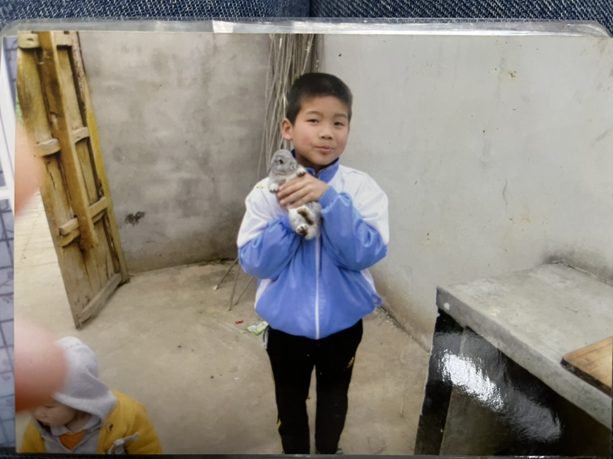{width=400 loading=lazy}
<figurecaption>我还养过一只兔子，可惜因为太臭被我妈遣返了</figurecaption>
</figure>

前两天我还路过了小学的门口：

<figure markdown>
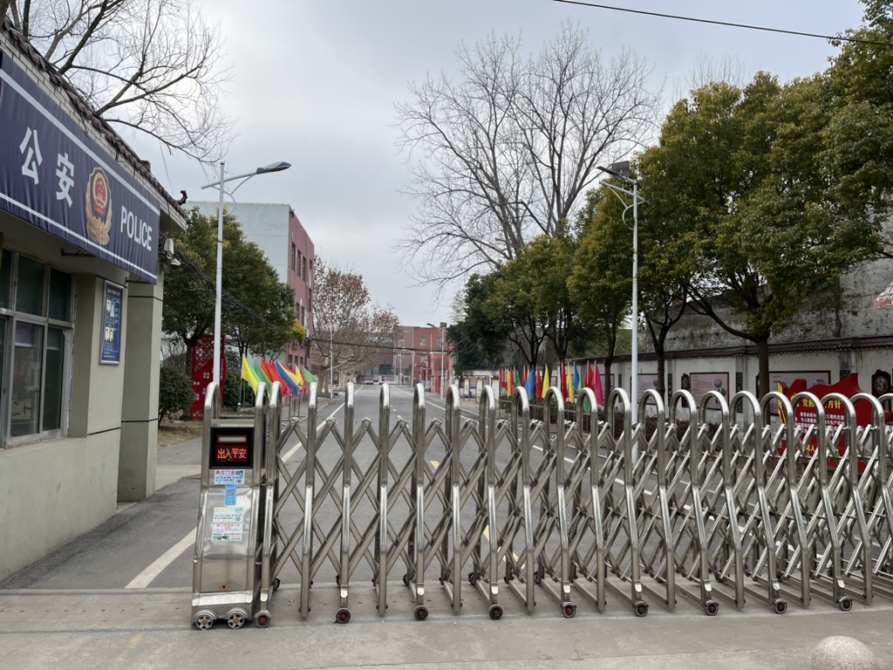{width=400 loading=lazy}
<figurecaption>这条道比记忆中短了太多</figurecaption>
</figure>

不知道毕业照里的那排梧桐树还在不在。

### 中学
中学开始，爸妈就都回到了我身边。不能说是鸡娃，因为我基本还是寄宿在学校，他们压根也管不了我。无论如何，他们的陪伴意义非凡。

说来惭愧，也是这个时候我开始频繁地出入网吧。最开始是六年级的时候，去网吧玩洛克王国。后来初中那会儿去玩CF，没过多久迷恋上了LOL。从此一发不可收拾。周末几乎会在网吧待一整天。所幸没有太过影响我的学习，不至于翘课去上网。到了高中假期变少了，但依然是争分夺秒去网吧坐一会儿，现在有了自己的电脑却没当年那么开心了。

对于初中的第一第二年我的印象不太深了，初三倒是还记得一些。32班的一些人我大概永远都不会忘。

<figure markdown>
{width=400 loading=lazy}
<figurecaption>初中的班服</figurecaption>
</figure>

那会儿的班主任总说，我到了高中会如鱼得水。果然他早就看出了我在理科方面的天赋。

现在想来，整个初中最难忘事的应该是我去北京玩了一趟。

<figure markdown>
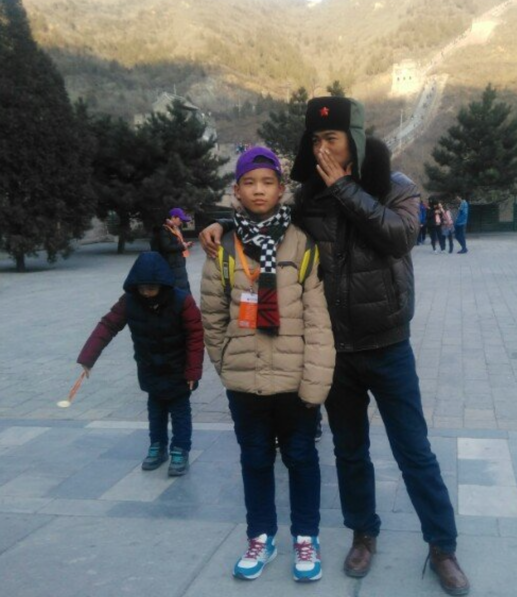{width=300 loading=lazy}
<figurecaption>班主任和我在长城</figurecaption>
</figure>

这是我第一次出门旅行，虽然全程跟团。但也给懵懂的我留下了深刻的印象。可惜当时我拍的照片全都丢了，不然应该有很多有意思的镜头。

到了高中，生活就更单调了，乏善可陈。致远的高中完全是军事化管理（或叫衡水模式），每天都很高压。到了高三假期就更少了，隔一周才有一天的假期。

不过我们私底下偷摸着玩玩手机、看看小书、谈谈恋爱也算是比较平衡的状态。

## 2019 上

高中的最后几个月过的很紧凑，但我现在无论如何也回想不起来那时候的心情了

- 辛苦的一月：试卷试卷做不完的试卷
- 短暂的二月：胡计昶过生日、过年第一次看哔哩哔哩拜年祭、回到学校参加一模、在追just because
- 模糊的三月：月底三模
- 做梦的四月：清华领军计划、复旦和南大的专项计划
- 冲刺的五月：最后的三模、最后一次回家、在追辉夜大小姐、毕业照
- 紧张的六月：高考、南大资格考试、查高考成绩

其中最值得一题的就是四月，算是改变我命运的专项计划。忘记是谁最先开始准备的了，大概是LJQ。大家都抱着试一试的心态报名了，努力地整理材料、写自述。现在看来自招就是高中版本的保研。只不过我们手里的筹码太少了，数竞我拿了省二，物竞只有省三。

然而命运弄人，LJQ算是半个上海人，所以他最想去的学校就是复旦。而我啥也不懂，压根没听过这学校。也跟着他顺便报了名（因为复旦的材料很简单）。没想到，最后我去了上海，他却去了成都。

另外，高考完我去南京考试。小白还陪我一起去玩了一天，也是非常开心的！

<figure markdown>
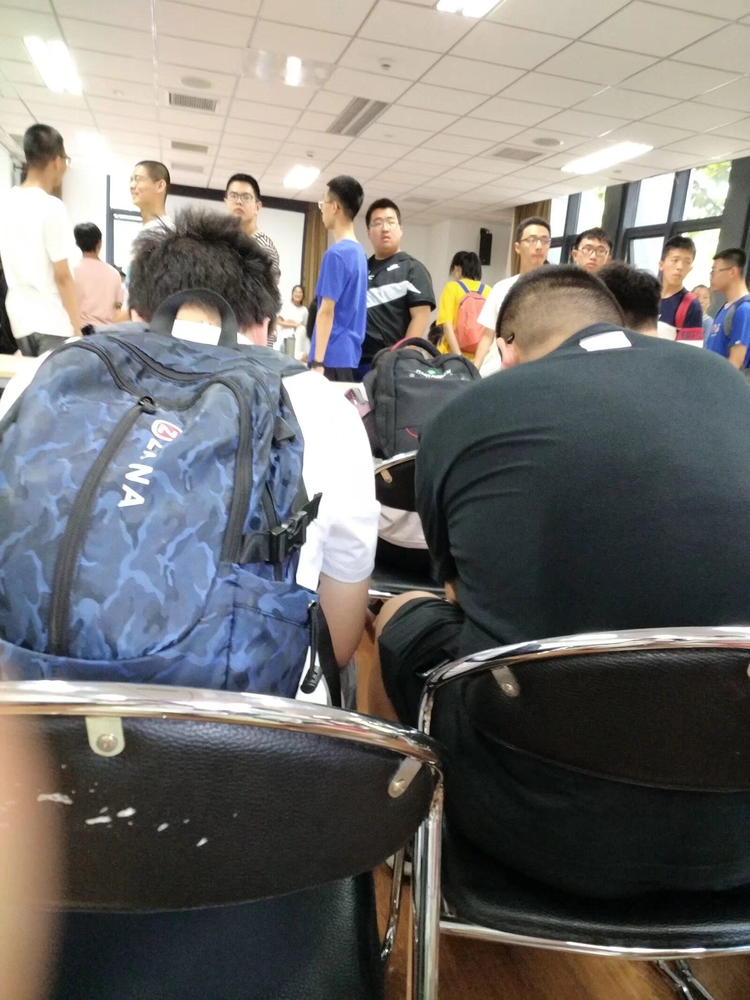{width=300 loading=lazy}
<figurecaption>在南大</figurecaption>
</figure>

爱你哦，小白：

<figure markdown>
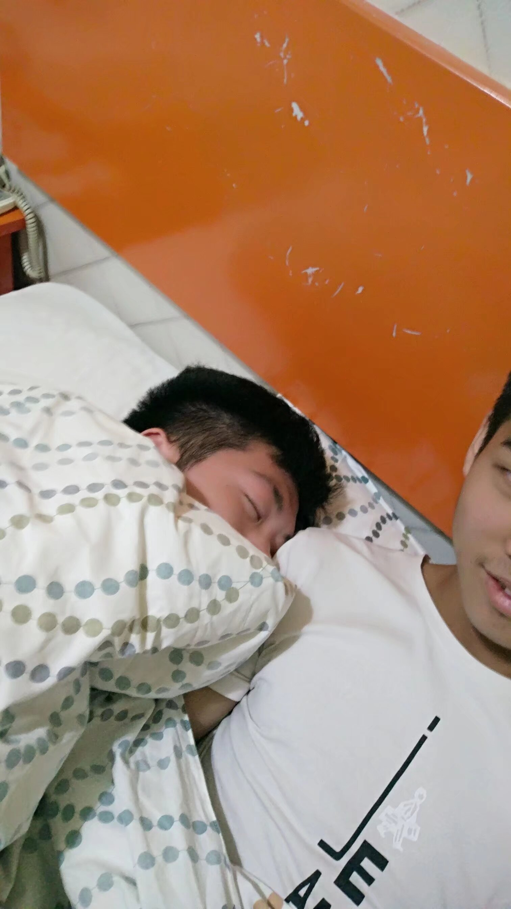{width=300 loading=lazy}
<figurecaption>我和我的男老婆㊙️</figurecaption>
</figure>

## 2019 下

- 恋爱了，但已经成为过去式。懒得写了🐶
- 考上大学了，但好像已经写过了。不再写了😭

感觉2019年度总结写的很全，我这里就在放点照片吧！

<figure markdown>
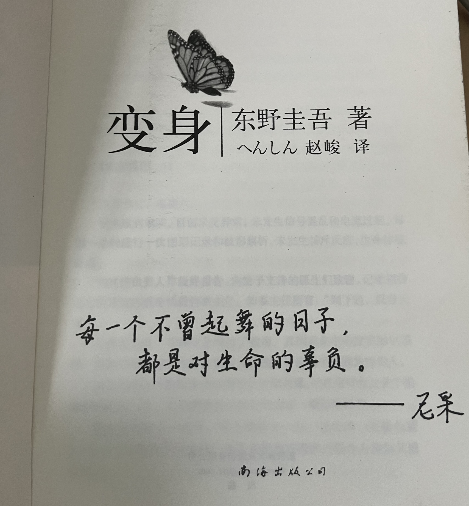{width=300 loading=lazy}
<figurecaption>每一个不曾起舞的日子</figurecaption>
</figure>

可乐过期了：

<figure markdown>
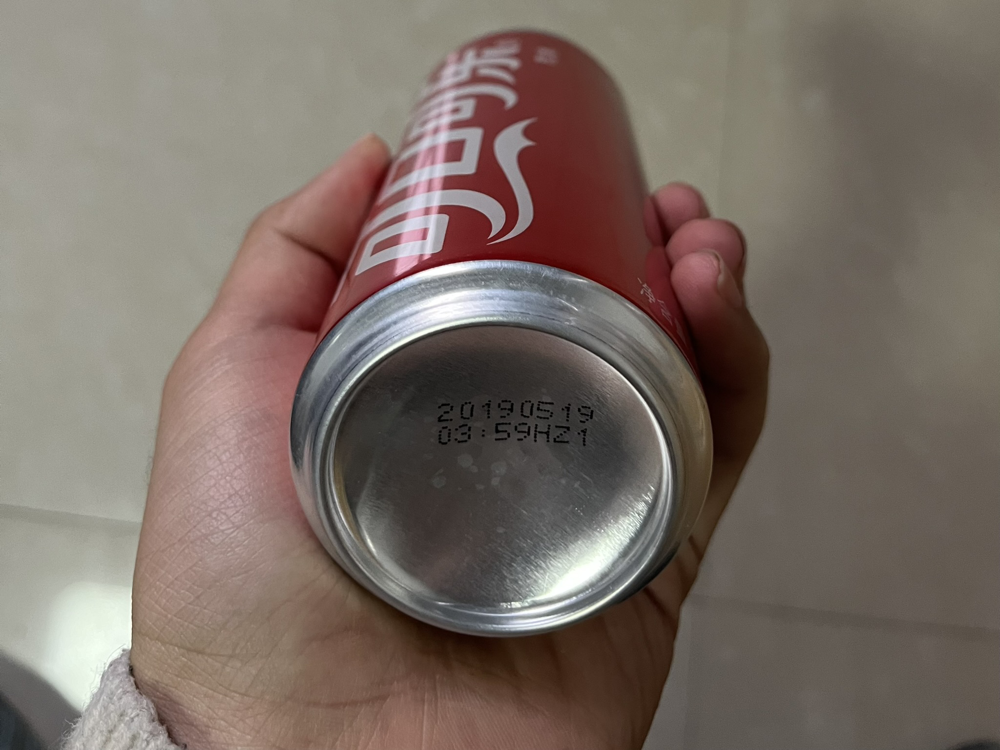{width=300 loading=lazy}
<figurecaption>你还要喝吗</figurecaption>
</figure>

运气不错：

<figure markdown>
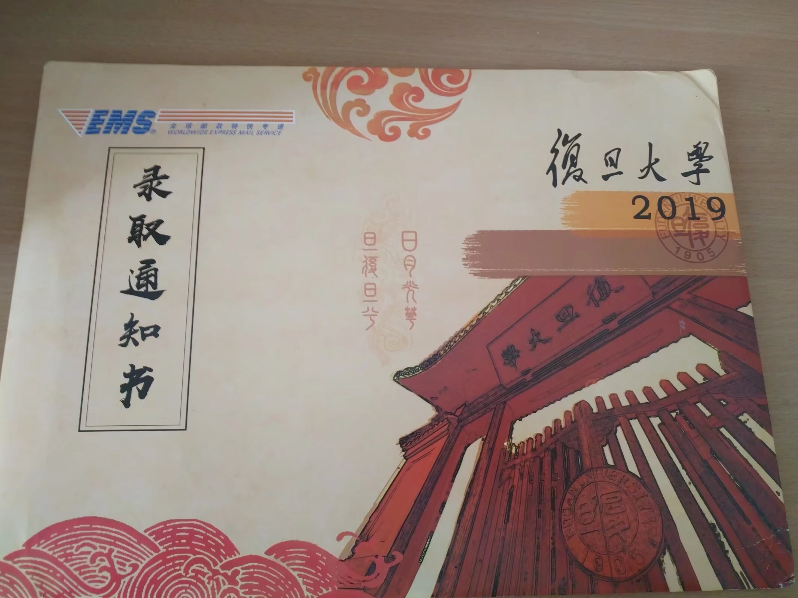{width=300 loading=lazy}
<figurecaption>录取咯</figurecaption>
</figure>

进山咯：

<figure markdown>
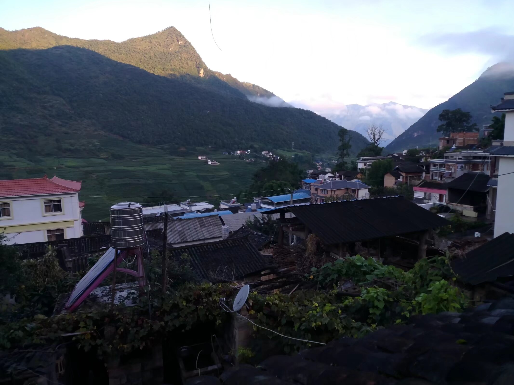{width=500 loading=lazy}
<figurecaption>去了一趟云南，我妈娘家</figurecaption>
</figure>

...

<figure markdown>
{width=200 loading=lazy}
<figurecaption>等你下课</figurecaption>
</figure>

二次元集会：

<figure markdown>
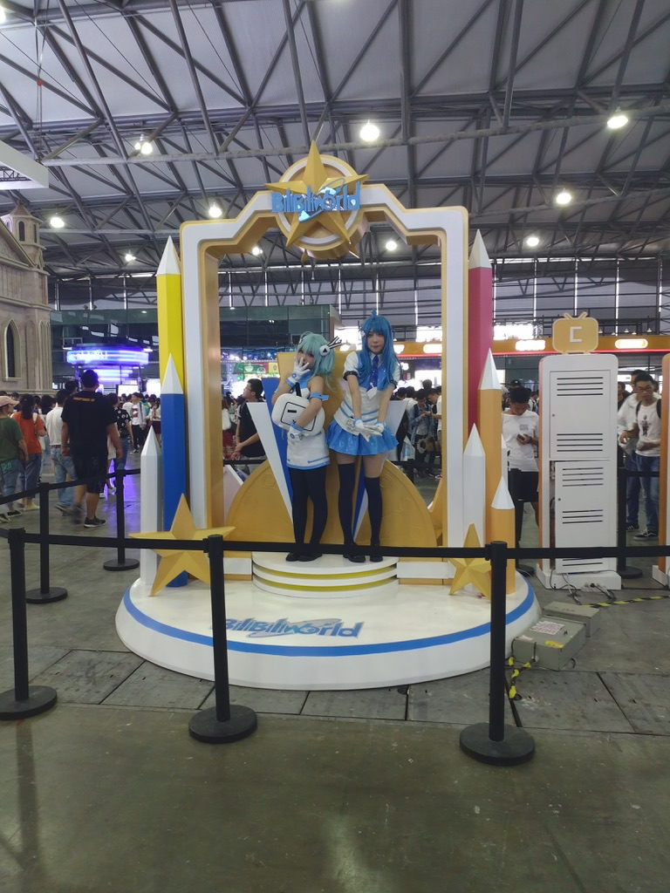{width=300 loading=lazy}
<figurecaption>BW2019！</figurecaption>
</figure>

2019的最后几天，在看白箱！

<figure markdown>
{width=500 loading=lazy}
<figurecaption>我老婆</figurecaption>
</figure>
