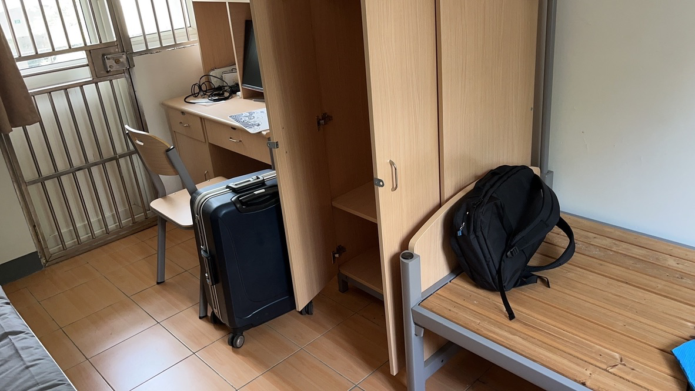
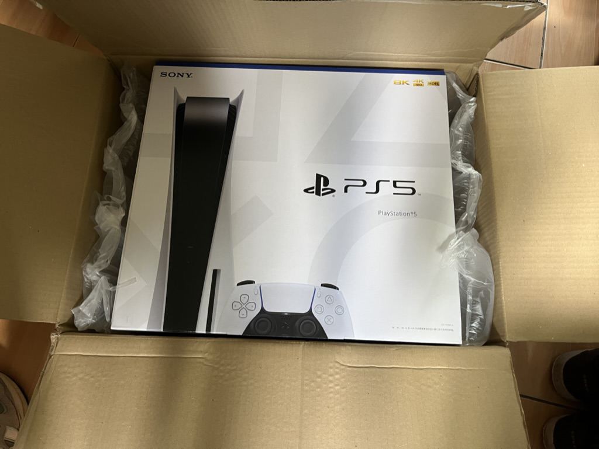

---
tags:
- blog
- 年度总结
---

# 2023年度回顾
> 原标题：2023年度总结。
> 
> 但我越写越觉得，一年之中发生的事情实在是太多了，每个不同的时间点我都有很多不同的想法。想要写一个年度总结是不现实的，就算写了也只是把我年末的想法写了下了。实际上我根本做不到把我这一年的种种思绪总结归纳出一篇日志。反而我真正想做的是回顾这一整年不同时间发生的事情，翻一翻我的相册，感受感受时光的流逝。所以标题改为2023年度回顾。

2023是各种意义上开启新生活的一年！

## 一月

家里下雪咯
<figure markdown>

{width=400}

<figcaption>蓝天白云和白雪</figcaption>
</figure>

今年的除夕是1月21号，考完研没出分的我在家里吃喝玩乐，快哉快哉。

<figure markdown>

{width=400}

<figcaption>这螃蟹，香迷糊咯。</figcaption>
</figure>

除夕夜还难得看了一次春晚，不过现在已经没什么印象了，大概没什么好玩的节目，为数不多的乐趣在于朋友们的吐槽。

## 二月

没快活几天，我就回到了上海，继续那现在看来毫无意义的[实习](../intern)。

<figure markdown>

{width=400}

<figcaption>绿色工位</figcaption>
</figure>

然后比较重量级的事情就是[考研初试](../GEE)的分数出了，现在看来分数低的刚刚好，但当时我已经完全不抱希望、开始准备直接就业了。
<figure markdown>

{width=600}

<figcaption>数学真烂啊&我被统计系除名了</figcaption>
</figure>

## 三月

三月刚好春暖花开，是个出游的好季节，于是乎我来到了南京，会见了网友若干。
<figure markdown>

{width=300}

<figcaption>集美</figcaption>
</figure>

<figure markdown>

{width=300}

<figcaption>集霸</figcaption>
</figure>

在鸡鸣寺求到了<s>开光的</s>香囊一颗，不知道是不是它的作用，考研的复试倒是一帆风顺。

见者有份，也祝大家诸事顺利咯。

<figure markdown>

{width=400}

<figcaption>顺！</figcaption>
</figure>

然后就回到了上海，开启新一轮的[实习](../intern2)，公司没什么好看的，边上有一家中古店倒是看起来不错，经常有一个神秘叔叔坐在门口。

<figure markdown>

{width=400}

<figcaption>我不说没人知道这是开在中国的店</figcaption>
</figure>

三月还发生了很多很多事情

- 考研的初试很烂，复试其实也很烂，但是学校还是捞了我一手，感恩戴德！！在三月的最后一天我收到了复试通过的邮件，心里一块巨石落地。
<figure markdown>

{width=300}

<figcaption>复试写实</figcaption>
</figure>

- 我去办了护照，照片上有一个巨大的粉刺！！！签名也很丑！！！
- 我爸又得了重感冒，陪他去医院检查、挂水，好在虚惊一场。老头子该退休了，希望我能顺利毕业早点找到工作……

最后放一张美照吧：

<figure markdown>

{width=400}

<figcaption>日本研究中心配樱花，刚刚好</figcaption>
</figure>

## 四月
四月好像什么也没发生。

相册里只有几场电影，几顿饭，几个游戏和那么几首歌（还录了桦桦唱给异地女友的超好听的彩虹，这里就不放了～）

放张新鲜出炉的显卡吧：
<figure markdown>

{width=400}

<figcaption>穷鬼甜品卡</figcaption>
</figure>

## 五月

五月的头等大事就是父亲大人和母亲大人来沪巡查，复旦校园、东方明珠、外滩、水族馆。本阿宅实在是不知道带他们去哪里玩了。

<figure markdown>

{width=300}

<figcaption>合照！</figcaption>
</figure>

五月还写完了毕业论文，通关了塞尔达传说（旷野之息+王国之泪二连破！），拿到了日本的旅游签证……一切都挺好

<figure markdown>

{width=300}

<figcaption>林克吃着炸串啤酒救下了塞尔达公主！</figcaption>
</figure>

## 六月

六月就是毕业季了。

留下了许许多多的[学士服照片](../graduation_pics)：
<figure markdown>

{width=400}

<figcaption>我和我清澈愚蠢的室友们</figcaption>
</figure>

也终于去日本来了一次[二次元朝圣](../travel_to_japan)：
<figure markdown>

{width=400}

<figcaption>不论我怎么站在这个场景里都还是太突兀，放一张空镜吧</figcaption>
</figure>

毕业，太爽了！！！能不能每年都毕业一次啊？

## 七月

七月哥们就是社会人啦！

回国第一时间拿到了硕士的录取通知书，真的太简陋了……然后暂时告别了学校，搬到了没有窗户的公寓，开始独居生活

<figure markdown>

{width=400}

<figcaption>真的是蜗居！</figcaption>
</figure>

虽然房间很小，但日子过的还行。

<figure markdown>

{width=300}

<figcaption>这西瓜一口下去，谁懂</figcaption>
</figure>

又回到了熟悉的李达三614，感谢chu老师在暑假期间赏了口饭吃
<figure markdown>

{width=400}

<figcaption>不过这次是两个人共享614</figcaption>
</figure>

还去了ybc哥哥家里吃火锅！！！
<figure markdown>

{width=400}

<figcaption>谁会不喜欢会腌肉的男人呢</figcaption>
</figure>

七月就这样慢悠悠地过去了。

## 八月

八月首先学习了绿植的灌溉和救护。
<figure markdown>

{width=300}

<figcaption>吊钟真的很难养</figcaption>
</figure>

然后又回家快活了几天

<figure markdown>

{width=400}

<figcaption>村里的天空真的很好看</figcaption>
</figure>

<figure markdown>

{width=400}

<figcaption>村里的云也是一绝</figcaption>
</figure>

偶尔露两手炒个菜
<figure markdown>

{width=300}

<figcaption>旺旺小小酥配米饭，口感绝</figcaption>
</figure>

和狗子吃最后的午餐，然后就滚回上海咯
<figure markdown>

{width=400}

<figcaption>别人家到狗子，很乖</figcaption>
</figure>

终于等到了开学
<figure markdown>

{width=400}

<figcaption>欢迎研究生新同学</figcaption>
</figure>

住进了豪华二人寝室
<figure markdown>

{width=400}

<figcaption>落地床=随时随地可躺</figcaption>
</figure>

八月还有一件让人哭笑不得的事情，小桀塌房了！
<figure markdown>

{width=400}

<figcaption>一层又一层！</figcaption>
</figure>

桀哥原来只是🤡，八月就在这样一场舞台剧中结束了。

## 九月

在年老师的蛊惑下，我还是全款拿下了PS5
<figure markdown>

{width=400}

<figcaption>SONY大法好</figcaption>
</figure>

虽然有些迟，但我还是加入了ZMIC大家庭！
<figure markdown>

{width=400}

<figcaption>ZMIC！</figcaption>
</figure>
大家真的都非常nice😭

还在中秋，第一次包了月饼
<figure markdown>

{width=400}

<figcaption>外表平平无奇，实则内有乾坤！</figcaption>
</figure>

九月就这样快乐地一闪而过。

## 十月

十月过了两次生日，一次和ZMIC的朋友们，一次和xy

<figure markdown>

{width=400}

<figcaption>麻友们眼都直了</figcaption>
</figure>

<figure markdown>

{width=400}

<figcaption>超好吃的白巧蛋糕</figcaption>
</figure>

和xy逛了很多圈财大，但还没逛够

<figure markdown>

{width=400}

<figcaption>财大牛B</figcaption>
</figure>

还没来得及仔细回味，心动的十月就结束了。

## 十一月

又是一位网友成功奔现，可惜晚上的FDU哪里都是暗淡的

<figure markdown>

{width=300}

<figcaption>李达三楼的真皮沙发，谁躺谁叫绝</figcaption>
</figure>

第二天的太阳照常升起，我也照常打工
<figure markdown>

{width=400}

<figcaption>男卫生间独享机位</figcaption>
</figure>

但是约会不能耽误，买一束花送给喜欢的人，一点点的浪漫似乎也没那么难

<figure markdown>

{width=300}

<figcaption>阳光刚刚好</figcaption>
</figure>

毕竟
<figure markdown>

{width=400}

<figcaption>All work no play makes Jack a dull boy</figcaption>
</figure>

学院还组织了一趟去联影的参观，原来国内的影像设备也某种程度上遥遥领先！
<figure markdown>

{width=400}

<figcaption>水不错</figcaption>
</figure>

我买了新的玩具：拍立得，结果第一张果然废掉了

<figure markdown>

{width=400}

<figcaption>模特是不是乱动了</figcaption>
</figure>

看来我只能当人像摄影师！这波是初音的问题。

## 十二月

我终于鼓起勇气看完了巨人的最终季，懒得吐槽了，放一张白学构图

<figure markdown>

{width=400}

<figcaption>太扭曲了！</figcaption>
</figure>

冬至是个吃饭的好节气，当然，任何节日都是

<figure markdown>

{width=400}

<figcaption>齐活儿了</figcaption>
</figure>

立于寸土寸金之地的静安寺，求个财运亨通肯定管用！
<figure markdown>

{width=400}

<figcaption>一圈人围着朝炉子里扔钱，堪称奇观</figcaption>
</figure>

在圣诞的前前夜许愿，圣诞老人能听见吗
<figure markdown>

{width=400}

<figcaption>🎄</figcaption>
</figure>

什么？听不见，那我再说一次，我的愿望是明年我和我们能走在正确的道路上。