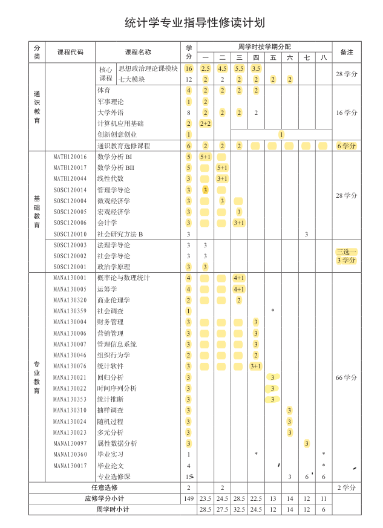
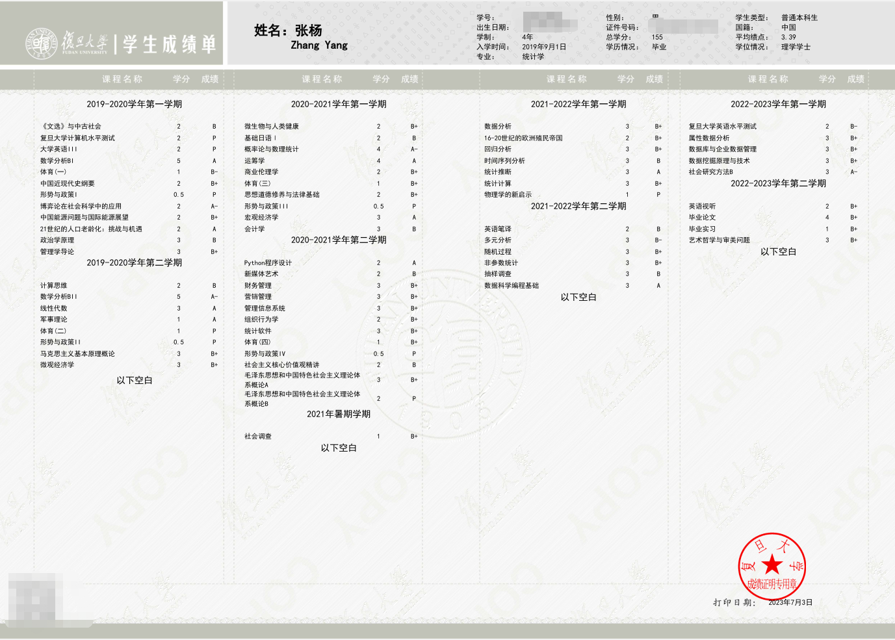
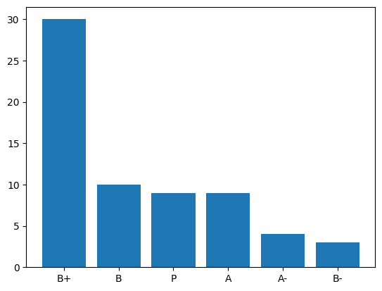
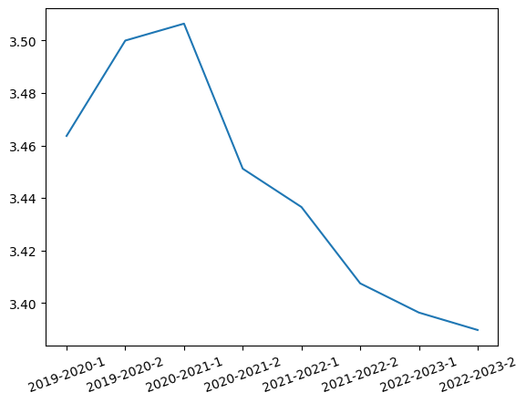
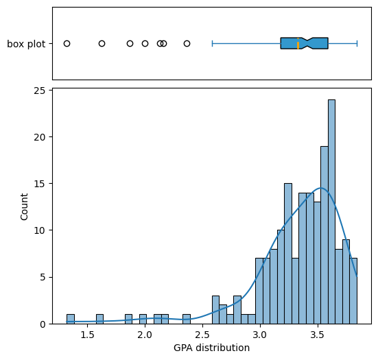
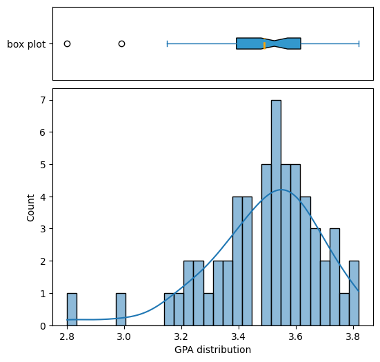

---
tags:
- blog
- 毕业碎碎念
---

# 毕业.课程

稀里糊涂就要毕业了，想留下些文字作个纪念。这篇就来回顾一下本科四年的那些课程。

## 培养方案
我们采用的是管理学院2019级经济管理实验班的培养方案，所谓的实验班就是【*统计学、财务金融、会计学、管理科学、管理信息、市场营销*】等专业的混合体。大家大一大二修读的课程完全相同，大三开始修读专业课，大四正式分流到各个专业。

??? question "我为什么选择这个专业"
	我根本没选这个专业啊，根据我对高考志愿的模糊记忆（*相关证据已经找不到了*），当年我的志愿顺序大概是
	
	- 数学
	- 微电子
	- 经济学
	- 经管实验班
	
	所以来到这个专业纯属机缘巧合/实力不足。好在管院也有我相对感兴趣的统计学专业，从结果上来说还算不错。

大一刚开学教务就发了一本厚厚的培养方案和一本课程表（有且仅有这一次发了纸质的课表），小地方来的我哪见过这个，眼都花了。统计系的修读计划大概是这个样子：

## 个人总结
先放一个成绩单镇楼：

我这四年八个学期一共修了155学分，分布情况大概是：

大一大二修的学分比较多，大三大四就比较清闲了。

拿到的成绩分布情况如图：

GPA的变化曲线是：

显然，B+占据了绝对的主导地位，一共65门课拿了30个B+。这直接导致我的GPA只有3.39，按照官方的百分制换算就是84分左右。在统计学专业排名位次大概是75%，在整个学院的排名位次大概是53%。我统计的时候延毕的同学学籍已经转到上一届了，所以实际排名还会低一些，大约就是中等偏下。在统计学专业里看就是吊车尾了。

??? question "我真的有那么菜吗？"
	说实话，我怎么也想不到自己会在专业排名后30%。按理说我虽然不算刻苦，但也付出了一定的努力。拿过最差的成绩是三个B-（*体育（一）、多元分析和 FET*），除此以外全都是B、B+、A-和A。由于优秀率的限制，只拿少量的A倒也说的过去，毕竟我平平无奇。可能是统计系的大家都太厉害了，踩在学院平均线上的我只能在专业排到末尾。

本来还想喷一下复旦的[绩点制度](https://www.zhihu.com/question/575929334/answer/2880299588)和转降制度，已经嘴炮输出了好几段了，最后想了想还是作罢。大家自己去知乎逛逛就知道了。

我们学院的绩点分布大概是这样的：

中位数是3.41，平均数是3.33，大家还是太强了。

统计学专业的绩点分布就更离谱了：

中位数是3.53，平均数是3.49，统计系果然是卷王聚集地。
## 课程回顾

### 大一上

啥也不懂愣头青，选了很多意义不明的选修课，现在啥也不记得了。

#### 《文选》与中古社会

- 课程属性：模块选修课
- 成绩：B
- 内容：上课就是诗词鉴赏，讲讲故事很快乐
- TAM（take away message）：None

#### 复旦大学计算机水平测试

- 课程属性：必修
- 成绩：P
- 内容：过关性测试，基础的计算机知识。
- TAM：真的有很多同学计算机的基础知识极差，需要保持清醒不要对别人又太高的期望。但也有很多大佬，需要保持谦虚。

#### 大学英语III

- 课程属性：外语选修
- 成绩：P
- 内容：和高中英语课没什么差别，更难点？
- TAM：农村鼠鼠我被你旦学生平均英语水平薄纱

#### 数学分析BI

- 课程属性：专业必修
- 成绩：A
- 内容：比较正经、单纯的数学课，我很喜欢
- TAM：能有学得会的数学就偷着乐吧！

#### 体育(一)

- 课程属性：必修
- 成绩：B-
- 内容：选的乒乓球
- TAM：不要以为自己会打乒乓球

#### 中国近现代史纲要

- 课程属性：必修
- 成绩：B+
- 内容：历史课，上课也在讲故事
- TAM：上百人的大课睡觉也没问题

#### 形势与政策I

- 课程属性：必修
- 成绩：P
- 内容：忘记了
- TAM：None

#### 博弈论在社会科学中的应用

- 课程属性：任意选修
- 成绩：A-
- 内容：博弈论
- TAM：还有博弈论这样一个理论呢，挺好玩的但也挺难的

#### 中国能源问题与国际能源展望

- 课程属性：任意选修
- 成绩：B+
- 内容：介绍、分析能源问题
- TAM：中国的能源还是离不开煤炭

#### 21世纪的人口老龄化：挑战与机遇

- 课程属性：任意选修
- 成绩：A
- 内容：忘记了
- TAM：就算是啥也没听的课也有可能拿A

#### 政治学原理

- 课程属性：必修三选一
- 成绩：B
- 内容：很有趣的基础政治学
- TAM：充分利用社交资源和公开信息非常有利于拿A。政治学存在于万物之间，甚至是大猩猩！

#### 管理学导论

- 课程属性：专业必修
- 成绩：B+
- 内容：大水课，讲了很多理论，让我感觉管理学有点类似心理学？？？
- TAM：管理学是和社交、做pre、做PPT息息相关的。

### 大一下【全线上课程】

疫情开始了，悲催的线上大学生

#### 计算思维

- 课程属性：模块选修
- 成绩：B
- 内容：类似算法导论，讲解了基础的计算机算法知识，包括但不限于压缩算法、排序算法、图算法
- TAM：有些课不要太早选修，这个课如果大三在修我肯定会收获更多！

#### 数学分析BII

- 课程属性：专业必修
- 成绩：A-
- 内容：单纯的数学、困难的数学
- TAM：鼠鼠我的数学也不算太好

#### 线性代数

- 课程属性：专业必修
- 成绩：A
- 内容：什么是线性空间，空间里有什么好玩的
- TAM：线性空间这种把一类东西抽象出来的想法是伟大的。以及山东大学的线性代数网课很不错（*我实在是无法理解为什么我们老师让我们去看其他学校的网课，每天上课就是微信群答疑，这上的是什么课啊？？*）。

#### 军事理论

- 课程属性：必修
- 成绩：A
- 内容：国家安全，孙子兵法等
- TAM：水课拿A具有完全随机性

#### 体育(二)

- 课程属性：必修
- 成绩：P
- 内容：看健身视频，模仿着录制自己健身的视频
- TAM：再也不用打乒乓球了

#### 形势与政策II

- 课程属性：必修
- 成绩：P
- 内容：忘了，这课线下上我都不记得，线上就更不记得了
- TAM：None

#### 马克思主义基本原理概论

- 课程属性：必修
- 成绩：B+
- 内容：老师是哲学院的，讲了很多马克思主义哲学
- TAM：马克思真的是哲学家

#### 微观经济学

- 课程属性：专业必修
- 成绩：B+
- 内容：微观经济学
- TAM：经济体内部的微观结构还是很有趣的

### 大二上

返校啦

#### 微生物与人类健康

- 课程属性：模块选修
- 成绩：B+
- 内容：介绍各类微生物，以及一些微生物带来的疾病，还有很好玩的实验课可以自己培养细菌
- TAM：如果培养皿上出现了雪花一样的透明结晶，可能是板子太干燥了而不是什么奇怪的菌体。

#### 基础日语Ⅰ

- 课程属性：外语选修
- 成绩：B
- 内容：日语入门
- TAM：语言类课程是没法速通的。二次元和日语不是一个东西，只靠二次元的热爱可学不好日语。

#### 概率论与数理统计

- 课程属性：专业必修
- 成绩：A-
- 内容：统计学入门
- TAM：统计学似乎挺好玩的

#### 运筹学

- 课程属性：专业必修
- 成绩：A
- 内容：线性规划、整数规划、凸优化、图优化、简单博弈论、简单排队论
- TAM：很有用的一门课。很多时候一个充满热情的授课老师会让学生也充满热情。

#### 商业伦理学

- 课程属性：专业必修
- 成绩：B+
- 内容：忘记了
- TAM：商业也有伦理学？？？？？

#### 体育(三)

- 课程属性：必修
- 成绩：B+
- 内容：高尔夫
- TAM：高尔夫其实也不是那么高端的运动，也很有趣！

#### 思想道德修养与法律基础

- 课程属性：必修
- 成绩：B+
- 内容：忘记了
- TAM：老师是心理咨询师（*有证书的那种*），喷到事情可以找他，（真的很会讲故事）哈哈哈哈哈

#### 形势与政策III

- 课程属性：必修
- 成绩：P
- 内容：忘记了
- TAM：这种课只要不挂就行了

#### 宏观经济学

- 课程属性：专业必修
- 成绩：A
- 内容：国家层面的宏观经济结构，是中年大叔在酒桌上最爱的经济话题的入门课程
- TAM：找一个全是大佬的小组就可以拿到A，就算这门课基本没怎么学全靠期末速通

#### 会计学

- 课程属性：专业必修
- 成绩：B
- 内容：基础的会计学
- TAM：我真的不适合会计

### 大二下

修的课最多的一学期。然而全是意义不明的专业必修课，学不懂，所以也是绩点狂掉的学期。

#### Python程序设计

- 课程属性：计算机选修
- 成绩：A
- 内容：基础的python
- TAM：当你已经完全掌握了一门课的知识再去选修这门课会很爽。python是一门不错的语言。

#### 新媒体艺术

- 课程属性：模块选修
- 成绩：B
- 内容：看不懂的艺术
- TAM：我完全没有艺术细胞

#### 财务管理

- 课程属性：专业必修
- 成绩：B+
- 内容：基础的投资学？
- TAM：钱是有时间属性的；以及我是不太适合搞金融的。

#### 营销管理

- 课程属性：专业必修
- 成绩：B+
- 内容：营销策略，营销案例
- TAM：营销是一门学问；纯英文授课就是老师心里想的中文，说出来是英文，我听着是英文，再翻译成中文来理解，全是中间商赚差价。

#### 管理信息系统

- 课程属性：专业必修
- 成绩：B+
- 内容：管理信息系统
- TAM：我没有领导力，就算当了组长也是无法带领组员追求卓越的

#### 组织行为学

- 课程属性：专业必修
- 成绩：B+
- 内容：组织中的心理学
- TAM：我是IJTS

#### 统计软件

- 课程属性：专业必修
- 成绩：B+
- 内容：SAS入门，一些基础的聚类分析、GLM
- TAM：不要学SAS，因为大多数的企业都用不起授权的SAS。倒不如去选择R语言，好用得多也通用得多。

#### 体育（四）

- 课程属性：必修
- 成绩：B+
- 内容：太极拳
- TAM：太极拳真好玩

#### 形势与政策IV

- 课程属性：必修
- 成绩：P
- 内容：忘记了
- TAM：None

#### 社会主义核心价值观精讲

- 课程属性：思政选修
- 成绩：B
- 内容：每次一位老师来做专题讲座
- TAM：我好像根本不懂社会主义核心价值观

#### 毛泽东思想和中国特色社会主义理论体系概论A

- 课程属性：必修
- 成绩：B+
- 内容：忘记了
- TAM：考研其实是要考这个的

#### 毛泽东思想和中国特色社会主义理论体系概论B

- 课程属性：必修
- 成绩：P
- 内容：课外时间，志愿者活动。我选择的是去图书馆拍书架~体验还不错，能看到各式各样的书并且还落得清净
- TAM：拍书架最好带手套，真的很脏

#### 社会调查

- 课程属性：必修
- 成绩：B+
- 内容：线上支教，本科负责备课
- TAM：None

### 大三上

挣扎着想提升一下绩点尝试保研，最终失败的学期

#### 数据分析

- 课程属性：任意选修
- 成绩：B+
- 内容：Python数据分析，来刷分的，但是失败了
- TAM：就算是你早就会的内容想要拿到A也不是必然事件。

#### 16-20世纪的欧洲殖民帝国

- 课程属性：模块选修
- 成绩：B+
- 内容：历史课
- TAM：已经模糊的帝国史

#### 回归分析

- 课程属性：专业必修
- 成绩：B+
- 内容：经典的多元回归，和一点点扩展的分位数回归概念
- TAM：很多时候是需要自学的，老师只是在引导；最小二乘回归就是投影！！！

#### 时间序列分析

- 课程属性：专业必修
- 成绩：B
- 内容：ARIMA模型，GARCH模型
- TAM：时间序列是很难的，金融序列是不可预测的

#### 统计推断

- 课程属性：专业必修
- 成绩：A
- 内容：统计量、点估计、区间估计、贝叶斯统计
- TAM：统计原来还是很有趣的

#### 统计计算

- 课程属性：专业选修
- 成绩：B+
- 内容：组合优化、数值优化、抽样、EM算法
- TAM：好难，但很重要

#### 物理学的新启示

- 课程属性：三创课
- 成绩：P
- 内容：各领域的老师开讲座
- TAM：原来量子力学有一种统计学的波函数视角！很有趣~

### 大三下【部分线上课程】

放弃对保研的挣扎，开始另寻出路。以及上海疫情反复，又开始线上上课了~

#### 英语笔译

- 课程属性：外语选修
- 成绩：B
- 内容：翻译
- TAM：翻译想要信达雅还是太难了。“向前一小步，文明一大步”有一种翻译是“We aim to please, You aim too please”

#### 多元分析

- 课程属性：专业必修
- 成绩：B-
- 内容：多元正态分布、多元统计推断、聚类分析、主成分分析
- TAM：老师会给出无法理解的分数

#### 随机过程

- 课程属性：专业必修
- 成绩：B+
- 内容：马尔科夫链、鞅基础、计数过程、更新过程、连续时间马尔科夫链、布尔运动
- TAM：一二维的对称随机游走都是常返的，更高的维度则不是。

#### 非参数统计

- 课程属性：专业选修
- 成绩：B+
- 内容：统计泛函、非参数回归、MINIMAX、非参数检验
- TAM：原来一学期是可以学两本书的；非参数统计和机器学习有很深的关系。

#### 抽样调查

- 课程属性：专业必修
- 成绩：B
- 内容：各种抽样方法和统计量的构造
- TAM：抽样原来那么复杂

#### 数据科学编程

- 课程属性：专业选修
- 成绩：A
- 内容：Python
- TAM：numpy和pandas细细的学一遍是大有裨益的

### 大四上

备战考研

#### 复旦大学英语水平测试

- 课程属性：必修
- 成绩：B-
- 内容：听力+口语+阅读+写作
- TAM：事实再次证明我的英语水平被薄纱

#### 属性数据分析

- 课程属性：专业必修
- 成绩：B+
- 内容：列联表检验，GLM
- TAM：繁琐的课程

#### 数据库与企业数据管理

- 课程属性：专业选修
- 成绩：B+
- 内容：数据库的设计、使用，SQL语句
- TAM：自己设计一个数据库并且实际在一个网站中投入使用是非常宝贵的经验

#### 社会研究方法B

- 课程属性：专业必修
- 成绩：A-
- 内容：学术写作
- TAM：我在你旦总能在一些意想不到的课程上拿到A

### 大四下

要毕业啦！！！！！！

#### 英语视听

- 课程属性：外语选修
- 成绩：B+
- 内容：听力+阅读
- TAM：训练强度很高，感觉这几年我的外语水平有显著提高

#### 毕业论文

- 课程属性：专业必修
- 成绩：B+
- 内容：毕业论文（我选择了实证分析），详见毕业.论文
- TAM：理想和现实相距甚远

#### 毕业实习

- 课程属性：专业必修
- 成绩：B+
- 内容：实习
- TAM：小厂不要去

#### 艺术哲学与审美问题

- 课程属性：模块选修
- 成绩：B+
- 内容：美学和哲学
- TAM：人的欲望是无限的，因为人欲求的不是具体的某物，而是被欲求。

