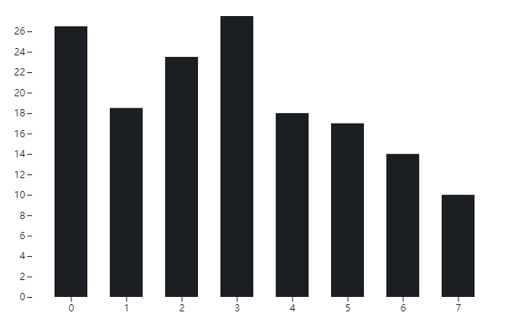

---
tags:
- blog
- 毕业碎碎念
---

# 毕业.课程

稀里糊涂就要毕业了，想留下些文字作个纪念。这篇就来回顾一下本科四年的那些课程。

## 培养方案
我们采用的是管理学院2019级经济管理实验班的培养方案，所谓的实验班就是【*统计学、财务金融、会计学、管理科学、管理信息、市场营销*】等专业的混合体。大家大一大二修读的课程完全相同，大三开始修读专业课，大四正式分流到各个专业。

??? question "我为什么选择这个专业"
	我根本没选这个专业啊，根据我对高考志愿的模糊记忆（*相关证据已经找不到了*），当年我的志愿顺序大概是
	
	- 数学
	- 微电子
	- 经济学
	- 经管实验班
	所以来到这个专业纯属机缘巧合/实力不足。好在管院也有我相对感兴趣的统计学专业，从结果上来说还算不错。

大一刚开学教务就发了一本厚厚的培养方案和一本课程表（有且仅有这一次发了纸质的课表），小地方来的我哪见过这个，眼都花了。统计系的修读计划大概是这个样子：

## 个人总结
先放一个成绩单镇楼：

我这四年八个学期一共修了155学分，分布情况大概是：

大一大二修的学分比较多，大三大四就比较清闲了。

拿到的成绩分布情况如图：

GPA的变化曲线是：

显然，B+占据了绝对的主导地位，一共65门课拿了30个B+。这直接导致我的GPA只有3.39，按照官方的百分制换算就是84分左右。在统计学专业排名位次大概是75%，在整个学院的排名位次大概是53%。我统计的时候延毕的同学学籍已经转到上一届了，所以实际排名还会低一些，大约就是中等偏下。在统计学专业里看就是吊车尾了。

本来还想喷一下复旦的[绩点制度](https://www.zhihu.com/question/575929334/answer/2880299588)和转降制度，已经输出了好几段了，最后想了想还是作罢。大家自己去知乎逛逛就知道了。

我们学院的绩点分布大概是这样的：

中位数是3.41，平均数是3.33，大家还是太强了。

## 课程回顾

### 大一上
啥也不懂愣头青
