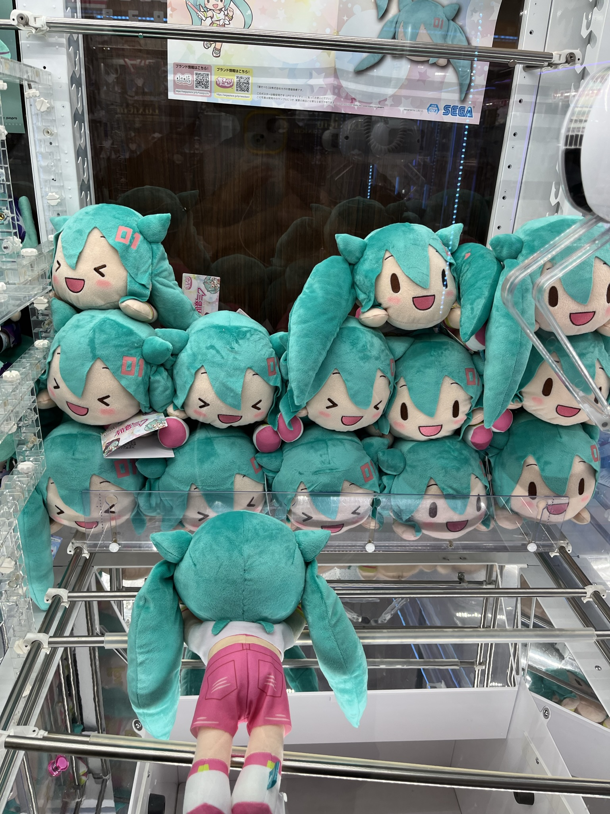
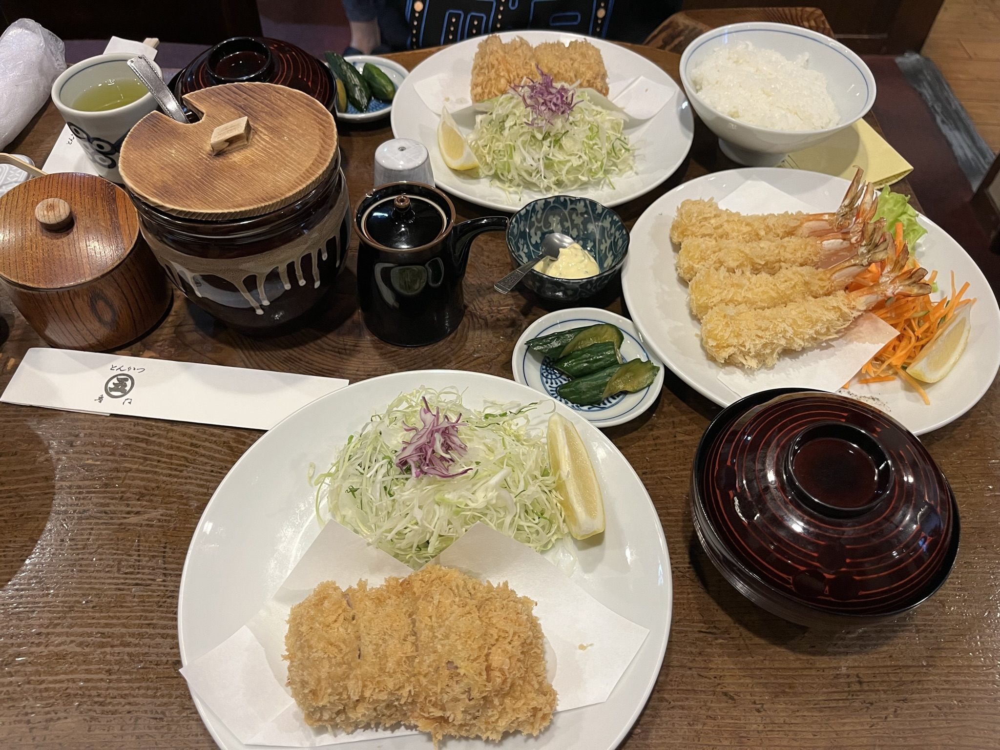

---
tags:
- blog
- 毕业碎碎念
---

# 毕业.旅行
> From 2023.6.19 to 2023.6.27 in Japan

终于在毕业这样一个特殊的时节去到了心心念念的日本，虽然只是短暂的一周旅行但是真的非常非常非常开心，特此一篇plog聊以纪念。

## 战术总结
本来战术总结想放在最后的，但是写着写着发现前面的内容太多了，放在后面估计没什么人看，于是挪到这里。
### 旅行的花费
这大概是大伙比较关心的事情，我这里有一张账单仅供参考：
{width=500}
> 这里面退改签的花费是我个人的原因（为了参加学院的毕业典礼而推迟的旅行，所以我付了我和我朋友双人份的退改签费用）

总的来说，我们八天七晚的旅行花费在万元以内（签证、护照大概500￥可以搞定）
### 交通

### 住宿
- 大阪的酒店
<video src="assets/IMG_6202.MP4"></video>
- 京都的酒店
<video src="assets/IMG_6501.MP4"></video>
- 东京的公寓
<video src="assets/IMG_6754.MP4"></video>

### 吃喝

### 日本印象

### 日本人印象

## Day 1 抵达日本
> 2023.6.19，从上海浦东机场飞到大阪关西机场、入住酒店、吃饭逛街

- 在浦东机场准备起飞，安全出口的位子很宽敞！

{width=500}
{width=500}

- 到日本啦，列车很乱差点就上错车了，以及竟然真的有女性专用车厢

{width=500}
{width=500}

- 赶路，干饭

{width=500}
{width=500}
{width=500}

- 逛街，来的了不得了的地方

{width=500}

## Day 2 环球影城，道頓堀
> 2023.6.20，去了大阪环球影城，然后去道頓堀、心斋桥逛街

- 霍格沃兹入学留影

{width=500}

- 小黄人

{width=500}

- 哆啦A梦

{width=500}

- Super Nintendo World

{width=500}

- 面目狰狞

{width=500}

- 来到了市中心

{width=500}

- 吃了好吃的拉面，隔着帘子的服务很特别

{width=500}

- 到处都是不得了的东西

{width=500}

- 日本人为什么什么东西都往扭蛋机里放啊

{width=500}
{width=500}
{width=500}

## Day 3 奈良
> 2023.6.21，去了奈良，看到了好多好多鹿🦌，晚上转移到了京都

- 想买个零钱包（真的很需要！），但是看到中国制造就不想买了

{width=500}

- 在奈良女子大学（特地去的，可惜没好意思进去参观🤣）的旁边，看到了小溪边干饭的鹿

{width=500}
{width=500}

- 走街串巷，偶然遇到的一家日料店，很好吃！

{width=500}

- 好像很多人家的门口都会放这个小鼹鼠欸，可爱

{width=500}

- 登高望远

{width=500}

- 奈良公园，鹿哥很给面子，很有镜头感

{width=500}

- 我有一个朋友被鹿撅了

{width=500}

- 去京都路上列车的驾驶室，好古老的感觉

{width=500}

- 公明党还有机会吗

{width=500}

- 共产党，行！海报比公明党好看多了~

{width=500}
{width=500}

## Day 4 伏见稻荷大社，锦市场
> 2023.6.22，去了伏见稻荷大社、清水寺（高强度爬山），晚上逛了锦市场

- 夹在城市楼宇之间的神社
{width=500}

- 爬山

{width=500}

- 好像我绝大多数的照片都是剪刀手，哈哈哈哈哈哈

{width=500}

- 捕捉一个空镜

{width=500}

- 很累

{width=500}
{width=500}

- 珍贵影像

{width=500}

- 超大型巨人被玩坏了

{width=500}

- 换了一座山爬

{width=500}
{width=500}

- 有种诡异的感觉

{width=500}

- 随处可见的古建筑

{width=500}

- 在日本也过了端午节，但是这粽子是真的小且贵

{width=500}
{width=500}

## Day 5 铁道博物馆
> 2023.6.23，去了地图偶然看见的铁道博物馆，然后坐新干线去东京

- 红鼻子

{width=500}

- 看一眼京都塔（似乎是柯南某个剧场版的名场面，不懂

{width=500}

- 单手开火车

{width=500}

- 卧轨视角

{width=500}

- 这个车会叫

{width=500}

- 望み，新干线

{width=500}

- 假装这是富士山，但实际上当天天气不太好，根本没看到真的富士山

{width=500}

- 二次元

{width=500}

- 到了住的地方附近随便吃了一家拉面，老板竟然是东北大哥，来了日本十几年说话还是一股子大碴子的味

{width=500}
{width=500}

- 直奔秋叶原

{width=500}

- PS和XBOX的地位差距不用我多说了

{width=500}

## Day 6 圣地巡礼，涩谷，秋叶原
> 2023.6.24，上午是圣地巡礼环节；下午去了涩谷，感受一下市中心的繁华；晚上依旧是秋叶原

- 喝到了大老师最爱的MAX咖啡

{width=500}

- 全世界的鸽子都是懒狗，你走到附近它都懒得飞走，仅是慢悠悠走开

{width=500}

- 君の名は

{width=500}
{width=500}
{width=500}

- 言叶之庭取景地，但是没找到电影里的场景

{width=500}
{width=500}

- 新宿御苑的温室，里面有各种奇形怪状的植物

{width=500}

- 水原千鹤这么大牌面的吗

{width=500}

- 涩谷crossing view

{width=500}

- 回转寿司

{width=500}
{width=500}

- 纳豆真的吃不了一点，滂臭

{width=500}

- 生的也吃不惯

{width=500}

- 忠犬八公

{width=500}

- 晚上没事儿干，又来了秋叶原

{width=500}

- 虽然我买不起，但是我拍了照就相当于带回家了，赛博手办柜迎来新成员

{width=500}

- woc，原

{width=500}

- 夹娃娃大失败

Before：

{width=500}

After：

{width=500}

（初音的头为什么那么大啊！！！！！！

- 好多地下偶像/女仆姐姐在街头发传单

{width=500}
{width=500}

- 她们营业能力太强了，我实在不好意思不拿一张传单

{width=500}

## Day 7 东京大学，秋叶原
> 2023.6.25，在东京的最后一天了，上午去了东京大学，下午还是秋叶原（

- 东大好看的校门

{width=500}

- 东大地标？

{width=500}

- 在打球，不认得啥球，球拍像是抓蝴蝶的网子

{width=500}

- 好看的亭子，肯定发生了很多爱情故事

{width=500}

- 价格实惠，排队不那么久的米其林餐厅！！！猪排很好，但是炸虾更棒

{width=500}
{width=500}

- 秋叶原，补充二次元能量

{width=500}
{width=500}

??? caution "折叠内容为男性向R18，请谨慎打开"
    秋叶原的本子真的数不胜数，但是一本都没买，怕被海关直接截获
    {width=500}
    {width=500}
    {width=500}
    还看到了原画展，大触真的太牛了
    {width=500}
    {width=500}

- 依然是一堆发传单的地下偶像/女仆

{width=500}

- 来都来了，体验一下女仆咖啡店

{width=500}
{width=500}
{width=500}
{width=500}
{width=500}

- 买点纪念品，溜了

{width=500}

## Day 8 回家
> 2023.6.26-6.27，东京成田机场-福州长乐机场-上海虹桥机场，回国啦！

- 在路上

{width=500}

- 成田机场

{width=500}

- 姑且还是买了点土特产

{width=500}

- 起飞

{width=500}

- 抵达福州

{width=500}

- 再次起飞，这次竟然又是应急出口，依旧宽敞的座位

{width=500}

- 但是厦门航空的应急出口比春秋航空好太多了，还是有大窗户可以看看云

{width=500}

- 不知道用什么结尾，放一张猛男吧

{width=500}