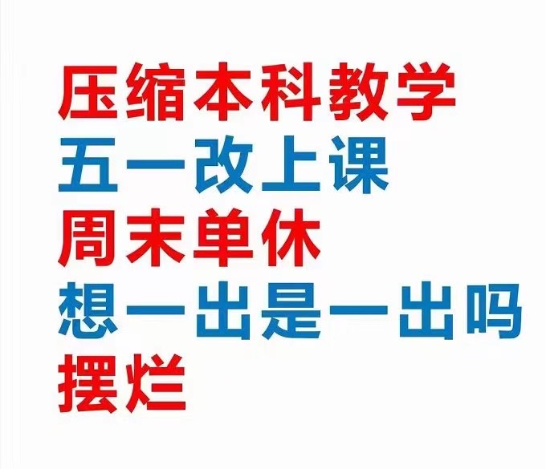
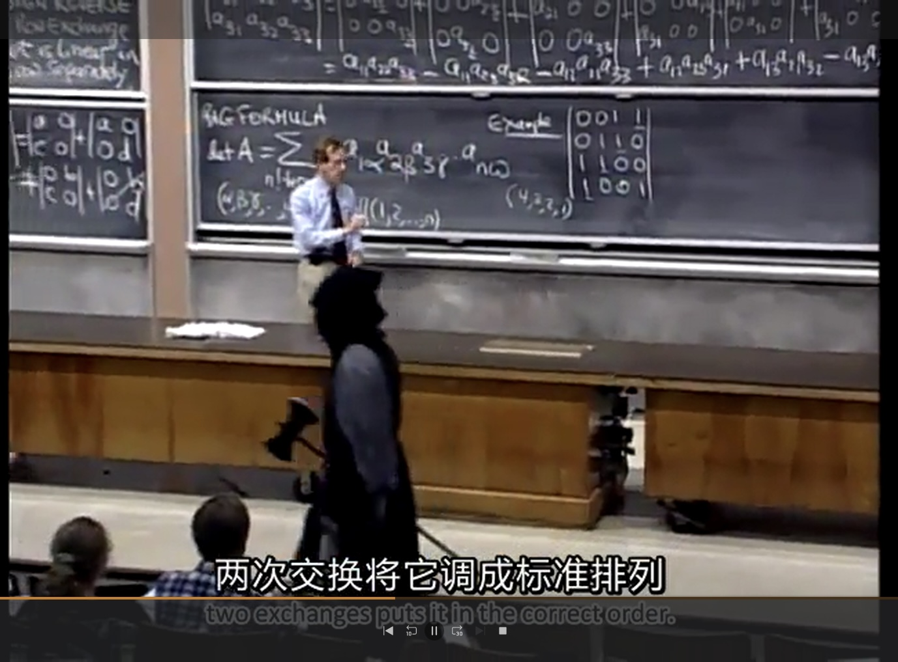
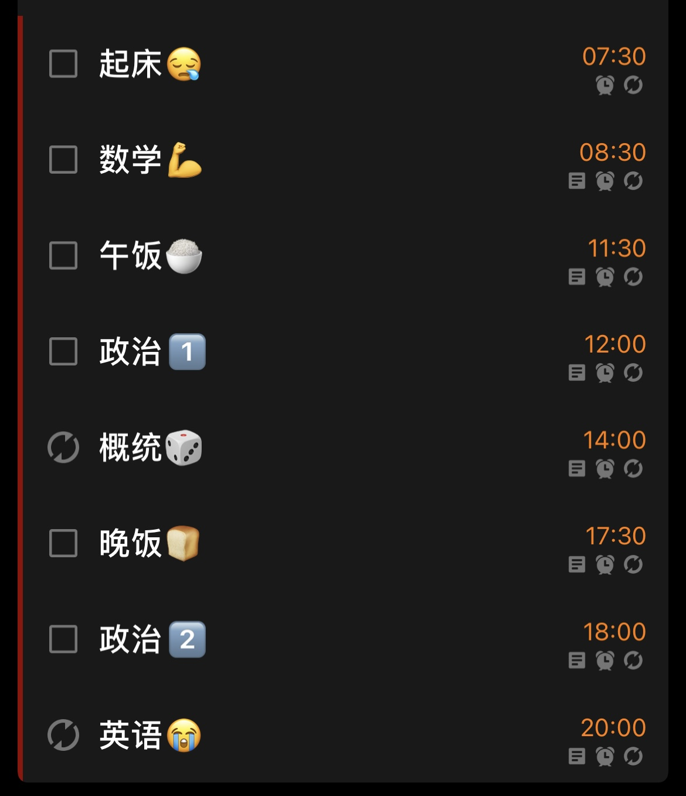
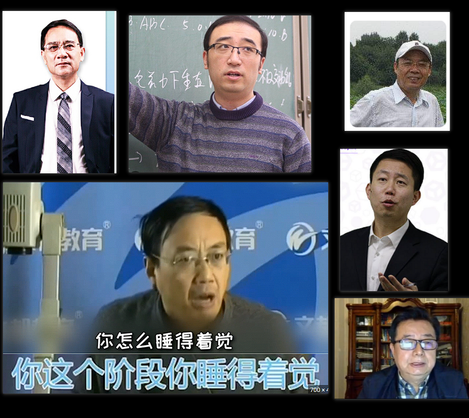
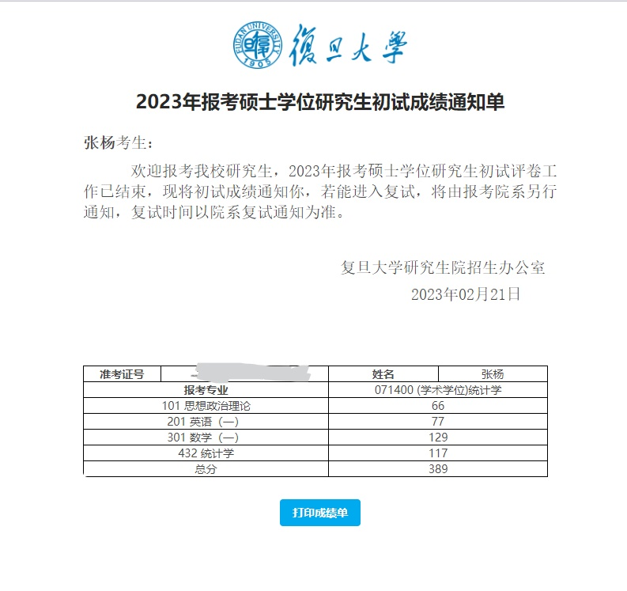
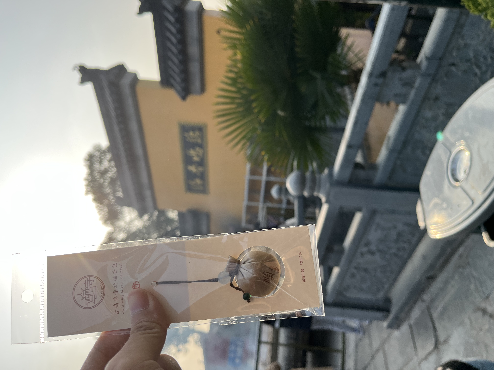
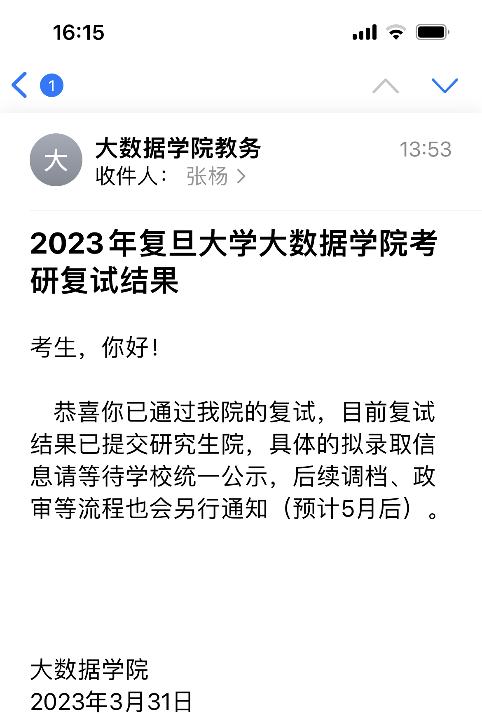
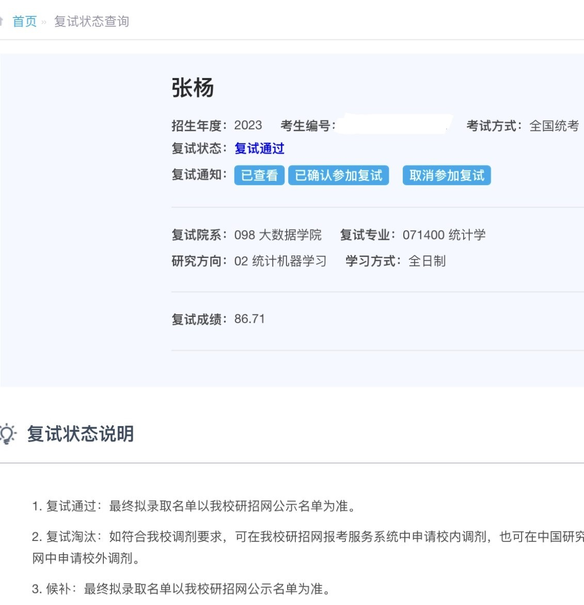

---
tags:
- blog
- 考研
---

# 考研始末

## 1 大三下
决定考研，或者说别无选择只能考研大概是在2022年的夏天。

大三的下学期完全是在一片狼藉之中度过的，疫情防控最严的时候我们甚至很少出房间门，每天的饭菜有人<s>（辛苦志愿者）</s>送到门口。

相册里翻到这样一张梗图：

{width=400}

??? question "什么梗？"
    这个图有两个梗。
    
    其一是当时隔壁同济大学闹出了“猪肉刺身事件”，红蓝相间的配色就是这个事件的某种旗帜。
    
    其二则是疫情之下，各大高校纷纷缩短假期、增加课时，以期早点放（定时炸弹的）学生们回去。
    
    {width=400}

还翻到一张有生之年头发最长时刻的留影：

??? warning "大圆脸盘警告"

    不是吧，真的会有人在头发还没完全干的时候把它扎起来吗？

    {width=300}

    是的，因为不想吹头发，并且不想头发遮住眼睛。

大概可以一瞥当时的精神状态。

就在这样啼笑皆非的生活中，大三结束了，我迎来了最后的暑假。

其实我有想过要不这个暑假去找一份实习，边实习边复习。但在听取了多方建议（感谢霄哥）和仔细权衡之后还是决定孤注一掷，全心复习。

## 2 暑假
我的复习生活不算高压，甚至有些放松。

记忆比较深刻的一些事物：

- Gilbert Strang的线性代数课上，MIT刀斧手
{width=800}
- 完成了DIY主机初体验。体验的方式是，把（用2000 ￥从朋友那里买过来的）三手电脑主机完全拆散，然后替换CPU、风扇和SSD之后再重新组装。我也是装机辕了！！
- 陪伴了我一年整的（二手）Xbox天蝎座，挂咸鱼了。含泪小赚200。
- 和霄哥拍了毕业照。
- 通关了《魔法使之夜》，成为月厨。
- 去扬州玩了几天，虽然没在烟花三月，但也是好风景。

好吧，记忆深刻的事物果然和学习不沾边。

要说学习，大概的进度就是：

- 看完了Gilbert的线性代数课
- 基本做完了李永乐的660
- 看了点徐涛的政治课
- 把《概率论基础》《数理统计》《高等代数简明教程》《工科数学分析》等书看了一遍。
- 背了背单词，看了几篇外刊精选
## 3 大四上
大四上开学没几天就是中秋节，（年后就没回过家的）我趁此机会回家吃点好的。

??? warning "大闸蟹警告"

    

    可惜2022的中秋有些早了，不是吃蟹最好的季节

然后就开始高强度的复习了。理想中的时间表是这样的：

{width=400}

当然，实际执行起来难度很大。日子就这么一天天过，很快就到了十一月。

{width=400}

这些老师总算也都混了个脸熟，但是我的复习进度有点危险：

> 现在是11月12日，我是废物
> 
> 还剩44天就考试了，现在政治课还没看完，怎么办啊
>
> 选自《记录复习日常》

我每天看着zhan同学的圣经，在焦虑和自己的低效之间挣扎。

??? quote "圣经：学习容易？容易个P"

    总有一些虚长几岁的社会人士，喜欢摇旗呐喊

    说学习是人生最容的事情，容易个p啊

    容易你咋没学明白呢？？？

    学习，**一天不学就没手感了**，**三天不学就不爱学了**，**俩礼拜不学之前学的就全忘了**，哪容易了？？？

    我九点钟的时候，看到有个同学发朋友圈，他在实验室里打游戏，说自己在摸🐟，都九点钟了，你摸什么🐟啊，除了学生谁晚上九点钟打游戏还不心安理得啊？？？

    *以上圣经出自zhan的破防视频 ([https://www.bilibili.com/video/BV1QS4y1v74J](https://www.bilibili.com/video/BV1QS4y1v74J?spm_id_from=333.337.search-card.all.click&vd_source=787c239c6bbe4d46f269e2eacb6d219d))，字字珠玑，我感同身受 😭，特此摘录*

## 4 考前
妈的，我还是阳了。

**12月17号**左右，我开始感到身体不适。发烧、肌肉酸痛、食欲不振、咳嗽。新冠的典型症状在我身上全部显著。

**12月24号**，研究生招生考试的第一天。我坐在江湾的阳性考场，耳边此起彼伏都是咳嗽声，监考老师全是大白。第一场政治考试有些混乱，到了考试的时间都还没安顿好。考务老师直接大喇叭一喊，延迟十分钟开场。虽然有点震惊于延迟的随便，但也某种程度上减轻了我的紧张。

**12月25号**，上午。这场考了数学，寄，不开玩笑真的寄。填空题错了几个，线性代数大题写的依托答辩。
> 【穿越时空的吐槽：分数129，没达到预期但也没有刚考完的时候想的那么差】。

**12月25号**，下午。专业课，我的主场啊，虽然有的题我是真的不会，但是总的来说考的还行？

> 【吐槽：分数117，这才是依托答辩。】

**12月25号**，晚上。处理[实习](../卖身)入职的事情。

> 【吐槽：虽然但是，无缝衔接实习是不是太拼了？】

## 5 出分数
> 跳过人生第一段实习、死亡期末和过年，快进到出分数。

2023年2月21日，平平无奇的下午，实习摸鱼的空挡，我终于查到了分数：389。

!!! quote "五分钟思想斗争"
    第一念头：肯定是我阳了没发挥好。

    败下阵来：哎，这都是给自己找的借口。

    深刻反思：我本来复习的也不是特别认真，活该啊。

    转念一想：今年题目是不是很难，会不会降分数啊？

    四处打探：先问问其他人。

    woc?????：他们分数好高，完蛋了。

    一线生机：不对，他们是专硕，数学二、英语二我不是很认可。

    四处打探：网上找找数学一、英语一的案例？

    woc?????：这些人分数也还是好高。

    罢了罢了：找个班上，咱不是读书的料。

就这样，第一段实习结束之后，我迅速找了一家互联网公司实习。小厂，老板欣然接下了我，我也不挑不拣先干了再说。

## 6 出复试线
次月，3月的17号，平平无奇的下午，坐在旺脉科技的会议室等待HR面试的空挡，我刷出来了分数线：385。

??? question "为什么在面试？"

    结合前文可知，我觉得自己G了就找了一家小厂光速入职。
    
    然后我和我的导师共享了这些信息，他直言“那待遇肯定不会很好吧”，我有点火大。
    
    他又说“那我给你去xxx？你把简历发我”，我内心高呼一声“爹！”

    于是我就在2023.3.17 Friday，请了一个假来面试。

过了两分钟，HR来了，我笑得合不拢嘴把喜讯分享给了她。

- 她：“那咱还谈吗？”
- 我：“来都来了！”

谈完我小跑出门。回宿舍的路上，在微信喜大普奔。

煎熬的三天过去，3月21日，在公司写代码的空挡，我刷出来了复试名单。我果然在名单上，可是，欸欸欸欸欸？前两名分别是411分、402分，我位列第三，385分，这是黑幕吧，这绝对是黑幕！中间17分的空挡竟然没有其他人嘛？

虽然很开心，但是真的很难以置信。大概是去南京求的福袋显灵了！

{width=600}

## 7 复试
之后就是从零开始准备复试了。

- 把简历增删改查，适应复试的需求
- 十多门专业课和选修课
> 包括但不限于数学分析、高等代数、概率论、统计推断、回归分析、时间序列分析、统计计算、非参数统计、多元分析、运筹学【图算法】、计算思维【数据结构和算法】
- 英语口语

我准备了很多，但是当我走进7对一的复试考场时我懵了。好在老师也没有问我任何简历上的内容，考完几个题就让我走了。

我还是有些忐忑，因为最后一个题我不是很会，答得非常磕绊，倒数第二个题也不是很舒畅。【TBD，复试工作完全结束之后会分享一下复试的题目】

好在结果还不错，复试顺利通过了：

??? success "嘿嘿"

    {width=400}
    {width=400}

## 8 写在最后
接下来坐等拟录取公示了，希望后续能顺利毕业、入学。

!!! info "最新消息"
    已经收到拟录的取消息了，但是毕业论文进展堪忧，根本写不动，很急。

也祝福各位看官，万事胜意！

此致