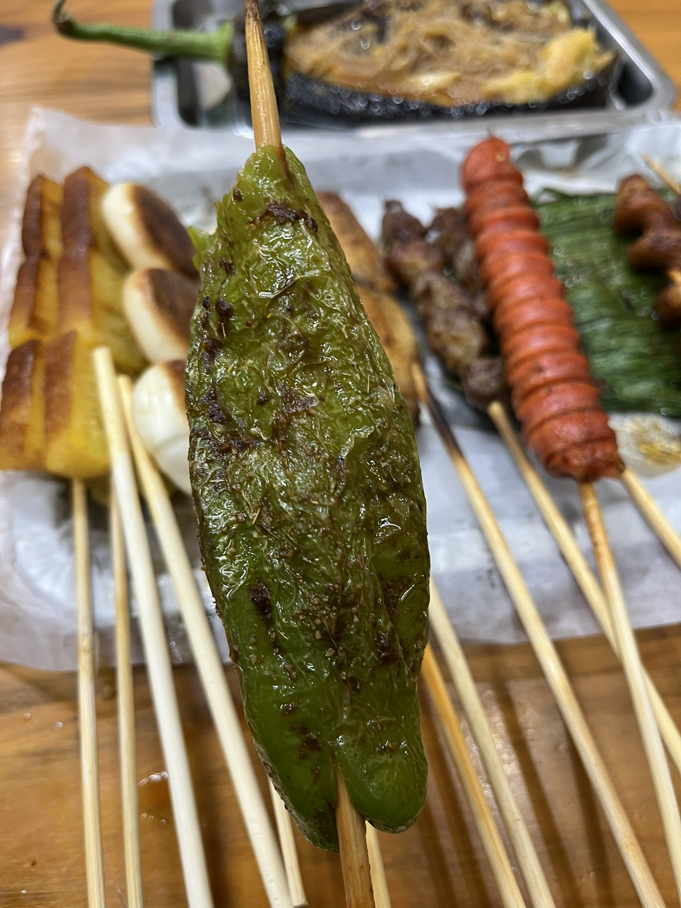
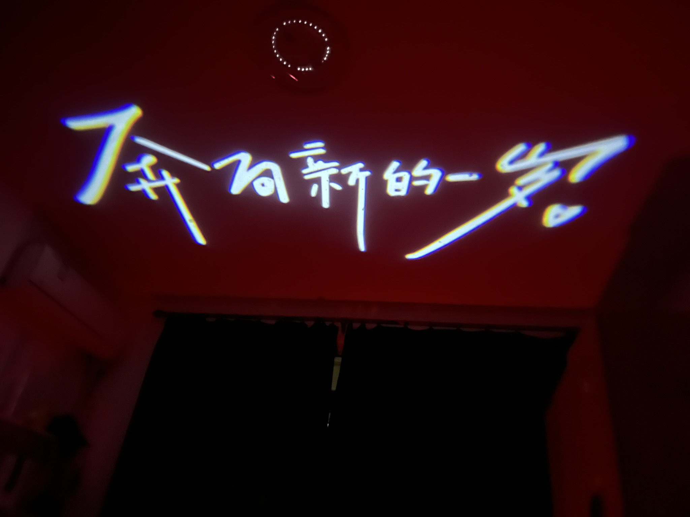
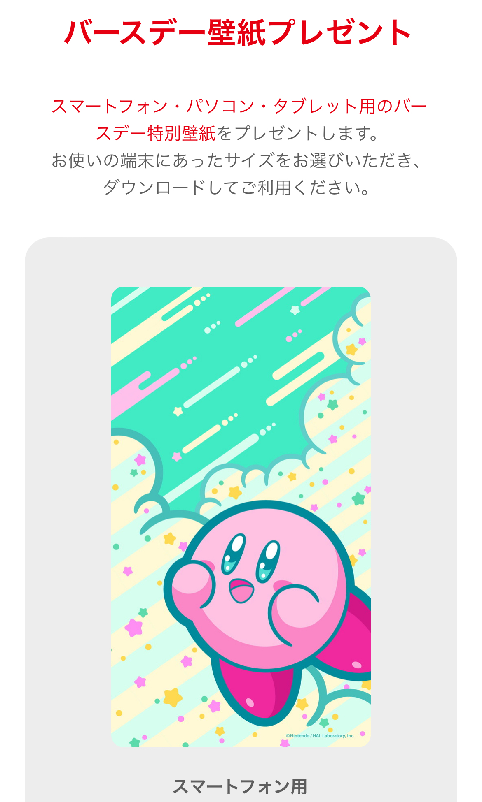

---
tags:
- blog
- 誕生日
---

# お誕生日おめでとう

怎么又是十月底了。

## 生日疑云

说起来zy的生日有诸多的版本，一般而言官方口径是**10月21日**，但这实际上只是身份证上的出生日期。准确地来说我是2001年的**12月5日**出生的，只不过那天刚好是农历的**十月廿一**，所以爸妈去登记的时候就写成了2001年10月21日。

简而言之zy一年要过三次生日：

- 十月廿一：农历生日
- 12月5日：阳历生日
- 10月21日：身份证生日

好吧，我瞎说的，其实zy并不是那么爱过生日。咱家里并没有过生日的传统。在过去的23载，生日当天吃蛋糕的次数大概屈指可数。我丧失了生日的仪式感。

当然我也充分理解，有的人很注重生日。我也很高兴有人能记得我的生日，能送上一句简单的祝福我已经非常开心了，有人送礼物我更是感激涕零。而今天就是这样一个幸福的生日。

## 奔向新的一岁

<figure markdown>
{width=300}
<figurecaption>
生日前夜吃了巨好吃的烧烤
</figurecaption>
</figure>

<figure markdown>
{width=400}
<figurecaption>
yy送的超好看的投影
</figurecaption>
</figure>

<figure markdown>
{width=300}
<figurecaption>
第一次有人专门给我过生日😭😭
</figurecaption>
</figure>

<figure markdown>
{width=300}
<figurecaption>
哔哩哔哩依旧准时送上了祝福
</figurecaption>
</figure>

<figure markdown>
{width=300}
<figurecaption>
任天堂的也壁纸超可爱！
</figurecaption>
</figure>

<figure markdown>
{width=300}
<figurecaption>
去森林公园转了转
</figurecaption>
</figure>

<figure markdown>
{width=400}
<figurecaption>
还拍了好多照片，这张最傻
</figurecaption>
</figure>

## 很难拔智齿？
更重要的是，今天预约了拔牙😭

经过反反复复的牙龈发炎，我终于下定决心把智齿拔掉！

<figure markdown>
{width=400}
<figurecaption>
巨大一颗智齿
</figurecaption>
</figure>

刚才拔牙的过程很顺利，麻药很给力。

可怕的是，此时此刻我的牙龈慢慢恢复知觉，舌尖上的铁锈味却始终如一，希望今夜能眠。

阿门！