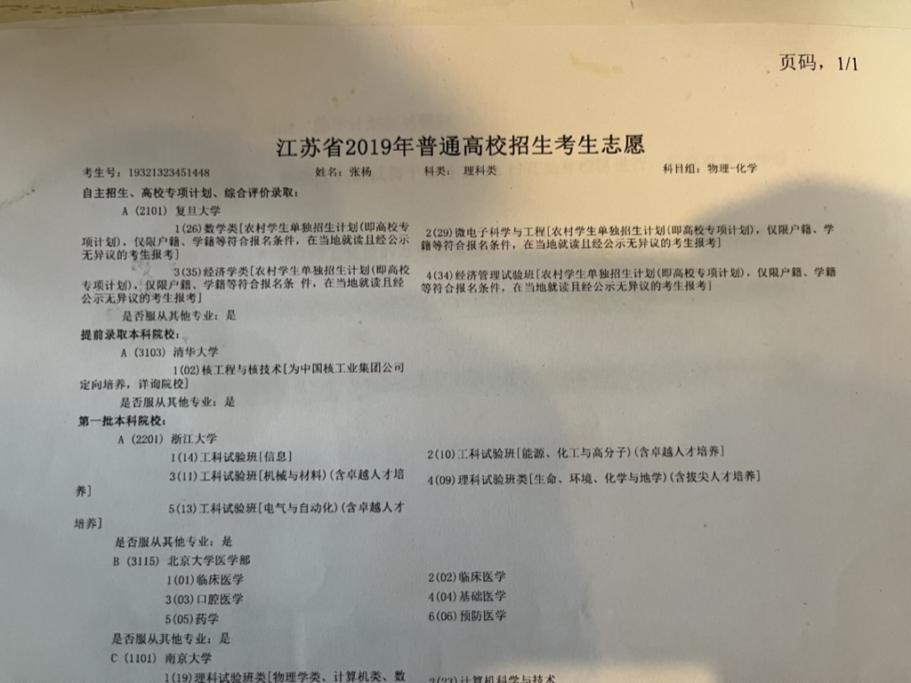

---
tags:
- blog
- FDU
include:
- ai-summary
---

# 生日快乐，复旦

## 校庆

又到了五月底，校庆的日子，<s>又可以吃便宜大碗的校庆餐了</s>。

说起来，复旦的校庆日并不是**建校日**，而是**上海解放日**，算是你旦红色基因的完美体现。无论如何，祝复旦119岁生日快乐！

??? cite "复旦校庆日的历史"
    复旦的校庆日要追溯到1905年的 9月13日。

    这一天，新成立的复旦公学开学，于是这天便成为复旦第一个所谓的“校庆日”。

    但真正意义上的校庆日是在1913年由李登辉（1872年~1947年）校长定下的。

    李校长是基督教徒，讳“13”，于是改校庆日为9月14日。

    后来的代理校长吴南轩（1893年~1980年）鉴于9月新学期刚开始，教学秩序尚未稳定，又忙于筹备校庆活动，影响教学质量的提高，于是定 5月5日为校友节让校友返校参观，这也是为了纪念曾任复旦校董的孙中山在广州出任非常大总统。

    抗战爆发后，复旦内迁北碚，定5月5日为立校纪念日（校庆日），从此，校庆日与校友节合二为一。

    一直到新中国成立后，陈望道（1891年~1977年）校长提出以上海解放日5月27日为校庆日。

    巧合的是，四十余年前的这一天，复旦公学师生在《时报》刊登申明，使“复旦”正式出现在公众的视野中。

    所以，5月27日是复旦诞生的日子，是复旦真正的校庆日。

    （根据校史资料整理）

    copy from [FDSM](https://mobile.fdsm.fudan.edu.cn/cs/nwmba/cn/nwmba1393506783954)

<figure markdown>

{width=300}

</figure>

## 我和复旦

这也是我在复旦的第五年了，刚好借此机会来写一写我和复旦的故事。

### 高考
坦白地说，我高中的时候压根没想过自己会来复旦读书。原因不是我对自己的没有想象力，也不是我太过高傲非清北不取。而是**我根本不知道还有复旦这么个学校**。

是的，很**荒谬**。在下作为一个高考生，堂堂(?)复旦大学我都不知道。实际上，高二时的我脑子里一共也没几个大学。由于去过北京游学，北京的高校倒是知道一些。江苏省内的高校也还是知道的。其他省外高校、包括上海这几所学校我就完全不知道了。

是的，很**可悲**。我缺乏获取信息的基本能力，也没有任何的独立思考能力。对于很多最基本的规则缺乏认知。我所处的环境也没有人能给我这些指引，作为“家里第一个大学生”，“村里最会读书的那一批人”，我始终在蒙眼前进。甚至到现在，你问我中国有哪些985高校，我也不甚了了。可就算这样，作为一个高中生总归要有一个梦中情校吧？

是的，**南京大学**。虽然很可悲，但也还算幸运。充分遗传了爸妈的聪明才智，我不算太笨，高中的数理化都是我的拿手科目。用我初中班主任的话来说：“这孩子到了高中会如鱼得水。”

不过也没那么幸运，倒霉孩子的文科项目一塌胡涂。文学素养是几乎没有的，写的一手烂字，拼音都搞不太懂（村小全责好吧！）。也没有任何的独立思考、没有远见、稀里糊涂地根本不知道自己在干什么，只会读书、考试、偷偷玩个游戏看个小说。所以，分数太高的学校我是没希望了，搞数学、物理竞赛也是没什么成果，在我认知范围内就只能瞄准南京大学了。那么，我到底是怎么样来到复旦的呢？

好吧，纯属**机缘巧合**。大概是高三，也许是ljq同学率先发现？作为土生土长的村里人，或许我们可以试一试“农村高校专项计划”。城里人有城里人的单招（竞赛、特长），我们村里也有自己的单招（只看户口？）。**于是我欣然参加，报名了南京大学的专项计划**。材料写都写了，就**顺便**报名了：清华领军、复旦腾飞等等好几个学校的项目。

清华根本不睬我，或许是高中的我确实太菜了。复旦和南大倒是给了我机会。就在高考之后的第二天，我马不停蹄赶到南大的仙林校区参加了他们的考试，勉强拿到了二等优录，可以有30分的加分。**我欣喜若狂，基本上稳了，终于可以去梦中情校南京大学了**。复旦则没有明确的加分，大概是在计划内择优录取。

然而，**造化弄人**。高考一发榜，我傻了。幸运女神又一次眷顾了我，哥们的语文居然活了，考出了小学以来(?)的最高分。这很好，可我又产生了动摇。

南大很好，可如果选南大分数就有些浪费，裸分似乎也能上。复旦没听过，好像也不错，但是录取策略不明确，不太稳。多方收集意见，最终我的高考志愿确定下来了：

<figure markdown>

{width=500}

<figurecaption>
把这张纸翻出来废了我老大劲，不过确实很有纪念意义
</figurecaption>
</figure>

划重点：

- 提前批1：复旦
    - 第一志愿：数学
    - 其他志愿：微电子、经济学院、管理学院，服从调剂

- 提前批2：清华
    - 专业：核物理，定向培养

- 本一批：
    - 浙江大学
    - 北大口腔
    - 南京大学

然后就是上帝的安排了，复旦数学不要我，微电子不要我，经济学院不要我，最终管理学院收留了我。可惜没去清华核物理，毕业直接入职中核集团岂不美哉。浙大最近实力猛涨，真正的top3啊；北大口腔也是绝佳选择；南大不必多说，同为华五，实力很强，主要是离家近啊。

总而言之，现在看来。复旦管院似乎是最差的解。**不是管院不好，是我不太契合管院的特质**。大学就是一个迷宫游戏，管院的大家就像是开了外挂。人手一个地图，目标明确、意志坚定，而我在商学院的我无所适从。实习、社团、学工、科研，我全都不行。好在管院还有统计学专业。我远离金融、财会、市场营销，投入了数学和计算机的世界。

## 考研

就这样，恍恍忽忽地进入了复旦，得过且过地度过了本科四年。我又走到了人生的十字路口。chu老师说的一点都没错，当下的卷是为了未来的更多可能性。而我先前卷地不够现在自然就没什么可能性了，暂时不想上班，估计没啥实习也不太好找工作。只能重回高三mode，看书、刷题、考试。

这次则是孤注一掷，选了只招两个人的大数据统计专业，可惜考试时状态不佳，刚好阳了。在江湾校区的体育馆里伴着此即彼伏的咳嗽里😷考完了试。考完自然也没什么底气，在chu老师的帮助下找了个公司准备入职。说来也巧，就在我去公司面试的那一天，等待面试官的间隙，我查到了复试名单，我是第三名。

幸运至极哇，我考的专业刚好扩招了一个，而我刚好就是第三名。我的朋友们都戏称，这背后绝对有什么黑幕。只有我知道，复旦大学，爹！

[考研始末](../../2023/GEE)之前写过一篇日志，这里就不再多说了。

## ❤️

最后的最后，我爱复旦。来年120岁生日再见👋