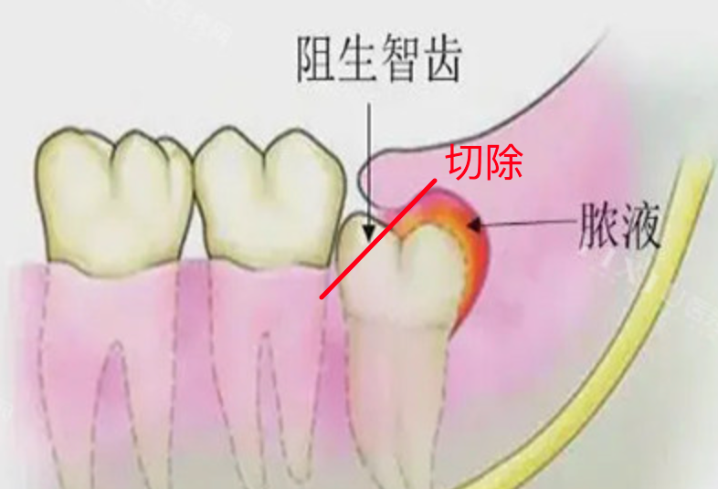

---
tags:
- blog
- 看病
include:
- ai-summary
---

# 拔牙始末

## 背景
故事要从2022年的夏天开始说起。

牙疼，具体来说是牙龈疼。疼得我吃嘛嘛不香、非常心烦，于是在一个平平无奇的周三，我去了一趟牙诊所。买了一个99¥的洗牙套餐，拍了一张牙片：

<figure markdown>
{width=400}
<figurecaption>
露骨的照片
</figurecaption>
</figure>

牙医说，我的（右下侧，牙片里是左下侧）智齿没有完全长出来，所以覆盖的牙龈和牙齿之间的缝隙很容易藏污纳垢。再加上我清洁不到位，所以就反复发炎。

!!! info
    FYI，这就叫[阻生齿](https://zh.wikipedia.org/wiki/%E9%98%BB%E7%94%9F%E6%99%BA%E9%BD%BF)

洗完牙之后给我上了一点药，药到病除、效果显著，可是真TM贵啊：

<figure markdown>
{width=600}
<figurecaption>
这个200¥的派丽奥我估摸着牙诊所含泪赚了我150¥
</figurecaption>
</figure>

顺带一提，人生第一次洗牙真的好痛啊😭：

<figure markdown>
{width=400}
<figurecaption>
你能想象每个牙缝都在渗血的感觉吗😭
</figurecaption>
</figure>

而后的日子，得过且过。牙龈也发炎过几次，但都不是很严重。我也开始每年都去洗牙了，我与牙结石不共戴天。

!!! info 
    FYI：洗牙真的能缓解**口臭**以及**牙龈出血**（其实就是牙周炎）！

## 导火索

到了今年，一方面我终于受不了牙龈的反复发炎了；另一方面，更让我忍受不了的是：牙龈和智齿之间的缝隙在每餐后都能存储海量的食物残渣。

简直是如鲠在喉，哦不对是**如渣在龈**。我不得不反复用冲牙器来清洗我那发炎肿胀的牙龈，痛、太痛了😭

于是经过充分且周密的案例调查和SWOT分析（i.e. 纠结），我终于下定决心要一劳永逸，直接把智齿拔了。

问了问沪✌️，实验室的朋友以及小红书上的集美，我就选了最近的牙防所来拔牙。

## 关键战役
持续两周，影响深远。

### 2024年10月15日
> 第一次门诊

上午九点过，我来到中原路的杨浦区牙防所。被告知上午的号已经没了，只能挂下午的号。

下午一点过，我迟到了十分钟，被延了几号。本以为当天就可以手起刀落、把牙拔掉。被告知需要预约，只能下周来拔。

开了一些治疗牙龈发炎的替硝唑片，拍了一个更昂贵的牙CT：

<figure markdown>
{width=400}
<figurecaption>
这次是multi-view，3D Stack
</figurecaption>
</figure>

医保尚未到达起付线，微信支付了200多现大洋。

!!! info
    上海的大学生医保可以报销牙齿治疗（当然包括拔牙），不可以报销牙齿美容。根据[复旦大学医保规定](https://zongwuchu.fudan.edu.cn/39411/list.htm)，300¥以内不报销，当年累计超过300¥才会开始报销：

    <figure markdown>
    {width=600}
    <figurecaption>
        在复旦六年，第一次用上医保
    </figurecaption>
    </figure>

### 2024年10月21日
> 第二次门诊，手术当天，也是我的阳历生日🎂

这次不用自己挂号，有预约单，爽！

手术过程很短暂，躺下来十分钟不到就结束了。

<figure markdown>
{width=400}
<figurecaption>
手术示意图
</figurecaption>
</figure>

0. 最开始先打了麻药，似乎是往牙龈里注射的。很快我的牙龈就没知觉了，连带那一侧的舌头也麻得厉害。
1. 然后医生把我的智齿磨掉一部分，否则它和旁边的牙挨在一起不是很好拔。磨牙的时候有一股难闻的味道，大概是高温下牙齿糊掉了。
2. 磨完之后，用钳子一翘就拔下来了。
3. 最后医生把旁边的牙龈拉下来缝合到一起遮住伤口、然后用止血棉把伤口盖住。

这就算结束了。

本次门诊终于到达了医保的起付线，账单是900¥多：

<figure markdown>
{width=400}
<figurecaption>
真贵吧😭
</figurecaption>
</figure>

微信支付409¥现大洋就搞定了。

术后给我发了一张小纸条，我就回家了：

<figure markdown>
{width=400}
<figurecaption>
当天没敢吃饭，只喝了点粥
</figurecaption>
</figure>

拔下来巨大一颗牙，阳光下还粘连了一点粉嫩嫩的估计是牙龈😱

<figure markdown>
{width=400}
<figurecaption>
看着就痛
</figurecaption>
</figure>

### 2024年10月28日
> 第三次门诊，拆线

依然不用自己挂号，医生给了预约单。

可气的是，医生拔牙那天搞错了日期。在备忘录上写的我10月21来拆线😭

所以我10月28去的时候，医生根本不知道我要来。最终我在外面等了一小时，实在受不了了进去问了她，她才给我拆了线。

拆线也很轻松，几乎没出血。医生还用生理盐水帮我洗了洗。

## 后续影响

拔牙前后一周吃饭还是会受到影响的。拆完线的那一周很快就恢复正常了。

最烦人的是拔完牙之后留下的大空洞，据说是会慢慢长好：

<figure markdown>
{width=400}
<figurecaption>
图源网络，和我的情况基本一致
</figurecaption>
</figure>

在长好之前，请务必准备一个**冲牙器**，否则塞进去的食物残渣根本没法清理。

此致，希望大家的🦷都安分一点，阿门！