---
tags:
- blog
- Annual
include:
- live
---

# 2025年度回顾

可喜可贺，又苟活了一年🙏

## 一月：吃喝玩乐，好不快活

刚考完统计计算的期末，我就来到了常州。

<figure markdown>
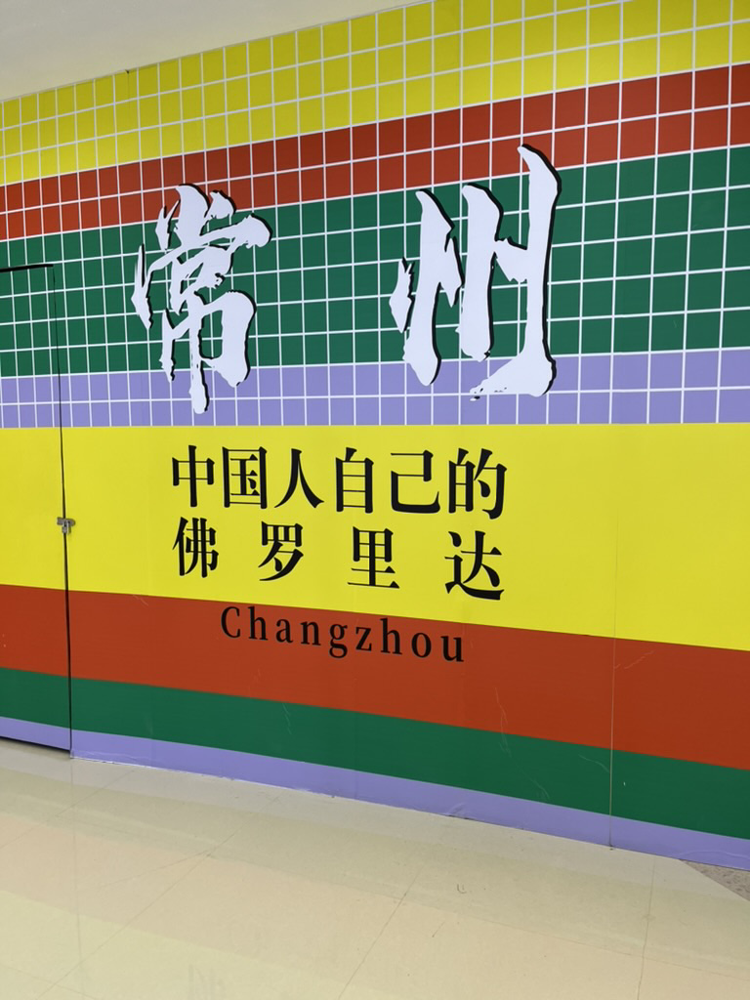{width=300}
<figurecaption>
东方佛州
</figurecaption>
</figure>

和好哥们吃吃喝喝，随便逛了逛，没感觉出常州和泗阳有什么不一样，无非就是楼多了点。

<figure markdown>
{width=300}
<figurecaption>
这个人吃草莓只吃红色的部分？强烈谴责！
</figurecaption>
</figure>

回到上海又马不停蹄就去[迪士尼玩了一趟](./disney.md)，在上海这么多年还是第一次去：

<figure markdown>
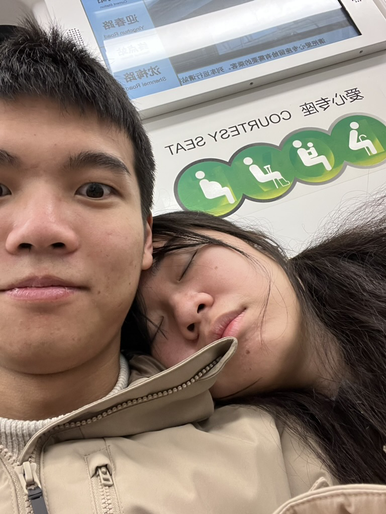{width=300}
<figurecaption>
俩人起了个大早，小猪睡了一路
</figurecaption>
</figure>

人是真的多，不过还是值得一去，也是人生体验了。

放了寒假没啥事我就回家了，还顺道去了一趟淮安。我的老吃家室友带我去吃了一家巨好吃的东北烤肉：

<figure markdown>
{width=300}
<figurecaption>
菜包饭是个伟大的发明
</figurecaption>
</figure>

第二天走之前还逛了逛淮安的景点，去了吴承恩故居、周恩来纪念馆；逛完了我室友还开车把我送到了家门口😭 太温柔辣！

回家之后每天就是晒晒太阳、串串门，整天无所事事，就等着过年。

<figure markdown>
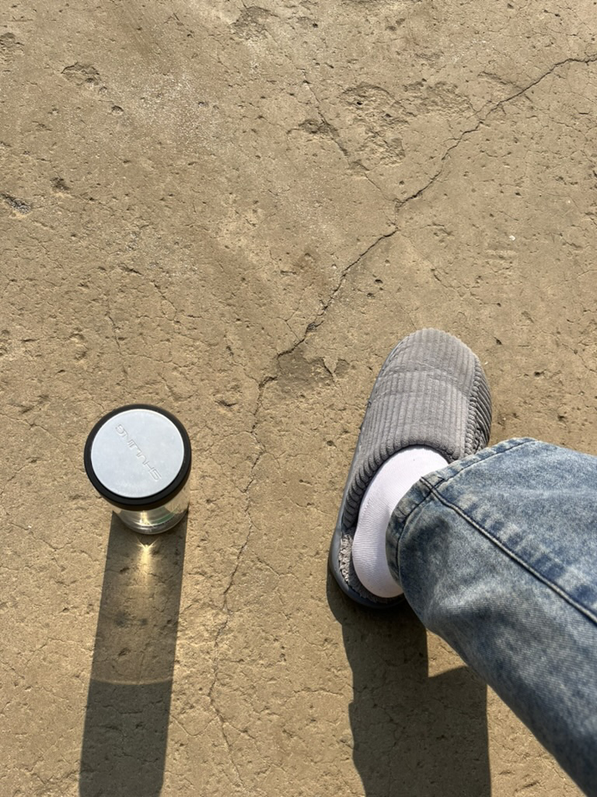{width=300}
<figurecaption>
纯享受
</figurecaption>
</figure>

闲到在家里翻箱倒柜，还真被我找到了很多老照片、老物件：

<figure markdown>
{width=300}
<figurecaption>
我爸的一代身份证，老头子年轻的时候真帅啊
</figurecaption>
</figure>

（此处省略吃喝玩乐）过了年，一月也就结束了。在本命蛇年的第一天，我就遇到了绝美的霞光，大概是祥瑞之兆！分享给大家：

<figure markdown>
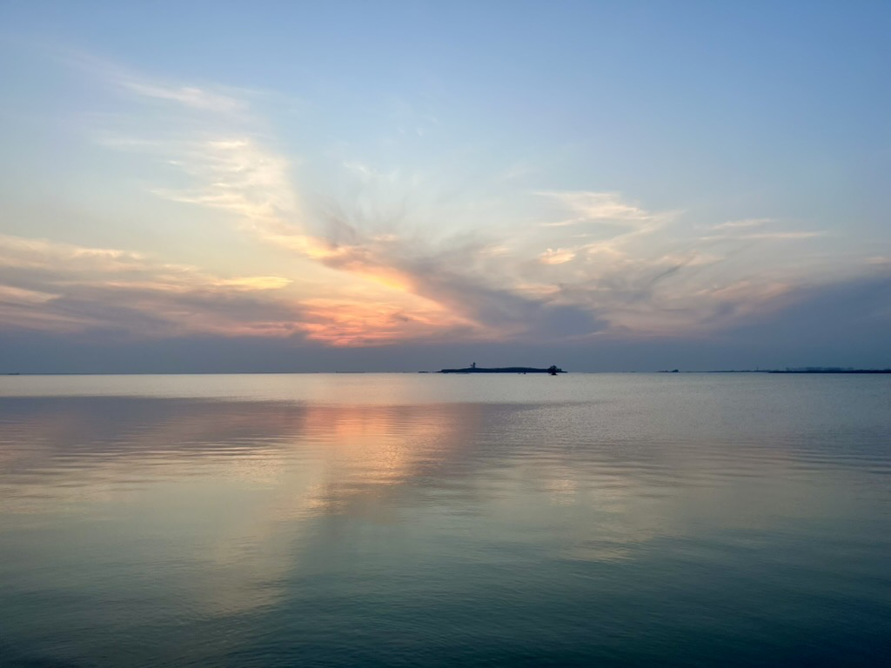{width=300}
<figurecaption>
水天一色！
</figurecaption>
</figure>

## 二月：你好，北海道

二月的相册是纯白的，堆满了北海道的雪。

这趟[和华哥一道去日本](./travel_to_japan2.md)，体验了一波J人旅行，感觉还不错：

<figure markdown>
{width=300}
<figurecaption>
我们拉通对齐了至少十个小时才产出了这张表
</figurecaption>
</figure>

这一趟走马观花，游览了十来个城市：

> 请各位同学顺带复习一下这些单词

- 札幌（Sapporo）
- 钱函（Zenibako）
- 小樽（Otaru）
- 美瑛（Biei）
- 富良野（Furano）
- 旭川（Asahikawa）
- 登别（Noboribetsu）
- 洞爷（Toya）
- 函馆（Hakodate）
- 富士吉田（Fujiyoshida）
- 诹访（Suwa）
- 歧阜（Gifu）
- 名古屋（Nagoya）

你别说，小日子还挺会起名字的。不知道为什么，总感觉这些日汉字写出来的城市名有种独特的美感（*或者说是不明觉厉*），虽然他们的实际含义可能很土。例如函馆，它的意思是“堆放箱子的地方”，是其作为港口城市的一大特征。

一遭走下来，不得不说北海道当真是一个看雪的好地方，连华哥这个东北人都连连称奇。每天都有下不完的雪，而且还一点都不冷。

作为一个没咋见过大雪的江苏人，可算让我开了眼了。今年寒假咱还打算去东北看一看，不知道东三省的烈雪又是如何。

哦对了，二月的最后一天刚好是MICCAI2025的截稿日。刚结束完旅行还带着感冒的我，拖着沉重的身体熬了几个大夜，终于是顺利提交了：

<figure markdown>
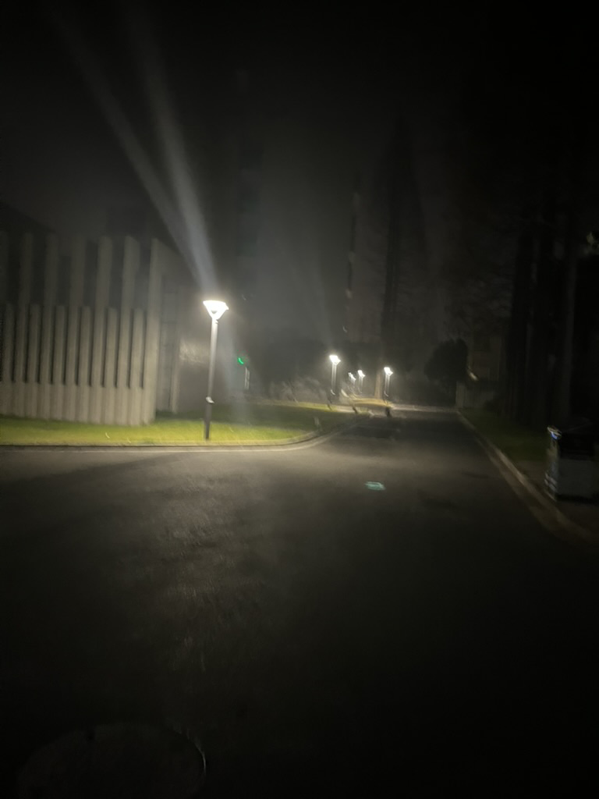{width=300}
<figurecaption>
4:24 AM, 这恍惚的灯光和我的脑子一样，晕成一坨
</figurecaption>
</figure>

## 三月：春暖花开

三月是杨老师的生日月🎂，猪猪又是新的一岁咯。今年的小礼物是一个彩色水墨屏：

<figure markdown>
{width=300}
<figurecaption>
要不是太贵了我肯定给自己也买一个😭
</figurecaption>
</figure>

和华哥趁着春暖花开[出门赏了樱花🌸](./haru.md)，虽然是工作日，鲁迅公园却全是人，我也好想加入退休的大军😭。

光草上的人和花也是繁盛了起来：

<figure markdown>
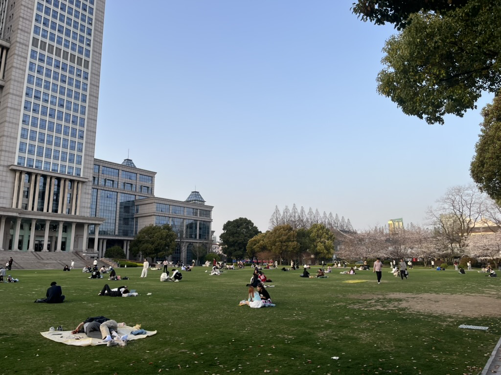{width=300}
<figurecaption>
拍的时候没注意，左下角小情侣在干啥！！
</figurecaption>
</figure>

月底还[去了一趟上海野生动物园](./shwzoo.md)，遇到了超多可爱的动物，互动票真的非常值！逛完动物园还在冷风里面了个暑期实习：

<figure markdown>
{width=300}
<figurecaption>
冻死我了
</figurecaption>
</figure>

是的，三月份我已经开始疯狂地找暑期实习了。剧透一下：根本没找到，面试了那么多一点用都没有😭。

## 四月：我是尼康佬

没错，我掏空钱包买了台相机📷

<figure markdown>
{width=300}
<figurecaption>
NIKON Z5～
</figurecaption>
</figure>

其实3月31号的晚上我就拿到了相机，无奈天色已晚只能等到第二天才出门拍拍拍。在学校里大肆扫荡：

<figure markdown>
{width=300}
<figurecaption>
🌸 + 🍃
</figurecaption>
</figure>

清明假期，带着刚买的相机[去了一趟杭州](./hangzhou.md)。我们4月3号趁着没放假的时候在西湖边逛了个爽，到了第二天再经过西湖已经是人山人海。错峰旅游真的很爽，是学生时代的特权😭

<figure markdown>
{width=300}
<figurecaption>
人头攒动，完全没有进去的欲望
</figurecaption>
</figure>

回到上海继续着**工作日宅宿舍摸鱼、周末出门约会**的混日子生活。

> 现在来看，这一年的大多数时候我都在这样混日子。除非有不得不去做的事情，否则就是如此循环往复。

四月很快也就过去了。不过有了相机后，相册里的照片多了起来：

<figure markdown>
{width=300}
<figurecaption>
黛玉呢，快呼叫黛玉
</figurecaption>
</figure>

<figure markdown>
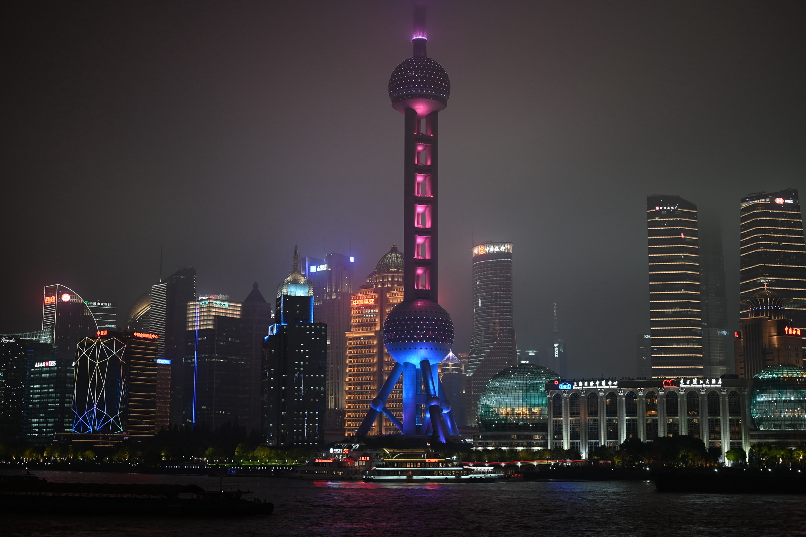{width=300}
<figurecaption>
雾里的东方明珠
</figurecaption>
</figure>

哦对了，在四月的最后一周，杨老师顺利通过了毕业答辩，成为准硕士，让我们恭喜她：

<figure markdown>
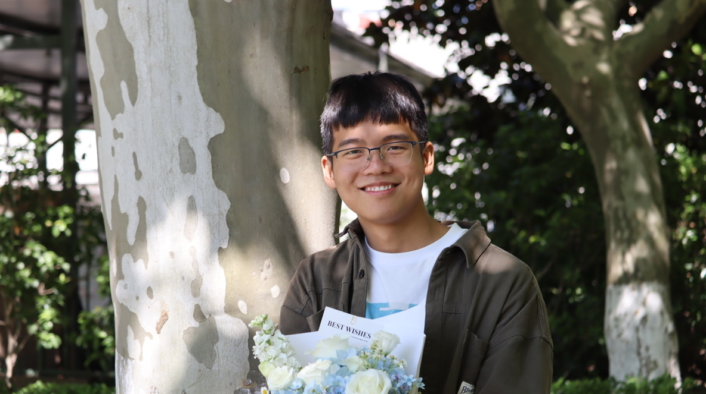{width=300}
<figurecaption>
为什么这个人捧着花笑得那么开心？又不是你毕业！
</figurecaption>
</figure>

## 五月：北京儿～

AUV，您猜怎么着？咱进京了！

其实这回是二进京，初中的时候班级组织过一次冬游（2016年的一月）。不过那个时候我还没开窍、啥也不懂，对北京的记忆早就已经模糊。尤记得北京的冬天很干燥，还记得王府井有很多坑人的小摊高价卖一些不值钱的小玩意儿。

趁着五一假期，[我和东哥暴走了北京](./beijing.md)。这一趟下来该去的景点差不多都去了。但是有三个遗憾：

1. 故宫没去成
    - 五一假期的人实在是太多了，我们倾尽全力也没预约上
    - 去北京不去紫禁城里晃一圈总归是缺了点什么
2. 没能进清华再看一看二校门
    - 人脉这一块还是欠缺了
3. 没去八达岭长城故地重游
    - 不过慕田峪长城倒也不错

25年在北京拍的照片之前的博客里都已经放过了，这里咱就整一个16年的回忆版本：

> 比较可惜的是，虽然当年去北京的时候我也带了手机，拍了一些照片。但是这些照片都丢了，一张不剩。好在还有一些别人拍的照片，能让我记起在北京的日子。

- 我（大概是）在故宫

<figure markdown>
{width=300}
<figurecaption>
珍贵的单人照，请忽略死亡的穿搭
</figurecaption>
</figure>

- 我们在清华二校门

<figure markdown>
{width=300}
<figurecaption>
无奖竞猜：我在哪？
</figurecaption>
</figure>

- 我们在北大图书馆

<figure markdown>
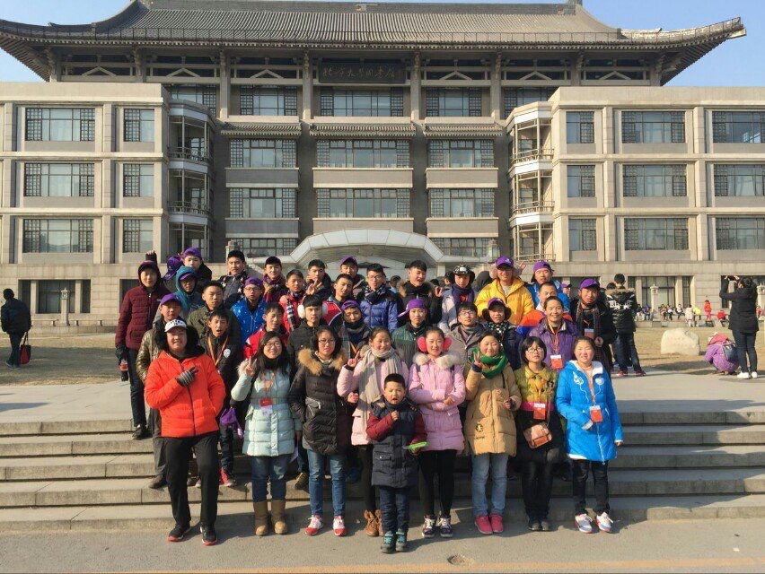{width=300}
<figurecaption>
年代太过久远，好糊😭
</figurecaption>
</figure>

- 我们在八达岭长城

<figure markdown>
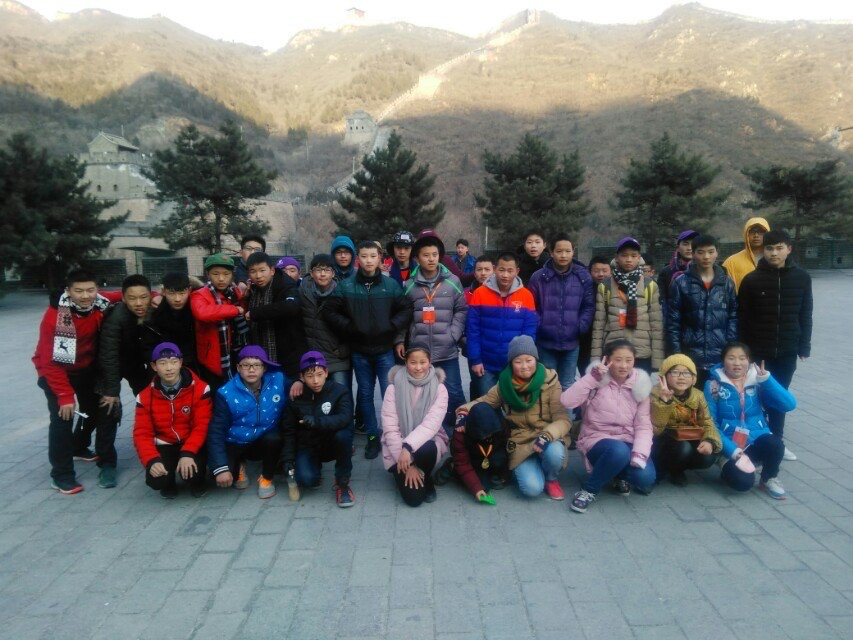{width=300}
<figurecaption>
好绝的背景
</figurecaption>
</figure>

- 我们在颐和园

<figure markdown>
{width=300}
<figurecaption>
这也能叫景点？？
</figurecaption>
</figure>

现在看来，这些照片都是无比珍贵的回忆。也再次印证了我在中二时期耻于拍照是一件多么可笑的事情😭，早知道就应该多多地拍！

从北京回来，又过上了**宅家摸鱼、出门约会**循环往复的日子，五月就这样平淡地走到了末尾。

这里有一个callback，5月20号我们去看了情书，电影里满是在北海道见过的景致，有种奇妙的感觉：

<figure markdown>
{width=300}
<figurecaption>
钱函啊！原来藤井树的家就在我们住的民宿附近
</figurecaption>
</figure>

最后是每年的固定节目：5月27号的复旦校庆。今年是120周年，必须大办特办！也是终于在外滩点亮了一次。

<figure markdown>
{width=300}
<figurecaption>
这回复旦也NB了，不输财大！
</figurecaption>
</figure>

## 六月：在得物打工

端午假期回家了一趟，把我收集的全套麦当劳可乐杯带了回去：

<figure markdown>
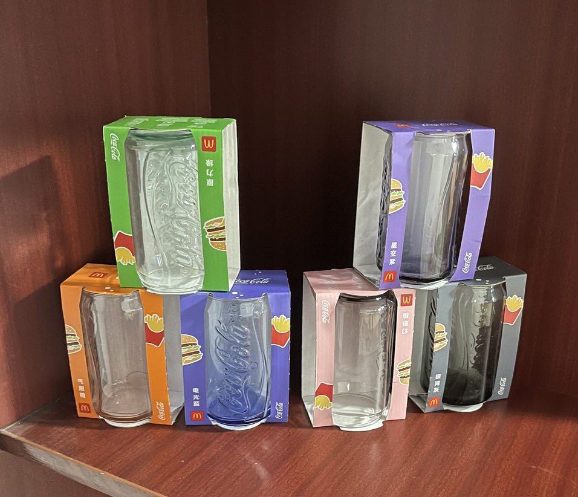{width=300}
<figurecaption>
麦门永存
</figurecaption>
</figure>

回上海就开始打工了：

<figure markdown>
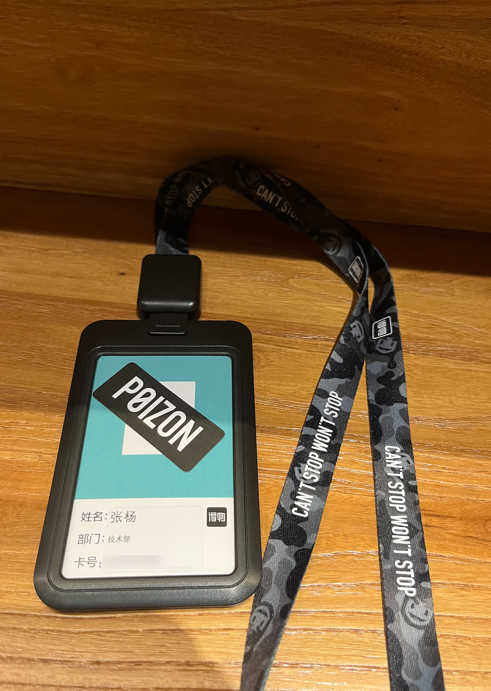{width=300}
<figurecaption>
得物数分
</figurecaption>
</figure>

其实我投了很多算法的实习，但是全都石沉大海。最后只有无心插柳的得物愿意让我去实习，也只能再捡起老本行去干数分。虽然干的不是最想要的算法，但好在有钱拿，也就干下去了。

六月底，杨老师终于蓝袍加身，彻底结束了学生时代，让我们再次恭喜她：

<figure markdown>
{width=300}
<figurecaption>
摄影师真厉害吧😎拍的真好👍
</figurecaption>
</figure>

## 七月：继续在得物打工

坏女人去马来西亚快活了，而我只能继续在得物苦苦打工。

好在我还有一堆狐朋狗友😭

<figure markdown>
{width=300}
<figurecaption>
年老师强势重返复旦！
</figurecaption>
</figure>

<figure markdown>
{width=300}
<figurecaption>
并且激情献唱
</figurecaption>
</figure>

月底，杨老师的爸妈来上海了。我被召见，只能硬着头皮上了，吃完了一顿巨尴尬的饭又逛了逛校园😭

<figure markdown>
{width=300}
<figurecaption>
这么看，复旦像是杨老师的母校
</figurecaption>
</figure>

七月在相册里也太短了，都怪工作。日复一日，生活了无生趣，怪不得大家都待不下去了：

<figure markdown>
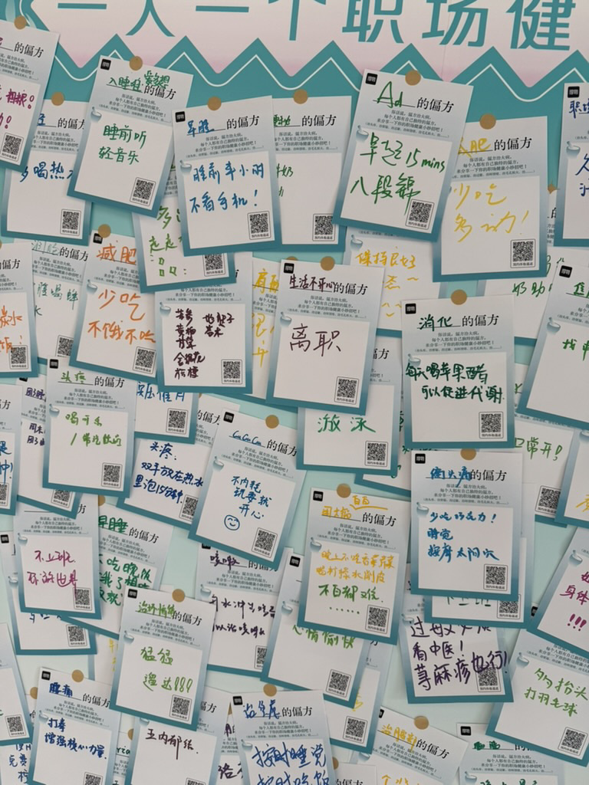{width=300}
<figurecaption>
生活不开心的偏方：离职
</figurecaption>
</figure>

## 八月：离职

终于熬到了八月份，差不多该润了。

总的来说，我在得物的日子过的相当无聊。日常工作就是SQL和一些简单的统计分析，没什么实际意义也没什么结果产出。更没交到什么朋友，mentor相当佛系、一门心思都放在家人上、负责的业务感觉也是路边，同期的实习生也没什么可聊的，偶尔约个饭也很无趣。

每天的日常就是早上十点到公司，半梦半醒中听听歌，刷刷手机就到了十二点。准点下楼吃饭，20%的概率去吃麦当劳，80%的概率去吃楼下离得最近的松板肉定食：

<figure markdown>
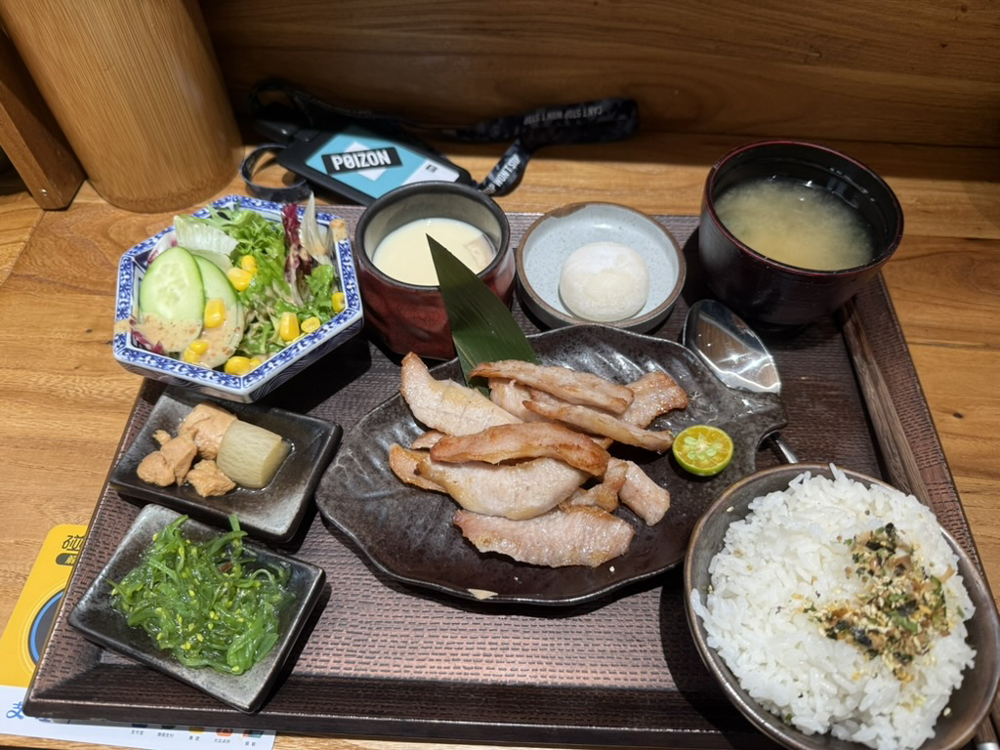{width=300}
<figurecaption>
吃到吐
</figurecaption>
</figure>

快速吃完饭回工位开始睡大觉，睡到一点半差不多起来干活：

<figure markdown>
{width=300}
<figurecaption>
困死🥱
</figurecaption>
</figure>

说是干活其实根本不知道在忙什么（有很大概率在写博客、摸鱼、看一些无聊的文档），总之到了下午五六点钟就开始饿了。尤其是快到七点，饿得发昏。实在顶不住了就吃点公司的免费小零食。你别说，**得物的小零食还都挺好吃**，质量很高，我被疯狂种草在宿舍也买了很多。

七点过，终于到了下班时间了，大概率没什么事我就准备开溜。由于我是组里溜的最早的，所以鼠鼠祟祟。小心打包自己的东西，轻轻起身。背包拉链是不敢拉的、直接一把提起，快速走到楼梯间再拉：

<figure markdown>
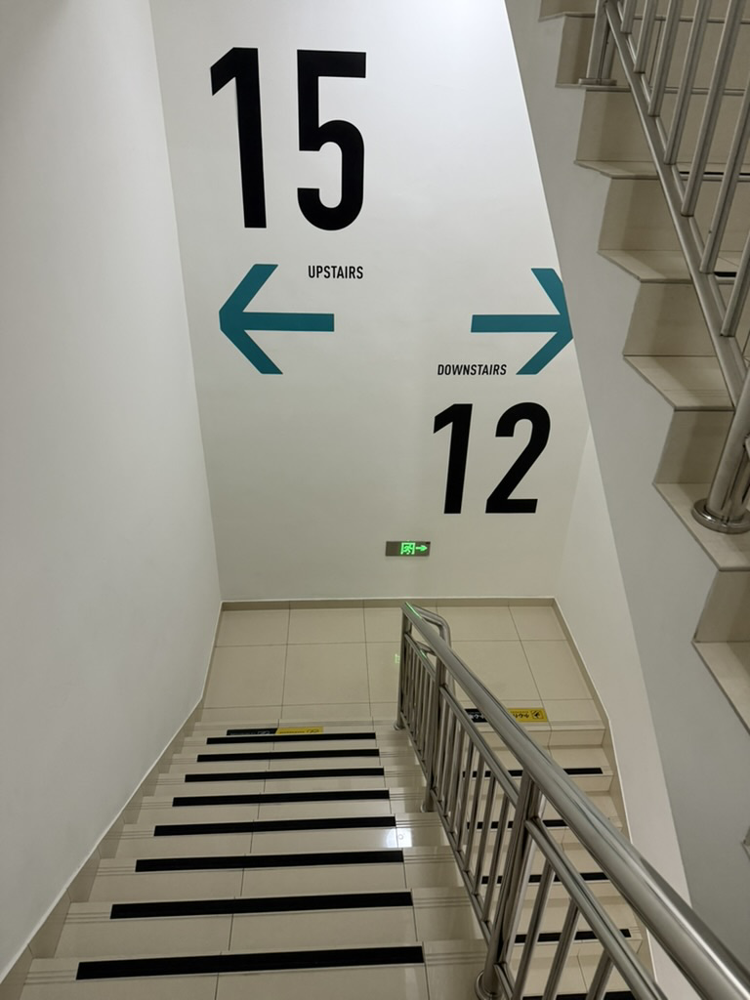{width=300}
<figurecaption>
鼠鼠专用楼梯
</figurecaption>
</figure>

从17楼一路小跑，到了一楼再去电梯间打个卡，爷就下班了！

<figure markdown>
{width=300}
<figurecaption>
运气好还能看到晚霞
</figurecaption>
</figure>

八月唯一的娱乐活动就是[去看了一次演唱会](./xiaoxia.md)：

<figure markdown>
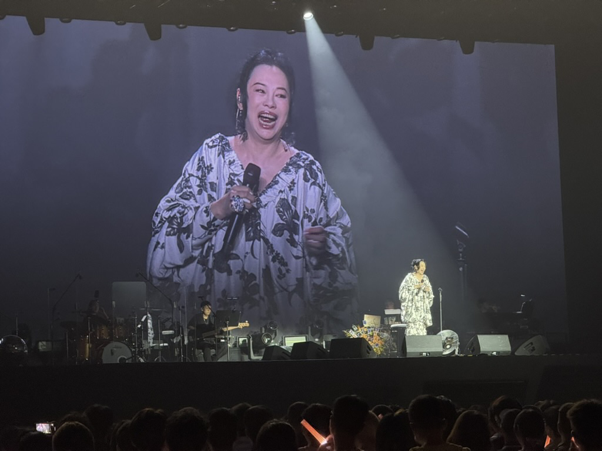{width=300}
<figurecaption>
黄妈的演唱会竟有点搞笑（？）
</figurecaption>
</figure>

## 九月：秋招

其实八月份还在得物的时候已经开始秋招了，我也不知道为什么秋招总是在夏天。秋招的过程很磨人，每天都在焦虑和自我质疑中度过。不停地填资料、笔试、面试、被刷掉，非常地反人类、稍有不慎就会坠入魔道。我投了17家，最后只收到了一个offer，只能说一败涂地。

<figure markdown>
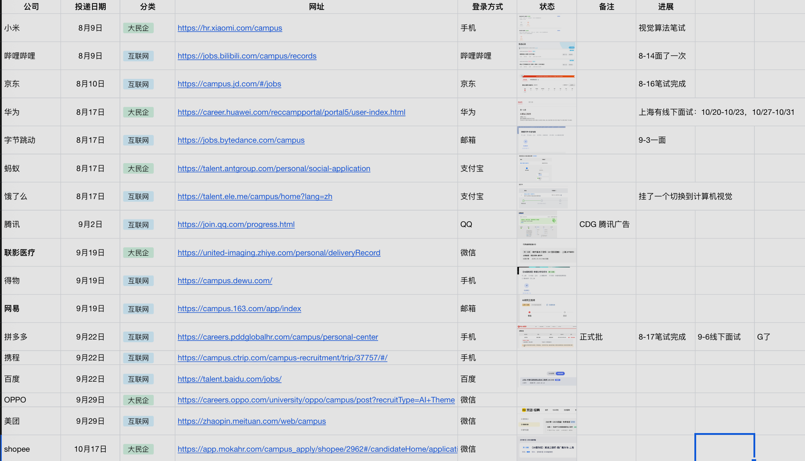{width=300}
<figurecaption>
1/17
</figurecaption>
</figure>

祸不单行，秋招不顺利也就罢了，家里也不太平。我们家老头子不知怎么的，突然晕倒在了工地上，非常吓人。好在急诊没发现什么病灶，我妈告诉我的时候人已经到了住院部，我连夜跑到南京在病房陪护：

<figure markdown>
{width=300}
<figurecaption>
总觉得我来过这个车站
</figurecaption>
</figure>

<figure markdown>
{width=300}
<figurecaption>
这个陪护床，要多难受有多难受
</figurecaption>
</figure>

好消息是，CT、磁共振、彩超、心超、血检，各种检查的组合拳打下来，依然没发现什么病灶。医生只说是颈动脉狭窄、脑部供血不足，不能高强度劳作。开了些中成药就放我爸回家了。原来是虚惊一场！不过终归年纪大了，老头子也该退休享享福了。

九月份就是这么的不如不如人意，好在《空洞骑士：丝之歌》发售了。苦难的生活有了些许乐趣：

<figure markdown>
{width=300}
<figurecaption>
扫清圣堡余孽，我辈义不容辞
</figurecaption>
</figure>

## 十月：俺哥结婚啦

对中国人来说，如果要挑一个日子办婚礼，假期最长的国庆节大概是首选。我哥也不能免俗，国庆我就被喊回去[当了一回伴郎](./wedding.md)。第一次深入到婚礼的细节当中，看到不同角色的各种作为，让我不禁感慨俗话说的对：

- 家家有本难念的经
- 世界是个草台班子
- 物以类聚人以群分

多的俺就不说了。

哦对了，这趟回家还顺带把我收集的**麦当劳可乐杯二代**带回了家：

<figure markdown>
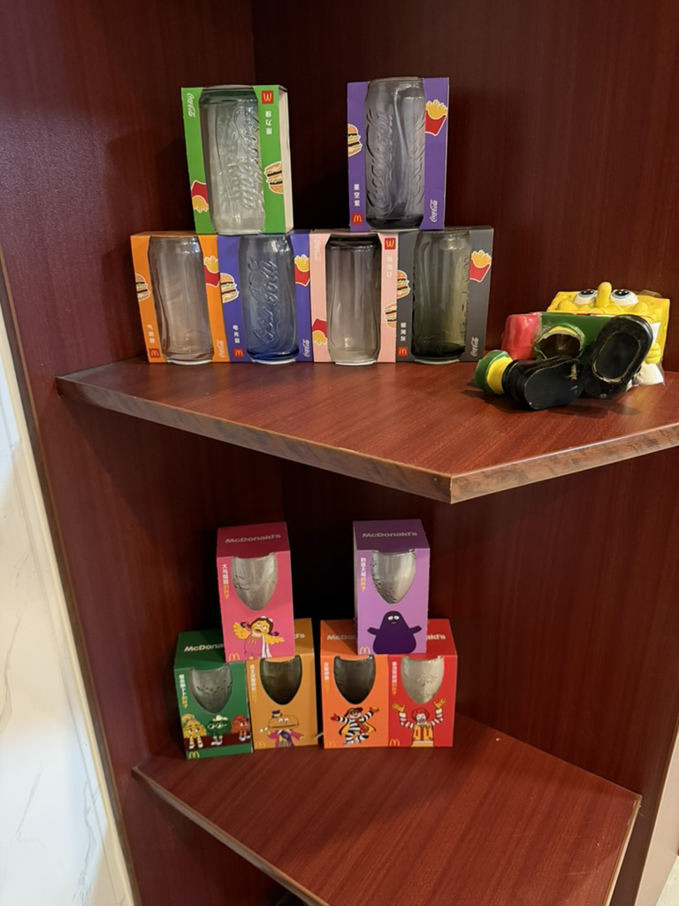{width=300}
<figurecaption>
麦门永存
</figurecaption>
</figure>

结完婚，我火速回到了上海。

好不容易有个假期，肯定要和喜欢的人过。幸好，假期还剩了点，足够我们相聚。

<figure markdown>
{width=300}
<figurecaption>
杨老师笑的多开心
</figurecaption>
</figure>

<figure markdown>
{width=300}
<figurecaption>
看我的大长焦，真能拍到嫦娥
</figurecaption>
</figure>

恰逢中秋佳节，杨老师拨了巨款买了好几只大螃蟹，加上我的祖传厨艺、匠心烹饪，直接搞了<s>一桌子美味</s>（好吧，其实就做了俩小菜）：

    <figure style="width: 30%; text-align: center;">
        
        <figcaption>猛男做饭</figcaption>
    </figure>
    <figure style="width: 30%; text-align: center;">
        
        <figcaption>🦀 + 🥚 + 🥩</figcaption>
    </figure>
    <figure style="width: 30%; text-align: center;">
        
        <figcaption>香晕了！</figcaption>
    </figure>

当然，也不能忘了兄弟们：

<figure markdown>
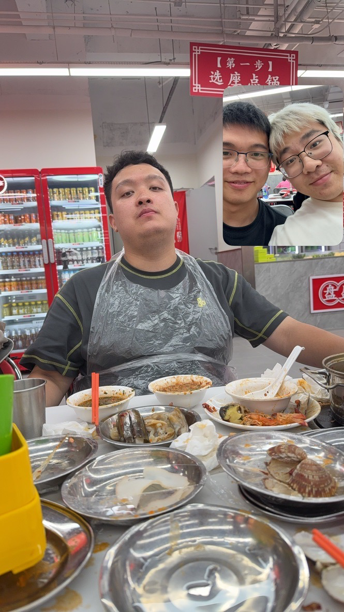{width=300}
<figurecaption>
一家三口属于是
</figurecaption>
</figure>

假期过后，日子继续回到**工作日宅家摸鱼偶尔工作、周末出门约会吃喝玩乐**的循环。这一年，我的体重直线上升！都怪杨老师，天天带我胡吃海喝！！！

十月底，去参加了华子的线下招聘会：

<figure markdown>
{width=300}
<figurecaption>
面试官排排坐，压迫感十足
</figurecaption>
</figure>

哦对了，十月是咱的生日月（众所周知，我有[三个生日](../2024/birthday.md/#_2)），快祝我生日快乐！

<figure markdown>
{width=300}
<figurecaption>
哔哩哔哩发来了准时的祝福
</figurecaption>
</figure>

## 十一月&十二月：无事发生

这两个月似乎啥也没干。相册里都是吃喝玩乐的照片，日程表也是空空如也😭

只能挑些有趣的照片分享一下。

- 又和华哥去K歌了

<figure markdown>
{width=300}
<figurecaption>
激情！
</figurecaption>
</figure>

- 迟早有一天我会拥有自己的小猫：吃重庆麻辣烫遇到了特别乖的狸花猫，可爱捏。

<live-photo-element src="../assets/2026-01-15-20-35-52.png" caption="小猫踩奶">
</live-photo-element>

> 我已经规划好了，一只美人猫、一只可爱猫，一公一母，儿女双全！

- [又去了一趟迪士尼](./disney2.md)

<figure markdown>
{width=300}
<figurecaption>
可惜天气不是特别好😭
</figurecaption>
</figure>

- 大晚上不睡觉和室友去吃海底捞

<figure markdown>
{width=300}
<figurecaption>
悍匪！
</figurecaption>
</figure>

- 在食堂偶遇了我关注的UP主，这还是第一次在线下遇到名人？

<figure markdown>
{width=300}
<figurecaption>
[籽岷](https://space.bilibili.com/686127)
</figurecaption>
</figure>

- 签了卖身契

<figure markdown>
{width=300}
<figurecaption>
我是华孝子
</figurecaption>
</figure>

- 逛了上海体育大学

<figure markdown>
{width=300}
<figurecaption>
青瓦大楼
</figurecaption>
</figure>

<figure markdown>
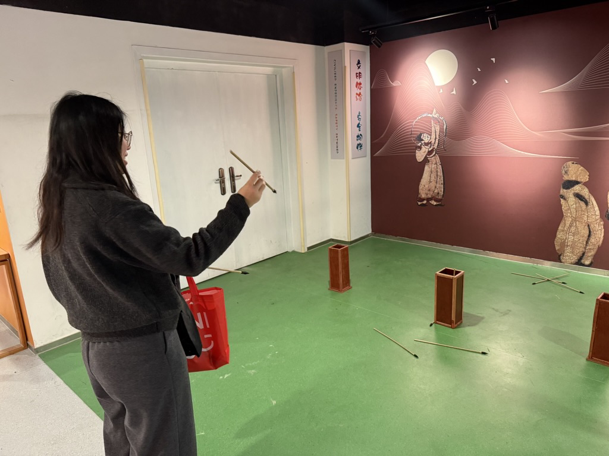{width=300}
<figurecaption>
免费的射箭、投壶小游戏
</figurecaption>
</figure>

- 五角场合生汇的五楼露台有只草泥马，望周知

<figure markdown>
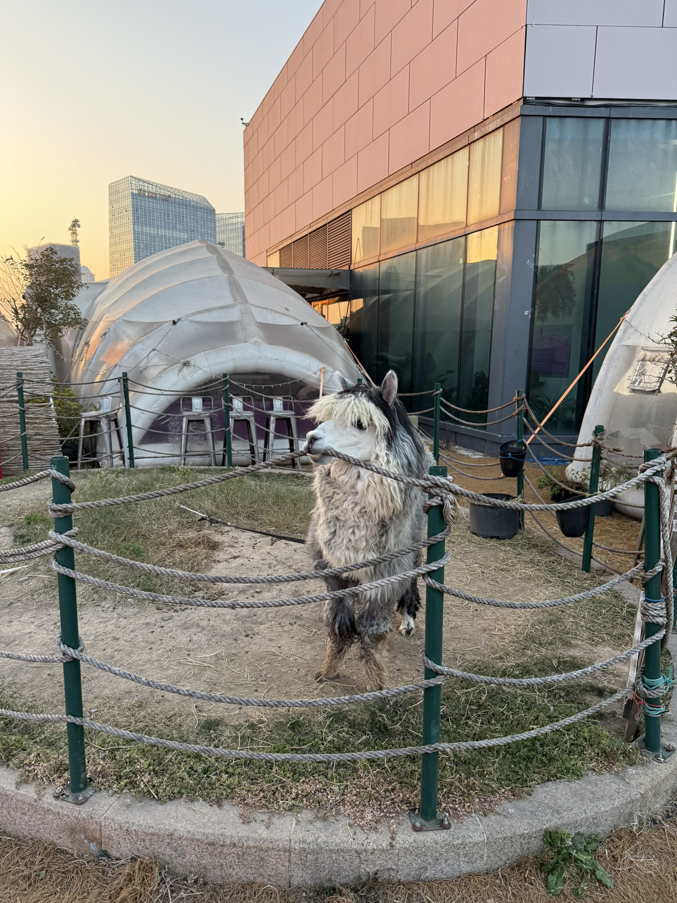{width=300}
<figurecaption>
眉清目秀的
</figurecaption>
</figure>

- 误入了“三个男人的婚礼”

<figure markdown>
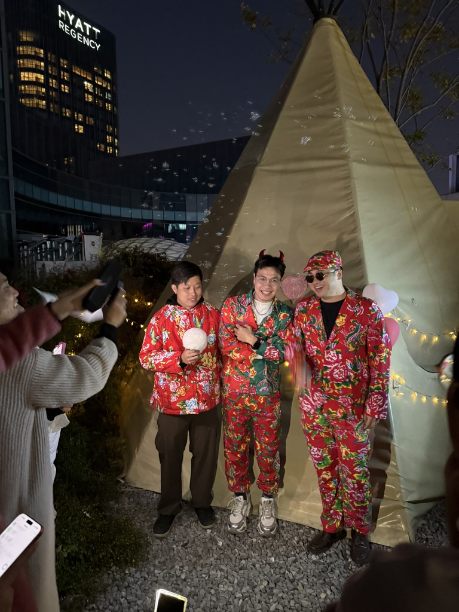{width=300}
<figurecaption>
我全场懵逼，不知道在干什么
</figurecaption>
</figure>

- 去野餐了

<figure markdown>
{width=300}
<figurecaption>
冬天还是别去了，冻死我了
</figurecaption>
</figure>

- 公园偶遇溜宠物兔，兔子也需要溜溜吗？

<figure markdown>
{width=300}
<figurecaption>
可爱🐰
</figurecaption>
</figure>

- 甚至还有溜老鼠的

<figure markdown>
{width=300}
<figurecaption>
鼠鼠估计吓死了🐭
</figurecaption>
</figure>

- 月底去ybc家聚餐了

<figure markdown>
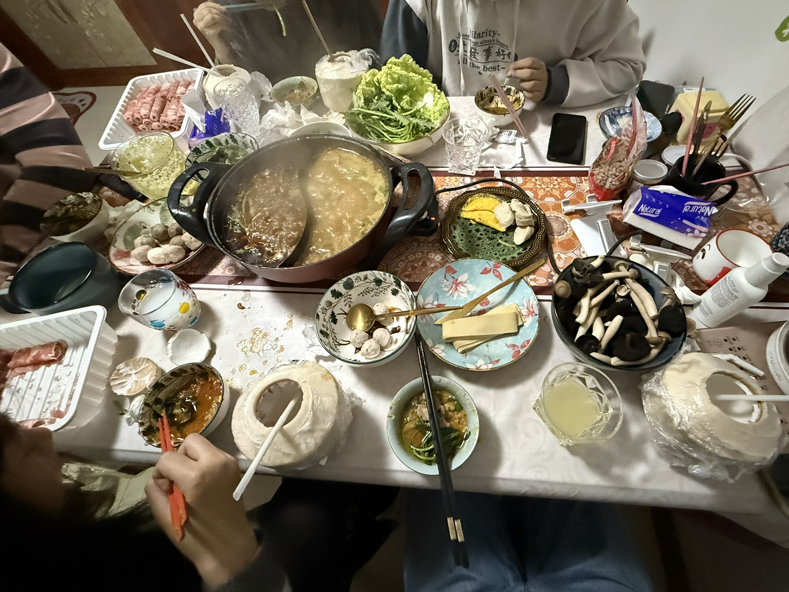{width=300}
<figurecaption>
啥时候才能是三对情侣，而不是两对情侣带一个单身汉
</figurecaption>
</figure>

- 最后三天，不走是狗！

<figure markdown>
{width=300}
<figurecaption>
在2026年到来之前，他们真的走了
</figurecaption>
</figure>

- 憨憨猫

<figure markdown>
{width=300}
<figurecaption>
一整个呆住了
</figurecaption>
</figure>

- 本来想出门跨年，但是太冷了只能缩在被窝里。听到烟花就去窗口瞄了几眼，赚到！

<figure markdown>
{width=300}
<figurecaption>
2026，新年快乐！
</figurecaption>
</figure>

## 许个愿

我亲爱的文殊菩萨、南无大慈大悲救苦救难广大灵感观世音菩萨、护国庇民妙灵昭应弘仁普济福佑群生诚感咸孚显神赞顺垂慈笃祜安澜利运泽覃海宇恬波宣惠导流衍庆靖洋锡祉恩周德溥卫漕保泰振武绥疆嘉佑天后，请保佑我顺利毕业、顺利就业🙏
