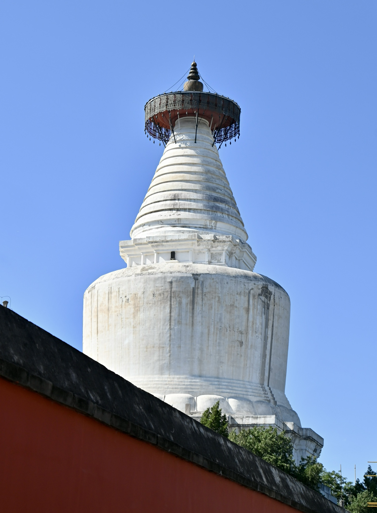

---
tags:
- blog
- 留影
- 旅行
include:
- ai-summary
---

# 再游北京

> From 2025.4.30 to 2025.5.6 in Beijing, China

是的，今年五一进京了。

??? question "为什么去北京？"
    这趟北京之旅可以说即是早有预谋又是临时起意。

    初中的时候，我跟着班里组织的冬令营去过一趟北京，不过记忆已经模糊、只留下几张零碎的照片。所以我一直很想再去一趟北京，算是旧地重游。

    研究生入学的时候，我和我室友突发奇想把家庭火车站写成了北京，为的就是这一天。

    今年的五一，我本来打算回家来着，手里没什么钱只能家里蹲了。但又不想放过难得的长假，于是盘算了一下去一趟北京应该没问题。毕竟东哥在北京，我可以厚着脸过去借宿一下😁。这样一来，路费是学生票优惠价，住宿是免费的，只需要考虑吃喝玩乐就行了。

    说干就干，我立马就买票冲到北京了。

特别感谢`@东哥`全程陪我暴走，以及让我留宿。

## 出发

没钱坐飞机，买了火车票。上午十点三刻发车，一路上睡睡醒醒，下午还面试了腾讯IEG的一个暑期实习（当然也是不出意外地被挂了），很快就到了北京。

从上海一路向北，山丘逐渐多了起来，不时就有一个隧道（我的面试也是也G中加G，还得沉淀！）。

<figure markdown>

<figurecaption>[G124线路图](http://cnrail.geogv.org/zhcn/route/CN~G0124)</figurecaption>
</figure>

到天津到时候，天气很差。我心想，北京这雾霾整治一点用没有啊，还是这B样：

<figure markdown>
{width=400}
<figurecaption>
华北平原？
</figurecaption>
</figure>

没想到，真到了北京，出地铁第一眼就是蓝天白云，看来北京的环境治理还是蛮成功的

<figure markdown>
{width=400}
<figurecaption>
神秘的塔
</figurecaption>
</figure>

东哥租的房子在北三环和北四环中间，离牡丹园地铁站就五分钟的路，交通非常方便。京城的地铁围绕着紫禁城排布地四方四正，看起来比上海地铁规划的好多了。

> 顺带一提，北京地铁的换乘很多都比较阴间，要跑很远，和上海龙阳路的天地换乘有的一拼。

<figure markdown>
{width=400}
<figurecaption>
北京地铁
</figurecaption>
</figure>

房子是个老破小，不过居然有外置的电梯，也是整挺好：

<figure markdown>
{width=400}
<figurecaption>
挺稀奇
</figurecaption>
</figure>

在北京这几天，基本都去景点里逛了。不得不说，北京的景点是真的多，全国应该很难再找到第二个地方有如此**密集且高质量的景点**了。就北京那几个公园都够我逛五天了。更别提北京还是政治中心，对中国人有额外的意义。

于是，五一的北京哪哪都是人，就一个北海公园我们去的时候就有一万多人同时逛，天坛公园这种网红点更是不用说，祈年殿前完全人挤人。不过这也是意料之中😭

## 景点

攻略是基本没做的，唯一提前想到的故宫还没抢到票。所以只能打开[Tripadvisor](https://cn.tripadvisor.com/Tourism-g294212-Beijing-Vacations.html)，从热门景点里随便挑几个出去走走。

自然，去逛景点之前也没做什么功课，属于随便乱逛、随便乱看。写此文的时候倒是补充了不少知识，都贴在文中了。

### [天坛](https://zh.wikipedia.org/wiki/%E5%A4%A9%E5%9D%9B)公园

??? quote "WIKI: 天坛"
    天坛（满语：ᠠᠪᡣᠠᡞ ᠮᡠᡴ᠋ᡩᡝ᠋ᡥᡠᠨ；转写：abkai mukdehun），位于北京市东城区，是明清两朝皇帝祭天、祈谷和祈雨的场所。天坛始建于明成祖永乐十八年（公元1420年），原名“天地坛”，明嘉靖九年（公元1530年）在北京北郊另建祭祀地神的地坛，并改名为“天坛”。

    天坛占地约273万平方米，是故宫面积的四倍，是现存中国古代规模最大、伦理等级最高的祭祀建筑群。1961年，天坛被国务院公布为第一批全国重点文物保护单位之一。1998年，“北京皇家祭坛—天坛”被列为世界文化遗产，亦为2024年7月27日所入选的另一项世界遗产“北京中轴线——中国理想都城秩序的杰作”的一部分。现时天坛公园还包括九坛八庙中的祈谷坛。

    天坛布局严谨，建筑结构独特，装饰瑰丽，巧妙地运用力学、声学和几何学等原理，具有较高的历史、科学和文化价值。

除了故宫，天坛大概是北京最值得一看的古建筑了。由于[更定祀典](https://zh.wikipedia.org/wiki/%E6%9B%B4%E5%AE%9A%E7%A5%80%E5%85%B8)，四郊分祀。北京实际上有四座祭坛：天地日月。天坛和地坛我都去看了一眼。

我们是从天坛的西门进去的，进门就是一条端庄大道，很阔气：

<figure markdown>
{width=400}
<figurecaption>
好绿，人好多
</figurecaption>
</figure>

没做攻略，我们就跟着人群走，直接到了祈年殿：

<figure markdown>
{width=400}
<figurecaption>
人是真的多
</figurecaption>
</figure>

祈年殿很好看：

<figure markdown>
{width=400}
<figurecaption>
可惜天不蓝
</figurecaption>
</figure>

<figure markdown>
{width=400}
<figurecaption>
近景
</figurecaption>
</figure>

<figure markdown>
{width=400}
<figurecaption>
全景
</figurecaption>
</figure>

看完了祈年殿就在公园里随便转了转，遇到了很多有趣的事。

<figure markdown>
{width=400}
<figurecaption>
玩抽象的
</figurecaption>
</figure>

<figure markdown>
{width=400}
<figurecaption>
搞玄学的
</figurecaption>
</figure>

<figure markdown>
{width=400}
<figurecaption>
玩抽象的
</figurecaption>
</figure>

<figure markdown>
{width=400}
<figurecaption>
搞音乐的
</figurecaption>
</figure>

<figure markdown>
{width=400}
<figurecaption>
甚至还有跳宅舞的
</figurecaption>
</figure>

照片实在是太多了，最后放一张有趣的屋脊：

<figure markdown>
{width=400}
<figurecaption>
[仙人走兽](https://zh.wikipedia.org/wiki/%E4%BB%99%E4%BA%BA%E8%B5%B0%E5%85%BD)
</figurecaption>
</figure>

### [永定门](https://zh.wikipedia.org/wiki/%E6%B0%B8%E5%AE%9A%E9%97%A8)

永定门里天坛还蛮近，是北京中轴线的最南端：

<figure markdown>
{width=400}
<figurecaption>
北京中轴南端点
</figurecaption>
</figure>

不过也就是一个普普通通的城门楼子

<figure markdown>
{width=400}
<figurecaption>
夕阳还不错
</figurecaption>
</figure>

实际上，现在的永定门是2003年重建的，原来的永定门早就被拆了😭

### [北海公园](https://zh.wikipedia.org/wiki/%E5%8C%97%E6%B5%B7%E5%85%AC%E5%9B%AD)

“让我们荡起双桨，小船儿推开波浪，水面倒映着美丽的白塔，四周环绕着绿树红墙”

这首歌想必大家都耳熟能详，描绘的正是北海公园。

可惜我们去的那天刮大风，不让划船，水面也不太能倒映出美丽的白塔。

<figure markdown>
{width=400}
<figurecaption>
遍布裂痕的白塔
</figurecaption>
</figure>

<figure markdown>
{width=400}
<figurecaption>
确实倒映了，但一点也不美
</figurecaption>
</figure>

我们要走的时候，夕阳搭配白塔还是很美的：

<figure markdown>
{width=400}
<figurecaption>
白塔下面的回廊也很美
</figurecaption>
</figure>

哦对了，北海下面就是中海和南海，简称中南海。在地图上是一片空白，实际上是中央人民政府的驻地。一路上全是警察，停车都不让停的那种。

### [景山公园](https://zh.wikipedia.org/wiki/%E6%99%AF%E5%B1%B1%E5%85%AC%E5%9B%AD)

景山公园在北海公园旁边，是个登高望远的好地方。

<figure markdown>
{width=400}
<figurecaption>
向南可以看到故宫
</figurecaption>
</figure>

<figure markdown>
{width=400}
<figurecaption>
向西可以看到北海公园
</figurecaption>
</figure>

<figure markdown>
{width=400}
<figurecaption>
向北可以看到钟鼓楼
</figurecaption>
</figure>

东边我没看，不知道能看到啥。

### [天安门](https://zh.wikipedia.org/wiki/%E5%A4%A9%E5%AE%89%E9%97%A8)广场

天安门是皇城的正门，也是中华人民共和国诞生的地方。天安门北边就是故宫，南边隔着一条长安街就是天安门广场。

我们去的时候已经是傍晚：

<figure markdown>
{width=400}
<figurecaption>
人民大会堂北侧
</figurecaption>
</figure>

排完队进去赶上了降旗，人山人海，啥也看不见。

等天黑下来，天安门就亮灯了：

<figure markdown>
{width=400}
<figurecaption>
万岁
</figurecaption>
</figure>

我们在长安街南北都走了走。

<figure markdown>
{width=400}
<figurecaption>
人民大会堂正门
</figurecaption>
</figure>

> 至此，一块钱和一百块钱人民币的取景地都打卡啦。还剩五十块、十块钱、二十块和五块钱😭道阻且长啊

也再一次看到了课本上的人民英雄纪念碑：

<figure markdown>
{width=400}
<figurecaption>
人民英雄永垂不朽
</figurecaption>
</figure>

### [故宫](https://zh.wikipedia.org/zh-hans/%E6%95%85%E5%AE%AB)外

天安门北就是故宫。这次没预约到，只能在紫禁城外转转了。

故宫四角有用来御敌的角楼：

<figure markdown>
{width=400}
<figurecaption>
东北角楼（可恶的水草😭）
</figurecaption>
</figure>

<figure markdown>
{width=400}
<figurecaption>
巨宽的护城河
</figurecaption>
</figure>

护城河边有非常多的格格和娘娘，宛如进入了大型清廷cos展：

<figure markdown>
{width=400}
<figurecaption>
皇帝选秀的日子不过如此
</figurecaption>
</figure>

<figure markdown>
{width=400}
<figurecaption>
抓拍的最美格格
</figurecaption>
</figure>

<figure markdown>
{width=400}
<figurecaption>
大长焦就是锐啊
</figurecaption>
</figure>

<figure markdown>
{width=400}
<figurecaption>
太像慈禧了！
</figurecaption>
</figure>

<figure markdown>
{width=400}
<figurecaption>
光很美
</figurecaption>
</figure>

<figure markdown>
{width=400}
<figurecaption>
远处的高楼
</figurecaption>
</figure>

路上还遇到了激情尼康捞，问我用的什么镜头。还一个劲给我安利他的F卡口大长焦。

从东北角楼，沿着护城河一路走来就到了午门。在这里，向南看就是天安门。天气好的话可以一直看到最远处的孙中山：

<figure markdown>
{width=400}
<figurecaption>
午门看天安门
</figurecaption>
</figure>

当然，上面这张图用的是大长焦。正常来看是这样：

<figure markdown>
{width=400}
<figurecaption>
很有压迫感的大道
</figurecaption>
</figure>

### [地坛](https://zh.wikipedia.org/wiki/%E5%9C%B0%E5%9D%9B)公园

地坛公园比起天坛那肯定差远了。但地坛因为史铁生增添了一份别样的味道。

江苏省的大家肯定都学过他的散文[《我与地坛》](https://baike.baidu.com/item/%E6%88%91%E4%B8%8E%E5%9C%B0%E5%9D%9B/19497203)（苏教版高一语文必修二）

!!! quote "《我与地坛》节选"
    在那段日子里--那是好几年长的一段日子，我想我一定使母亲作过了最坏的准备了，但她从来没有对我说过：“你为我想想”。事实上我也真的没为她想过。那时她的儿子，还太年轻，还来不及为母亲想，**他被命运击昏了头，一心以为自己是世上最不幸的一个，不知道儿子的不幸在母亲那儿总是要加倍的**。

    ...

    有一年，十月的风又翻动起安详的落叶，我在园中读书，听见两个散步的老人说：“没想到这园子有这么大。”我放下书，想，这么大一座园子，要在其中找到她的儿子，母亲走过了多少焦灼的路。多年来我头一次意识到，**这园中不单是处处都有过我的车辙，有过我的车辙的地方也都有过母亲的脚印**。

地坛公园如今就是一个普普通通的公园。有人练广场舞、有人做早操还有人摆摊，大多数人和我一样，就是闲逛。

<figure markdown>
{width=400}
<figurecaption>
进门的大道
</figurecaption>
</figure>

<figure markdown>
{width=400}
<figurecaption>
我在地坛
</figurecaption>
</figure>

<figure markdown>
{width=400}
<figurecaption>
余华的朋友铁生认养的树
</figurecaption>
</figure>

<figure markdown>
{width=400}
<figurecaption>
铁生的朋友余华认养的树
</figurecaption>
</figure>

<figure markdown>
{width=400}
<figurecaption>
市集
</figurecaption>
</figure>

### [国子监](https://zh.wikipedia.org/wiki/%E5%9B%BD%E5%AD%90%E7%9B%91)

国子监就在地坛公园不远处，是古代的最高学府。

其实附近还有一个[雍和宫](https://zh.wikipedia.org/wiki/%E9%9B%8D%E5%92%8C%E5%AE%AB)，排队的人实在太多我就放弃了。

<figure markdown>
{width=400}
<figurecaption>
长龙
</figurecaption>
</figure>

国子监和[孔庙](https://zh.wikipedia.org/wiki/%E5%AD%94%E5%BA%99)是在一起的。

作为礼制庙宇的孔庙多与地方官学结合，亦即所谓“**庙学制**”，布局主要可以分为前庙后学、左庙右学、右庙左学等形式。

<figure markdown>
{width=400}
<figurecaption>
孔夫子
</figurecaption>
</figure>

<figure markdown>
{width=400}
<figurecaption>
万世师表
</figurecaption>
</figure>

孔庙内种了几株紫藤花，我去的时候虽不是盛开但也还挂着：

<figure markdown>
{width=400}
<figurecaption>
紫藤花
</figurecaption>
</figure>

隔壁的国子监则没什么特别之处。只有一点，据说国子监不设门槛是为**有教无类**：

<figure markdown>
{width=400}
<figurecaption>
大门
</figurecaption>
</figure>

<figure markdown>
{width=400}
<figurecaption>
国子监
</figurecaption>
</figure>

### [鲁迅故居](https://zh.wikipedia.org/wiki/%E9%B2%81%E8%BF%85%E6%95%85%E5%B1%85)

鲁迅一生呆过很多地方，自然就有多个鲁迅故居。

北京的鲁迅故居是个四合院，我原以为是那种很大很气派的四合院。结果站在院子里却倍感拥挤：

<figure markdown>
{width=400}
<figurecaption>
鲁迅院子里有课树，一颗是丁香，另外一颗也是丁香
</figurecaption>
</figure>

故居同时作为鲁迅博物馆，展出了鲁迅生平。

<figure markdown>
{width=400}
<figurecaption>
鲁迅博物院
</figurecaption>
</figure>

展出非常丰富，我印象非常深的还是鲁迅的书信：

<figure markdown>
{width=400}
<figurecaption>
小刺猬！
</figurecaption>
</figure>

不仅写的一手好字，而且异常甜蜜。一反我对鲁迅的刻板印象。

> 他称她为“小刺猬”，她唤他作“小白象”……异地恋里的鲁迅，一样充满了孩子气。
>
> 来自[搜狐网](https://www.sohu.com/a/124848526_563955)。

哦对了，鲁迅还来过复旦呢：

<figure markdown>
{width=400}
<figurecaption>
好眼熟的照片
</figurecaption>
</figure>

### [妙应寺白塔](https://zh.wikipedia.org/wiki/%E5%A6%99%E5%BA%94%E5%AF%BA%E7%99%BD%E5%A1%94)

妙应寺白塔和北海公园的永安寺白塔应该是北京最知名的两个白塔了。

永安寺白塔在琼华岛上，修的非常大。妙应寺白塔则坐落在一片胡同里。

<figure markdown>
{width=400}
<figurecaption>
胡同里的白塔
</figurecaption>
</figure>

妙应寺白塔比永安寺白塔要早得多，前者元代初年就修建了，后者要到清代了。

试想一下，元代，还没有各种高楼、电线杆。这样一座巨大且巍峨的白塔矗立在胡同巷里，威严十足。

<figure markdown>
{width=400}
<figurecaption>
红墙配白塔
</figurecaption>
</figure>

巧的是，我和这座白塔还有另外的故事。

有个文艺片叫[《白塔之光》](https://movie.douban.com/subject/35424892/)，很文艺、很北京。电影讲的什么已经记不太清了，白塔之光究竟是什么也不甚了了。只记得那是我在上海第一次和女孩子去看电影，电影里确实有座白塔。在那之前我一次买两张电影票还是2020年的《送你一朵小紅花》，只不过她没来成上海，电影也就没看成。

罢了，往前走。看完妙应寺白塔，穿过一片胡同巷子就是历代帝王庙啦。

> 这条步行路线也是复刻[无穷小亮](https://zh.wikipedia.org/wiki/%E5%BC%A0%E8%BE%B0%E4%BA%AE)的北京一日游。从鲁迅博物馆出发，一路走到故宫角楼。

<figure markdown>
{width=400}
<figurecaption>
胡同里放的插画
</figurecaption>
</figure>

<figure markdown>
{width=400}
<figurecaption>
万象更新
</figurecaption>
</figure>

<figure markdown>
{width=400}
<figurecaption>
一条胡同
</figurecaption>
</figure>

### [历代帝王庙](https://zh.wikipedia.org/zh-cn/%E5%8E%86%E4%BB%A3%E5%B8%9D%E7%8E%8B%E5%BA%99)

历代帝王庙算是故宫的平替了，毕竟也是皇家建筑。

<figure markdown>
{width=400}
<figurecaption>
我不说你不说，谁能认出这不是故宫？
</figurecaption>
</figure>

<figure markdown>
{width=400}
<figurecaption>
中华统绪，不绝如缕
</figurecaption>
</figure>

好吧，屋脊还是暴露了，和故宫的规格比起来差远了：

<figure markdown>
{width=400}
<figurecaption>
居然只有三只
</figurecaption>
</figure>

### [慕田峪长城](https://zh.wikipedia.org/wiki/%E6%85%95%E7%94%B0%E5%B3%AA%E9%95%BF%E5%9F%8E)

“不到长城非好汉，屈指行程二万。”

毛的一句诗的前半句把多人少骗到了长城。可这诗本来说的是红军万里长征，和爬长城是一点关系都没有。

无论如何，我还是去爬长城了。八达岭东哥去过了，我小时候也去过了。于是这次我们选了慕田峪。

其他景点没什么好说的，慕田峪的交通还是值得单独说一下。去八达岭很简单，有专门的火车在八达岭停。慕田峪的话只能做公交车过去。或者像我们一样，乘坐[北京旅游集散中心](https://83531111.com/#/showLine/83/29)的大巴车，80块钱来回，还算可以。

这个车统一从[前门](https://zh.wikipedia.org/wiki/%E5%89%8D%E9%96%80%E5%A4%A7%E8%A1%97)出发，而旅游旺季前门地铁站封锁。我们只能坐地铁到珠市口再走路过去，刚好逛了一下前门大街，好不热闹。

去的时候没堵车，一个半小时准时到达。慕田峪长城还是得做一下攻略的，如果随机游走的话脚怕是要断掉：

<figure markdown>
{width=400}
<figurecaption>
路线图
</figurecaption>
</figure>

我们的路线是：缆车上山-->14号敌楼-->20号敌楼-->14号敌楼-->6号敌楼-->滑道下山

强度真的很高。坐缆车的时候有个哥们直接被抬下来了：

<figure markdown>
{width=400}
<figurecaption>
希望人没事
</figurecaption>
</figure>

<figure markdown>
{width=400}
<figurecaption>
好高的缆车
</figurecaption>
</figure>

<figure markdown>
{width=400}
<figurecaption>
开爬！
</figurecaption>
</figure>

<figure markdown>
{width=400}
<figurecaption>
忠于毛主席
</figurecaption>
</figure>

很快啊，已经到顶了

<figure markdown>
{width=400}
<figurecaption>
前面的区域以后再来探索吧
</figurecaption>
</figure>

长城这一路上都有小贩的身影，最高点这位的更是大师：

<figure markdown>
{width=400}
<figurecaption>
海拔一千米，徒步上来的
</figurecaption>
</figure>

二十块一瓶的矿泉水也该他们赚。

上山容易下山难，从20号敌楼往回走更是难走。

<figure markdown>
{width=400}
<figurecaption>
这都要90度了吧
</figurecaption>
</figure>

可惜不是秋天，看不到满山红遍：

<figure markdown>
{width=400}
<figurecaption>
卖家秀
</figurecaption>
</figure>

<figure markdown>
{width=400}
<figurecaption>
买家秀
</figurecaption>
</figure>

挣扎着走到了六号敌楼，又排了巨长的队，终于从长城上滑下去了：

<figure markdown>
{width=400}
<figurecaption>
滑道真的很好玩，很刺激
</figurecaption>
</figure>

回去的时候堵车了😭六点就上车了，八点半过才回到市区。

<figure markdown>
{width=400}
<figurecaption>
谁懂这一片红
</figurecaption>
</figure>

### 北京大学

抱歉，我把北大放在了景点里。但是北大的[燕园校区](https://zh.wikipedia.org/wiki/%E7%87%95%E4%BA%AC%E5%A4%A7%E5%AD%A6)完全就是一个园林。

<figure markdown>
{width=400}
<figurecaption>
一半都是绿色😭
</figurecaption>
</figure>

当然，咱也是文明游览，在未名湖边逛了逛就从西门出去了。没去什么图书馆、教室、食堂。

<figure markdown>
{width=400}
<figurecaption>
未名湖畔
</figurecaption>
</figure>

<figure markdown>
{width=400}
<figurecaption>
绝美绣球花
</figurecaption>
</figure>

<figure markdown>
{width=400}
<figurecaption>
校园里全是古建筑😭
</figurecaption>
</figure>

顺带吐槽，我也是服了北京，逛着逛着，下起了泥浆：

<figure markdown>
{width=400}
<figurecaption>
我勒个去
</figurecaption>
</figure>

<figure markdown>
{width=400}
<figurecaption>
跪了
</figurecaption>
</figure>

### [颐和园](https://zh.wikipedia.org/wiki/%E9%A2%90%E5%92%8C%E5%9B%AD)

北大旁边就是圆明园、颐和园。大家都知道圆明园被火烧了，时间不够了所以我们只逛了颐和园。

不得不说，颐和园是真的大，造景建筑也很江南。我们去的那天在下雨，烟雨缭绕，恍惚间我还以为到了西湖：

<figure markdown>
{width=400}
<figurecaption>
颇有烟雨江南的味道
</figurecaption>
</figure>

<figure markdown>
{width=400}
<figurecaption>
又遇到格格啦
</figurecaption>
</figure>

<figure markdown>
{width=400}
<figurecaption>
有苏堤那味道了
</figurecaption>
</figure>

### 小动物合集

<figure markdown>
{width=400}
<figurecaption>
天坛公园的鸟
</figurecaption>
</figure>

<figure markdown>
{width=400}
<figurecaption>
天坛公园的猫猫
</figurecaption>
</figure>

<figure markdown>
{width=400}
<figurecaption>
北海公园的猫猫
</figurecaption>
</figure>

<figure markdown>
{width=400}
<figurecaption>
景山公园的乌鸦
</figurecaption>
</figure>

<figure markdown>
{width=400}
<figurecaption>
周树人家里的猫猫
</figurecaption>
</figure>

<figure markdown>
{width=400}
<figurecaption>
慕田峪长城的猫猫
</figurecaption>
</figure>

<figure markdown>
{width=400}
<figurecaption>
颐和园的鸳鸯
</figurecaption>
</figure>

<figure markdown>
{width=400}
<figurecaption>
颐和园的不知名小蓝鸟
</figurecaption>
</figure>

## 吃的

景点逛够了，那么北京有什么好吃的呢？

答案是没有。

- 老北京豆汁儿，难喝！
- 老北京炸酱面，一般
- 老北京炒肝儿，难吃！
- 老北京稻香村，还行
- 老北京烤鸭，没吃，听说也一般

这五天在北京吃的最开心的一顿居然是俄国菜（俄士厨房，已加入收藏），很难评。

哦对了，最后一顿我们去吃了韩式自助烤肉（姜胖胖）也还不错。

但是，你东哥放着烤好的肉不吃，非要去吃那B甜点（还吃了两大块），望周知

<figure markdown>
{width=400}
<figurecaption>
还隔那笑，撑死我了
</figurecaption>
</figure>
