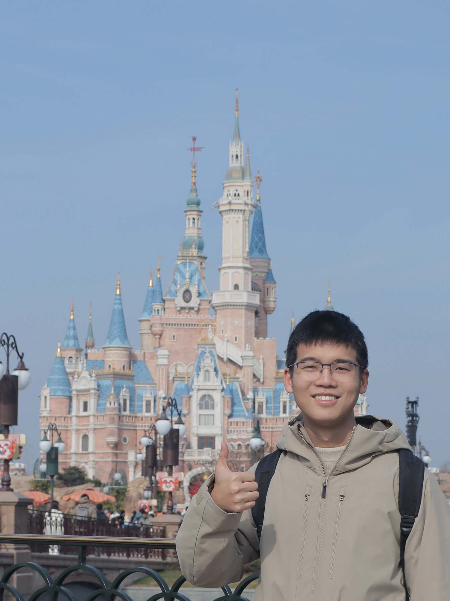
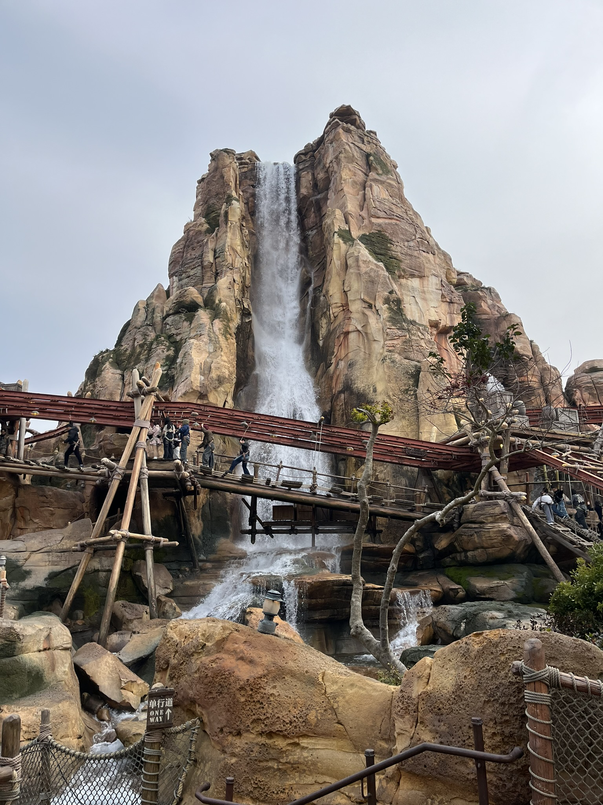
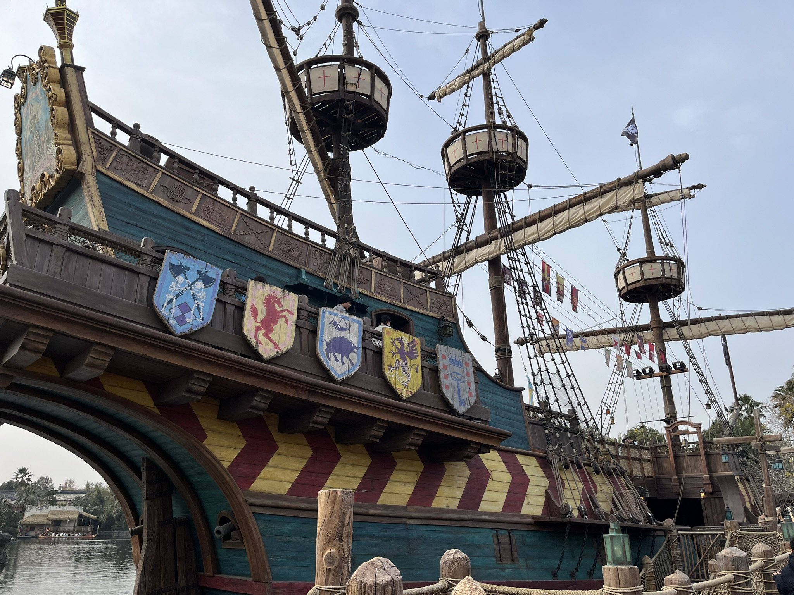
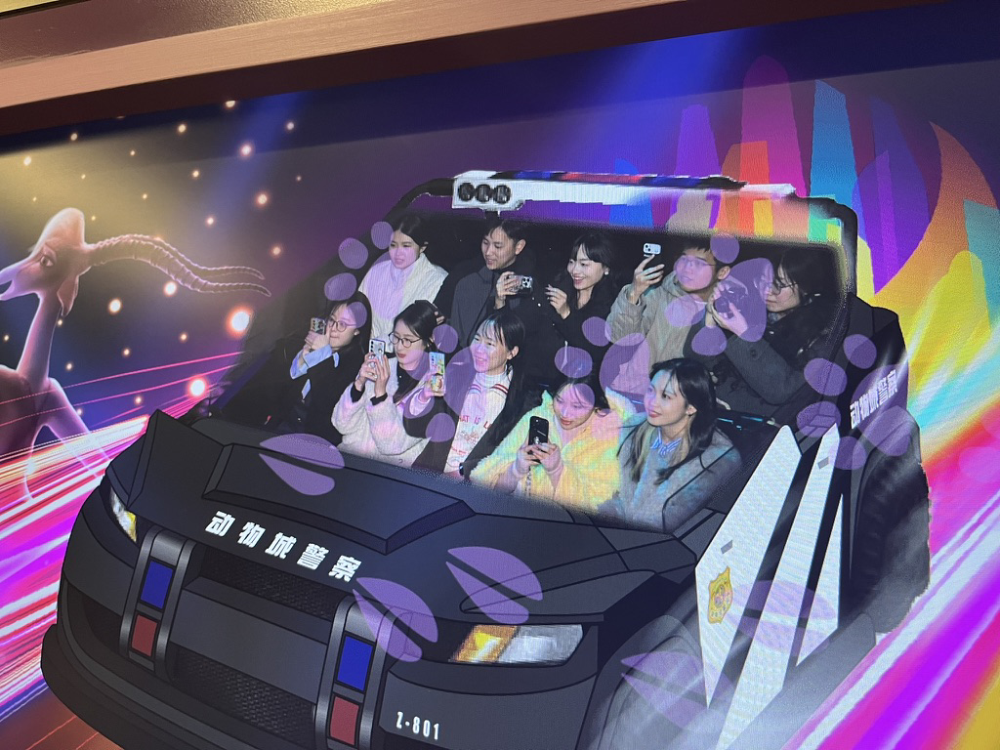
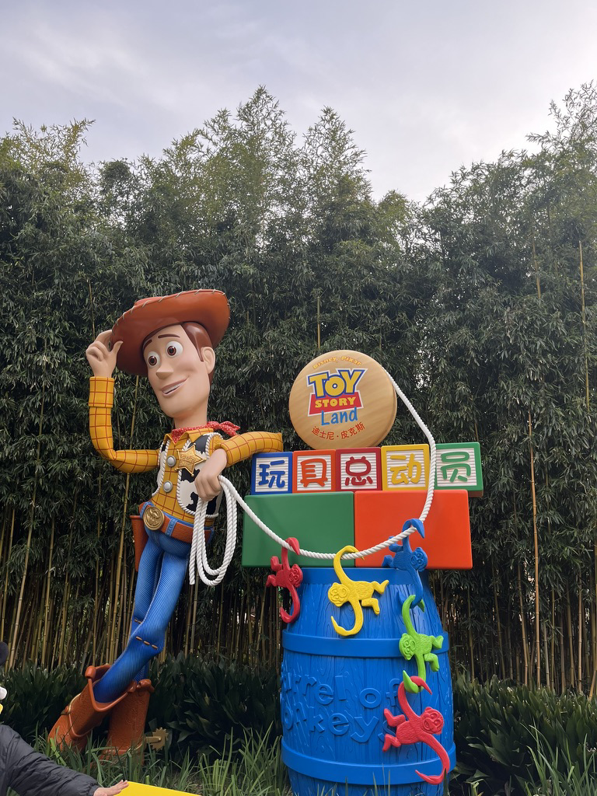
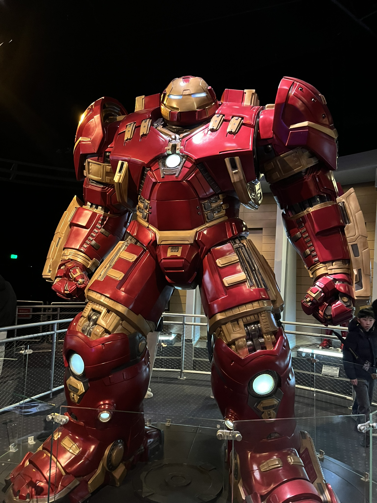
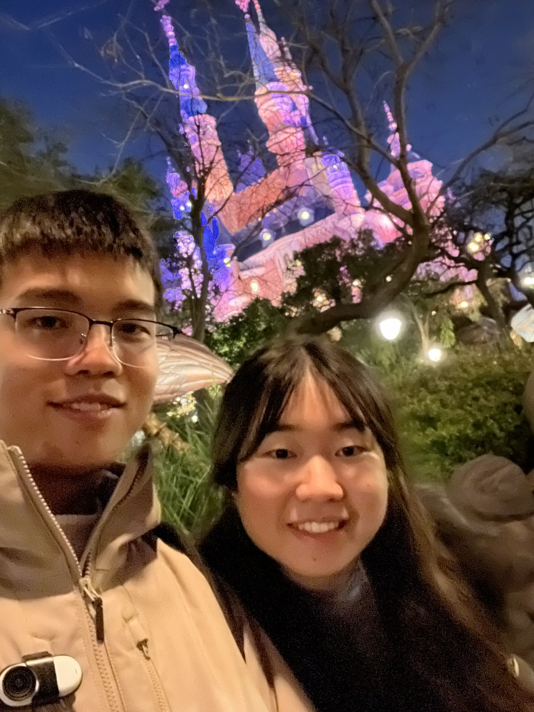
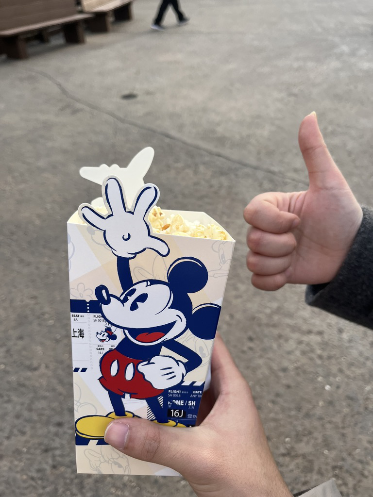

---
tags:
- blog
include:
- live
---

# 迪士尼一日游

来上海五六年了，也是终于去了一趟迪士尼😭

<figure markdown>
{width=300}
<figurecaption>经典大拇指👍</figurecaption>
</figure>

## 路线

我们完全没做攻略，进门就看地图随便走了一通：
> 大家记得去下载迪士尼的官方app，可以导航以及看排队时间哦！

<figure markdown>

<figurecaption>图源上迪官网</figurecaption>
</figure>

> 顺带吐槽，百度提供的这个地图组件真是难用，我改了半天的css才把地图放到大这个样子

第一站是探险岛，玩了一个爬山的项目，有点意思，排队的人不多

<figure markdown>
{width=500 loading=lazy}
<figurecaption>真的有点高，恐高慎入</figurecaption>
</figure>
第二站是宝藏湾，去海盗船上转了转，不需要排队

<figure markdown>
{width=500 loading=lazy}
<figurecaption>开炮！</figurecaption>
</figure>
第三站是城堡一楼，误打误撞排了一个（👸公主会面）的长队，还是个不认识的长发公主

<figure markdown>
{width=500 loading=lazy}
<figurecaption>我勒个英语角</figurecaption>
</figure>
第四站我们进了城堡，看了白雪公主的故事，几乎不排队

<figure markdown>
{width=500 loading=lazy}
<figurecaption>好多公主啊</figurecaption>
</figure>
第五站是疯狂动物城，热力追踪很有趣，排老长队，但是很值得

<figure markdown>
{width=500 loading=lazy}
<figurecaption>早知道不举着手机了！</figurecaption>
</figure>
第六站是玩具总动员，玩了一个胡迪牛仔嘉年华，排队一小时旋转三分钟～

<figure markdown>
{width=500 loading=lazy}
<figurecaption>他的鞋子里有只蛇</figurecaption>
</figure>
第七站是明日世界，随便逛了逛就走了

<figure markdown>
{width=500 loading=lazy}
<figurecaption>哦对了，漫威被迪士尼收购了哦</figurecaption>
</figure>
第八站回到了奇想花园，坐了旋转木马🎠

<live-photo-element src="../assets/2025-01-11-20-05-37.png" caption="比心🫰">
</live-photo-element>

第九站是爱丽丝漫游仙境迷宫，晚上可以从各种角度看发光的童话城堡

<figure markdown>
{width=300 loading=lazy}
<figurecaption>很适合拍照的地方</figurecaption>
</figure>
最后一站回到了入口附近，逛了逛纪念品商店、看了烟花

<live-photo-element src="../assets/2025-01-11-18-58-08.png" caption="龇牙咧嘴的俩人">
</live-photo-element>

<live-photo-element src="../assets/2025-01-11-20-11-47.png" caption="天女散花真的很好看">
</live-photo-element>

## 感受
感觉是一个拍照的好地方。不过人真的是太多了，热门项目基本都是排队一小时以上😭所以游玩体验就比较一般。

有些大热门项目（如七个小矮人过山车、创极速光轮）我们都没排，实在是没体力了。如果想一次体验完，建议早点过去，我们差不多十点半才入园，有点太松弛了。

冬天去的话多穿点，晚上真的很冷（居然还有人在一月份的上海裸腿短裙，集美们真是铁做的）。园区里有吃的，虽然有点小贵但是很好吃！

<figure markdown>
{width=300 loading=lazy}
<figurecaption>点名表扬芝士爆米花</figurecaption>
</figure>
最后，天干物燥，小心静电⚡️

## 后记

事后发现，有个傻子在迪士尼把身份证🆔丢了，所幸上迪的**失物招领**很给力，很快就找回来了～没误了大事

大家记得保管好个人物品哦！

!!! note "很有用！"
    如果您在离开上海迪士尼度假区后发现遗失了个人物品，请在早8点至晚8点之间致电（请根据语音提示拨3选择信息咨询）+86-21-2099-8001与我们联系。
