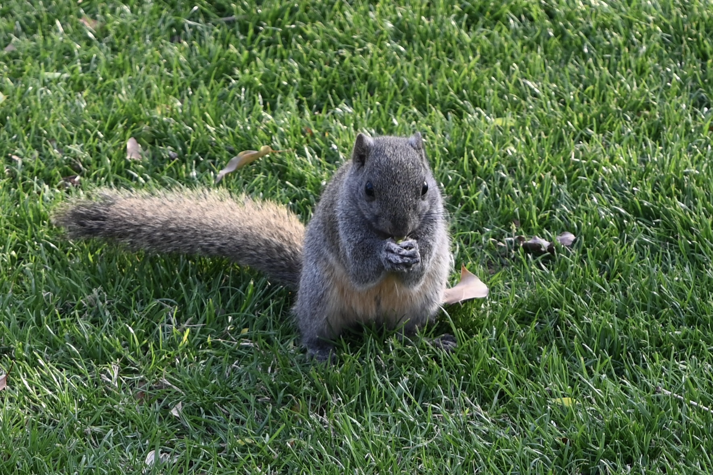

---
tags:
- blog
- 留影
---

# 杭州两日游

清明节去杭州玩了两天。时间比较短，只在西湖周边转了转。

## 感受

### 西湖真“网红”

!!! question "西湖十景"
    西湖十景指分布在杭州西湖周围的十个有代表性的景点。通常是指苏堤春晓、曲院风荷、平湖秋月、断桥残雪、花港观鱼、南屏晚钟、双峰插云、雷峰夕照、三潭印月以及柳浪闻莺这十个景点，其中许多又被改编成广东音乐。

    西湖十景最早称呼于南宋，后随朝代的替换，景点的名称，位置也有所更换。而到清朝时则增加到十八景，甚至是二十四景。但其中仍以南宋所传的十景最为著名。

    1985年，杭州市多家单位重新评选了西湖十景，并将新评选的西湖十景命名为“新西湖十景”。而南宋时的西湖十景，则相对的被称为“西湖老十景”。

不得不说，西湖的营销太顶级了，堪称中国第一湖（我有证据：一元钱的人民币纸币就印了西湖一景）。自古以来无数文人在这里吟诗作对，西湖十景各个听起来都是顶级美景。

我感觉西湖可以说是中国最早的“网红”景点。

“欲把西湖比西子，淡妆浓抹总相宜”

这谁听了不迷糊啊？？

??? chatgpt-summary "AskGPT: “网红”西湖？"
    > 帮我论证，西湖是最早的“网红”景点。这里的网红是比喻，想说古代也很火。

    好啊，这个比喻特别有意思！“网红”一词虽然源于现代社交网络，但如果我们把“网红”理解为“在大众中拥有极高知名度和关注度，频频被提及、赞美甚至模仿”，那西湖完全可以说是中国最早的“网红”景点之一。

    下面我来从几个角度帮你论证西湖的“网红”地位：

    一、被名人“打 call”最多的景点之一

    古代的“网红”靠的不是短视频，而是诗词、绘画、文章和口耳相传。西湖从唐宋开始就被无数文人墨客“带火”：

    - 白居易担任杭州刺史期间，亲自参与西湖疏浚工程，并赋诗《钱塘湖春行》，赞美西湖美景。
    - 苏东坡更是超级“顶流代言人”，名言“欲把西湖比西子，淡妆浓抹总相宜”直接成了千古绝句。
    - 柳永、欧阳修、陆游等人也都写过大量赞美西湖的诗词。

    这些文人的“带货能力”就像今天的大V博主，他们一发朋友圈（诗词），立刻就能掀起全民关注。

    二、古代文旅产业链的“顶流景点”

    从宋代起，杭州就是中国最繁华的城市之一，而西湖是它的门面担当。宋人笔记、画作、甚至“旅游指南”中，西湖都是重点推荐。

    - **《梦粱录》、《东京梦华录》**等记录当时市井生活的书里，对西湖游览体验、节庆活动如“西湖赏春”、“曲院风荷”等描写详细。
    - 明清时期还出现了大量专门描绘西湖的画册，比如《西湖十景图》，这些相当于今天的“网图大片”，供人观赏模仿。
    - 西湖的“十景”设定，也是古代“打卡点”概念的鼻祖。

    三、“舆论热度”持续千年，从未下线

    西湖并不是昙花一现，而是长期霸榜，堪称流量王者。

    - 每个朝代都有文人重游西湖，继续创作，把西湖热度维持在高位。
    - 不同历史时期都对西湖进行多次美化与改造，从苏堤、白堤到柳浪闻莺等不断更新，保持“内容新鲜”。
    - 清朝乾隆皇帝六次下江南，次次都要游西湖，给足排面。

    四、西湖在古代“社交媒体”中的高频出镜

    古代没有微博和抖音，但有书信、诗词集、壁画、瓷器绘画等传播媒介，西湖频频出镜。

    - 不少士子、文人以能去西湖游玩、题诗为荣耀。
    - 民间还流传大量与西湖相关的故事、传说（白蛇传、西泠桥的爱情传说等），相当于今天的“热门IP”。

    五、西湖形象多元，覆盖“流量全龄段”

    西湖既有自然风光，也有文化积淀，适合各类人群“打卡”：

    - 文人来写诗
    - 商人来观景
    - 情侣来约会
    - 百姓来赏花划船

    完全是古代版本的“全民景区”。

     

    总结：

    如果“网红”指的是自带流量、被广泛传播、引发模仿、长盛不衰的存在，那西湖当之无愧是最早的“网红”景点。它通过古代文人墨客的“内容创作”、多样化的“运营活动”和持久不衰的“用户口碑”，在没有网络的年代实现了跨时代的传播与影响力。

    要不要我帮你把这个论证写成一篇小短文或演讲稿形式？可以直接用在课堂或活动里。

并且西湖真的是**被开发的太完全了**，我感觉到如今西湖边上每一寸土地都被开发成了景区。相比之下，我家隔壁的**洪泽湖**就惨淡多了，完全没什么人去玩。

### 人真多

既然如此网红，为了错峰出行，我们在清明假期前一天就出发了。果然，第一天人不是很多。西湖游船、三潭印月、苏堤都是可玩的状态。

到了第二天，西湖周围根本走不动路：

<figure markdown>
{width=400}
<figurecaption>
飞来峰门口完全人挤人
</figurecaption>
</figure>

我们直接放弃了飞来峰和灵隐寺，随便转了几个寺庙、吃了一顿素面就离开灵隐了。下午去了花港观鱼、雷峰塔和虎跑公园。

### 小插曲

哦对了，去杭州的火车上还发生了一件趣事。

无座的我在流窜的过程中碰到了一个参加过越南战争的退役老兵，拉着我聊了一路。

大爷给我看了他的残疾军人证，给我讲了他的老战友把他从鬼门关背回来的故事，还给我看了他年轻时候的照片、看了老战友“闪闪红星”微信群。

大爷用平淡的语气诉说着生死，一遍又一遍地感叹：“你们真是生在了好时代，我们那时候十六岁已经在战场上了，你们都还在读书呢”。

这还不算完，大爷把自己的籍贯、女儿从哪毕业、女婿从哪毕业、孙子在哪上学，这些统统交代了。聊嗨了，还让我帮他改了改手机设置。

要么大爷本身就是社交恐怖份子，要么大爷已经孤独到了一定程度，但愿是前者！

### 相机

题外话。

这是我第一次带相机出门。不得不说，除了累了点，用相机拍照好处多多：

- 其一，照片质量得到了显著提升，拍的照片终于不糊了。如果有大长焦就更好了😭
- 其二，手机终于可以解放了。没有了拍照的任务，手机的电量压力小多了。走在路上刷手机的次数也显著降低了，因为完全没空啊。
- 其三，拍路人（以及其他用手机不太好意思拍的东西）变得没那么奇怪了，哈哈哈。

## PLOG

### 4月3日

到杭州已经是中午，先吃了饭（金猪，近武林夜市）。

这家东坡肉居然是咸口的？肉本身也有点难吃，切的太厚，肥瘦比例也不好。不过鳊鱼、糖醋排骨、芦笋都很好吃：

<figure markdown>
{width=400}
<figurecaption>
杭帮菜
</figurecaption>
</figure>

吃完饭到西湖边已经两点多了，这时候整个湖面都是雾蒙蒙的：

<figure markdown>
{width=400}
<figurecaption>
初见西湖
</figurecaption>
</figure>

<figure markdown>
{width=400}
<figurecaption>
鸳和鸯
</figurecaption>
</figure>

划了一会儿船：

<figure markdown>
{width=400}
<figurecaption>
有人划水！！！
</figurecaption>
</figure>

坐船上三潭印月看了杭州地标：

<figure markdown>
{width=400}
<figurecaption>
不是大长焦根本拍不到😭
</figurecaption>
</figure>

<figure markdown>
{width=400}
<figurecaption>
岛上有超多绝美的花
</figurecaption>
</figure>

<figure markdown>
{width=400}
<figurecaption>
建筑也很好看
</figurecaption>
</figure>

逛了一会儿，我们就坐船离开了三潭印月，沿着苏堤从南向北一路走过去。

<figure markdown>
{width=400}
<figurecaption>
偶遇了小松鼠🐿️！
</figurecaption>
</figure>

<figure markdown>
{width=400}
<figurecaption>
白居易的营销文案
</figurecaption>
</figure>

<figure markdown>
{width=400}
<figurecaption>
傍晚的西湖很美
</figurecaption>
</figure>

晚上去浙大蹭了一顿饭：

<figure markdown>
{width=400}
<figurecaption>
梦中情校😭
</figurecaption>
</figure>

<figure markdown>
{width=400}
<figurecaption>
煲仔饭！
</figurecaption>
</figure>

### 4月4日

第二天我们起晚了😭，十一点半才到灵隐景区，门口人山人海。于是直接放弃了灵隐寺～就在景区的免费区随便走了走。

<figure markdown>
{width=400}
<figurecaption>
应该叫清明龙井？
</figurecaption>
</figure>

因为是清明节，好像所有的寺庙都免费开放：

<figure markdown>
{width=400}
<figurecaption>
请香
</figurecaption>
</figure>

中午吃了素面和艾草粿：

<figure markdown>
{width=400}
<figurecaption>
艾草粿很香
</figurecaption>
</figure>

<figure markdown>
{width=400}
<figurecaption>
假装是灵隐寺
</figurecaption>
</figure>

走到公交站我们就坐车去西湖边了。不得不说，杭州的公交车和地铁是真的不太方便。游船讲解小姐姐都说：“我们平时都是电瓶车出行的～”

西湖边人挤人，我们看了一眼雷峰塔就溜了。

<figure markdown>
{width=400}
<figurecaption>
雷峰塔
</figurecaption>
</figure>

来到了绿油油的虎跑公园：

<figure markdown>
{width=400}
<figurecaption>
虎跑（páo）
</figurecaption>
</figure>

<figure markdown>
{width=400}
<figurecaption>
感觉是进了森林，到处是绿色
</figurecaption>
</figure>

<figure markdown>
{width=400}
<figurecaption>
绿绿绿
</figurecaption>
</figure>

<figure markdown>
{width=400}
<figurecaption>
偷拍了别人的模特🤫
</figurecaption>
</figure>

<figure markdown>
{width=400}
<figurecaption>
瓦缝小花
</figurecaption>
</figure>

走的时候想坐公交车来着，根本挤不上去。虎跑周围还全是交通管制区域，打车也不打不到。只能军训脚丫子了。

<figure markdown>
{width=400}
<figurecaption>
全是人😭
</figurecaption>
</figure>

<figure markdown>
{width=400}
<figurecaption>
杭州解放纪念碑
</figurecaption>
</figure>

<figure markdown>
{width=400}
<figurecaption>
钱塘江大桥
</figurecaption>
</figure>

走了半小时，到了江边终于可以坐到公交车了。去武林夜市边上吃了晚饭。

<figure markdown>
{width=400}
<figurecaption>
美味刨冰😋
</figurecaption>
</figure>

<figure markdown>
{width=400}
<figurecaption>
蟹黄拌饭😋
</figurecaption>
</figure>

<figure markdown>
{width=400}
<figurecaption>
吃完就回上海咯～
</figurecaption>
</figure>
