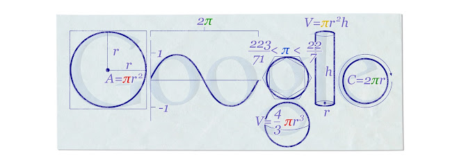

---
tags:
- blog
include:
- math
---

# Happy Pi Day

又是一年一度的Pi Day了。

看了一下今日的Google Doodle，居然不是Pi Day主题。查了一下发现居然只有十五年前做过一次：

<figure markdown>

<figurecaption>Doodle For Mar 14, 2010</figurecaption>
</figure>

不过这张图做的还是很有意思的：

1. 第一个G画了个圆，并且标注了它的面积（$A={\color{red}\pi} r^2$）
2. 接下来的两个O连起来画了一个正弦波（$\sin x$），并且标注了它的周期（$2\color{green}\pi$）
3. 第二个g分为上下两部分：
    - 上半部画了圆的内接、外切正多边形。这实际上给出了关于$\pi$的一个不等式：
        $$
        \frac{223}{71} \lt {\color{blue} \pi} \lt \frac{22}{7}
        $$
    - 下半部则画了一个球，并且标注了它的体积（$V=\frac{4}{3}{\color{red}\pi} r^3$）
4. 接下来的l画了一个圆柱体，并且标注了它的体积（$V={\color{brown}\pi}r^2h$）
5. 最后的e画了一个圆，并且标注了它的周长（$C=2{\color{green}\pi}r$）

此外，我特地写<s>（从网上摘抄）</s>了一篇：[Pi的无理性](../../SomeMath/real/pi.md)。

也算是解答了自己一个长期以来的疑惑～
