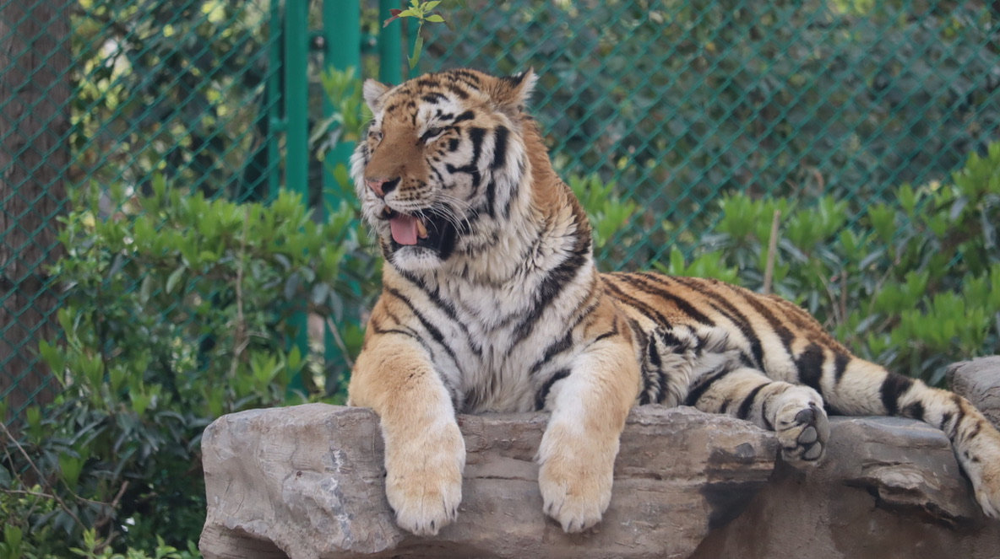

---
tags:
- blog
- 留影
include:
- live
---

# 上海野生动物园一日游

上次去动物园还是日本旭川的**旭山动物园**。那里的特色项目是超可爱的🐧企鹅户外散步。可以近距离观察企鹅走路的姿态，体验很不错。

这次我们去了**上海野生动物园**，最大的感受是：离动物真的好近啊。

相比旭山动物园，除了企鹅散步外绝大多数的动物只能远距离看看；上野有非常多的互动项目，可以零距离接触各种动物，260¥的互动票感觉很值得！

> 互动票（比普通票额外加价100¥）可以互动的项目：火烈鸟、狮虎、袋鼠、羊驼、长颈鹿、非洲象、河马、老虎、亚洲象、斑马、卡皮巴拉、小熊猫、棕熊。
>
> 每个点都可以互动一次，基本上都要在下午四点之前。

## 地图

上野分为六个大区：

- 车行区（必须乘坐观光车进入）
- 萌兽联盟
- 巨峰区
- 月亮湾
- 灵猴天地
- 猛兽水世界

<figure markdown>
{width=400}
<figurecaption>
不大不小的5A景区
</figurecaption>
</figure>

我们十一点才入园，漫无目的地乱逛，最终也差不多逛完了。

园区内，有很多动物表演项目（例如马戏团），我们没什么兴趣，一个也没看。

## 动物们

### TIP

带个长焦镜头去动物园真能拍到很多好看的照片！

### 火烈鸟

> flamingo

进门就可以看到火烈鸟。真的好红，腿很细很长，嘴巴超级大！

<figure markdown>
{width=400}
<figurecaption>
吃吃吃
</figurecaption>
</figure>

### 亚洲黑熊

> bear

<figure markdown>
{width=400}
<figurecaption>
熊哥爬树
</figurecaption>
</figure>

### 小浣熊

> raccoon

<figure markdown>
{width=400}
<figurecaption>
可爱
</figurecaption>
</figure>

<figure markdown>
{width=400}
<figurecaption>
我爱吃小浣熊干脆面！
</figurecaption>
</figure>

### 小熊猫

> firefox（原来就是你！

<figure markdown>
{width=400}
<figurecaption>
可爱
</figurecaption>
</figure>

小熊猫绝对是动物园的顶流了，互动项目排了超长的队伍，我们最终没去互动。

### 松鼠猴

> squirrel monkey

相比之下，隔壁的松鼠猴根本没人看！

<figure markdown>
{width=400}
<figurecaption>
吃吃吃
</figurecaption>
</figure>

### 天鹅

> swan

<figure markdown>
{width=400}
<figurecaption>
天鹅打架～
</figurecaption>
</figure>

<live-photo-element src="../assets/IMG_6613.jpeg" caption="太凶了">
</live-photo-element>

### 长颈鹿

> giraffe

<live-photo-element src="../assets/IMG_6631.jpeg" caption="丑萌">
</live-photo-element>

### 大熊猫

> giant panda

<figure markdown>
{width=400}
<figurecaption>
罢工了
</figurecaption>
</figure>

### 袋鼠

> kangaroo

<figure markdown>
{width=400}
<figurecaption>
躺平了
</figurecaption>
</figure>

<figure markdown>
{width=400}
<figurecaption>
小袋鼠露头啦，超可爱！
</figurecaption>
</figure>

### 羊驼

> alpaca

<figure markdown>
{width=400}
<figurecaption>
🦙
</figurecaption>
</figure>

### 环尾狐猴

> ring-tailed lemur

<figure markdown>
{width=400}
<figurecaption>
一点都不怕人，吃吃吃
</figurecaption>
</figure>

### 老虎

> tiger

<figure markdown>
{width=400}
<figurecaption>
老虎餐厅真有老虎
</figurecaption>
</figure>

### 中美貘

> Baird's tapir

<figure markdown>
{width=400}
<figurecaption>
没见过的动物
</figurecaption>
</figure>

### 食蚁兽

> anteater

<figure markdown>
{width=400}
<figurecaption>
第一次见！
</figurecaption>
</figure>

### 金毛羚牛

> golden takin

<figure markdown>
{width=400}
<figurecaption>
丑萌丑萌的
</figurecaption>
</figure>

### 红毛猩猩

> orangutan

<figure markdown>
{width=400}
<figurecaption>
太像人了
</figurecaption>
</figure>

吃！为什么不吃！

### 卡皮巴拉

> capybara

<figure markdown>
{width=400}
<figurecaption>
估计早吃撑了
</figurecaption>
</figure>

### 斑马

> zebra

斑马为了这颗胡萝卜也是拼了

### 非洲象

> african elephant

<live-photo-element src="../assets/IMG_6733.jpeg" caption="大象鼻子超硬的！">
</live-photo-element>

### 麦哲伦企鹅

> Magellanic penguin

<figure markdown>
{width=400}
<figurecaption>
温带企鹅🐧
</figurecaption>
</figure>

莫名其妙让我想起了《马达加斯加的企鹅》！

### 孔雀

> peacock

<figure markdown>
{width=400}
<figurecaption>
开屏啦
</figurecaption>
</figure>

### 猎豹

> cheetah

<figure markdown>
{width=400}
<figurecaption>
猎豹猎豹跑得快
</figurecaption>
</figure>

### 狮子

> lion

<figure markdown>
{width=400}
<figurecaption>
午睡狮子
</figurecaption>
</figure>

### 棕熊

> brown bear

<figure markdown>
{width=400}
<figurecaption>
我也爱这么趴着，可舒服了
</figurecaption>
</figure>

### 白虎

> white tiger

<figure markdown>
{width=400}
<figurecaption>
上镜！
</figurecaption>
</figure>

### 蓝色大嘴鸟

> 我也不知道这个具体叫啥，可能是某种鹦鹉吧

<figure markdown>
{width=400}
<figurecaption>
超级鲜艳的颜色
</figurecaption>
</figure>
