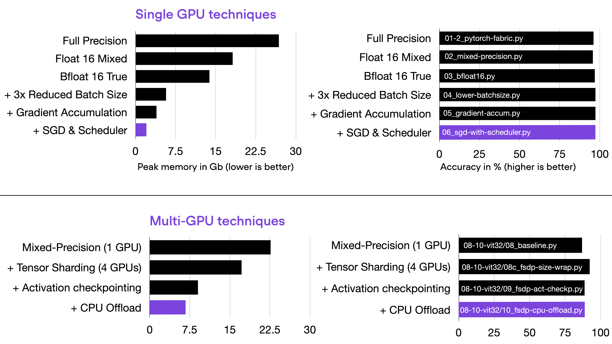
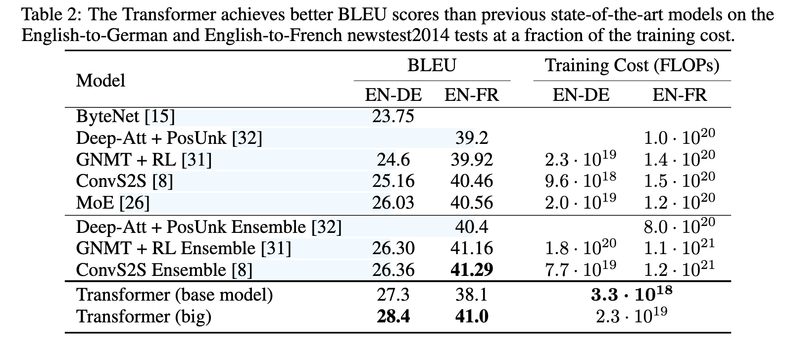

---
tags:
- blog
- pytorch
- DL
include:
- math
---

# 模型训练开销

> 好久没写技博了，来一篇！我导提醒我们需要对模型训练的开销有一个基本的sense，不然枉为AI人。因此整理了本文。

---

深度学习模型训练的开销主要可以从两个维度来衡量：

- 显存占用：决定能不能训练
- 算力消耗：决定要训练多久

## 显存占用

在一个经典的反向传播随机梯度下降算法中，我们需要保存以下变量：

> 假设参数量为$\Psi$，参数量的计算相对简单；一个热知识：Transformer中的FFN不论是参数量还是计算量都占据整个模型很大的比重（超过一半，甚至90%+），是开销最大的地方。

- 模型参数
    - 每个参数使用单精度浮点数fp16来存储
    - 显存占用：$2\Psi$ Bytes
- 梯度
    - 使用AMP（自动混合精度）训练，用fp16来存储梯度信息
    - 显存占用：$2\Psi$ Bytes
- 优化器参数
    - Adam需要动量参数以及动量二阶矩【$2\Psi$】，SGD可能需要动量参数【$\Psi$】
    - 这些参数一般用全精度浮点数fp32，每个参数需要4个Bytes
    - 显存占用：$4\Psi\sim 8\Psi$ Bytes
- 激活值【可以节省，但是会减缓训练速度】
    - 在BP算法计算梯度的过程中，需要使用激活值；模型越深，需要保存的激活值越多，显存占用也就越大，尤其对于现代的Transformer或者ResNet，通常深度都非常大！
    - 通常我们用**时间换空间**，前向的过程中不保存激活值，在需要BP的时候重新前向计算，从而节约显存占用

综上所述，一个典型的模型训练过程中显存占用可视化如下：

!!! quote
    

    来自：<https://huggingface.co/blog/train_memory>

    这篇博客还提供了一个[显存估算的工具](https://qgallouedec-train-memory.hf.space/)：
    
    

### 优化策略

> 这部分内容我们在[pytorch系列笔记](../../Python/ThirdPartyLibrary/pytorch/tricks.md)介绍过一些

除了上面提到的

- AMP（自动混合精度）训练：用fp16保存梯度，结合Scaler缩放来减少显存占用
- Gradient Checkpoints（梯度检查点）：前向过程不保存激活值、或者仅保存部分激活值

还有很多其他**减少显存占用**的策略，比较知名的例如梯度累积、[ZeRO](https://arxiv.org/pdf/1910.02054)，[这个仓库](https://github.com/rasbt/pytorch-memory-optim)有一些比较直观的例子：

## 算力消耗

算力消耗是训练模型时更加本质的开销。模型的前向、反向运算本质是由一系列的浮点运算构成的，因此算力消耗的单位就是**FLOPs**（Floating Point Operations）。

例如最经典的Transformer文章，其一大卖点就是更少的算力消耗，更高的BLEU：

算力消耗决定了训练模型需要的时间，只要用总的算力消耗除以显卡的计算速度（单位：FLOPS，表示每一秒可以进行的浮点运算速度）就可以得到训练时间。

常见的显卡运算速度如下：

- RTX 3090：在FP16和FP32下可以达到**35.58 TFLOPS**
- A100：在FP16下可以达到**312 TFLOPS**

有钱真的是可以为所欲为。
