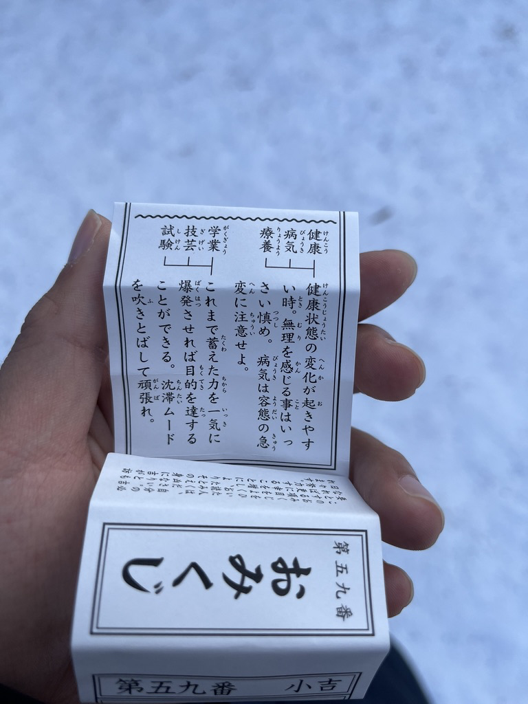
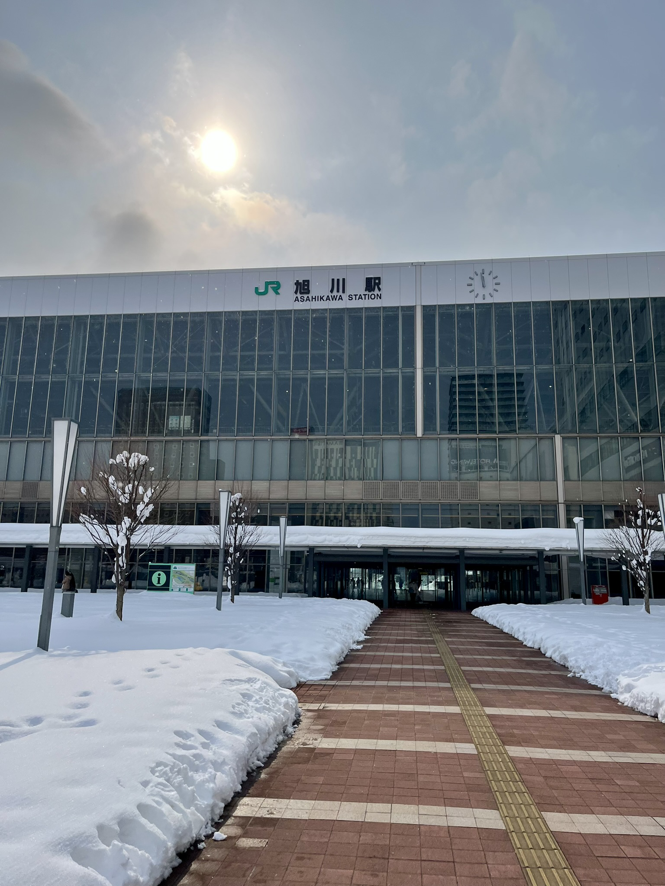
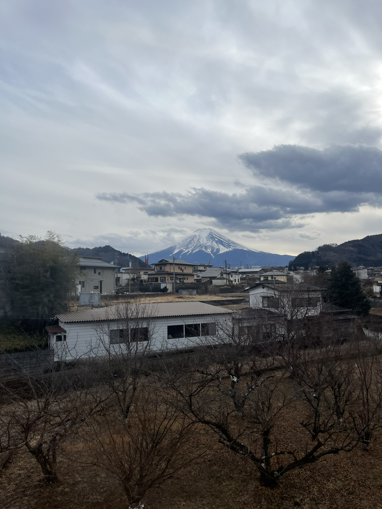
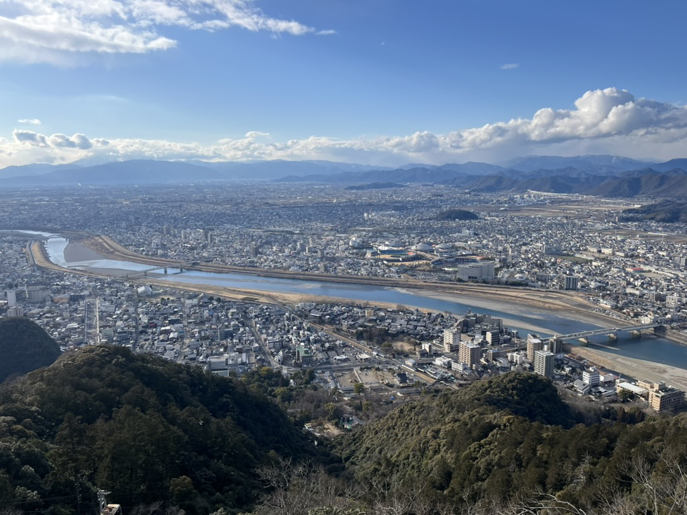
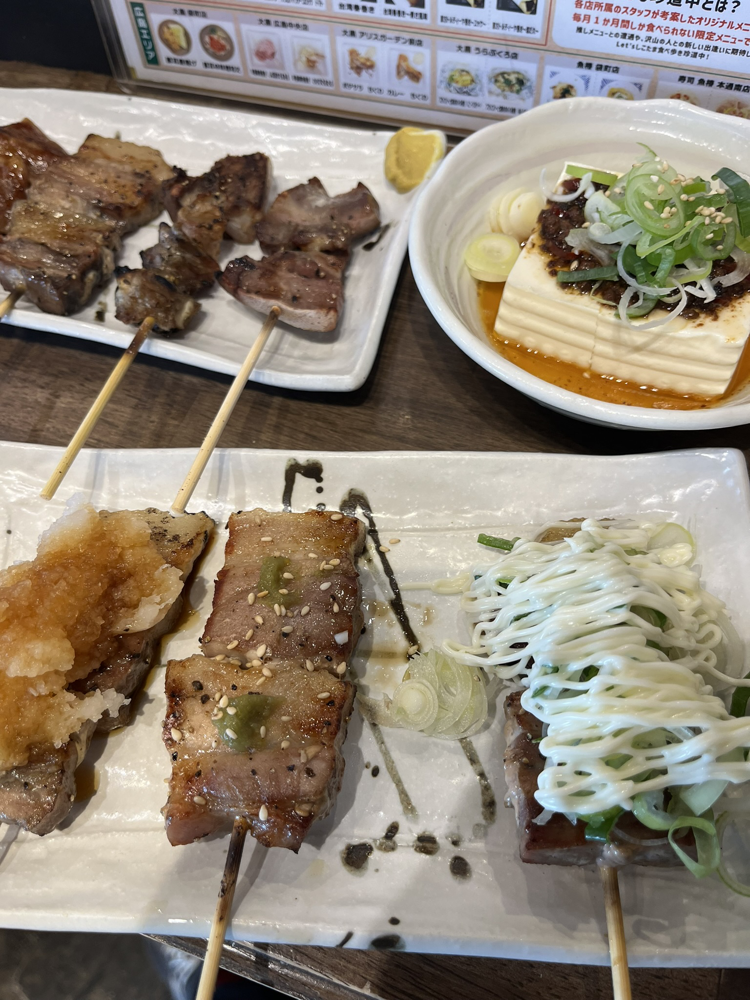

---
tags:
- blog
- 旅行
- 留影
template: blog_with_map.html
include:
- live
- ai-summary
ai-summary-config:
    model: "gpt-4o"
---

# 再游日本
> From 2025.2.14 to 2025.2.24 in Japan

是的，（偷偷摸摸地）我又去了一趟日本🤫🤫🤫

## 战术总结

上次去日本还是在[23年的夏天](../../2023/travel_to_japan/)，那回主要逛了大阪、京都、东京这三个城市。而这次我们选了冬天，落地札幌，而后逛遍了北海道的几个主要大城市。取道东京看了一眼早樱🌸、接着去了富士吉田以及诹访。最后从名古屋飞回国。

实话说，我们还是太多特种兵了。旅行的最后几天我已经非常疲劳，我的跟腱直接要废掉了：

<figure markdown>

<figurecaption style="font-style: italic;">
暴走
</figurecaption>
</figure>

加上从二月二十一号开始，我就有点感冒，走完整个行程更是要螺旋升天。

> 回国之后，又无缝衔接了MICCAI2025的DDL，熬了几个大夜。直到我写完本文的今天（三月四号），我的感冒才完全好。

无论如何，我还是活下来了。虽然有些许遗憾，但也无疑是一次难忘的旅行～

FYI，我把有用的信息汇总在了下面，希望能帮到你。

### 开销
首先是总账单，这次花了一万两千多，总体来说北海道还是贵的。但上次在东京感觉有过之而无不及。

上次家里支持了一万，这次则完全是做家教打工攒的钱💰。走这一遭，直接把我的小金库扬了😭

<figure markdown>

<figurecaption style="font-style: italic;">
钱包瞬间干瘪
</figurecaption>
</figure>

!!! warning "换汇"
    一定要关注汇率，提前在手机银行上买好**日元现钞**。我是2月10号在银行现场买的外钞，结果汇率一坨。如果趁着过年期间人民币比较给力，提前买好日元现钞能省一百多块钱。

    <figure markdown>
    
    <figurecaption style="font-style: italic;">
        被抄底了😭
    </figurecaption>
    </figure>

!!! info "旅伴"
    此次旅行我是和本科的室友@*华哥* 同行的，他是资深精日，在日本如鱼得水。两个人均摊住宿的话确实便宜了很多，不过交通才是北海道最贵的东西😭

### 住宿

我们打一枪换一个地方，沿途一共**十晚**入住了**七个地方**。

大致的行程是：

- 二月十四：上海浦东机场==>札幌新千岁机场，札幌半日游
- 二月十五：札幌一日游
- 二月十六：小樽一日游
    - 前3晚都住在钱函
- 二月十七：美瑛、富良野
- 二月十八：旭川一日游
    - 这2晚住在旭川
- 二月十九：登别、洞爷
    - 这1晚住在登别
- 二月二十：函馆一日游
    - 这1晚住在函馆
- 二月二十一：富士吉田
    - 这1晚住在富士吉田
- 二月二十二：诹访一日游
    - 这1晚住在诹访
- 二月二十三：歧阜一日游
    - 这1晚住在名古屋
- 二月二十四：名古屋中部机场==>上海浦东机场

#### 钱函
> 近JR钱函站(Zenibako Station)

我们在钱函住的是一个民宿（Zenibako House，钱函屋，3B房间；这个房间不是正对大海，如有需要建议选择3C），三晚上花了1600¥。小贵，但是体验很不错。房间里什么都有，洗衣做饭都是免费的。我们最后一晚上还搞了一顿寿喜烧。出门就是海岸和JR站，非常便利。

可能有点雷的是，离JR站实在是太近了（直线距离一百米不到？），所以电车开过会有一定的声音和光亮。不过我的睡眠质量上乘，不受影响。

Check in的方式也很简单，房主会把钥匙锁在门口的密码箱里，在你预定的平台发消息告诉你密码。走的时候再把钥匙锁进去就行了。

#### 旭川
> 近JR旭川站(Asahikawa Station)

在旭川住的就是正常酒店了（Tabist HOTEL），双床房两晚上762¥，算便宜的。房间很大。

Check in的方式是最常见的前台人工办理。

#### 登别
> 近JR登别站(Noboribetsu Station)

在登别住了巨贵的温泉旅馆（Adex Inn），一晚上花了843¥。房间非常干净，是唯一一个没有浴缸的酒店（因为主打温泉嘛）。这家自己的温泉很小，不过住在Adex可以免费去对面第一泷本馆的超大温泉泡汤，爽！

Check in的方式是自助办理，比较特别的就是温泉旅馆**需要额外交一个300日元每人的入汤税**。

#### 函馆
> 近JR函馆站(Hakodate Station)

函馆的酒店（FlexStay Inn）是真的便宜，一晚上246¥。不过房间比较小就是啦，其他没什么特别的。

Check in的方式是前台人工办理。

#### 富士
> 近JR富士山站(Mt.Fuji Station)

富士吉田的酒店（富士山站酒店）也很贵，一晚上603¥。双床房，房间很大，也没什么特别的。

Check in的方式是前台人工办理，我总感觉这家态度有点不好。

#### 诹访
> 近JR上诹访站(Kamisuwa Station)

在诹访我们又入住了一个温泉酒店（Lafontaine 諏訪），这家相对便宜了一些，一晚上463¥。不过他们的温泉是直接把水接到了房间的浴缸里，没什么泡温泉的感觉。住的那天我感冒了，没体验。

这家给我的感觉就是日式情侣酒店，大床、大浴缸。你甚至可以看免费的海量成人电影😁<s>（我可没看</s>

Check in的方式是前台自助办理。但他们用的是一套奇怪的系统，不是连锁酒店那种刷护照吐房卡的类型。最后我们还是找了前台才办理成功。

#### 名古屋
> 近名古屋地下铁荣站(Sakae Station)

最后一站是名古屋，我们住在了荣（名古屋S plus），刚好碰上了周末一晚上花了492¥。楼下就是繁华的荣，不过这个地方里名古屋站有些远了，还得坐一站地铁，不是特别方便。

Check in的方式是前台人工办理。值得一提的是，这家在临时外出的时候也需要把钥匙放在前台。

### 交通（Japan Rail Pass）
为了省点交通费，我们选择了JR Pass：只要五万日元，七天之内全日本的JR随便坐！

> 就在刚刚，华哥还和我说：我们这趟其实可以从函馆直接坐到福冈，玩一天再回中部的。

> 你别说，好像还真行。反正随便坐～新干线也很爽。

<figure markdown>

<figurecaption style="font-style: italic;">
小小一张卡纸，价值两千多块钱，丢了就没了😭
</figurecaption>
</figure>

<figure markdown>

<figurecaption style="font-style: italic;">
纯纯铁屁股
</figurecaption>
</figure>

图里从JR Pass开始，顺时针依次是：

- <s>札幌 ==> 旭川（这张被闸机吃了）</s>
- 旭川 ==> 札幌
- 札幌 ==> 登别
- 登别 ==> 洞爷
- 洞爷 ==> 函馆
- 新函馆北斗 ==> 东京（新干线！）
- 东京 ==> 大月
- 甲府 ==> 上诹访
- 盐尻 ==> 名古屋

以及我们做的其他自由席列车，数不胜数。五万日元的Pass，回本肯定没问题。热门的线路（新干线尤其）最好**提前预定指定席**，不然只能在空座位流窜了。

Pass之外的时间，为了方便坐车，我在手机上开通了suica。平时在便利店买东西、连锁店吃饭什么的也可以直接刷手机。有一说一，NFC比扫二维码爽多了。

实测，即便是在手机上开通的电子suica，也可以在车站用现金充值。并且也可以在线上用银联卡充值。总之就是非常方便

<figure markdown>

<figurecaption style="font-style: italic;">
可爱小企鹅
</figurecaption>
</figure>

!!! warning "注意行车间隔"
    北海道有些地方实在是太村了，公交车、电车都是一小时一辆。旅行的时候一定要提前看好车的时间，防止过不去、回不来。实在没车的话就得大出血了，日本打车是真的贵😭

??? question "有哪些JR Pass？"
    有一说一，挺乱的。

    [在售的JR Pass](https://www.jrpass.com/zh-cn/regional-passes)大概有这些：
    
    - JR全日本Pass（我们买的）
        <figure markdown>
        
        <figurecaption style="font-style: italic;">
                也有一定的[不适用范围](https://japanrailpass.net/cn/about_jrp/route/)
        </figurecaption>
        </figure>
    - JR东日本Pass：
        <figure markdown>
        
        <figurecaption style="font-style: italic;">
                乱！
        </figurecaption>
        </figure>
    - JR北海道Pass：
        <figure markdown>
        
        <figurecaption style="font-style: italic;">
                这个还挺简单易懂的
        </figurecaption>
        </figure>
    - JR西日本、东海、四国和九州Pass（这几个我没研究）：
        <figure markdown>
        
        <figurecaption style="font-style: italic;">
                乱！
        </figurecaption>
        </figure>

    在网上买了JR Pass之后，需要去观光案内所线下取实体凭证。每次坐车的时候都需要插入它。如果没有闸机就找工作人员人工确认即可。

    JR Pass如果要坐指定席，可以在网上/车站/观光案内所提前预定、取好票。我们在出发前就预定了一些，在取Pass的时候就把票都拿到手了：

    <figure markdown>
    
    <figurecaption style="font-style: italic;">
        这么多票，一看就是铁屁股特种兵
    </figurecaption>
    </figure>

??? deekseek-summary "Ask Deekseek: 回送？"
    > 这次去日本发现了巨多“回送”的电车、公交。我和华哥都很奇怪，于是问了一下AI，感觉回答的不错～

    日本的电车和公交常出现“回送”（空车返回或移动）的现象，主要原因与其高度发达的公共交通系统、运营策略以及城市规划密切相关。以下是具体分析：

    ---

    #### 1. **适应高峰与非高峰需求差异**
    - **早晚高峰集中调度**：日本大城市通勤需求极高，电车和公交在早晚高峰时会大幅增加班次以满足人流。非高峰时段，部分车辆需空驶返回车库或始发站，为下一轮高峰做准备。
    - **单向通勤线路**：某些线路（如郊区通往市中心的通勤线）在高峰后可能出现单向客流骤减，车辆需空驶返回起点重新投入服务。

    **例子**：东京的中央线早高峰后，部分列车可能空驶回立川车库，以便晚高峰再次发车。

    ---

    #### 2. **车辆维护与检查制度严格**
    - **定期回厂检修**：日本轨道交通以安全著称，车辆需频繁回送车库进行日常维护、清洁或定期检查（如每日收车后的“终电回送”）。
    - **夜间回库**：许多电车夜间不运营，必须返回车库停放，而非停在沿线车站，以确保安全和管理。

    ---

    #### 3. **线路网络复杂，车辆调配灵活**
    - **跨线路支援**：当某条线路出现故障或临时需求激增时，车辆可能从其他线路空驶支援。例如，阪急电车在活动期间可能从非繁忙线路调车。
    - **私铁与JR系统互通**：不同运营商线路间的车辆调配（如直通运转结束后需返回原公司线路）可能导致空驶。

    ---

    #### 4. **公交线路设计与运营效率**
    - **单向循环线路**：部分公交线路因道路限制设计为单向行驶，回程可能需绕行或空驶返回起点。
    - **确保准点率**：公交可能提前空驶至始发站，避免因拥堵延误班次。

    **例子**：大阪某些环状公交线路在完成单程服务后，可能空车绕行返回起点。

    ---

    #### 5. **特殊运营场景需求**
    - **活动或突发事件**：大型活动结束后，临时增派的车辆需空驶撤回。
    - **节假日期调整**：节假日与非节假日客流量差异大，车辆调度需频繁调整。

    ---

    #### 为何这种现象在日本更明显？
    - **高密度路网**：日本轨道交通线路交织复杂，车辆调配更频繁。
    - **文化习惯**：乘客对准点率要求极高，运营商需通过灵活调度维持可靠性。
    - **资源高效利用**：避免车辆闲置，通过回送实现“循环使用”。

    ---

    #### 总结
    日本的回送现象本质上是其精细化运营管理的体现，通过动态调整车辆分布、严格维护和灵活调度，既保障了运输效率，也维持了全球领先的准点率和服务质量。这种现象虽看似“空跑浪费”，实则是复杂系统高效运转的必然结果。

### 签证
这次我依然是拿的**学生签**。可惜的是现在日本单次旅游签都改为电子签了，仪式感大大降低！

<figure markdown>

<figurecaption style="font-style: italic;">
我是护照，我想被贴纸
</figurecaption>
</figure>

不过华哥好像这次拿了**普通单次签证**，足额的存款和银行流水就可以申请。三年之内，拿两次这个签证去日本之后就可以**免除经济实力证明**申请到三年多次签证了！

!!! quote "材料减免"
    过去 3 年内有 2 次以上持指定个人旅游签证赴日经历的人士，需提供⑦所示资料（访日经历证明）可以不提供⑤（经济能力证明）

### 日本行政体系

关于在日语言、支付方式、交通方式、导航推荐和上网方式[之前都写过了](../../2023/travel_to_japan/#_5)。

这次Apple地图在导航的时候有失水准，有的车根本查不到。需要Google地图进行辅助。当然绝大部分时候还是靠谱的，部分车也能显示实时情况。我觉得两个地图最好同时使用，能互补。

除了这些，这次学到比较多的就是日本的行政体系啦（依据1947年施行的《地方自治法》）：

<figure markdown>

<figurecaption style="font-style: italic;">
一都、一道、两府、四十三县
</figurecaption>
</figure>

北海道作为一级行政单位，现下辖35个市、129个町与15个村，共计179个二级行政区，是日本管辖地方公共团体数量最多的一级行政区。
> 市、町、村，就是规模依次递减的城市。特别区仅有东京都设立了，别称东京二十三区。

??? question "大阪都？"
    在2012年以前，根据《地方自治法》，特别区是针对“都”此类行政区设置的行政区划，并不是特别为东京都而设的，但由于只有东京都一个“都”，因此也只有东京有特别区存在。
    
    大阪市曾在2010年开始讨论与比邻的堺市一起拆分为数个特别区，并让上级区划大阪府改制为“都”，即大阪都构想；该构想虽未成功实现，但促使日本国会于2012年通过《大都市地域设置特别区相关法律》，规定人口多于200万人口的大都市区域，只要经当地民众公投同意，亦可撤除原有的市町村、设立辖于道府县的特别区，使特别区不再限制于都。
    
    该专法通过后，大阪市于2015年在大阪府及堺市无意改制下，单独举办了特别区设置公投，计划将大阪市拆分为数个特别区，但最后以些微差距否决；2020年又出了类似的公投，但还是以些微差距否决。

我也在右侧放了一个日本地图，会把游玩的区域标出来，日本地理这不就手拿把掐了吗。

### 日本的政治环境
其实上次东京、大阪、京都之旅我就有感觉。日本的政治环境还是相对开放的。走在街上你可以经常看到各大党派的宣发。

这次我们在北海道、中部也见了不少。很多人在街头大声宣发，还收到了宣传材料：

<figure markdown>

<figurecaption style="font-style: italic;">
by.札幌有志素人会
</figurecaption>
</figure>

<figure markdown>

<figurecaption style="font-style: italic;">
这东西也有人反对？
</figurecaption>
</figure>

<figure markdown>

<figurecaption style="font-style: italic;">
日本共产党
</figurecaption>
</figure>

<figure markdown>

<figurecaption style="font-style: italic;">
天皇陛下万岁？
</figurecaption>
</figure>

## 行程Plog

这次过去我和华哥都是一个背包（不是图里这个绿色的，是一个大一些的黑色电脑包）外加一个行李箱，本以为北海道会很冷特意带了最保暖的衣服。结果发现根本不冷🤭下暴雪的时候尤其不冷，化雪的时候倒是冷一些，但感觉不如宿迁冷。

<figure markdown>

<figurecaption style="font-style: italic;">
收拾收拾，该出发了
</figurecaption>
</figure>

### Day1 札幌闲逛
> 上海市.多云，北海道.札幌市.大雪

起了个大早，天还没亮就从学校出发。

<figure markdown>

<figurecaption style="font-style: italic;">
怪好看的
</figurecaption>
</figure>

二月十四刚好是情人节，也是开学注册的日子。然而学校的系统出了问题，我们一直注册不上，无奈只能先不管了。

<figure markdown>

<figurecaption style="font-style: italic;">
开学注册失败
</figurecaption>
</figure>

飞日本我们坐了吉祥航空，体验还不错。机上的午餐不难吃～

在飞机上看了《名侦探柯南：百万美元的五棱星》，味同嚼蜡。现在的柯南毫无逻辑，完全的粉丝向作品以及北海道旅游宣传片。

<figure markdown>

<figurecaption style="font-style: italic;">
不过，平次&和叶 还是很甜啦
</figurecaption>
</figure>

<figure markdown>

<figurecaption style="font-style: italic;">
落地札幌新千岁机场
</figurecaption>
</figure>

在机场里吃了点东西，然后就直奔我们住的地方了。在电车上，我的手机突然定位漂移了，居然在学校。然后我就注册成功了😁

<figure markdown>

<figurecaption style="font-style: italic;">
おいしい
</figurecaption>
</figure>

<figure markdown>

<figurecaption style="font-style: italic;">
好多雪，开心！
</figurecaption>
</figure>

<figure markdown>

<figurecaption style="font-style: italic;">
我和华哥，笑嘻了
</figurecaption>
</figure>

放下行李，我们就直奔札幌市区了。大通公园完全没开放，似乎刚搞完一个活动在清理。

<figure markdown>

<figurecaption style="font-style: italic;">
你能看出来图里有个公园吗
</figurecaption>
</figure>

没一会儿就下雪了，超大的雪❄️：

<live-photo-element src="../assets/IMG_4011.png" caption="平生仅见">
</live-photo-element>

哦对了，今天是情人节。市区的小情侣真多呀～我们随便逛了逛，然后吃了个饭就回去睡觉了。

<figure markdown>

<figurecaption style="font-style: italic;">
可爱！
</figurecaption>
</figure>

<figure markdown>

<figurecaption style="font-style: italic;">
晚饭吃了成吉思汗烤肉～
</figurecaption>
</figure>

没忍住，喝了点小酒😋吃烤肉怎么能不来一杯呢？

### Day2 暴走札幌
> 北海道.札幌市.晴

五点渴醒，果然不能喝酒喝太多。七点又醒了因此，九点终于挣扎起床。出门看了石狩湾和附近的丰足神社。

<figure markdown>

<figurecaption style="font-style: italic;">
海就在楼下
</figurecaption>
</figure>

<figure markdown>

<figurecaption style="font-style: italic;">
白色鸟居真的很好看
</figurecaption>
</figure>

然后我们去了札幌市区，在中岛公园玩了玩雪。该说不说，大雪过后札幌市区到处都是雪白一片，没带墨镜真的有点受不了😭

<figure markdown>

<figurecaption style="font-style: italic;">
可爱小熊雪人
</figurecaption>
</figure>

路过了柯南电影里的表白圣地之一：

<figure markdown>

<figurecaption style="font-style: italic;">
札幌计时台
</figurecaption>
</figure>

<figure markdown>

<figurecaption style="font-style: italic;">
雪人可爱捏
</figurecaption>
</figure>

中午吃了汤咖哩，巨好吃😭

<figure markdown>

<figurecaption style="font-style: italic;">
各种蔬菜简直绝了😋
</figurecaption>
</figure>

下去我们去了圆山公园，逛了逛北海道神宫。

<live-photo-element src="../assets/IMG_4157.png" caption="蓝天白云乌鸦">
</live-photo-element>

二百日元，为我的学业求了一支签：

<figure markdown>

<figurecaption style="font-style: italic;">
厚积薄发，加油～
</figurecaption>
</figure>

打卡札幌的伏见稻荷神社，雪中的连环鸟居别有风味。

<figure markdown>

<figurecaption style="font-style: italic;">
通往天国的门
</figurecaption>
</figure>

最后去了白色恋人工厂，可惜去的晚了点没体验自制巧克力。买了一些其他纪念品。

<figure markdown>

<figurecaption style="font-style: italic;">
白い恋人
</figurecaption>
</figure>

这个地方太适合小情侣来了😭，可惜我只有好哥们。

<figure markdown>

<figurecaption style="font-style: italic;">
缺位拍照
</figurecaption>
</figure>

<figure markdown>

<figurecaption style="font-style: italic;">
我的另外一半，你咋不来？
</figurecaption>
</figure>

<figure markdown>

<figurecaption style="font-style: italic;">
哦不对，来了
</figurecaption>
</figure>

感觉还是我p的红色火柴人好一点哈哈哈。

晚上找了家水产店，炫了螃蟹：

<figure markdown>

<figurecaption style="font-style: italic;">
这个蟹粉香昏了
</figurecaption>
</figure>

吃完饭从札幌回钱函（我们居然再一次坐过站了）。来到了十几公里外的朝里。

<figure markdown>

<figurecaption style="font-style: italic;">
嗯，真是个奇怪的站台
</figurecaption>
</figure>

所幸，刚出车站就有一辆出租车过来了。日本打车初体验～

<figure markdown>

<figurecaption style="font-style: italic;">
事后总觉得不是运气，司机？猎人！
</figurecaption>
</figure>

<figure markdown>

<figurecaption style="font-style: italic;">
体验还不错
</figurecaption>
</figure>

你猜怎么着？十二公里二十分钟的车程，4800日元😭，大出血～

### Day3 小樽一日游
> 北海道.小樽市.多云

早上先去札幌站取了JRpass，然后坐了札幌-小樽的特急。

<figure markdown>

<figurecaption style="font-style: italic;">
有没有机车侠知道这是什么列车
</figurecaption>
</figure>

到了小樽我们先去了天狗山：

<figure markdown>

<figurecaption style="font-style: italic;">
可爱天狗👺
</figurecaption>
</figure>

山上的中国人含量很高，感觉一半以上都在说中文。

<figure markdown>

<figurecaption style="font-style: italic;">
还有人在拍婚纱照，祝幸福～
</figurecaption>
</figure>

<figure markdown>

<figurecaption style="font-style: italic;">
情书！
</figurecaption>
</figure>

下山了我们就直接回市区了，忘记山下还有一个玻璃工坊可以去看看，可惜。

在市区沿着运河随便走了走。

<figure markdown>

<figurecaption style="font-style: italic;">
爱蓝天白云
</figurecaption>
</figure>

<figure markdown>

<figurecaption style="font-style: italic;">
打卡船见坡
</figurecaption>
</figure>

<figure markdown>

<figurecaption style="font-style: italic;">
还真能看见船坞
</figurecaption>
</figure>

中午饿的不行了，随便吃了一个味增拉面。结果意外的好吃！

<figure markdown>

<figurecaption style="font-style: italic;">
香的嘞
</figurecaption>
</figure>

吃完饭继续在市区转悠

<figure markdown>

<figurecaption style="font-style: italic;">
八音盒店，可爱！
</figurecaption>
</figure>

差点就冲动消费买下这个可爱的八音盒了：

<figure markdown>

<figurecaption style="font-style: italic;">
🐷
</figurecaption>
</figure>

幸好我在淘宝上搜了一下，断定这个🐷肯定是Made In China，遂放弃

接下来去逛了超市，买了一些食材，准备回我们的民宿自己做一顿寿喜烧！

<figure markdown>

<figurecaption style="font-style: italic;">
🛒
</figurecaption>
</figure>

<figure markdown>

<figurecaption style="font-style: italic;">
三个苹果四十块钱，抢钱呐
</figurecaption>
</figure>

<figure markdown>

<figurecaption style="font-style: italic;">
买了一堆食材！
</figurecaption>
</figure>

<figure markdown>

<figurecaption style="font-style: italic;">
🧑‍🍳
</figurecaption>
</figure>

<figure markdown>

<figurecaption style="font-style: italic;">
好吃！！
</figurecaption>
</figure>

### Day4 美瑛、富良野
> 北海道.旭川市.多云，北海道.美瑛町.大雪，北海道.富良野市.大雪

早起，在钱函海岸走了走。

<figure markdown>

<figurecaption style="font-style: italic;">
很有感觉的楼梯
</figurecaption>
</figure>

<figure markdown>

<figurecaption style="font-style: italic;">
我爱大海
</figurecaption>
</figure>

在路上还捡到了一个北海道JR Pass，本来想放到车站的失物招领。但是我们走的比较匆忙，这个Pass又是最后一天了最后就没放。

<figure markdown>

<figurecaption style="font-style: italic;">
随机一个人又心碎了
</figurecaption>
</figure>

下面又是铁屁股环节，一路坐车到旭川：

<figure markdown>

<figurecaption style="font-style: italic;">
我的包和这个车的颜色还挺搭
</figurecaption>
</figure>

<figure markdown>

<figurecaption style="font-style: italic;">
旭川站修的真漂亮
</figurecaption>
</figure>

中午就随便吃了个快餐，在旭川站外的雪地（后来看了一下，是宫前公园，怪不得这么漂亮）玩了一会儿，然后直奔美瑛町。

<figure markdown>

<figurecaption style="font-style: italic;">
pepper lunch 还不错
</figurecaption>
</figure>

<figure markdown>

<figurecaption style="font-style: italic;">
情书同款躺雪地
</figurecaption>
</figure>

<figure markdown>

<figurecaption style="font-style: italic;">
哈哈哈
</figurecaption>
</figure>

<figure markdown>

<figurecaption style="font-style: italic;">
挂雪的树是真漂亮
</figurecaption>
</figure>

哦对了，素晴3要来啦！

<figure markdown>

<figurecaption style="font-style: italic;">
KonoSuba!
</figurecaption>
</figure>

做了电车又转了公交，我们终于来到了绝美的白须瀑布：

<live-photo-element src="../assets/IMG_4679.png" caption="绝景" muted="false">
</live-photo-element>

在空无一人的山顶复刻了情书的名场面（在天狗山人太多了，没好意思哈哈哈哈）：

<figure markdown>

<figurecaption style="font-style: italic;">
好大的雪
</figurecaption>
</figure>

看完瀑布我们就溜了，等车回JR站的时候发现全是中国人：

<figure markdown>

<figurecaption style="font-style: italic;">
是的，图里全是国人😭
</figurecaption>
</figure>

完全没有在日本的实感，宾至如归了属于是。

然后我们就一路坐车来到了富良野，太晚了想看的景点已经关门，我们就随便走了走、吃个了饭回去了。

<figure markdown>

<figurecaption style="font-style: italic;">
蓝调时刻
</figurecaption>
</figure>

路上偶遇了一个神社，暖色调的灯光在雪地里很美。好笑的是这家神社的御守和绘马居然是自助贩卖机出售的。日本人到底是有多爱自助贩卖机啊！！这样做神明同意吗？？

<figure markdown>

<figurecaption style="font-style: italic;">
北真神社
</figurecaption>
</figure>

<figure markdown>

<figurecaption style="font-style: italic;">
御守自助贩卖机😂
</figurecaption>
</figure>

晚饭，转了几家店。搞笑的是我们在一路问的时候，有一家店说他们上菜比较慢，可以去对面看看。我们还要赶回程的电车，实在没时间排队等吃饭了，最终去了居酒屋：

<figure markdown>

<figurecaption style="font-style: italic;">
还不错～
</figurecaption>
</figure>

!!! info "お通し！"
    有意思的是，看一眼居酒屋的账单就会发现日本的居酒屋存在一个糟粕文化：お通し。

    简单来说就是必须要点的**卖的巨贵的**餐前小菜。大家请看VCR：

    

    <iframe style="position: absolute; width: 100%; height: 100%; left: 0; top: 0;" src="https://player.bilibili.com/player.html?bvid=BV1831sYrEHx&page=1&as_wide=1&high_quality=1&danmaku=0&autoplay=0" frameborder="no" scrolling="no">
    </iframe>
    

    我们这家店的お通し是两个人900日元，就三个鸡肉丸子，真贵吧。

吃完饭我们就坐富良野线直奔旭川的酒店了。

<figure markdown>

<figurecaption style="font-style: italic;">
华哥直接昏睡过去了
</figurecaption>
</figure>

另外，不得不说樱花妹是真的扛冻啊。我们都是秋裤加身，而她们的制服还是裸腿裙子（上面图里这种），恐怖如斯。真的很想去问一句，**寒くないですか？**
> 问了的话肯定要被当成🦐头男<s>（日本是不是得叫痴汉）</s>了，不敢问

顺带一提，欧洲人果真是素质吊差。图里的guys，大声讲话、直接脱衣服到剩一个T恤，旁若无人。

哦对了，今天是月曜日，记得收看《月曜から夜ふかし》哦：

<figure markdown>

<figurecaption style="font-style: italic;">
看不懂思密达
</figurecaption>
</figure>

### Day5 旭川一日游
> 北海道.旭川市.晴转大雪

早起发现手机没进去电了，还好只是数据线坏了，不是手机坏了。可能是昨天在美瑛，数据线插在雪里短路了，很烦。

上午我们直奔旭山动物园，公交车开了好久才到，幸好有个座位。

这趟公交车还挺特别，用的是木地板：

<figure markdown>

<figurecaption style="font-style: italic;">
是不是因为总是下雪？
</figurecaption>
</figure>

动物园里我最想看的就是企鹅散步啦：

<figure markdown>

<figurecaption style="font-style: italic;">
可爱！
</figurecaption>
</figure>

大家进了动物园好像也都是直奔企鹅散步：
<figure markdown>

<figurecaption style="font-style: italic;">
可爱！
</figurecaption>
</figure>

<live-photo-element src="../assets/IMG_4869.png" caption="可爱！">
</live-photo-element>

看完了企鹅散步，我们就在园里深度优先搜索。依次看了山羊🐐、绵羊🐑、猪🐷、大猩猩🦍、鹿🦌、蛇🐍、雕、卡皮巴拉博物馆（卡皮巴拉没上班）、猴子🐒、北极熊、企鹅、海豹🦭

<figure markdown>

<figurecaption style="font-style: italic;">
打卡～
</figurecaption>
</figure>

<figure markdown>

<figurecaption style="font-style: italic;">
猴脸是真的红啊
</figurecaption>
</figure>

<figure markdown>

<figurecaption style="font-style: italic;">
在睡觉？
</figurecaption>
</figure>

??? chatgpt-summary "Ask GPT：企鹅歪脖子？"

    企鹅歪脖子可能是在：

	1.	观察周围环境 🧐——企鹅的眼睛在头部两侧，歪头可以帮助它们更好地聚焦某个目标或观察不同角度的事物。
	2.	交流或表达情绪 🗣——企鹅之间有丰富的肢体语言，歪头可能是好奇、友好，或者在向同伴传递某种信息。
	3.	调整视角适应光线 🌞——企鹅的眼睛对光线敏感，歪头可能是为了调整角度，避免阳光直射或更好地看清楚水面反射。
	4.	准备梳理羽毛 🪶——如果企鹅歪头并用嘴巴接着整理羽毛，那它可能是在进行日常清洁。
	5.	听声音 👂——企鹅的耳朵藏在羽毛下，歪头可能是在调整方向，以便更好地听到声音来源。
	6.	卖萌（纯属可爱） 🥰——有时候，企鹅歪头只是显得呆萌可爱，让人忍不住想多看两眼。

    你是在哪里看到企鹅歪头的？是动物园，还是视频？😂

    企鹅睡觉的时候通常会把头歪到一侧，有时还会把嘴巴埋进自己的背部或翅膀里，以保持温暖和舒适。尤其是在寒冷的环境下，这种姿势可以减少热量流失。

    如果你看到企鹅歪着头、眼睛半闭或者完全闭上，那它大概率是在小憩。不过企鹅的睡眠时间很零碎，通常是短暂的打盹，而不是长时间熟睡。它们随时保持警觉，以防掠食者或其他企鹅的“恶作剧”😂。

    你是在哪里看到企鹅睡觉的？它们的姿势是不是特别可爱？😆

午饭就在旭山动物园吃个了拉面：

<figure markdown>

<figurecaption style="font-style: italic;">
可爱！
</figurecaption>
</figure>

吃完饭，出门就是旭山公园，我们上去爬了会儿山：

<figure markdown>

<figurecaption style="font-style: italic;">
山的那边，啥也没有
</figurecaption>
</figure>

然后我们就坐车回旭川站了，为了省点钱回去的时候中途下车换了JR。结果偶遇了一个很像秒五里出现过的车站：

> 真正的巡礼点在JR津軽線（三厩駅待合室），我们去的是JR东旭川站

<figure markdown>

<figurecaption style="font-style: italic;">
如果椅子不是绿色就好了
</figurecaption>
</figure>

到了旭川站，时间还早。我们打算去神乐冈公园转转，结果差点迷路了。还偶遇了一个中国留学生。

<figure markdown>

<figurecaption style="font-style: italic;">
积雪真厚啊，只能额外插路牌
</figurecaption>
</figure>

> 叠甲：真不是我破坏公共设施，它就是直接插在雪地里的。拿起来看了一下我就放回去了！

<figure markdown>

<figurecaption style="font-style: italic;">
哈哈哈，我们偶遇的留子就是图里这个哥们
</figurecaption>
</figure>

<figure markdown>

<figurecaption style="font-style: italic;">
最爱的夕阳
</figurecaption>
</figure>

晚饭点，回到旭川站吃了章鱼小丸子（还行）和猪肉盖饭（好咸，不是很好吃😭）。

这天回去的比较早，晚上还工作了一会儿，和xicheng讨论了一下论文的事情😭

<figure markdown>

<figurecaption style="font-style: italic;">
就这？日本人是真没见过冷的地方
</figurecaption>
</figure>

### Day6 登别、洞爷
> 北海道.登别市.晴转小雪转冰雹，北海道.洞爷湖町.多云

早上七点多我们就出发了，从旭川取道札幌换乘新北斗特急直奔登别：

<figure markdown>

<figurecaption style="font-style: italic;">
有Pass就是爽
</figurecaption>
</figure>

<figure markdown>

<figurecaption style="font-style: italic;">
看到了JR电车的幕后工作
</figurecaption>
</figure>

到了登别站坐道南bus（是的，不是JR bus，还得另外掏钱）直奔酒店。从bus一下车就是扑面而来的温泉气息♨️（说实话，硫化物太多了，闻久了鼻子很难受）

放完行李去逛了地狱谷，味儿真大啊：

<figure markdown>

<figurecaption style="font-style: italic;">
👍
</figurecaption>
</figure>

<live-photo-element src="../assets/IMG_5214.png" caption="还真有点地狱的意思">
</live-photo-element>

逛完地狱谷刚好开始下冰雹了，山上的天气是真的多变。我们火速撤离，吃了个午饭，还是汤咖喱，但明显不如上一次的好吃。

<figure markdown>

<figurecaption style="font-style: italic;">
太咸了
</figurecaption>
</figure>

吃完饭随便转了转，买了点纪念品。发现了登别的温泉娘：

<figure markdown>

<figurecaption style="font-style: italic;">
登别绫濑
</figurecaption>
</figure>

是的，日本人疯了。温泉也有娘化形象，甚至全国各地的温泉都有温泉娘。他们还做了一个地图在车站可以免费取用：

<figure markdown>

<figurecaption style="font-style: italic;">
温泉娘地图
</figurecaption>
</figure>

最最最搞的是，还有一个海外温泉娘：台湾新竹的[尖石内湾](https://onsen-musume.jp/character/jianshih_neiwan)

<figure markdown>

<figurecaption style="font-style: italic;">
？？
</figurecaption>
</figure>

<figure markdown>

<figurecaption style="font-style: italic;">
还挺好看
</figurecaption>
</figure>

逛了一会儿我们就离开登别去看洞爷湖了。其实登别还有一个值得一看的熊牧场，但我们时间有限就放弃了。据我们之前偶遇的留子说这个熊牧场还有点意思，里面还举办了鸭子游泳比赛之类的活动。在最顶上还可以看到火山湖：

<figure markdown>

<figurecaption style="font-style: italic;">
俱多乐火山口湖
</figurecaption>
</figure>

> 留子把照片分享给了我们，约等于我们去过了

登别温泉 ==> 登别JR ==> 洞爷JR ==> 洞爷温泉，又是狠狠坐车。并且又是好几个bus，不囊括在JR Pass里。真费钱啊。

到了洞爷湖发现天气不是很好，云层很厚。远处的山根本看不见。

<figure markdown>

<figurecaption style="font-style: italic;">
打卡
</figurecaption>
</figure>

湖边有一个游船🚢可以坐，但我们去的太迟了错过了最后一班。

<figure markdown>

<figurecaption style="font-style: italic;">
还挺好看
</figurecaption>
</figure>

在湖边吹了一会儿风：

<live-photo-element src="../assets/IMG_5278.png" caption="湖水很蓝">
</live-photo-element>

实在冷的受不了，我就先润了。回车站等一小时一班的道南bus：

<figure markdown>

<figurecaption style="font-style: italic;">
这个车站也很有感觉
</figurecaption>
</figure>

<figure markdown>

<figurecaption style="font-style: italic;">
洞爷温泉娘
</figurecaption>
</figure>

晚上，回到登别，我们俩饿的发昏，吃了个不排队的烤肉：

<figure markdown>

<figurecaption style="font-style: italic;">
很贵，只能说一般好吃
</figurecaption>
</figure>

吃完烤肉就是期待已久的温泉环节了，换上浴衣的我酷似大佐：

<figure markdown>

<figurecaption style="font-style: italic;">
可惜没有武士刀
</figurecaption>
</figure>

<figure markdown>

<figurecaption style="font-style: italic;">
第一泷本馆的男汤
</figurecaption>
</figure>

温泉的花样还挺多，进去之后禁止拍照。我只能口述一下：

- 硫磺泉：缓解慢性皮炎
- 芒硝泉：缓解高血压
- 酸性緑ばん泉：缓解慢性皮炎
- 食塩泉：适合手脚冰凉的人
- 重曹泉：可使皮肤更光滑

> 其实他们有个[官网](https://takimotokan.co.jp/ja/spa/)，介绍还挺全的

<figure markdown>

<figurecaption style="font-style: italic;">
这张是违规偷拍的
</figurecaption>
</figure>

里面还挺大的，除了上述各色功效不同的泉水。还有几个有特色的：

- 蒸汽風呂：蒸汽桑拿
- サウナ風呂：干热桑拿
- 水風呂：冷水池！！
- **露天風呂**：可以看到室外的雪，很有意境
- 气泡風呂：有气泡从水底涌出来
- 打たせ湯：从高处落下来的水流拍打肩膀，很爽
- 寝湯：躺着泡
- 步行浴：边走边泡脚

男女露天风吕居然挨这么近，嘿嘿。泡完澡来一杯冰牛奶：

<figure markdown>

<figurecaption style="font-style: italic;">
劲！
</figurecaption>
</figure>

### Day7 函馆一日游
> 【函馆 晴】

又又又早起，登别 ==> 函馆。又又又坐了巨贵的bus。

我发现在日本就算最村的地方，公交车都搞得不错。比如这个下车按钮，是全车每个位置都有，一个人按了所有地方都会亮，真不错：

<figure markdown>

<figurecaption style="font-style: italic;">
下车别忘了按：止まります
</figurecaption>
</figure>

一路上的风景还是不错的，用go3s录了一些。有时间再放出来：

<figure markdown>

<figurecaption style="font-style: italic;">
这小相机还挺好用的
</figurecaption>
</figure>

到了函馆，去酒店放下行李，就先去干饭了。

路上随机找了一家回转寿司，结果发现还挺好吃😋：

<figure markdown>

<figurecaption style="font-style: italic;">
大胃王就是在下
</figurecaption>
</figure>

吃完饭我们就在城里闲逛。

去海边吹了吹风：

<figure markdown>

<figurecaption style="font-style: italic;">
红白栏杆好好看
</figurecaption>
</figure>

去看了柯南剧场版出现过的JR运输署。结果人家特地写了个告示牌，让我们别进去：

<figure markdown>

<figurecaption style="font-style: italic;">
柯南在日本的号召力还是太强了
</figurecaption>
</figure>

只能远远在天桥上看了一眼：

<figure markdown>

<figurecaption style="font-style: italic;">
电车停车场属于是
</figurecaption>
</figure>

时间差不多我们就直奔五稜郭塔了：

<figure markdown>

<figurecaption style="font-style: italic;">
外面也很好看
</figurecaption>
</figure>

<figure markdown>

<figurecaption style="font-style: italic;">
白天的五稜郭
</figurecaption>
</figure>

<figure markdown>

<figurecaption style="font-style: italic;">
晚上的五稜郭
</figurecaption>
</figure>

还在这边用go3s拍了一个函馆山的日落延时：

<iframe style="position: absolute; width: 100%; height: 100%; left: 0; top: 0;" src="https://player.bilibili.com/player.html?bvid=BV1xf9hYGEfH&page=1&as_wide=1&high_quality=1&danmaku=0&autoplay=0" frameborder="no" scrolling="no">
</iframe>

从五稜郭下来天黑了，我们直奔函馆山去看了“价值百万美元的夜景”：

<figure markdown>

<figurecaption style="font-style: italic;">
真不错，整个函馆尽收眼底
</figurecaption>
</figure>

下山随便吃了个拉面：

<figure markdown>

<figurecaption style="font-style: italic;">
平平无奇
</figurecaption>
</figure>

> 学了一个日语单词。吃拉面的时候如果想要大碗，可以说：お盛り(omori)

吃完饭我就先回去休息了。华哥还去看了一眼柯南电影里入住的酒店：

<figure markdown>

<figurecaption style="font-style: italic;">
柯南真是日本国民ip
</figurecaption>
</figure>

### Day8 东京早樱
> 东京都.新宿区.晴；山梨县.富士吉田市.多云

起了个大早，天还没亮我们就坐上了电车。

<figure markdown>

<figurecaption style="font-style: italic;">
六点钟🥱
</figurecaption>
</figure>

今天要坐新干线，从新函馆北斗一路坐到东京：

<figure markdown>

<figurecaption style="font-style: italic;">
人好少
</figurecaption>
</figure>

列车从北海道到东日本跨海的时候我还以为能看到大海。结果是我太天真了，日本这么多自然灾害，咋可能是跨海大桥呢？

<figure markdown>

<figurecaption style="font-style: italic;">
原来是隧道
</figurecaption>
</figure>

睡了醒、醒了睡，很快就到了东京：

<figure markdown>

<figurecaption style="font-style: italic;">
中央线！
</figurecaption>
</figure>

我们把行李扔在新宿站就去代代木公园看花了。

<figure markdown>

<figurecaption style="font-style: italic;">
白色的
</figurecaption>
</figure>

<figure markdown>

<figurecaption style="font-style: italic;">
粉色的
</figurecaption>
</figure>

<figure markdown>

<figurecaption style="font-style: italic;">
✌️
</figurecaption>
</figure>

手机拍出来的效果挺差的。不过这个季节的早樱本身也不是很惊艳。

在公园随便吃了点东西，我们就回车站准备直奔富士了。

<figure markdown>

<figurecaption style="font-style: italic;">
可丽饼！
</figurecaption>
</figure>

<figure markdown>

<figurecaption style="font-style: italic;">
鱼肉汉堡
</figurecaption>
</figure>

在大月换乘富士急行列车：

<figure markdown>

<figurecaption style="font-style: italic;">
这列车还挺有特色
</figurecaption>
</figure>

<figure markdown>

<figurecaption style="font-style: italic;">
内饰也很有意思
</figurecaption>
</figure>

还可以直接看到司机开车：

在车上就可以远远看到富士山🗻了：

<figure markdown>

<figurecaption style="font-style: italic;">
天气不是很好
</figurecaption>
</figure>

到酒店放下行李我们就出门闲逛了。

<figure markdown>

<figurecaption style="font-style: italic;">
河口湖温泉娘
</figurecaption>
</figure>

<figure markdown>

<figurecaption style="font-style: italic;">
感觉富士山要喷发了
</figurecaption>
</figure>

<figure markdown>

<figurecaption style="font-style: italic;">
网红罗森
</figurecaption>
</figure>

<figure markdown>

<figurecaption style="font-style: italic;">
彩色的云和🗻
</figurecaption>
</figure>

晚饭吃了个天妇罗，还不错～

<figure markdown>

<figurecaption style="font-style: italic;">
炸鱿鱼特好吃
</figurecaption>
</figure>

晚上在车站碰到了火影主题的富士急行电车：

<figure markdown>

<figurecaption style="font-style: italic;">
NARUTO
</figurecaption>
</figure>

<figure markdown>

<figurecaption style="font-style: italic;">
这么多起爆符，太危险了
</figurecaption>
</figure>

<figure markdown>

<figurecaption style="font-style: italic;">
迪达拉，你冷静点
</figurecaption>
</figure>

### Day9 富士山下
> 山梨县.富士吉田.晴，长野县.诹访市.多云

又起了个大早，在河口湖看了富士山的日出：

<figure markdown>

<figurecaption style="font-style: italic;">

</figurecaption>
</figure>
拍了延时，但效果不是特别好。日出没那么明显：

<iframe style="position: absolute; width: 100%; height: 100%; left: 0; top: 0;" src="https://player.bilibili.com/player.html?bvid=BV1E59aYwEt7&page=1&as_wide=1&high_quality=1&danmaku=0&autoplay=0" frameborder="no" scrolling="no">
</iframe>

河口湖和富士山还是很搭配的：

<figure markdown>

<figurecaption style="font-style: italic;">
好看！🤩
</figurecaption>
</figure>

看完日出，我们又去爬山了。特种兵是也。

<figure markdown>

<figurecaption style="font-style: italic;">
这陡坡
</figurecaption>
</figure>

<figure markdown>

<figurecaption style="font-style: italic;">
天空鸟居
</figurecaption>
</figure>

<figure markdown>

<figurecaption style="font-style: italic;">
打卡✌️
</figurecaption>
</figure>

下山又坐车，经过石和温泉站到甲府换JR信浓特急列车直奔上诹访站。

下站就看到一个足汤，车隔那么长，等车的时候可以泡一泡：

<figure markdown>

<figurecaption style="font-style: italic;">
免费的哦
</figurecaption>
</figure>

行李放在酒店，出门在楼下吃了荞麦面天妇罗，一般

<figure markdown>

<figurecaption style="font-style: italic;">
是不是热的荞麦面没灵魂啊
</figurecaption>
</figure>

吃完饭就在市区闲逛了。

<figure markdown>

<figurecaption style="font-style: italic;">
间歇泉
</figurecaption>
</figure>

<figure markdown>

<figurecaption style="font-style: italic;">
上诹访温泉娘
</figurecaption>
</figure>

<figure markdown>

<figurecaption style="font-style: italic;">
足汤真不错！
</figurecaption>
</figure>

吃完饭去看了诹访大社前宫，山上的天气太多变了，走几步就开始下雪。本宫、春宫、秋宫没来得及看我们就走了。

<figure markdown>

<figurecaption style="font-style: italic;">
诹访大社
</figurecaption>
</figure>

离开诹访大社，我们直奔立石公园，又是狠狠爬山。

<figure markdown>

<figurecaption style="font-style: italic;">
这里居然也有红楼梯
</figurecaption>
</figure>

我们在公园呆了很久，看了诹访湖的日落：

<iframe style="position: absolute; width: 100%; height: 100%; left: 0; top: 0;" src="https://player.bilibili.com/player.html?bvid=BV1nu9aYvEap&page=1&as_wide=1&high_quality=1&danmaku=0&autoplay=0" frameborder="no" scrolling="no">
</iframe>

山上是真的冷，立石公园的海报有920米，冻的我直发抖。这次我们遇到的游客几乎都是日本人，君名的粉丝很多！旁边还有日本人在感慨你的名字都快十年啦！

<figure markdown>

<figurecaption style="font-style: italic;">
打卡👍
</figurecaption>
</figure>

也是圣地巡礼成功啦：

<figure markdown>

<figurecaption style="font-style: italic;">
糸守镇
</figurecaption>
</figure>

<figure markdown>

<figurecaption style="font-style: italic;">
亮灯了也很好看
</figurecaption>
</figure>

下山去吃了个烧鸟，超好吃！

<figure markdown>

<figurecaption style="font-style: italic;">
绝顶烧鸟😋
</figurecaption>
</figure>

吃完饭就回酒店了，身体有点不舒服，磕了药：

<figure markdown>

<figurecaption style="font-style: italic;">
救我狗命
</figurecaption>
</figure>

<figure markdown>

<figurecaption style="font-style: italic;">
是的，你可以在这家酒店免费看片
</figurecaption>
</figure>

但我实在是太难受了，在床边躺了一会儿就昏睡过去了。

### Day10 歧阜一日游
> 爱知县.名古屋市.多云

早上去看了一眼诹访湖畔公园，据华哥说是某个动画的巡礼，我倒是没什么兴趣：

<figure markdown>

<figurecaption style="font-style: italic;">
大犄角
</figurecaption>
</figure>

我们从上诹访站出发，经盐尻站换乘特急直奔名古屋。又是狠狠坐车。

在车站看到很多人拿着这种长长的树枝，不明觉厉：

<figure markdown>

<figurecaption style="font-style: italic;">
应该是有什么祭典？
</figurecaption>
</figure>

结束了村里的旅行，终于来到了大城市：

<figure markdown>

<figurecaption style="font-style: italic;">
好诶，是大楼
</figurecaption>
</figure>

在名古屋花620日元买了地铁一日通票，行李扔在酒店就去吃饭了。

<figure markdown>

<figurecaption style="font-style: italic;">
能回本
</figurecaption>
</figure>

<figure markdown>

<figurecaption style="font-style: italic;">
KURA，廉价回转小寿司
</figurecaption>
</figure>

吃完饭去歧阜城转了转。

<figure markdown>

<figurecaption style="font-style: italic;">
织田信长～
</figurecaption>
</figure>

<figure markdown>

<figurecaption style="font-style: italic;">
小市民系列！！
</figurecaption>
</figure>

<figure markdown>

<figurecaption style="font-style: italic;">
歧阜城
</figurecaption>
</figure>

<figure markdown>

<figurecaption style="font-style: italic;">
原来歧阜来自孔子+周文王
</figurecaption>
</figure>

<figure markdown>

<figurecaption style="font-style: italic;">
还真有睥睨天下的感觉
</figurecaption>
</figure>

<figure markdown>

<figurecaption style="font-style: italic;">
我是只狼，我需要立马跳上去杀人
</figurecaption>
</figure>

<figure markdown>

<figurecaption style="font-style: italic;">
这条河小市民系列里也有出现哦！
</figurecaption>
</figure>

逛完从歧阜回到名古屋已经是晚饭时间了，去吃了名古屋特色炸鸡翅，平平无奇：

<figure markdown>

<figurecaption style="font-style: italic;">
排队的人倒是不少
</figurecaption>
</figure>

<figure markdown>

<figurecaption style="font-style: italic;">
这就是名古屋名物？
</figurecaption>
</figure>

吃完饭我和华哥分头行动，他去药妆店、我去ビックカメラ逛了逛，买了点东西。

<figure markdown>

<figurecaption style="font-style: italic;">
帅！
</figurecaption>
</figure>

<figure markdown>

<figurecaption style="font-style: italic;">
败犬！
</figurecaption>
</figure>

<figure markdown>

<figurecaption style="font-style: italic;">
日本到底为什么这么多弹珠店啊？？
</figurecaption>
</figure>

??? chatgpt-summary "Ask GPT：日本弹珠店？"
    日本的弹珠店（也叫“パチンコ”店）非常普遍，主要是因为它们是日本娱乐文化的一部分。简单来说，弹珠店本质上是一种结合了赌博和娱乐的游戏场所。它们既有类似电子游戏的体验，又能让玩家通过弹珠游戏获得奖品，奖品可以换成现金或其他物品。

    至于为什么这么多人去，主要有以下几个原因：
    
    1.	娱乐和放松：弹珠游戏的玩法非常简单，但具有一定的策略和运气成分。很多人把它当作一种放松和消遣的方式，尤其是在忙碌的工作或学习之后。
    2.	奖金诱惑：虽然在日本，赌博是受限制的，弹珠店的奖金是通过奖品兑换的方式来规避这些限制。玩家可以用玩得来的弹珠兑换奖品，再将奖品转卖为现金，这种“灰色地带”的操作吸引了不少人。
    3.	社会文化：弹珠店在日本已经成为一种特有的文化现象，不少人从年轻时就接触，甚至是家庭的一部分。老一辈的人也常常有参与这些活动的习惯，形成了一个相对稳定的社交圈。
    4.	周边娱乐设施：弹珠店大多在商业区，附近可能有其他的娱乐场所，比如酒吧、卡拉OK等，形成了一个娱乐综合体。

    至于去的人群，主要有不同层次的人：

    - 上班族：很多上班族会在下班后去玩弹珠游戏，放松心情。
    - 退休老人：一些退休的老人也很喜欢去，因为它能让他们保持社交和娱乐活动。
    - 年轻人：尽管年轻人对弹珠店的兴趣相较于老一辈有所减少，但仍有不少年轻人会去尝试，尤其是周末。

    不过，值得注意的是，日本的弹珠店在近年来也面临一些批评，比如对赌博成瘾的担忧，尤其是年轻人可能会因此沉迷。

逛完跑了个澡就睡觉了。我的咽炎持续发力，鼻子不通达，感觉要升天了😭

### Day11 回家
> 爱知县.名古屋市.晴

快九点起床，收拾一下直接去了车站。本来想吃个飞弹烤肉再走，碰上了日本假日，预约人太多，没吃到。

<figure markdown>

<figurecaption style="font-style: italic;">
龙猫～
</figurecaption>
</figure>

<figure markdown>

<figurecaption style="font-style: italic;">
龙猫公共汽车
</figurecaption>
</figure>

在车站体验了一下站着吃饭：

<figure markdown>

<figurecaption style="font-style: italic;">
真没座位
</figurecaption>
</figure>

<figure markdown>

<figurecaption style="font-style: italic;">
店员真的很有元气
</figurecaption>
</figure>

<figure markdown>

<figurecaption style="font-style: italic;">
但不是很好吃，还很贵
</figurecaption>
</figure>

吃完饭直奔中部机场：

<figure markdown>

<figurecaption style="font-style: italic;">
爱❤️中部
</figurecaption>
</figure>

春秋航空便宜是真的便宜，垃圾也是真的垃圾。我本身就感冒了，加上飞机噪声巨大。整个降落的过程我的耳朵都很痛，我一度怀疑自己要聋了😭

<figure markdown>

<figurecaption style="font-style: italic;">
马里奥护照皮～
</figurecaption>
</figure>

下了飞机脑袋还是嗡嗡的，感觉要升天了。

小小吐槽一下，浦东的托运出口是真的粗暴，行李箱直接飞到传送带上：

<figure markdown>

<figurecaption style="font-style: italic;">
是的，直接飞
</figurecaption>
</figure>

从浦东回学校也是漫漫长路，北京时间晚上七点过才到。第一时间把脏衣服扔洗衣机，行李箱清空，洗洗睡了。

--- 

此致。