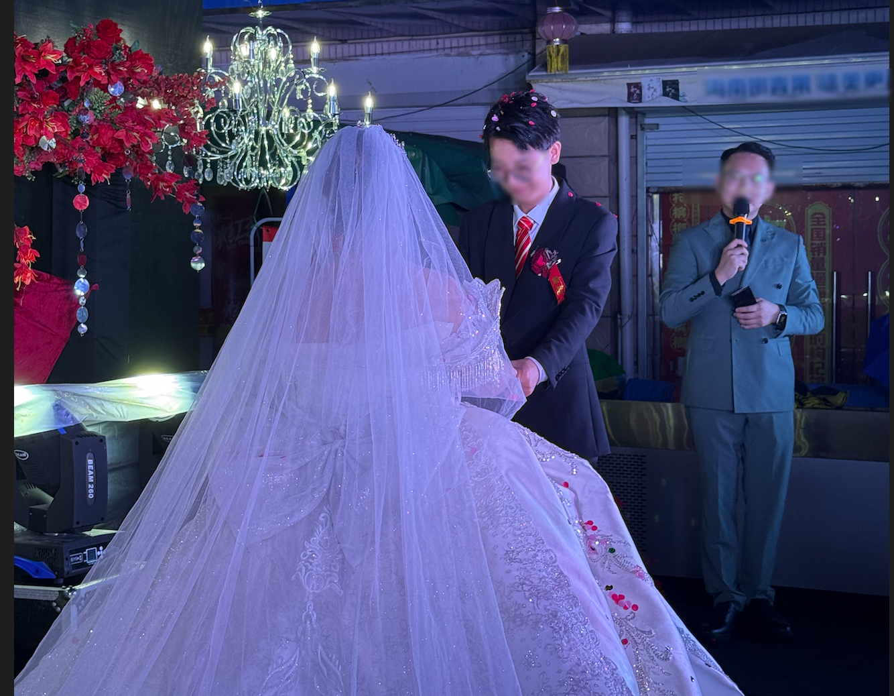
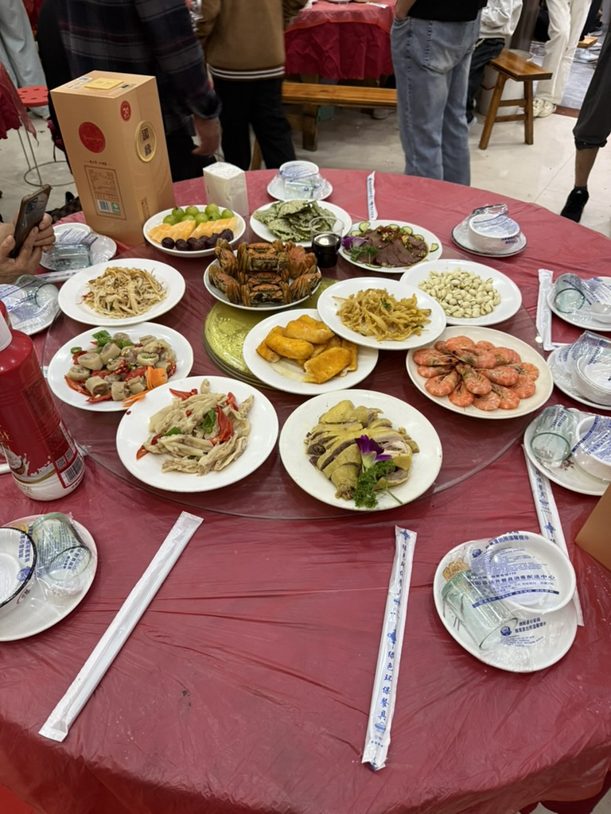
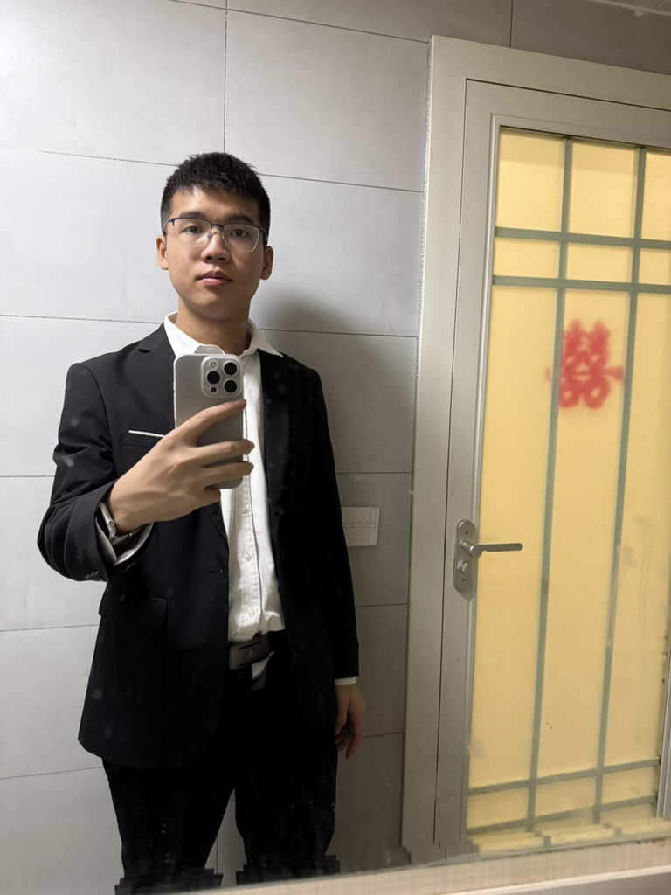

---
tags:
- blog
---

# 婚礼日记

> 记第一次当伴郎 & 老张家最后一位比我大的哥哥结婚

婚礼定在十月的第三天，大概是个黄道吉日。然而天气却不甚好，晚间还下了雨。婚礼本该只有一天，可我被我哥抓去当了伴郎，无奈跟着连忙了三天。打扫卫生，布置婚房，跑老远试了伴郎的礼服，还去先人坟前祭拜了一下。不过这些都还好，婚礼当天才是最手忙脚乱的。

## 中式传统

### 出发前

七点刚过我就被喊了起来，这还得亏我们不化妆可以多睡一会儿，新娘估计起的老早了。大约八点，跟拍的摄影师就加入了战场，非常熟练地指挥新郎官拍了一系列分镜，俗套的像个短剧。摄影大哥按照预设的剧本摆拍了好一会儿，剧情终于发展到了高潮：接亲！

### 接亲

<figure markdown>

{width=200}

<figurecaption>💐🤲</figurecaption>
</figure>

收拾妥当，新郎就捧起花出发了。浩荡的车队打着双闪，还没转几个街角就停了下来。是的，新娘家不过一里开外，发动机还没热起来就已经到了新娘家楼下。

### 拦门

伴着浓浓的硝烟升起，新郎闪亮登场。最磨人的攻坚战也正式打响，新郎必须一路过关斩将、拿下一众拦门的亲戚才能见到新娘。

<figure markdown>

{width=200}

<figurecaption>没开玩笑，当真是浓浓硝烟</figurecaption>
</figure>

第一关就是新娘家的大门。好家伙，那是一家老小齐上阵，而且还不断有敌方增援赶到。幸好我方的装备精良，红包、喜糖、香烟组成的糖衣炮弹成功击溃了他们的防线。

第二关则是新娘的闺房。好家伙，那是密不透风一扇门，甚至红包都塞不进去。所幸新郎官他丈母娘鼎力相助，协助我方共克时艰，成功破门而入。

??? success "小插曲1😂"
    破门而入后我们终于看到了伴娘们。嘿！你还真别说，伴娘们还真都挺好看。新郎官没说胡话。

    我们四个伴郎里，就只有一个wansheng要找对象。这下肉多狼少，他不得开心死了？

    然而，wansheng很快发现，四个伴娘里三个是未成年小妹妹，还有一个已经名花有主。气的wansheng直呼诈骗，最后无奈之下跟化妆师聊的火热，晚宴的时候坐在一起还加上了微信。我看有戏，他是真来找对象的。

    抢捧花的时候wansheng也是一个箭步，迅雷不及掩耳之势抢到了手捧花，其心可鉴。

    ㊗️顺利！

最后一关就是新娘本人的考验，新郎在摄影大哥的相机“威胁”下立下了结婚宣言，本场攻坚战以双方签订“不平等条约”为战果，终于落下帷幕。

至此，新郎官的任务基本就算是完成了。不过一时半会儿新娘还不能带回去，娘家这边还有习俗未竟。全套流程不清楚，其中有个步骤是新娘的弟弟给她洗脚，小胖子拿了红包开心死了；另外还有一个环节是新郎官找鞋，找到了鞋子新娘才能下床。

### 女方午宴

接下来是新娘家的午宴时间，来的都是女方的亲戚，我们几个上路接亲的人坐一桌奉为上宾。吃饭的地方是个专门承办婚礼的酒店（本来的习俗可能是在家里吃），厨师水平很次，菜品多而不精、没几个能吃的，上菜还贼慢；我还被表叔拉着喝了一杯酒，吃得更不开心了。装修也很辣眼睛（字面意思），现场的灯超级晃眼。

<figure markdown>

{width=200}

<figurecaption>介于好看和丑中间，略丑</figurecaption>
</figure>

吃到一半就是发喜烟、喜糖以及新人敬酒环节了，我哥提着一瓶100%农夫山泉出去喝了一圈就回来了。

饭后新娘就要被正式接出门了。我们几个伴郎提上嫁妆、放上几条催促的鞭炮🧨，新娘终于下来了。而后依然是在一阵鞭炮声中，车队接上新娘回家咯。

### 拦门 2.0

没几分钟，婚车就到了新郎官家门口。但仍旧道阻且长，新娘轻易不下车，还得是我表叔代表男方一顿糖衣炮弹猛轰才能把新娘请下车。新娘撑着一柄红伞伞，跨过火盆就迎来了最后的挑战：拦门 2.0

这回坐镇的是男方亲戚，老张家上下三代都坐在大门口严阵以待。我们几个伴郎也搬了凳子守在婚房门口，嘿嘿😁

小登领喜糖、中登领红包、老登领喜烟，大家都满意了之后新娘才终于进了婚房。

### 捅破那层窗户纸

到这里我已经很累了，新郎也累趴了。不过中式婚礼仍在继续，我们直接快进到捅窗户纸。喊一句吉祥话戳一根筷子，最后一把梭。随着红色筷子落在新娘的裙摆上，中式婚礼也就此暂告一段落。

??? failure "小插曲2😭"
    在进入西式婚礼之前，请容我尴一个尬。

    也许是出于对我的信任或者对我学历的信任，五爷铁了心让我去给他们登账（就是那种坐在门口，记录下每位来宾随礼多少的笔杆子）。
    
    虽然我完全不想去，但却之不恭，还是硬着头皮上了。结果咱屌丝程序员，写字比较幼稚扭曲就算了，`零壹贰叁肆伍陆柒捌玖拾佰仟万亿`这些个数字咱也写不利索，更别提来宾的各种花哨名字和浓厚方言。

    结果是，没写几行我就绷不住了，所幸有一位大哥比较自信，写得一手好字、毛遂自荐。我也是不甘受辱，火速跑路。本I人的脚趾已经可以扣出一栋别墅了，好想找个地缝钻进去😭

## 舶来的浪漫

捅破窗户纸后，新娘闪亮变装，穿上了西式婚纱。婚礼也来到了最后一个环节：没有牧师的“露天教堂”式婚礼。

<figure markdown>

{width=300}

<figurecaption>新婚快乐！</figurecaption>
</figure>

在司仪铿锵有力的播音腔里，新郎缓缓走向新娘，互诉衷肠，礼成～

如果没下雨就更完美了。

### 男方晚宴

没时间沉浸在浪漫当中了，开饭了！

<figure markdown>

{width=200}

<figurecaption>😋好吃！ 只拍了前菜，正菜忙着吃忘拍了</figurecaption>
</figure>

这次和午宴不一样，看来是个正经大厨。每道菜都挺好吃。而且还没人拉着我哈酒，这道菜没炫完下一道菜已经端了上来，没时间犹豫了，吃吃吃。

### 尾声

吃饱喝足，拿上一天的战利品（= 喜烟若干 + 皮带一根，烟直接换成五张毛爷爷，嘿嘿～），咱就打道回府咯。

<figure markdown>

{width=200}

<figurecaption>照片留念 怎么看都是个小登啊 <s>可我全拿的喜烟</s></figurecaption>
</figure>

> 本来还有些题外话想写。但现在已经很晚了，我的脑子越来越不清醒。并且要写的内容也不太契合全文的氛围。索性言尽于此，等我再写想的时候放在评论里。

此致。
