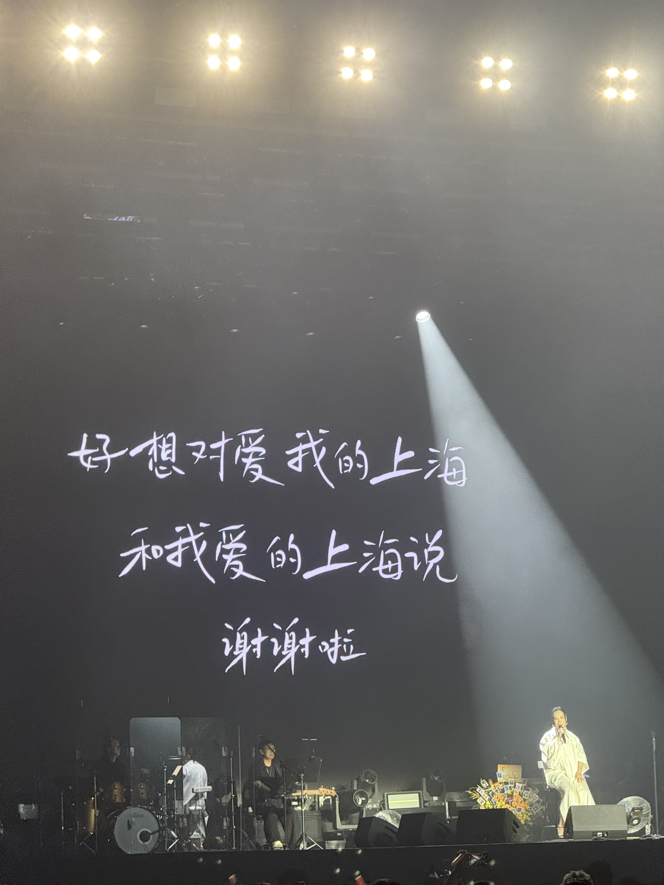

---
tags:
- blog
- 音乐
---

# 晚霞·不晚

> 2025年8月23日于上海国家会展中心·虹馆

在实习、秋招、科研的夹击之下，咱忙里偷闲，去看了人生第一场演唱会。

<figure markdown>

{width=300}

<figurecaption>爱我的上海和我爱的上海！</figurecaption>
</figure>

杨老师和我比较松弛，黄妈已经唱了两句我们才到场。尴尬的是，我们的座位还被别人占了，好在座位在第一排、比较好找，工作人员很快协调好了。

> 卑微求求各路大侠以后对号入座，本i人在现场差点就被一万双眼睛杀死了。

我们坐下来的时候应该已经在唱《细雨轻声》了。少听了一首《爱是什么》，血亏！

从网上找了整场的歌单，居然足足唱了22首：

??? success "《晚霞·不晚》2025巡回演唱会，上海站！"

    1. ==爱是什么==（这首没听到live😭）
    2. 细雨轻声
    3. ==思念一种爱==
    4. 怀疑女士
    5. ==我的美丽==
    6. ==拆穿==
    7. 号外
    8. 喜欢你（真是写给初恋的吗？）
    9. 你也怀念吗
    10. 牵手（黄妈建议：不管认识不认识的，坐旁边的都牵起手哈哈哈）
    11. 荒蛮的幽默
    12. 清白的
    13. 秘密2
    14. ==蠢货==
    15. 喷涌
    16. 旷世之交
    17. ==是妈妈是女儿==（😭）
    18. ==向云端==
    19. ==小霞==（就是为了这首歌才买的票！）
    20. 离不开你
    21. 灯塔
    22. 回来（这首唱完已经晚上十点了！黄妈唱嗨了，多唱了半个小时哈哈哈。可能因为是最后一首歌，黄妈火力全开，我👂都🐲了。她不是57了吗，咋还这么能飙高音？）

    > 另外不得不吐槽一下，黄妈的串词太尬了！咱完全可以不搞这个直接下一首的，非要整几句尬的。
    >
    > 和观众的互动画风也很诡异，最前排的铁粉一个劲的喊妈；她在台上则是一口一个孩子们，也是内娱独一份了。

其实我是个假粉，这里面歌我很多都没怎么听过。虽然为了去看演唱会还特地循环了她的歌单，可到头来还是那几首比较入耳。现场听下来也没有什么意料之外好听的歌，倒是《是妈妈是女儿》听到了和CD不一样的感觉。

!!! quote
    孩子会穿过大雨

    去懂人间的道理

    **我只能唠叨 因为我已帮不上你了**

险些掉眼泪了😭
