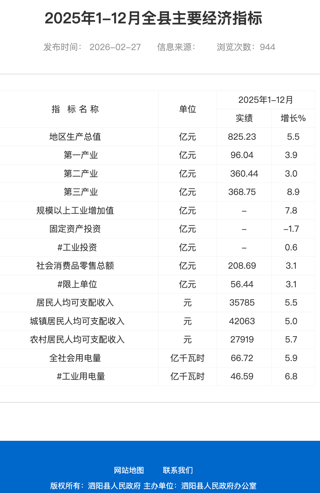

---
tags:
- blog
- 留影
- 旅行
creation_date: "2026.1.3"
---

# 泗阳三日游
> From 2026.1.1 to 2026.1.3 in Siyang, China

是的，在2026年的元旦，我以游客的身份重新走过了泗阳的大街小巷。突然发觉，这座我呆了十七年有余(1)的城市竟如此陌生。如此看来“旧游无处不堪寻”说的并不是很对，只怕是“旧游无处可堪寻”，物非人非。
{ .annotate }

1. 从出生到高中毕业为止。上大学之后基本都呆在上海了，回家的日子**加起来都不够一年**。这样来看泗阳于我而言难免陌生了。

为了纪念这次旅行、也为了重新认识泗阳，我整理了旅行的见闻、收集了一些资料、另外还刨出些许记忆碎片，写下了这篇游记。

## 啥？泗阳是哪？

单看这标题——“泗阳三日游”，想必朋友们都很疑惑。

不熟悉泗阳的朋友会问：**泗阳是什么地方？有啥好玩的吗？**熟悉泗阳的朋友同样会发问：**泗阳这小县城也能玩三天？？**

那我就来说道说道。

### 泗阳地理：一河一湖

通过卫星图可以看到[泗阳县](https://zh.wikipedia.org/wiki/%E6%B3%97%E9%98%B3%E5%8E%BF)是一个纵向狭长的行政区，中心城区基本沿着**京杭运河**建设（并且基本都在运河北方！），其余地方零零散散分布着几个乡镇。

??? question "千里运河最美县？"
    泗阳是有这么个名号，但似乎是自封的。

    还有诸如“运河三千里，最美在泗阳”之类的口号，各种媒体上都可以看到。

    也有谐音梗：运河三千里，**醉美**在泗阳。恰好呼应泗阳的一大特产：洋河酒～

县城南方有一个超大的**成子湖**，它是中国第四大淡水湖洪泽湖的一部份。

??? question "成子湖和洪泽湖到底啥关系？"
    好吧，我此前也从未思考过这个问题。只觉得成子湖就是洪泽湖的绰号，兴许只是泗阳人爱这么叫。但我调查之后发现，**真相没这么简单**！！

    

    从卫星图上来看，它俩完全联通、是一湖之水，因此整体而言称为洪泽湖，在中国所有的淡水湖中体量排第四。但是由于洪泽湖的形状比较怪异：类似一个鸡爪。因此它的其中一个爪子就得名成子湖。

    我也问了一下AI，它给出了更根本的原因（但是不如维基百科说的清楚！AI啥时候才能彻底打败百科啊！）：历史上[洪泽湖](https://zh.wikipedia.org/zh-cn/%E6%B4%AA%E6%B3%BD%E6%B9%96)没这么大，起初只是一些小湖泊。只是经过了黄河夺淮入海，几个湖泊连成一片才变成如今的规模。洪泽湖这个名字也是到了唐朝才有。至于成子湖为什么叫成子湖，就无处可考了。
    
    PS 这段历史也解释了洪泽湖为何称为地上悬湖，全怪黄河啊！

    PPS 怪不得我小时候那会儿成子湖盛行在捞沙子，原来这也是黄河的遗产！

    ??? chatgpt-summary "洪泽湖和成子湖不是一个湖嘛，为什么两个名字？"

        严格说，洪泽湖 和 成子湖 既“是一个大湖体系里的部分”，又“不是完全同一个湖”。

        可以理解成：

        * “洪泽湖”是整个大湖的总名称；
        * “成子湖”是洪泽湖内部的一个湖湾/子湖，位于西北部。

        就像一个大海湾里还有“小湾区”一样。

        现在很多资料都写到：洪泽湖全湖水域由“成子湖湾、溧河湖湾、淮河湖湾”等部分组成。

        所以会出现两种叫法：

        1. 从整体看
            * 都算洪泽湖的一部分；
            * 行政、水利、地图上通常统一叫“洪泽湖”。
        2. 从局部看
            * 成子湖又有自己相对独立的水域、渔业和地理特征；
            * 当地人、旅游宣传、渔民会单独叫“成子湖”。

        历史上这类情况很多，比如：

        * 太湖 里面还有东太湖、胥湖等分区；
        * 洞庭湖 也分东洞庭、西洞庭、南洞庭。

        另外，“成子湖”这个名字本来比现代“大洪泽湖”的概念更局部、更古老。后来洪泽湖不断扩大，把周围很多浅湖、水荡连成一片，于是成子湖就逐渐成了洪泽湖的一部分。

按照最新的行政区划，泗阳下辖3个街道办事处、9个镇、1个乡还有2个*类似乡级单位*(1)：
{ .annotate }

1. 是的，类似乡级单位是一个专有名词。

!!! quote
    众兴街道、​城厢街道、​来安街道、​爱园镇、​王集镇、​裴圩镇、​新袁镇、​李口镇、​临河镇、​穿城镇、卢集镇、​三庄镇、​庄圩乡、​棉花原种场和​泗阳农场。

鄙人的老家就在现在的​卢集镇，它是2020由原来的高渡镇和​卢集镇合并而成。我可怜的老家高渡镇，财政实在太拉垮，据说欠了太多钱就直接被撤消了。

另外一个关于行政区划的趣闻就是：1996年前，泗阳归属淮阴市（今淮安市），身份证开头为3208；1996年7月，泗阳划属新设立的宿迁市，身份证开头为3213。所以我和我爸的身份证开头根本不一样😭

其实我更认同自己是一个淮安人，毕竟淮安市区（距离更近、更发达）我去过几次，但宿迁市区我是一次没去过。

### 泗阳特产：膘鸡就酒

> “就酒”是泗阳方言，读作这个，我也不知道咋写。就是下酒的意思。

如果让我一个泗阳人在不问AI、不用搜索引擎的情况下说泗阳的特产，我能想到的就是：洋河酒、泗阳膘鸡、意大利杨树这三样。另外还有新袁羊肉、穿城大饼、八集小花生之类的，不知道算不算得上特产，总归也是耳熟能详的地方吃食。哦对了，既然靠着洪泽湖，大闸蟹之类的水产自然也是地方特色。

如果去网上搜，可以搜到更多其他各种各样的特产（例如[这个网站](http://www.mpsj.com.cn/produce/index686.html)），我不是特别了解就不提了。

#### 洋河酒

{width=200}

上图是洋河比较高端的M6+白酒，大概五六百一瓶，入口非常绵柔。

这应该是泗阳最响亮的特产了，任何泗阳人肯定都是知道的，大概能排进中国白酒市值前五。就算是外地的朋友，清晨在泗阳城里走一遭也大概率能闻到洋河酒厂飘出来的酒糟味。不开玩笑地说，在泗阳县城里晨跑一圈、相当于一两白酒下肚。

> 不过，幽默的是：按照现在的行政区划，洋河酒的老家**洋河镇**已经改制为洋河新区，被划分给了宿迁市区。和泗阳再无半毛钱关系。

#### 泗阳膘鸡

{width=400}

上图左侧是膘鸡，右侧是与之类似的酥鸡。

膘鸡虽然叫鸡，但它实际上是猪肉做的蒸制熟食。成品呈现出分层，一层山药、一层猪肉、最底层是百叶。酥鸡就是把猪肉糊糊和山药糊糊混合起来，捏成小饼之后油炸一下。这俩都是不能生食的，一般都是和青菜一起烩，搞一个汤菜。吃起来还是不错的，我个人更喜欢油炸的酥鸡。

#### 意大利杨树

是的，意大利杨树也是泗阳最有名的一大特产，泗阳号称“意杨之乡”、“平原林海，世外桃源”。

但是据说，最近泗阳种的杨树都是日本品种了，不是早前引入的意大利杨树。也正因如此，杨树花变多了，一到春天满城都是飞絮！！！如果你在这个季节去过一次，肯定忘不了。

然而据另外一说：

!!! quote
    > 来源：[新华日报](https://zgjssw.jschina.com.cn/shixianchuanzhen/suqian//202306/t20230612_7971125.shtml)，2023年6月

    泗阳是我国较早引进美洲黑杨的县，素有“杨树之乡”美誉
    
    ...

    杨树在给泗阳带来巨大经济社会效益的同时，每年春夏之交的杨絮也影响了居民日常生活。从2010年起，泗阳县林业科技人员与南林大专家探索“不飘絮”杨树品种的选育

    ...

    杨树新品种培育成功后，该县在13个乡镇街道建立繁育基地，年繁育“不飘絮”杨树苗超过70万株。泗阳还制定农村绿化暨杨树更新改造方案，淘汰“老龄化”杨树，启动“杨树更新改造年”活动，引导农民更新栽植“不飘絮”杨树。

所以有没有常居泗阳的老铁说一下，飞絮到底是变多了还是变少了？

### 泗阳历史：泗水古城

据考，泗阳的历史非常悠久，有五千年的文明史、两千年的建县史。

!!! quote
    > 本段源自ChatGPT抓到的一个[词典](https://www.guoxuemi.com/hydcd/767735z.html?utm_source=chatgpt.com)

    泗阳在江苏省宿迁市东北部、洪泽湖北岸。京杭运河斜贯。县人民政府驻众兴镇。**西汉设泗阳县（以在古泗水之阳得名），东汉废。元为桃园县，明改桃源县，1914年复名泗阳县。**产小麦、玉米、甘薯、稻、棉花、花生及苹果、金针菜。工业有纺织、酿酒、化肥、机械等。特产“洋河大曲”酒。

下面是Wiki上历朝的泗阳县，还有一篇[野生的文章](https://www.sohu.com/a/455608857_120053699)专门考究了泗阳县名的由来：

- 秦朝：凌县
- 汉朝：泗阳县
- 唐宋：泗州，桃园镇
- 元朝：桃源县
- 明清：桃源县
- 民国：泗阳县

不难发现，历史上的泗阳城基本是围绕“泗水”和“桃源（园）”这两个要素命名的。

“泗”字不难理解，虽然现在的泗水已经离泗阳非常远（山东附近有一个，不知道是不是同一条），但古时候大概是流经泗阳的。泗阳还修了一个仿古的泗水古城，不过到了2026年已经相当破败了。

“桃”则更加简单，泗阳据说有“夭桃千顷、翠柳万行”之景色。但我倒是没怎么听说泗阳盛产桃子，可能也是古时候的事情吧。桃源这个词倒是现在很多地方都在沿用，例如桃源中学、桃源大桥、桃源路、桃源小区等等。

### 泗阳地标：妈祖保佑你

如今泗阳小县城整的倒是不丑，有很多不错的地标性建筑。

#### 西式建筑

<figure markdown>

{width=200}

<figurecaption>这西式小建筑，拿捏了🤏</figurecaption>
</figure>

首先就是上面图里的**大本钟**以及**基督教堂**。我也是第一次知道：“大本钟是泗阳县**泗阳大剧院钟楼**的一部份，建造于20世纪，是一座古朴典雅的时钟。”

至于这个教堂姓甚名谁，是用来干什么的，我问了很多地道泗阳人都不晓得。大概真的不知名。

??? question "这教堂到底是什么？在哪里？"
    按照我模糊的记忆，这个教堂就在运河边的公园旁边，我以前总能看到它。为了得到确切的消息，我在网上搜了很久都没搜到。只能求助我的朋友们。

    我先问了高中的好基友：

    <figure markdown>

    {width=400}

    <figurecaption>一个洋河✌️、一个城区✌️都不知道</figurecaption>
    </figure>

    又问了我爸我妈我姐，结果他们也不知道在哪里。只知道以前是基督教堂，后来变成一个可以办婚礼的地方。

    最后问了几个高中同学，居然真给我问到了：“左边是以前的基督教堂，在**运河边上**。我上大学的时候（2019～2023左右）被我一个小学同学家承包下来办了一个**书吧和餐厅**，现在不知道倒闭没有。”

    通过熟人破案了。果然，六度分隔理论是对的。而在泗阳城，只需要三度分隔。

#### 大运河畔

<figure markdown>

{width=200}

<figurecaption>这美工也是人才 硬是把这些东西拼一起了</figurecaption>

</figure>

然后就是上图里的三个建筑，左到右分别是**泗水阁**、**运河风光带雕塑**、**妈祖像**。

泗水阁修在运河边上，泗阳大桥旁边。应该是仿古建筑，晚上亮个灯还挺漂亮。

??? quote "泗水阁？"
    > 本段来自公众号：[泗阳花园口](https://mp.weixin.qq.com/s/Nw8HLQVf4FD-jiNaEatvww)

    泗水阁，坐落于泗阳县城运河风光带，扎根于千年流淌的大运河北岸，被誉为“苏北黄鹤楼”。泗水阁主体7层， 高56.4米，建筑面积5800平方米。夜幕下的泗水阁，通体金碧辉煌，光华璀璨，不仅完美再现出汉唐王朝的雍容尊贵，更成功诠释了泗水文化的古典神韵， 引得众多游人驻足兴叹、流连忘返。且看苏北夜色，风景这边独好！

运河风光带就是在运河边修的长长的一条公园，可以散步。逢年过节人比较多。但是我上次去的时候整个公园大晚上一盏灯没开，异常阴森。

??? quote "运河风光带？"
    > 本段来自公众号：[泗阳花园口](https://mp.weixin.qq.com/s/Nw8HLQVf4FD-jiNaEatvww)

    运河风光带是我县打造“中国最美运河岸线”、加快运河新城片区开发的重点工程之一，与城市森林公园、奥林匹克生态公园组成城市T型生态走廊，总投资3.6亿元，全长6.4公里，平均宽幅150米，铺设木栈道1360米，建有亲水平台4个，栽植各类乔木5972株，保留乡土树种324株。项目采用“中轴、绿带、特色功能区”整体结构，建有亮化、硬铺广场、滨河大道，配以泗水阁、运河印象建筑群等景观内容，全面构建一个和谐、灵动、绿色、文化、震撼的特色城市景观核心区和集观光、游赏、运动健身、休闲娱乐、交流体验为一体的滨水景观区，成为市民健身休闲的最佳场所，被县内外领导和群众形象地称为“泗阳外滩”。

妈祖像伫立在运河中的一座人工岛上。真实的妈祖像非常高（三十多米），上面图里的比例不太对。据说是世界上惟一的三面妈祖雕像，有可能是最高的妈祖，似乎号称天下第一妈祖（？极大存疑，是我模糊的记忆）。中学的时候经常被带过来春游什么的，现在估计没什么游客了。香火倒是不错。

至于为什么泗阳会有一座妈祖庙，我也不知道。

??? quote "妈祖文化园？"
    > 本段来自公众号：[泗阳花园口](https://mp.weixin.qq.com/s/Nw8HLQVf4FD-jiNaEatvww)

    妈祖文化园位于泗阳船闸西南侧的情人岛上，所处之地位于大运河中流，三面环水。整个景观结构为一轴、一环、两心、一片区。一尊高达32.3米的三面妈祖雕像坐落在岛的最西端，也是世界上惟一的三面妈祖雕像。妈祖文化园整体规划用地面积41528.8平方米，主体建筑有妈祖广场、妈祖圣像、山门、钟鼓楼、妈祖殿、观音殿、福禄寿三星殿。现已建成，这里将是全球5000多座妈祖庙中罕见的集水利、生态、风光及佛、道于一体的多元文化旅游景点，称得上是千里运河之上独特的文化地标。泗阳妈祖文化园是千里运河上一颗璀璨的明珠，千里运河上的唯一妈祖文化遗存。形成了“南有昆山慧聚寺、北有泗阳妈祖文化园”的格局。

#### 运河之上

另外既然有条运河穿城而过，自然少不了各种跨运河的大桥、以及河上的船闸。虽然和武汉的跨江大桥比不了，但也是泗阳小县城的门面。

<figure markdown>

{width=500}

<figurecaption>你选哪条进城？ 选哪条都会堵！</figurecaption>
</figure>

上图里从左往右依次是众兴大桥、成子河公路大桥、泗阳大桥、桃源大桥和泗阳船闸大桥。

- [众兴大桥](https://baike.baidu.com/item/%E4%BA%AC%E6%9D%AD%E8%BF%90%E6%B2%B3%E4%BC%97%E5%85%B4%E5%A4%A7%E6%A1%A5/61918680)（2001年通车），虽然比泗阳大桥早，但是大家都叫它二桥：

{width=500}

- [成子河公路大桥](http://www.china-qiao.com/ql16/sqql/sqql037.htm)（2014年通车）：

{width=500}

- [泗阳大桥](https://baike.baidu.com/item/%E6%B3%97%E9%98%B3%E5%A4%A7%E6%A1%A5/3880866)（2012年通车），现在是[2008年开始重建](https://www.ourjiangsu.com/a/20190628/15616898233.shtml)后的样子：

{width=500}

- [桃源大桥](https://baike.baidu.com/item/%E6%A1%83%E6%BA%90%E5%A4%A7%E6%A1%A5/62426189)（2025年通车），图里还能看到泗阳大桥（红色）和成子河公路大桥（蓝色）呢：

{width=500}

- [泗阳船闸大桥](http://www.china-qiao.com/ql16/sqql/sqql033.htm)（2013年通车）：

{width=500}

#### 其他地标

最后是一些其他的地标，不好归类就都放在这里了。

- 泗阳电视塔：

{width=300}

- 泗阳骡马街：

{width=500}

- 泗阳杨树博物馆：

{width=500}

### 泗阳教育：行健致远

泗阳县有七个普通高中，还有几个职业高中。我也是去找了一个中考分数线才知道如今泗阳高中的格局已经变了样：

<figure markdown>

{width=500}

<figurecaption>致远中学拉了啊</figurecaption>
</figure>

- 泗阳中学不必说，老牌强校。
- 海门实验中学是2020年新办的学校，我19年就高中毕业了，所以完全不了解。
- 致远中学，我的母校。如今看来根本不是泗阳中学的对手，但是**高中的我们迷之自信，就是爱大致远**。
- 泗阳县实验高级中学（以前叫众兴中学），没怎么听说过，生源比较差。
- 桃州中学，我姐读的高中，据说不太行。后来我姐到泗阳中学复读才考上本科。

在网上找了一个宿迁各个高中的高考成绩：

<figure markdown>

{width=400}

<figurecaption>看起来泗阳中学比致远中学强的不是一点半点</figurecaption>
</figure>

整体看下来，泗阳在宿迁市的水平还是太差了。和隔壁淮安更是比不了。

### 泗阳经济

根据泗阳县人民政府的公报，[泗阳县](http://www.siyang.gov.cn/siyang/sjfb/202607/b491ca98f1734e51b2faf0548a317b1a.shtml)2025年地区生产总值是825.23亿元。作为参考，宿迁市下辖的其他几个单位的GDP如下：

<figure markdown>

{width=400}

<figurecaption>宿城区有两个数据：650为预测值，1197为最终核算值</figurecaption>
> 据说打一个#就是代表估算的意思，我倒是第一次见到这种习惯

</figure>

看起来沭阳县一骑绝尘，稳稳的千亿强县。但是沭阳县人口众多（160万），大概是泗阳县的两倍，这样一算其实都半斤八两。肯定还是不如城区富裕。况且，总体上宿迁市就是江苏的倒数第二，也就比连云港好那么一丢丢，人均GDP无论如何也高不起来。

下面这张表给出了更多详细的数据：

<figure markdown>

{width=400}

<figurecaption>泗阳县人均可支配收入：3.5万</figurecaption>
</figure>

### 泗阳方言

## 为啥要去泗阳旅游

## 在泗阳都玩了啥
