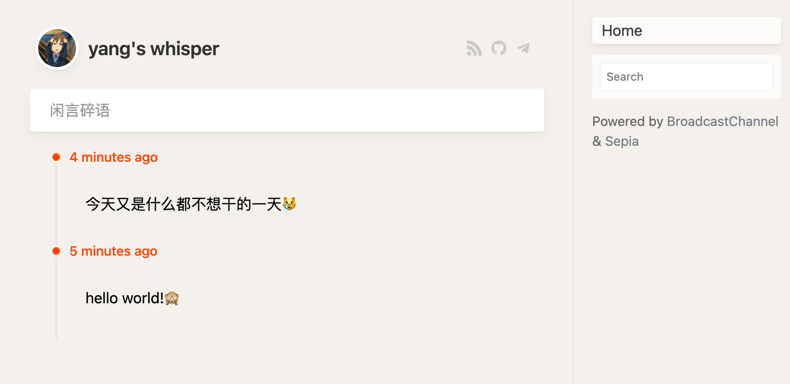

# 博客📕
我经历的一切累加起来就是我，所以欢迎进入我的精神世界。

## 佛系小诗一首
??? quote "佚名《宽心谣》  “不是神仙，胜似神仙！”"
	日出东海落西山，愁也一天，喜也一天。

    遇事不钻牛角尖，人也舒坦，心也舒坦。

    每月领取养老钱，多也喜欢，少也喜欢。

    少荤多素日三餐，粗也香甜，细也香甜。

    新旧衣服不挑拣，好也御寒，赖也御寒。

    常与知己聊聊天，古也谈谈，今也谈谈。

    内孙外孙同样看，儿也心欢，女也心欢。

    全家老少互慰勉，贫也相安，富也相安。

    早晚操劳勤锻炼，忙也乐观，闲也乐观。

    心宽体健养天年，不是神仙，胜似神仙。

## [闲言碎语](https://whisper.yangz.site)
> 这是一个类似微博的东西
<figure markdown>

[{width=600 nozoom}](https://whisper.yangz.site)

</figure>

## 最近更新的博客
> 下面是偶尔更新的长文