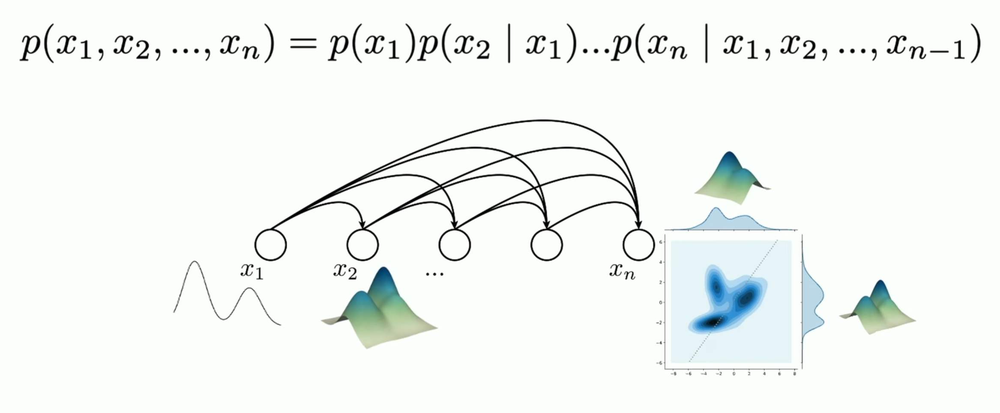
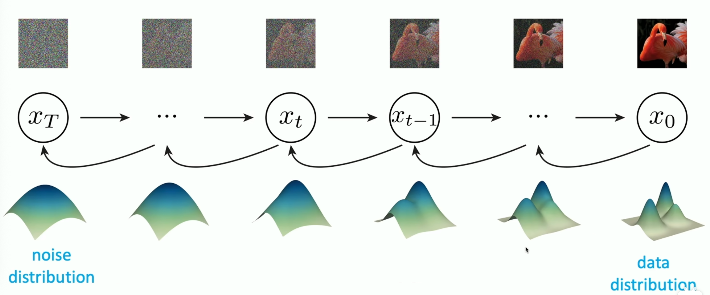

---
tags:
- Alg
- Papers
include:
- math
---

# 生成模型

之前在介绍各种[深度学习模型](../../../Python/ThirdPartyLibrary/pytorch/model.ipynb)的时候也提到过，生成(式)模型是非常独特的一类范式。之所以称之为范式，是因为本质上它不是一种新的模型架构（MLP、CNN、Transformer、RNN等），而是对这些基本模型架构的应用。

## 生成 vs 判别

通常我们所说所的生成式模型（Generative Models）区别于判别式模型（Discriminative Models），后者已经发展了数十年，深入到了我们的日常生活当中：推荐系统，搜索引擎，机器翻译等等。

生成式模型在当下则是如日中天，从GAN到最近的GPT、Suno、Sora，我们已经可以生成高质量的**图片、文字、音频、视频**。

[kaiming](https://www.youtube.com/watch?v=2yJSoaGU2i4)的这张图用**图像分类**和**图像生成**这个例子展示了他们最大的区别：判别式模型往往有固定的预期输出，而生成式模型的输出并不固定。

> 注意，图中展示的生成式模型并非标准的生成式模型，而是**条件生成式模型**：根据输入生成指定的内容。

### 判别式模型

任何需要**判断**（一个固定的输出）的场景都可以使用判别式模型，包括但不限于分类和回归以及可以归结为这两个问题的其他任务（例如图像的语义分割，可以归结为逐个像素的分类问题）。

可以说判别式模型就是一种函数拟合：

$$
f: x\to y,\quad g_{\mathrm{disc}} \rightrightarrows f
$$

> $x,y$之间存在函数对应关系，我们的判别式模型$g_{\mathrm{disc}}$就是在近似这种关系

例如线性回归、SVM、神经网络等，可以拟合不同的函数关系。

### 生成式模型

生成式模型则完全不同，通常我们根本**不需要输入**，我们的目标是构造一个生成器，它可以产生和目标分布一致的数据（一个最简单的构造就是经验分布函数）。

$$
x \sim p_x, \quad g_{\mathrm{gen}} \rightrightarrows p_x
$$

不过毫无限制地生成用处不大，只能作为玩具。**条件生成模型**则不同，它可以接受用户的输入，然后据此输出一个条件分布。

$$
g_{\mathrm{gen}}(y) \rightrightarrows p_{x\mid y}
$$

### 判别也是一种生成

从概率论的角度来看，条件生成式模型希望建模的是**条件分布**，也就是说对于每一个输入$x$我们输出一个条件概率分布$P(y|x)$。

判别式模型某种程度上也可以这个框架：我们总是用模型来估计候选输出的**条件概率**：

$$
P(y_\mathrm{candidate}|x),\quad y_\mathrm{candidate}\sim Y
$$

然后输出概率最大的那个$y_\mathrm{candidate}$。这个过程也可以视为是我们根据输入$x$生成了标签$y$的一个伯努利分布。

只不过这里的目标分布太过简单。判别式模型的目标往往是一个伯努利分布（二分类任务）、多项分布（多分类任务）或者其他的连续分布（回归任务）。

而真正的生成式模型往往需要面对复杂得多的分布，例如图片（可以建模为$m*n$个随机变量的分布）、文本、视频等等。

### 一个例子

这么说可能还是有点抽象，我结合上面这张图给一个具体的例子：

假设我们现在要做一个垃圾邮件的判别器，输入一个邮件（$x \sim X$）、输出它是不是垃圾邮件（$y \sim Y$）。

- 判别式模型（例如逻辑回归）的做法是：在$X$的空间中找一条线，一分为二，一侧是垃圾邮件、另外一侧不是。判别式模型只在乎这条线怎么画。
- 生成式模型（例如朴素贝叶斯）的做法是：先学习$P(x|y)$，也就是垃圾邮件和正常邮件的文本分布以及$P(y)$也就是垃圾邮件的比例，然后使用Bayes公式得到：$$P(y|x) \propto P(x|y)P(y)$$可以看到，生成式模型不仅要做出垃圾邮件的判断，更重要的是学习$P(x|y)$，**也就是垃圾邮件和正常邮件的生成方式**。

有了这个生成方式，我们不仅可以完成判别任务：$P(y|x) \propto P(x|y)P(y)$，还可以从中采样，生成新的$x$。

## 如何建模

### 判别式

判别式模型的建模非常自然，我们只需要构造合适的函数来近似数据集中的关系即可。

判别式模型学习的一般范式是：

- 设计一个模型$f_\theta$，由参数$\theta$决定
- 使用从真实世界采样的输入输出对$(x,y) \sim (X,Y)$来优化$\theta$: $$\theta^* = \arg\min \sum_{(x,y) \sim (X,Y)}\mathrm{loss}(y, f_\theta(x))$$
- 这个过程中隐含的假设是：
    - 可学习假设：$x$和$y$之间存在一个对应关系$g: x\to y$。我们的模型就是对它的近似: $$f \rightrightarrows g$$
    - 流形假设：高纬数据分布在一个低维流形上，因此训练集上拟合的模型可以泛化到真实数据。
- 如果流形假设被破坏，也就是我们遇到了OOD的数据，那么模型的表现可能就会很差。

### 生成式

生成式模型则比较复杂，我们希望构造一个分布函数，它产生的数据和数据集分布一致。

为此，我们通常把生成式模型建模为**对分布的变换**。

例如，我们知道如果$x\sim \mathcal{N}(0,1)$，那么$y=x^2 \sim \chi^2(1)$。也就是说，从标准正态分布到自由度为1的卡方分布我们只需要一个函数映射$f: x\to x^2$即可。

假设我们有一个先验分布$\pi$，那么我们的目标就是找到一个变换$T$使得
$$
T(\pi) \rightrightarrows p_x
$$

## 生成式模型架构

> 图源：[Deep Learning Day: Generative Modeling](https://www.youtube.com/watch?v=2yJSoaGU2i4)

??? info "吐槽"
    MIT搞的这个Deep Learning Day质量还挺高。不时能有kaiming这样的大佬来给talk也是很幸福了，我猜想做kaiming的学生也是很幸福的，起码他是知道整个领域动态的、是活跃在一线的研究人员。再看看我导，哎！啥时候才能享受一下老师带学生的日子啊。

为了训练这样的变换$T$，有非常多的模型架构，我也写了一些笔记来详细介绍：

- [VAE](./vae.md)：用编码器生成先验分布的参数，解码器作为分布的变换
    - 使用推导出的ELBO作为损失函数训练
    
- [GAN](./gan.md)：使用对抗式判别器来训练
    - 目标是判别器无法分辨生成的对象和真实样本
    
- [Auto-regressive](./gpt.md)：基于自回归，逐步生成各个维度
    - 可以自监督训练，常用于序列数据
    
- [Diffusion](./diffusion.md)：基于热力学，模拟逐步加噪、逐步去噪的过程
    - 训练过程也是自监督的，在去噪的过程中预测加入的噪声，这称为去噪损失
    
- [Flow Matching](./flow_matching.md)：把变换建模为一个随着时间变化的流场
    - 使用流场通常是可逆变换，因此可以直接计算似然损失
    
