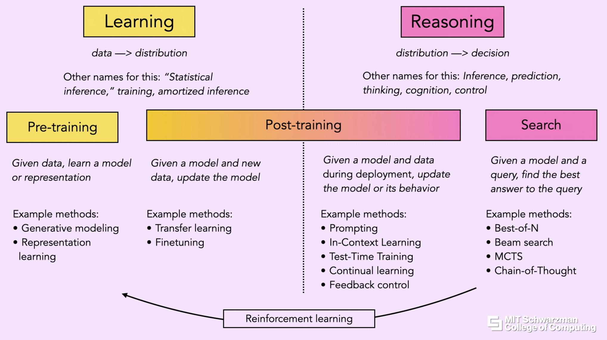
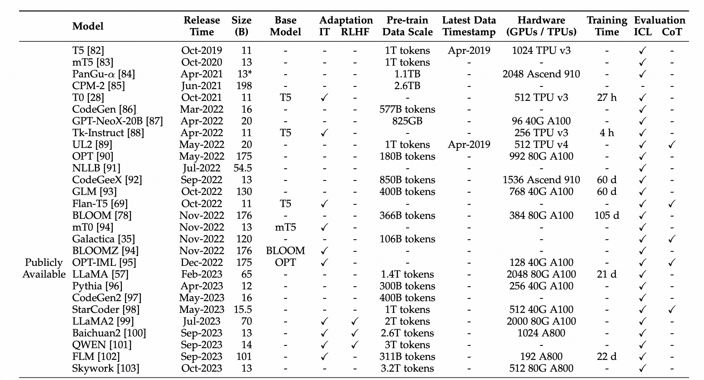
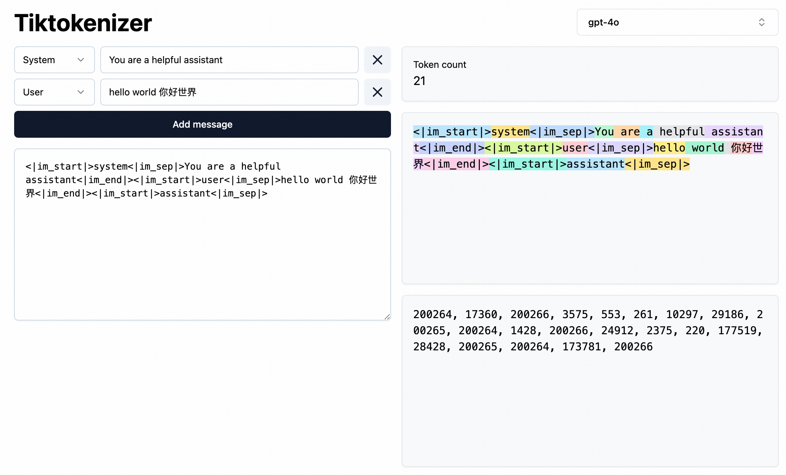
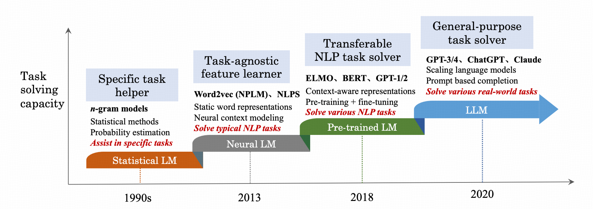
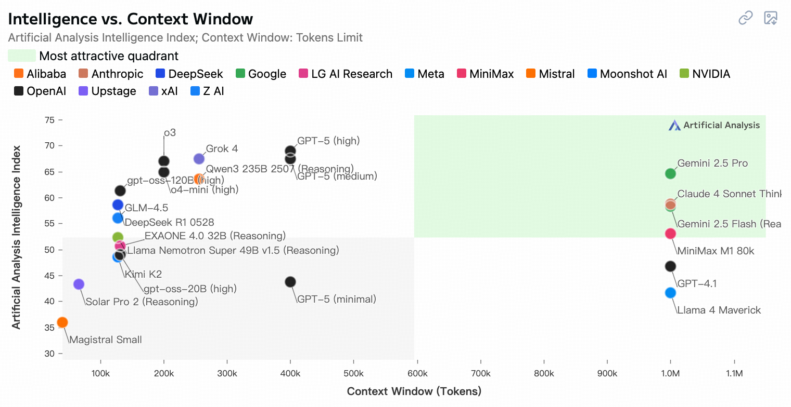
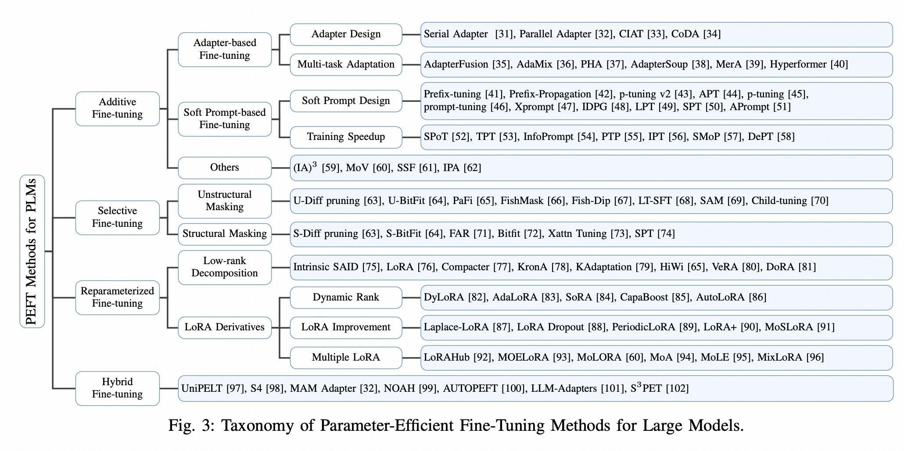
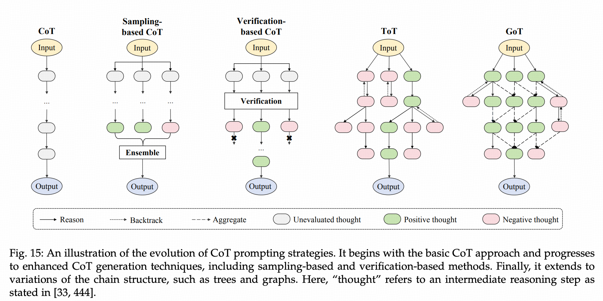
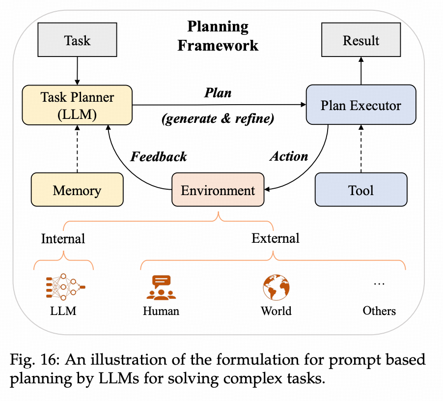
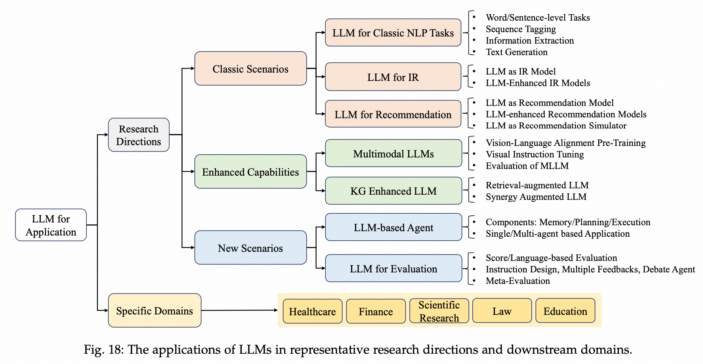

---
tags:
- Alg
- Papers
- LLM
include:
- math
---

# Large Language Models

LLM无疑是当下最热门的领域。作为技术人，肯定需要了解一下。本文算是综述的综述，走马观花地看一看现在LLM热门的研究方向。

## LLM科技树

LLM的成功建立需要点出很多的**前置科技**。这颗庞大的科技树上，每一篇叶子都有无数人在研究，推动AI领域[日新月异](https://artificialanalysis.ai/trends#progress)的发展。



> 图源：[Deep Learning Day: Reasoning](https://www.youtube.com/watch?v=s91WGN5-5A0)

### Dataset

LLM作为一个机器学习模型，最重要的基础设施之一当然是数据集。为了训练超大规模的模型、践行[Scaling Law](https://arxiv.org/abs/2001.08361)，自然需要与之匹配的大规模数据。

在LLM的生产流程中，需要各种数据集，大体分为：

- 预训练（pretraining）数据集
    - 通常是无标签数据集，超大规模，来源不一（网络爬虫、书籍资料等）
    - 一个重要的议题是，如何提高数据集的质量，减少有毒的数据，例如[CCNet](https://arxiv.org/abs/1911.00359)
- 微调（finetuning）数据集
    - 通常是有标签数据集（SFT，有监督微调）
    - 可以细分为指令微调（IT）和人类反馈微调（RLHF）等等
- 评估（benchmarking）数据集
    - benchmark通常是在特定的场景下建立的数据集，例如多语言问题、编程问题、数学问题、QA问题、医学诊断问题等等。
    - 有相当多的人在研究如何从不同角度评价大模型的能力，构造更好的数据集，例如[MATH-Perturb](https://math-perturb.github.io/)

下面的表格展示了一些开源大模型的数据集大小，作为参考GPT3的预训练数据集规模是300B tokens：



> 图源：[A Survey of Large Language Models](https://arxiv.org/abs/2303.18223)

!!! info
    很多时候，为了低成本**构造、清洗**这些数据集，我们无法依赖人力，只能使用已经训练好的大模型、以一种**左脚踩右脚**的方式不断迭代。

### Tokenizing

你肯定发现了，很多时候我们提数据集的大小并不是多少多少TB这样的物理单位，而是多少多少tokens。这就涉及到第二个关键的科技点：Tokenizing

!!! info
    大模型api的计价方式也是按照token来付费。

    本质上，大语言模型就是在做下一个token的预测（next-token prediction, NTP）。这个过程是一个选择题，大语言模型会给所有潜在token的概率，供我们选择。

    所以tokenizer真的很重要，词汇表决定了大语言模型的输入输出。

有非常多的方式和算法实现文本的token化，有很多网站在线展示了token化的结果可以帮助你理解，例如[tiktokenizer](https://tiktokenizer.vercel.app/)，下图展示了gpt-4o的token化结果：



tokenize通常有三种思路：

- character-based：直接用字母表
    - 简单粗暴，但是丢失了语义
    - 当然，中文比较适合这个方法，因为汉字本身的语义就很丰富
- word-based：分词
    - 词库非常大，没见过的词就无法处理
- subword-based：词元（例如`unhappy = un + happy`）
    - 压缩词库的同时保留很多信息
    - 这是LLM的标准做法，常见的算法有：BPE、Unigram、WordPiece、WordLevel

一个经典的subword-based tokenizer算法是：[Byte-Pair Encoding](https://en.wikipedia.org/wiki/Byte-pair_encoding)，它的步骤如下：

```text
原始文本：aaabdaaabac

第一次压缩：ZabdZabac
Z=aa

第二次压缩：ZYdZYac
Y=ab
Z=aa

最终的词汇表：acdYZ
```

得到了词汇表之后我们就可以把它们映射为整数id。当然真实世界的文本要复杂的多，标点符号、emoji、unicode字符等混合出现，需要小心处理。并且，你可以发现在本节开始的图中还有很多的**special tokens**，例如：

- UNK（unknown）
- BOS（begin of sequence）
- EOS（end of sequence）

然而实践中这一步非常简单，因为社区已经造好了[轮子](https://github.com/huggingface/tokenizers)，直接支持BPE、Unigram、WordPiece、WordLevel算法：

```python
from tokenizers import Tokenizer
from tokenizers.models import BPE

tokenizer = Tokenizer(BPE())
output = tokenizer.encode("Hello, y'all! How are you 😁 ?")
print(output.tokens)
# ["Hello", ",", "y", "'", "all", "!", "How", "are", "you", "[UNK]", "?"]
```

!!! deepseek-summary "主流模型的词表"

    - GPT系列：BPE分词，词汇表约50k（如cl100k_base）。
    - BERT：WordPiece分词，词汇表30k（多语言版更大）。
    - Llama 2：BPE分词，词汇表32k，支持多语言。
    - T5：Unigram分词，词汇表32k。

### Embedding

现在我们已经把文本转换为了tokens（若干个整数id），然而这些**离散的token**并不能直接输入模型，我们希望模型的输入输出是连续的向量（便于计算加速）。一个简单的方法是one-hot编码，我们把所有离散的id转换为只含有0-1的稀疏向量即可；另外一个传统的方法是TF-IDF，通过结合词频（TF）和反文档频率（IDF）来衡量词的权重。这些方法在传统的文本分析方法（LSA、LDA等）中使用很多。

现代LLM使用的方法是Embedding，我们学习一个嵌入模型，把离散的token id映射到高维的向量空间。Embedding方法的核心目的是解决离散符号的语义表示问题，这里有个[网站](https://embeddings.fyi/en)讲的挺好，介绍了embedding的历史和应用。

Bengio（又是这个男人）最早提出了[NNLM](https://www.jmlr.org/papers/volume3/bengio03a/bengio03a.pdf)这一方法，使用神经网络来估计word embedding；其后一个里程碑式的工作是[word2vec](https://arxiv.org/abs/1301.3781)，不仅提出了简单高效的计算，而且开源了大规模预训练的结果。此外，word2vec的嵌入结果还很好地保留了词之间的Semantic和Syntactic[关系](https://www.fit.vut.cz/person/imikolov/public/rnnlm/word-test.v1.txt)：

- Semantic：`Embe(USA) - Embe(dollar)` 应该非常接近 `Embe(Japan) - Embe(yen)`，这两组向量的差应该都表示**currency**这个语义。
    - 换言之`Embe(Japan) - Embe(USA) + Embe(dollar)`大概就是日元的embedding
- Syntactic：类似semantic，syntactic上的变化也是如此，例如`Embe(read)`和`Embe(reading)`

这种语言学特征的保持带来一个非常好的特性，我们甚至可以表示未登录词（OOV），例如`网红 = 网+红 = 网络+红火`。

当然word2vec有一个缺点，它学习的词潜入是静态的，对一词多义的情况处理比较差。例如bank在不同语境下可能表示河堤或者银行。因此诸如[BERT](https://arxiv.org/abs/1810.04805)之类的模型，通过上下文动态学习词的表征。

### Transformer

终于，我们的数据预处理完毕，可以开始训练模型了。用什么模型好呢？

自然语言处理（[NLP](https://en.wikipedia.org/wiki/Natural_language_processing)）使用的技术跟随时代在不断发展：

- 基于规则（1950s-）
    - 语言学家指定一些规则，基于这些规则执行任务，例如聊天机器人[ELIZA](https://en.wikipedia.org/wiki/ELIZA)
- 统计学习（1990s-）
    - 基于统计建模，从数据中学习规律。例如[n-gram模型](https://en.wikipedia.org/wiki/Word_n-gram_language_model)。
- 深度学习（2010s-）
    - 最早是MLP
    - 后来有了专门处理序列数据的RNN，以及它的改进LSTM、GRU
    - 2017年[Transformer](https://arxiv.org/abs/1706.03762)问世，成为主流模型



> 图源：[A Survey of Large Language Models](https://arxiv.org/abs/2303.18223)

老东西我们就不提了，从RNN开始说起。在RNN当道的时代，[seq2seq](https://en.wikipedia.org/wiki/Seq2seq)成为主流架构，注意力机制（attention mechanism）已经成为一种提高RNN长上下文能力重要的工具。在这种背景下，[Transformer](https://arxiv.org/abs/1706.03762)提出**Attention Is All Your Need**，革掉了RNN的命，完全基于注意力机制实现Encoder-Decoder的架构，以高度可并行的特性成为大模型的不二之选。

然而Transformer有个问题，它无法识别序列的顺序；RNN则没有这个问题，因为RNN的自回归形式暗含了序列的顺序。一个标准的Transformer对输入序列的顺序是不敏感的，排列不变的。因此，我们需要显示地给序列加上**位置编码（Positional Encoding）**，模型才能正确地学习语义。

位置编码的问题也成为一个热门的研究问题，有下面几种方式：

- 绝对位置编码（Absolute Positional Encoding）：简单，但是外推性差，遇到没见过的长度就不行了
    - 正余弦编码（Sinusoidal）：这是[Transformer](https://arxiv.org/abs/1706.03762)论文中使用的原始方法
    - 可学习编码（Learnable）：例如[GPT-1](https://www.mikecaptain.com/resources/pdf/GPT-1.pdf)用的就是可学习编码
- 相对位置编码（Relative Positional Encoding）：对长上下文稳定
    - [Self-Attention with Relative Position Representations](https://arxiv.org/abs/1803.02155)
    - [T5: Text-to-Text Transfer Transformer](https://arxiv.org/abs/1910.10683)
- 旋转位置编码（Rotary Position Encoding, RoPE）：此前的位置编码都是加性的，需要把位置编码向量直接加到词编码上，RoPE则使用旋转变换来加入位置信息
    - [RoFormer](https://arxiv.org/abs/2104.09864)

当然，Transformer的其他组件例如Attention（-> [Flash Attention](https://arxiv.org/abs/2205.14135)）、Normalization（-> [DeepNorm](https://arxiv.org/abs/2203.00555)）等都有对应的变种，你可以去看看相关的[综述](https://arxiv.org/abs/2303.18223)。

### Pretrain

模型确定了之后，就可以使用之前准备好的数据大规模训练了。大模型的预训练又是一个庞杂的技术体系。

首先需要选择**模型的架构**：

1. Encoder-decoder：编码器使用自注意力学习语义表征，解码器使用交叉注意力机制来融合编码和解码信息生成目标序列，原始的[Transformer](https://arxiv.org/abs/1706.03762)（纯粹的NTP）模型就是这么干的，[BART](https://arxiv.org/abs/1910.13461)（带掩码的NTP）也是这么干的
    - 例如机器翻译任务，需要把`我爱你`翻译为`i love you`，那么编码器输入`我爱你`，解码器进行NTP：
        - 输入为`<SOS>`，预测目标是`i`
        - 输入为`<SOS> i`，预测目标是`love`
        - 输入为`<SOS> i love`，预测目标是`you`
        - 输入为`<SOS> i love you`，预测目标是`<EOS>`
        - 注意，**以上过程是并行的**，通过掩码多头注意力机制一次完成，这也是Transform高效的地方。
2. Decoder-only：Encoder实际上可以直接去掉，我们只用Decoder也可以实现NTP，[GPT-1](https://www.mikecaptain.com/resources/pdf/GPT-1.pdf)就是这么干的
    - 这时候如果还想做翻译任务可以这样建模：
        - 输入为`我爱你<translated-to>i`
        - 其中`<translated-to>`是一个特殊token
        - 我们希望模型预测出`love`，以此类推
3. Encoder-only：类似的，我们也可以把Decoder去掉，通过Encoder的双向注意力来学习，[BERT](https://arxiv.org/abs/1810.04805)就是这么干的
    - BERT的输入是两个序列：`[CLS] 我 [MASK] 你. [SEP] I love you. [SEP]`
    - 输出也是两个序列：`[NSP] 我爱你. [SEP] I love you. [SEP]`
    - 其中`[NSP]`用来预测两个句子是否为上下句，`[MASK]`被恢复为了一个token，计算损失的时候只计算这些被mask的位置。
4. Mixture-of-Experts：多个模型+门控机制，可以提高模型规模的同时降低资源耗费（整个模型变大了，但是每次只激活一部分的路径），例如[Switch Transformer](https://arxiv.org/abs/2101.03961)

其次要选择**自监督学习（SSL）的任务**，因为我们的数据集是没标签的，只能通过自监督学习的任务来训练。有下面几种常见的范式：

- Language Modeling：自回归，用前缀token预测下一个token
- Denoising Autoencoding：人为加入噪声（例如之前讲的随机MASK），再使用模型去掉这些噪声
- Mixture-of-Denoisers：缝合怪，如下图，来自[UL2](https://arxiv.org/abs/2205.05131)
    

最后，选完了架构和任务还需要构建训练的损失函数（-> 交叉熵损失）和优化方法（-> 梯度下降），以及整套的数据流（-> batching, chunking, padding）。这些较为通用，就不再赘述了。

!!! info "超长上下文？"
    由于算力的限制以及Transformer本身的设计，模型能够处理的上下文长度是有限的。主流模型的上下文长度不过百万tokens：

    

    > 图源：[Artificial Analysis](https://artificialanalysis.ai/models#context-window)
    
    然而理想的模型应该是可以处理无限的上下文。为此我们有一些妥协的方案：

    - **改进模型**：例如稀疏注意力等，通过降低Transformer本身的算力消耗来提高上下文长度。例如听到的一个工作[SepLLM](https://arxiv.org/abs/2412.12094)。
    - **离线化**：把上下文转化为知识库，例如一个庞大的系统日志，可能有TB级别的数据。直接输入模型也无法高效处理，倒不如在本地建立数据库，用[RAG](https://en.wikipedia.org/wiki/Retrieval-augmented_generation)的方式来实现交互。

### Metrics

训练完了之后，如何评估LLM呢？这又是一个宏大的主题，有非常多的细分场景，例如[deepeval](https://github.com/confident-ai/deepeval)这个工具就提供了非常多的Eval方法。针对不同的任务，我们肯定有不同的指标；针对大模型不同维度上的能力也有不同的指标。

鉴于LLM都是生成式模型，下面这些文本生成的指标应该是最常见的了：

- [Perplexity](https://en.wikipedia.org/wiki/Perplexity)：困惑度是信息论中的一个指标，衡量一个分布的不确定性，实际上它的对数就是熵
    - 在文本生成任务中，LLM实际上就是一个条件概率分布`P(out | input)`，所以困惑度衡量这个条件分布的熵（模型预测下一个 token 的不确定性），具体的计算例子可以看[这个知乎的文章](https://zhuanlan.zhihu.com/p/651410752)
- [BLEU](https://en.wikipedia.org/wiki/BLEU)：双语替换评测（BiLingual Evaluation Understudy），它衡量**生成序列**和**参考序列**之间的重合度
    - 具体来说，BLEU先计算n-gram的精准率（只关心n-gram词元出现的次数，不关心位置），然后计算`n=1~4`的几何平均值。
- [ROUGE](https://en.wikipedia.org/wiki/ROUGE_(metric))：BLEU只关心精准率（生成的词是不是对的），不关心召回率（我需要的词有没有被生成出来），ROUGE（Recall-Oriented Understudy for Gisting Evaluation）则只关心召回率
- [METEOR](https://en.wikipedia.org/wiki/METEOR)：准确率和召回率都考量

针对其他**任务**和**评价维度**当然有其他不同的指标，例如：

- 长上下文能力：例如[LongPPL](https://arxiv.org/abs/2410.23771)
- 幻觉情况：例如[FactCC](https://arxiv.org/abs/1910.12840)
- 利用其他模型：例如[G-Eval](https://arxiv.org/abs/2303.16634)

等等等等，太多了。并且，这些指标还可能被用在不同的**Benchmark数据集**上评估大模型不同领域的能力，例如数学、医学、编程等等。

### Search

正式评估之前还有一件事很重要。我们已经有了一个模型可以给出下一个token的概率分布：`P(next-token | input)`，如何利用这个模型来生成文本呢（这被称为解码策略，decoding strategy）？

- **Greedy search**：最简单的策略就是每次都输出概率最高的next-token
    - 当然，这个策略也存在问题。如果我们想要生成的内容和输入关系不大，这时候生成的内容可能会比较差。例如：`讲一个故事给我听`，可能每次讲的都是同一个故事。
- **Random Sampling**：对Greedy策略一个简单的提高方法是加入一些随机性。
    - 例如按照token的概率**随机抽样**
    - 或者**温度抽样**，也就是计算概率的时候对logits进行缩放：$\exp(l_i/T) / \sum \exp(l_i/T)$。以此来控制分布的形态（高温度会拉平分布，可以使低概率的 token 有更多机会被选中，生成结果更多样；反之类似）。
    - 还可以对所有的token进行**截断**，例如top-k（只在概率最高的k个进行抽样）或者top-p（只在累积概率刚好达到p的token进行抽样）
- **Beam search**：常用的搜索策略，我们每次都保存生成的概率最高的k个token，最终选择联合概率最高的序列
    - 单纯的Beam容易导致输出偏向于更短的序列，因此可能需要加入长度惩罚项（Length penalty）

实际上，我们在调用LLM api的时候也可以设置这些解码参数，例如[千问的api](https://help.aliyun.com/zh/model-studio/use-qwen-by-calling-api)就支持下面的参数：

- temperature
- top_p
- top_k
- presence_penalty：重复度惩罚

### Fine-tuning

对已经预训练好的大模型，我们可以进行微调使得它满足我们的特定需求，这又是一个庞杂的研究体系。

按照有无标签，微调可以分为有监督微调（supervised fine-tuning, SFT）和无监督微调（unsupervised fine-tuning, UFT），当然99%的语境下微调都指的是SFT，[无监督微调](https://arxiv.org/abs/2110.09510)是一个小众领域。

而SFT按照数据集的类型又可以进一步分为下面几个方式：

- **Supervised Training**：数据集是某个或者某些特定的任务，例如机器翻译，输入和输出都固定是一个二元组，形式由任务决定。
    - 如果是为了训练特定领域的模型（例如翻译器），这样的方法很有效
    - 如果是为了训练通用的chatbot，这样的微调方法会导致模型丧失其他能力，为了避免这一点可以考虑[持续学习](https://arxiv.org/abs/2402.01364)或者[多任务学习](https://arxiv.org/abs/2206.12131)
- **Instruction Tuning**：数据集是`指令+对话`，例如`翻译句子：XXX`，重点在于模型需要理解不同的指令，提高泛化性能。
    - 为了训练通用模型，持续学习、多任务学习这样的SFT都太麻烦了，一个聪明的做法是指令微调（IT），直接把任务用自然语言描述作为指令发送给LLM即可，例如[FLAN](https://arxiv.org/abs/2109.01652)：Finetuned Language Models Are Zero-Shot Learners，它证明了通过指令微调LLM可以很好地提高模型在未见任务上的泛化性能。
- **Alignment Tuning**：数据集是人类的反馈（human feedback），通过RLHF等方法使得模型输出的结果对其人类的偏好。
    - SFT和IT更多时候是为了让模型把任务完成、把问题回答对。但是这远远不够，我们还希望模型满足一些特性：
        - Helpfulness：模型应该表现得倾向于解决问题
        - Honesty：不要胡说
        - Harmlessness：违背道德的事情不能干
    - 为此RLHF（Reinforcement Learning from Human Feedback）方法被提出，利用强化学习使得模型对其人类的偏好，一个重要的工作是[InstructGPT](https://arxiv.org/abs/2203.02155)，使用[PPO](https://arxiv.org/abs/1707.06347)（Proximal Policy Optimization，2017年openai提出）优化策略。当然最近还有更广为人知的[Deepseek V2](https://arxiv.org/pdf/2405.04434)提出了[GRPO](https://arxiv.org/abs/2402.03300)（Group Relative Policy Optimization，2024年Deepseek提出）用于策略优化。
    - 强化学习又火了一把

另外，SFT还可以从微调策略上分为下面几个方式：

- **Full parameter fine-tuning**：全参数微调，LLM的所有参数都可学习
- **Parameter-efficient fine-tuning**：全参数微调是很贵的，因此我们通常用参数高效微调（PEFT）



> 图源：Parameter-Efficient Fine-Tuning for Large Models: A Comprehensive [Survey](https://arxiv.org/abs/2403.14608)

这个图里把常用的PEFT方法都总结好了，一目了然～

### Compression

为了实现低成本的推理，我们需要压缩已经预训练、微调完毕的LLM。有下面几种post-training的路子（当然也可以在设计架构的时候就开始考虑模型的稀疏化，例如MoE架构）：

- **quantization**：通常模型用的都是半精度浮点来存储参数，每个参数需要使用16-bit的存储空间。我们可以在保持模型能力的情况下，使用更低精度的数据类型来存储，这个过程就是量化（quantization）。例如最近openai开源的[gpt-oss-20b](https://huggingface.co/openai/gpt-oss-20b)，就把参数量化为了[MXFP4](https://en.wikipedia.org/wiki/Block_floating_point)类型，20B的模型只需要16GB的显存就可以推理。
- **distillation**：知识蒸馏（knowledge distillation）也是常用的模型压缩技术，是Hinton在2015年提出的[Distilling the Knowledge in a Neural Network](https://arxiv.org/abs/1503.02531)。知识蒸馏的核心想法是用教师模型输出的logits（蕴含的信息比原始的标签要多得多）作为标签来训练学生模型。
- **pruning**：剪枝（pruning）更加激进，它通过去除模型中的部分结构来实现模型压缩。例如[LLM-Pruner](https://arxiv.org/abs/2305.11627)，在保持93.6%性能的情况下移除了LLaMA 7B模型20%的参数，实现了模型压缩。
- **approximation**：我们知道，模型的参数其实就是一堆矩阵。矩阵的压缩就是老生常谈的话题了，一个经典的算法是[SVD](https://en.wikipedia.org/wiki/Singular_value_decomposition)，在Frobenius范数和谱范数下，SVD给出的低秩近似（low-rank approximation）是全局最优的。

### Utilization

搞完了上面的所有步骤，我们已经得到了一个性能强大的通用模型。如何使用这样强大的模型也是一个热门的研究领域。

- **Prompt Engineering**：提示词工程是非常重要的，好的提示词可以引导LLM给出好的答案
    - 清晰明确的任务描述、足够的上下文信息、解决问题的步骤引导、适当的文本标记等可以提高模型回答的质量。
    - 当然，我们还可以自动优化用户输入的提示词（Prompt Optimization），类似搜索引擎中的搜索词改写（query rewrite），我们可以用一个小模型把用户的提示词改写为更好的样子再输入到LLM中。
- **In-Context Learning**：上下文学习（ICL）是另外一个重要的LLM使用方式
    - 通过在提示词中加入一些示例，LLM可以理解这些任务、从而更好地解决我们提出的问题。
    - [GPT-3](https://arxiv.org/abs/2005.14165)证明了ICL是行之有效的：Language Models are Few-Shot Learners
- **Chain-of-Thought**：思维链（[CoT](https://arxiv.org/abs/2201.11903)）最近也很火，研究发现通过引导模型逐步思考可以很好地解决一些推理问题，甚至是专家级别的数学难题。最早CoT单纯作为一种提示词工程被提出，而现在我们有了更多CoT的方法：
    
    
    > 图源：[A Survey of Large Language Models](https://arxiv.org/abs/2303.18223)

- **Planning**：规划是更加高等级的思维模式，是系统为达成目标，**分解任务、制定步骤、决策行动顺序**的过程。
    - 其实这就是最近很火的[Agent](https://modelcontextprotocol.io/docs/getting-started/intro)，模型可以自主拆解任务、规划任务、使用工具、和外界交互，从而完成大型复杂任务。
    
    {width=400}

    > 图源：[A Survey of Large Language Models](https://arxiv.org/abs/2303.18223)

### Application

通过上述各种利用方式，大模型可以完成非常多的任务，在各个场景下成为人类的帮手：



> 图源：[A Survey of Large Language Models](https://arxiv.org/abs/2303.18223)

上面这个图中展示了LLM在各个场景下的应用，包括但不限于：

- 传统NLP问题：例如文本生成，聊天机器人就是最重要的应用之一。
- 信息检索（information retrieval）：RAG已经成为很多客服产品的重要部分。
- 推荐系统（recommendation system）：我感觉没必要，但是大厂确实都在做。
- 大模型研究：左脚踩右脚，LLM在研究过程中被广泛使用，可以生成数据集、评估模型等等。
- 知识图谱、多模态：这里不多赘述。
