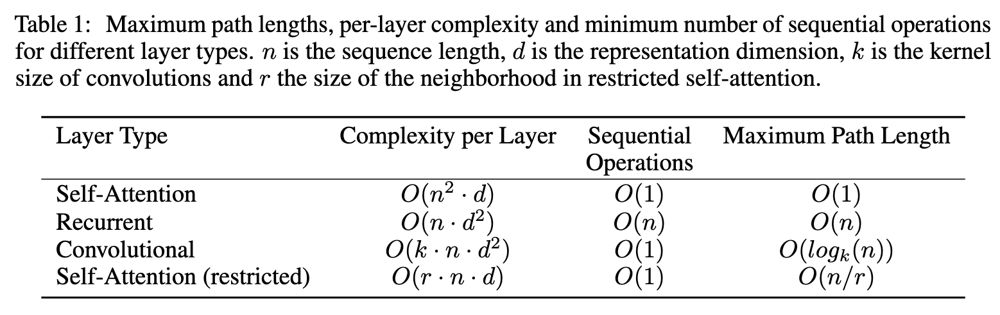
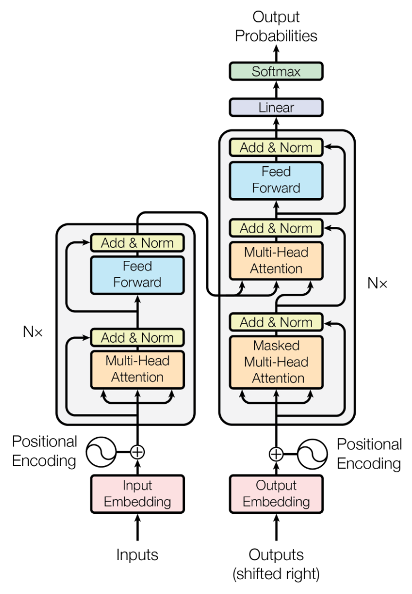
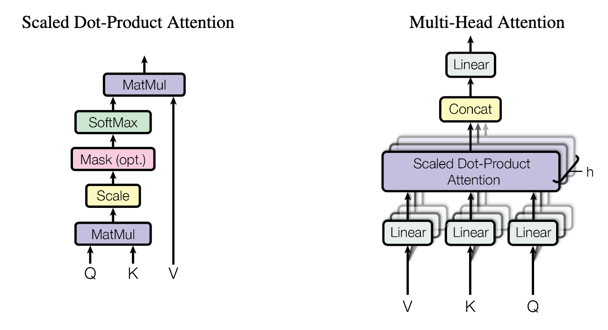
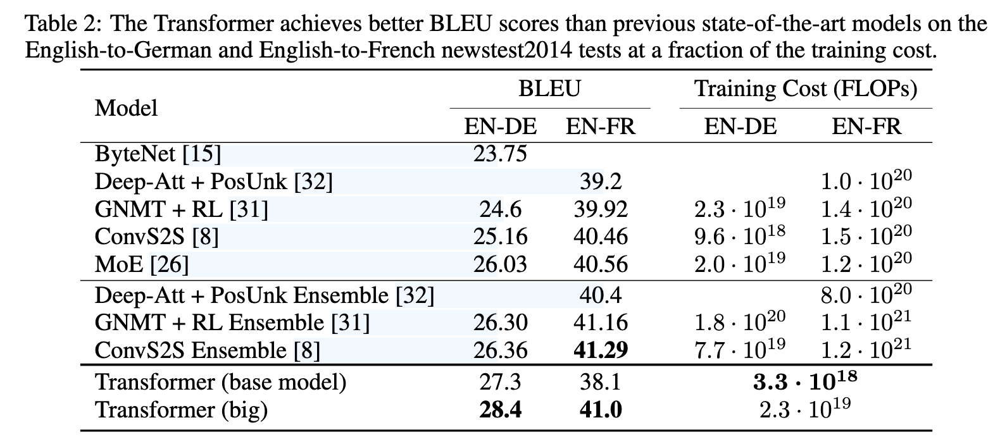
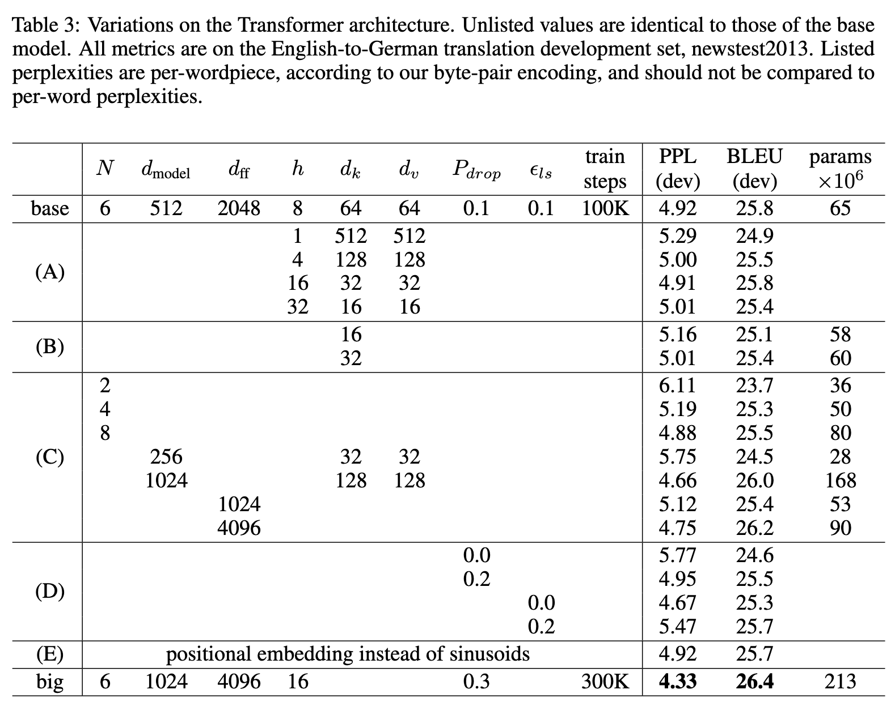

---
tags:
- Alg
- Papers
- LLM
include:
- math
---

# Transformer

2017年发表的《Attention is All Your Need》大概是最近AI领域十年最重要的文章之一了。值得精读。

- 首先要读的当然是原文：[Attention is All Your Need](https://arxiv.org/abs/1706.03762), NIPS 2017
- 最早引入注意力机制的文章也值得一看：[Neural Machine Translation by Jointly Learning to Align and Translate](https://arxiv.org/abs/1409.0473), ICLR 2015
    - 又是Bengio，无处不在
- 如果你对seq2seq模型不熟悉，还可以去看看这篇博客：[Sequence to Sequence (seq2seq) and Attention](https://lena-voita.github.io/nlp_course/seq2seq_and_attention.html#attention_intro)
    - 图文并茂，通俗易懂，神仙博客😭

## 简介

在此之前，最好的seq2seq模型是RNN或者CNN，它们通常都使用Encoder+Decoder的架构，SOTA的模型还会引入注意力机制。

既然注意力机制如此有效，作者干脆提出了一个**完全基于注意力机制的模型**，抛弃了RNN的架构设计了一种全新的Transformer架构。

## 背景



上图对比了本文的自注意力机制和传统的RNN以及CNN之间的差异。

### RNN的问题

RNN模型很好，它是针对序列数据设计的，效果其实还不错。但它有一个致命的问题：太慢了！循环的设计就决定了它必须**顺序计算**每一个隐状态，这就快不了。

### CNN的问题

也有一些工作使用CNN架构结合RNN的思路来**减少顺序计算，更多地使用并行计算**，以此提高计算效率（Extended Neural GPU [20], ByteNet [15] and ConvS2S [8]），不过CNN也存在一些问题，它是为了图像设计的，卷积核限制了视野。如果序列很长，通常需要很多层才能够完成全局信息的提取。

### 自注意力机制

自注意力机制（Self-Attention），有时也称为内部注意力机制（Intra-Attention），是一种注意力机制，用于关联同一序列中不同位置的元素，以便计算该序列的表示。自注意力机制已被成功应用于多种任务中，包括阅读理解、抽象式文本摘要、文本蕴含以及任务无关的句子表示学习等。

不过在此之前，注意力机制通常是RNN或者CNN的附加品。Transformer则完全基于自注意力机制构建。

## 模型

### 架构

Transformer模型的架构如下图所示：

<figure markdown>

{width=400}

<figurecaption>模型架构</figurecaption>
</figure>

Transformer是为了seq2seq任务设计的。以机器翻译任务为例，它输入源语言，输出目标语言。

具体而言，模型分为Encoder和Decoder，其中Encoder用于编码源语言，编码完成之后输送到Decoder中。Decoder则根据已经生成的序列预测下一个token。

### 训练方式

在训练的过程中，采用shifted right的方式逐个生成目标语言token：

例如：

- Encoder输入：`我爱你`
- 第1次Decoder输入:`<START>`, 输出: `i`
- 第2次Decoder输入:`<START> i`, 输出: `love`
- 第3次Decoder输入:`<START> i love`, 输出: `you`
- 第4次Decoder输入:`<START> i love you`, 输出: `<END>`

Transformer训练的时候还使用了Label Smoothing（学习目标为软标签）以及Residual Dropout（每一个残差链接都有一定的概率被置0）这两个正则化技术。

### 核心组件

| 组件                | 解决的问题                          | 关键优势                          |
|---------------------|-----------------------------------|----------------------------------|
| 自注意力            | 长距离依赖、并行化                 | 直接建模任意词对关系              |
| 多头注意力          | 单一注意力模式的局限性             | 多视角捕捉特征                    |
| 位置编码            | 自注意力缺乏顺序感知               | 显式注入位置信息                  |
| 残差连接 + LayerNorm| 深层网络训练不稳定                 | 梯度流畅传播                      |
| FFN                 | 注意力层的线性局限                 | 引入非线性变换                    |
| 编码器-解码器       | 序列到序列任务（如翻译）           | 分离上下文编码与生成              |

#### 多头自注意力机制

Transformer选取的注意力机制是乘性（scaled dot-product）注意力机制，基于矩阵乘法可以高效地并行计算。

> 换言之其实也有加性注意力机制，不过他们没选，因为乘性的计算效率高得多。

计算方式如下：

$$
\text{Attention}(Q,K,V) = \text{softmax}(\frac{QK^T}{\sqrt{d_k}})V
$$

其中QKV分别代表query, key, value

你可以把它想象为一个查询任务，给定Q和K我们计算每一个q和每一个k之间的相似性，得到一个得分，然后使用这个得分对V进行加权。

??? question "Q,K,V哪来的？"
    假设我们输入的序列长度为`seq_length`，词嵌入的纬度为`d_embedding`，batch大小为`batch_size`，也就是：

    ```
    x.shape = (seq_length, batch_size, d_embedding)
    ```

    我们会用一个线性变换分别计算出QKV：
    
    $$
    Q = W_qx\\\\
    K = W_kx\\\\
    V = W_vx
    $$

    其中
    ```
    W_q.shape = W_k.shape = (d_k, d_embedding)
    W_v.shape = (d_v, d_embedding)
    ```
    
    > `d_k`和`d_v`是超参数，通常取成同一个值`d_model`。
    
    ```
    Q.shape = K.shape = (seq_length, batch_size, d_k)
    V.shape = (seq_length, batch_size, d_v)
    ```

??? question "$\sqrt{d_k}$是干什么的？"
    实验表明，在$d_k$比较小的情况下，加性注意力机制和乘性注意力机制表现相当。不过当$d_k$比较大的时候，加性注意力机制表现更好。

    作者**推测**，这是由于随着纬度$d_k$的增加，点积的结果会比较大，从而在softmax计算得分之后进入梯度非常小的区域（饱和），进而导致梯度消失的问题。因此他们加入了$\sqrt{d_k}$这个缩放因子。

??? question "多头注意力？"

    {width=500}

    标准的注意力机制是左侧图示的那样，多头注意力机制则如右图所示。具体来说我们引入了一个超参数$h$，它代表头的数量。

    多头注意力的计算方式如下：
    $$
    \text{Multi-headAttention}(Q,K,V) = \text{Concat}(\text{head}_1, \text{head}_2, \cdots, \text{head}_h) W^O
    $$

    其中每一个头都是带缩放的乘性注意力机制：

    $$
    \text{head}_i = \text{Attention}(QW_i^q, KW_i^k, VW_i^v)
    $$

    几个权重矩阵的纬度如下：
    ```
    W_i^q.shape = (d_model, d_k)
    W_i^k.shape = (d_model, d_k)
    W_i^v.shape = (d_model, d_v)
    W^O.shape = (d_v*h, d_model)
    ```

    这里的$d_{\text{model}}$是从原始embedding投影到QKV的纬度，$d_k=d_v=d_{\text{model}} / h$是每个头上分到的纬度。

    换言之，我们先把原始embedding投影到QKV，然后把QKV投影到比较小的子空间计算注意力得分，最后再Concat到一起。

??? question "注意力是如何用在Transformer模型中的？"
    观察Transformer的架构图不难发现，有三个地方使用了注意力机制。

    - 首先是Encoder模块中，使用了**多头注意力机制**对源输入（src）进行了编码。
        - 这个地方就是标准的多头注意力，比较简单
    - 其次是在Decoder模块中，使用**带掩码的多头注意力机制**对目标输出（tgt）进行了编码。
        - 为了不产生信息泄漏问题，我们需要把目标token之后的序列都遮住
        - 实现的方式就是在softmax计算之前加上一个$-\infty$的mask：$\text{softmax}(\frac{QK^T}{\sqrt{d_k}}+ M)V$
    - 最后，还是在Decoder模块中，把Encoder输出的序列作为K和V，把Decoder编码的序列作为Q，使用**交叉多头注意力机制**进行了计算。
        - 这里的KV是Encoder所有Block都计算完成之后留下来的缓存。
        - 这里的Q则是Decoder的每一层都在变化。

#### 残差连接+LayerNorm

残差连接是一个基础的组件，可以在网络比较深的情况下减弱梯度消失和梯度爆炸问题。

残差连接要求输入输出的向量形状完全一致，这一点从上一节多头自注意力机制的计算中可以看到，我们的向量始终保持纬度是`(seq_length, batch_size, d_model)`。

[LayerNorm](https://docs.pytorch.org/docs/stable/generated/torch.nn.LayerNorm.html)也是增加训练稳定性的技术，它区别于[BatchNorm](https://docs.pytorch.org/docs/stable/generated/torch.nn.BatchNorm2d.html)：

```python title="LN和BN的区别"
import torch
import torch.nn as nn

x = torch.randn(4, 3, 256, 256)
# --- BatchNorm2d ---
# 对每个通道计算整个 batch + 空间维度上的均值与方差
bn = nn.BatchNorm2d(num_features=3, affine=True)
y_bn = bn(x)
print("BN:", y_bn.mean(dim=[0, 2, 3]), y_bn.std(dim=[0, 2, 3]))

x = torch.randn(2, 3, 10)
# --- LayerNorm ---
# 对单个样本的所有特征维度计算均值与方差
ln = nn.LayerNorm(normalized_shape=10, elementwise_affine=True)
y_ln = ln(x)
print("LN:", y_ln.mean(dim=2), y_ln.std(dim=2))
```

在Transformer中，形状为`(seq_length, batch_size, d_model)`的tensor，LayerNorm只会作用在`d_model`这一维度，实现每个token单独的归一化。

??? question "为什么要用LN？"
    1. 提高收敛速度，增加训练稳定性。
    2. BN的计算依赖batch size，然而NLP任务中不同句子token数量不一样，无法对齐，因此使用LN更加合适。
    3. BN在不同的batch size下可能会不稳定（动态batch size），并且batch size比较小的时候更加不稳定。LN在推理的时候也更加稳定。
    4. Transformer 中的序列计算是逐 token 并行的，LN中每个 token 的 embedding 在内部被标准化，不会依赖其他 token。

    更多细节可以看文章[LayerNorm](https://arxiv.org/abs/1607.06450)和[BatchNorm](https://arxiv.org/abs/1502.03167)。

#### FFN

为了**引入非线性变换**，增强特征转换能力，加入了FFN:

$$
\text{FFN}(x) = \max(0, xW_1+b_1)W_2+b_2
$$

具体来说，把形状为`(seq_length, batch_size, d_model)`的tensor变为`(seq_length, batch_size, d_ff)`再变回去。通常`d_ff`比`d_model`要大得多。这种“升维→非线性变换→降维”的结构，有助于捕捉复杂模式。

#### 位置编码

注意力机制是排列不变的，对token之间的相互位置关系并不敏感。因此我们需要额外加入位置编码来显式加入token的位置信息。

Transformer使用的位置编码是正余弦，这是一种绝对的、固定的位置编码方式：

$$
PE_{(pos, 2i)} = \sin(pos / 10000^{2i/d_{\text{model}}})\\\\
PE_{(pos, 2i+1)} = \cos(pos / 10000^{2i/d_{\text{model}}})
$$

不过正余弦函数的周期性巧妙蕴涵了相对位置，也允许模型来学习token之间的相对位置。

## 实验

### 性能以及开销



可以看到Transformer用更小的开销实现了更好的性能。

### 超参数探索



从这张表我们可以看到：

1. 头不是越多越好，太多头会导致性能下降。
2. 降低$d_k$会导致性能下降。
3. 模型越大性能越好（废话
4. 可学习的PE和正余弦PE差别不大。
5. Dropout非常有效，可以防止过拟合。
