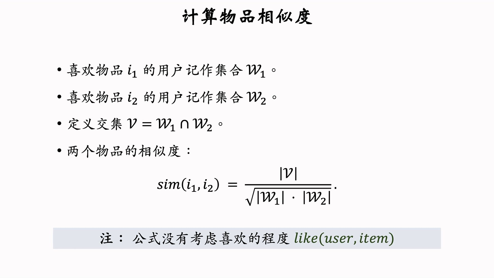
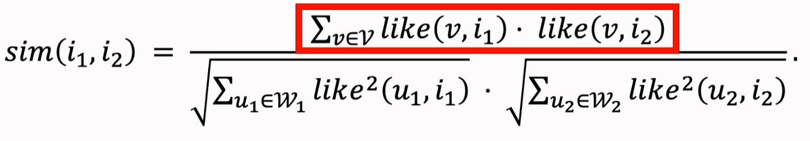
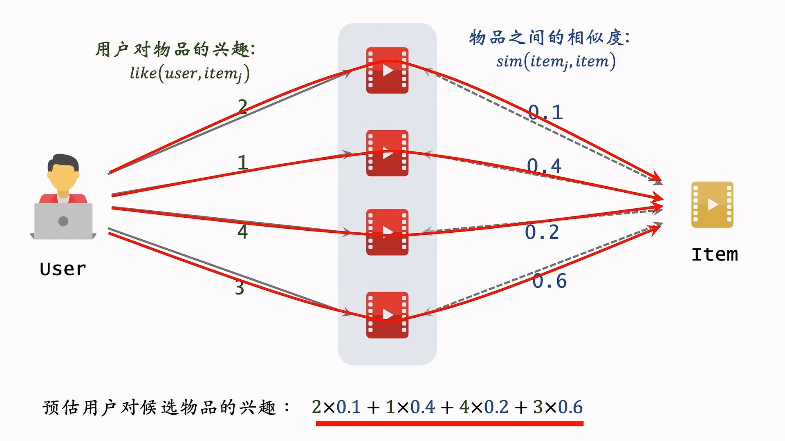
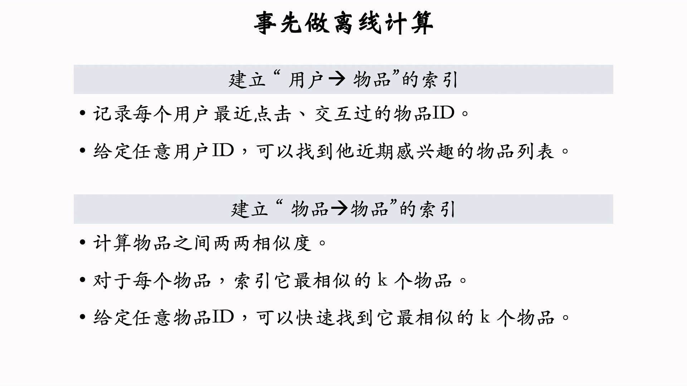
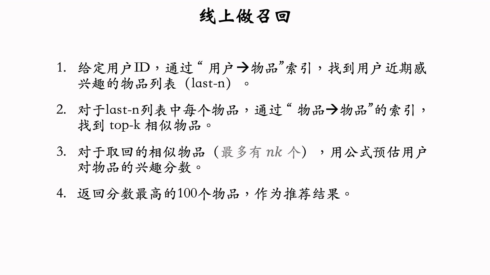

---
tags:
- Alg
- Papers
- 推荐
- 召回
---

# 召回1：ItemCF

核心问题：如何判断Item之间的**相似性**？

- 基于知识图谱：例如两本书同作者
- 基于用户行为

加入喜爱程度的度量（cosine distance）：

ItemCF算法流程：

- 基于用户交互过的物品进行兴趣打分
- 对于候选物品，计算相似性
- 计算兴趣的相似度加权和，作为用户对候选物品的兴趣估计

算法部署流程：

