---
tags:
- Alg
- Papers
- 推荐
- 召回
---

# 召回4：矩阵补充

## 离散特征处理

对于下面这些离散变量，我们需要把他们转换为数值向量方便后续的计算：

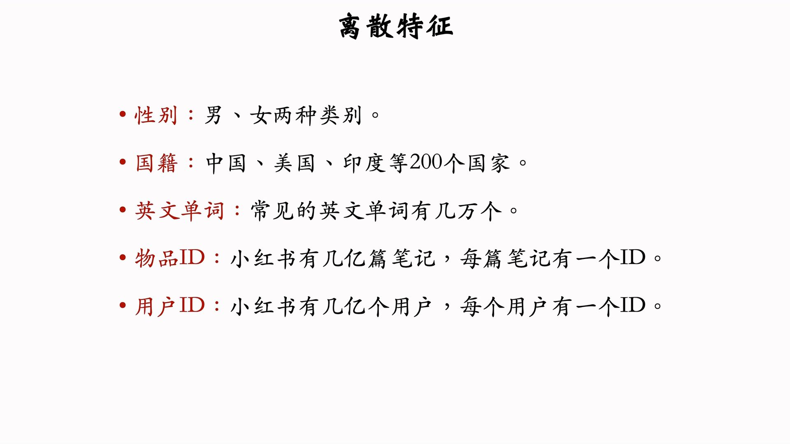
这其实就是NLP中的embedding过程，步骤如下：

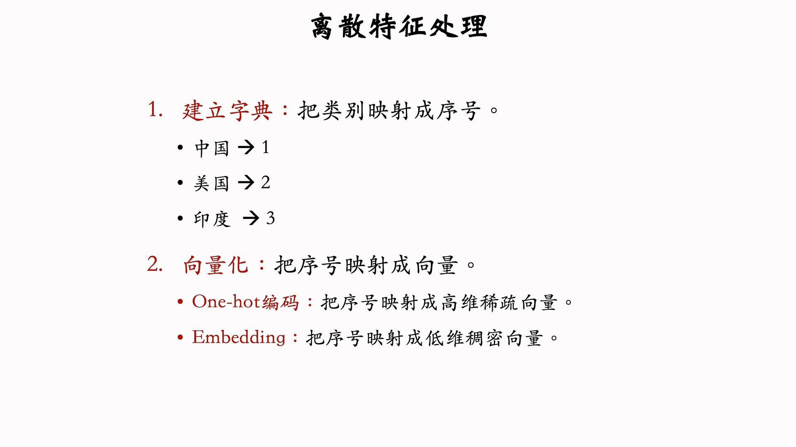

### OneHot编码

例如性别：0,0 = 未知 0,1 = 男 1,0 = 女

显然OneHot会造成维度灾难，对于类别数量很大的变量不适合做OneHot编码。

### Embedding

例如国籍的Embedding：

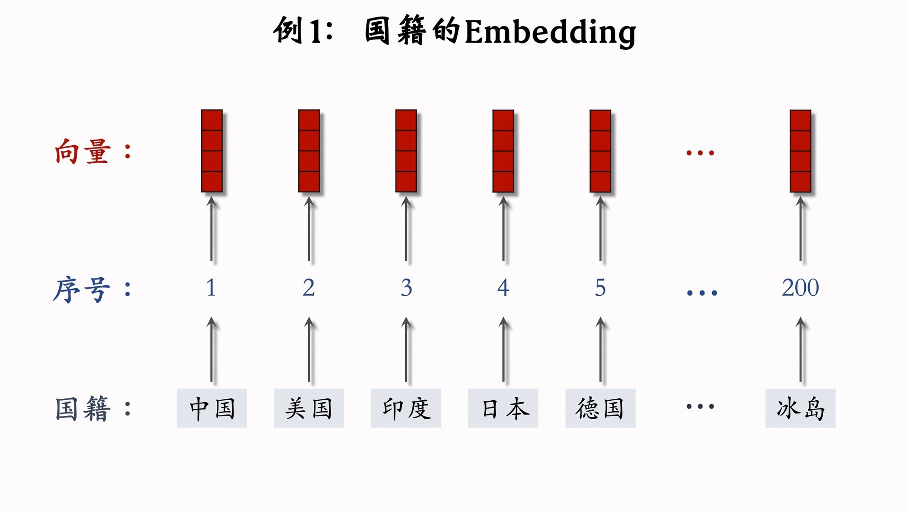
Embedding需要的参数量是：

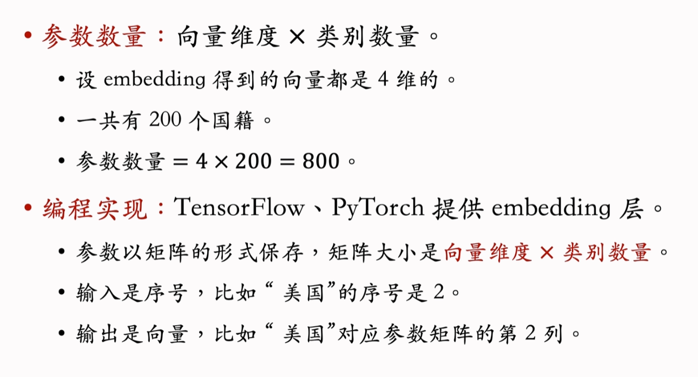
超大规模的模型参数基本都集中在这里，比如物品ID的embedding，维度非常高。

Embedding需要满足一些特征。比较直观的就是相似的物品之间的距离比较接近：

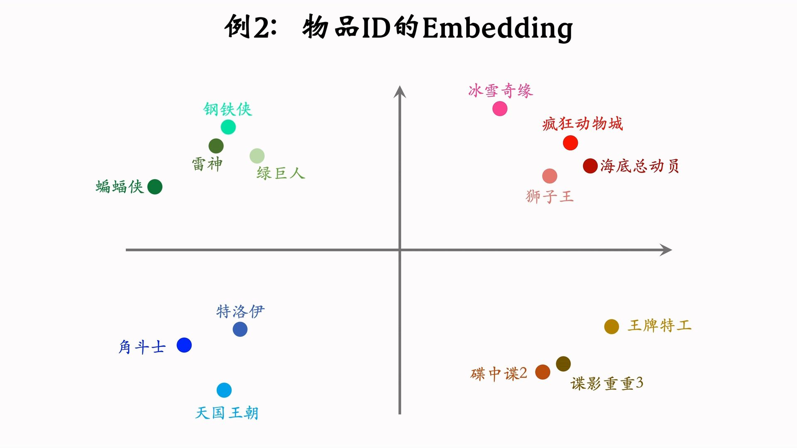

## 矩阵补充模型

基于Embedding我们可以计算用户兴趣的估计：

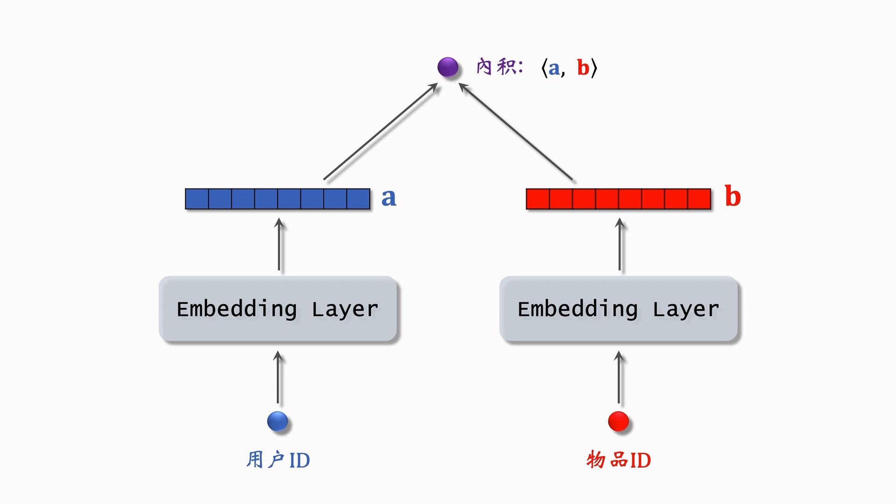
其实就是两个Embedding的内积。上面的过程就叫矩阵补充。

### 模型的训练

嵌入模型的参数就是俩大矩阵：

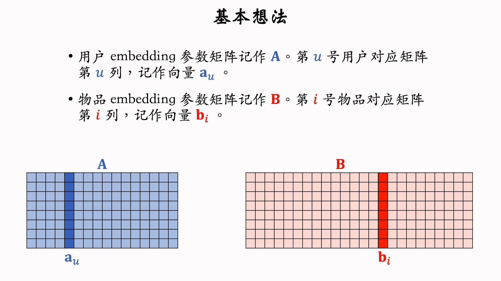
训练的目标就是让我们的**Embedding内积接近用户对物品的真实兴趣**。

数据集可以取自系统的日志：

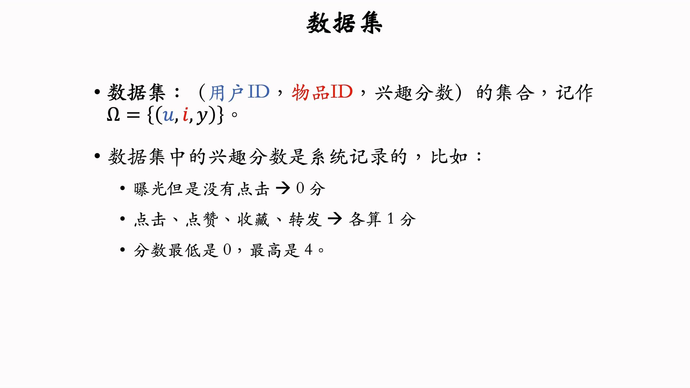
损失函数就是数据集上的预测兴趣分数和真实兴趣分数的差距：

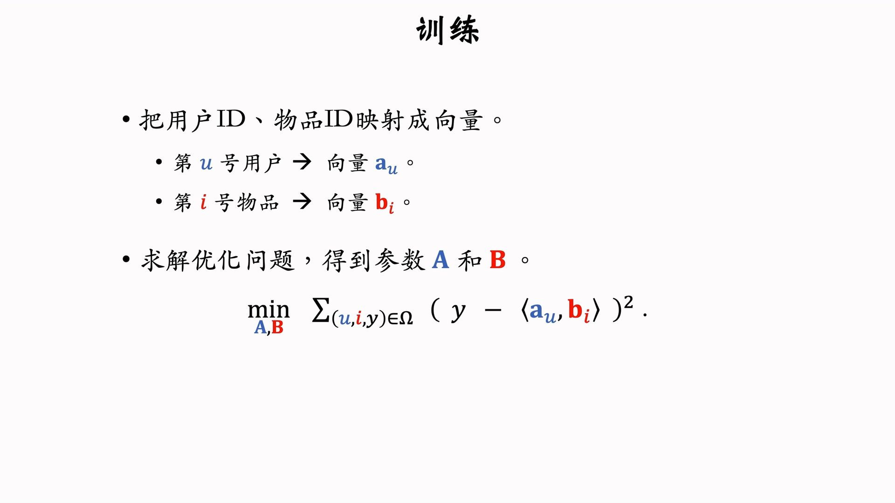

### 矩阵补充的含义

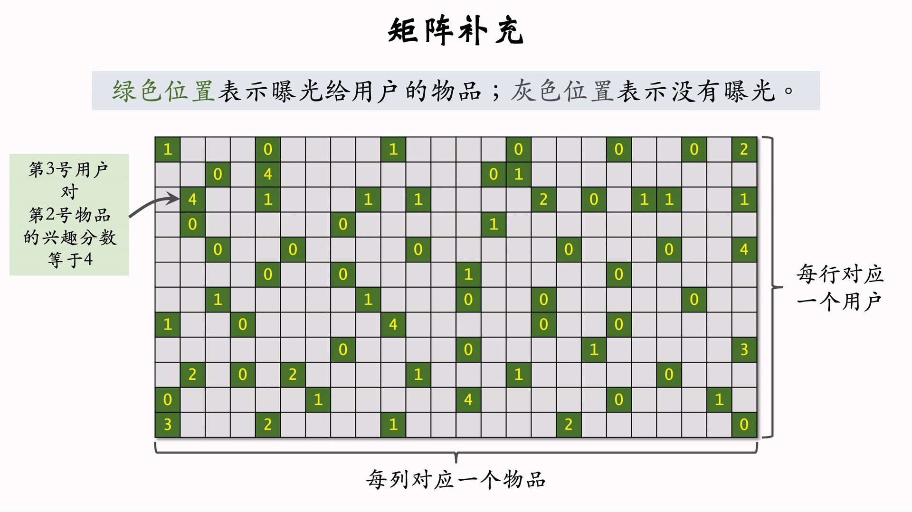

### 矩阵补充的问题

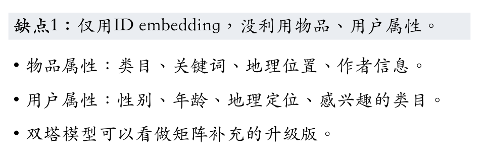

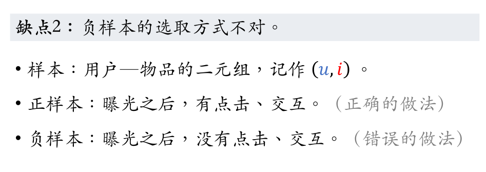

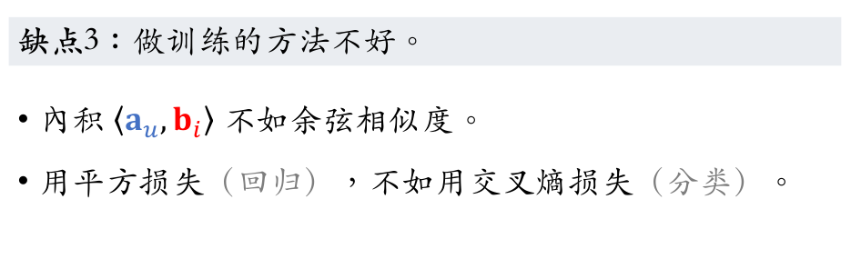
正负样本选取的问题后续会专门讨论。

### 模型部署

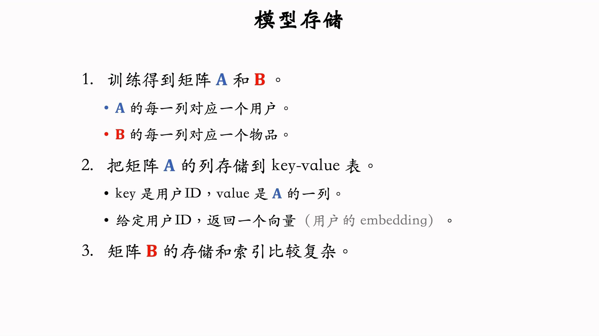

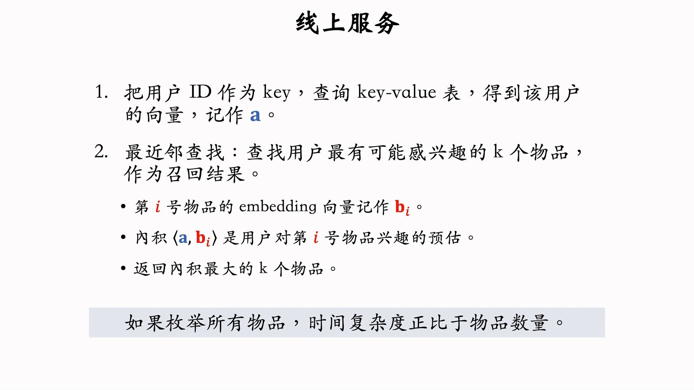
加速KNN的方法（[向量数据库](https://en.wikipedia.org/wiki/Vector_database)？）：

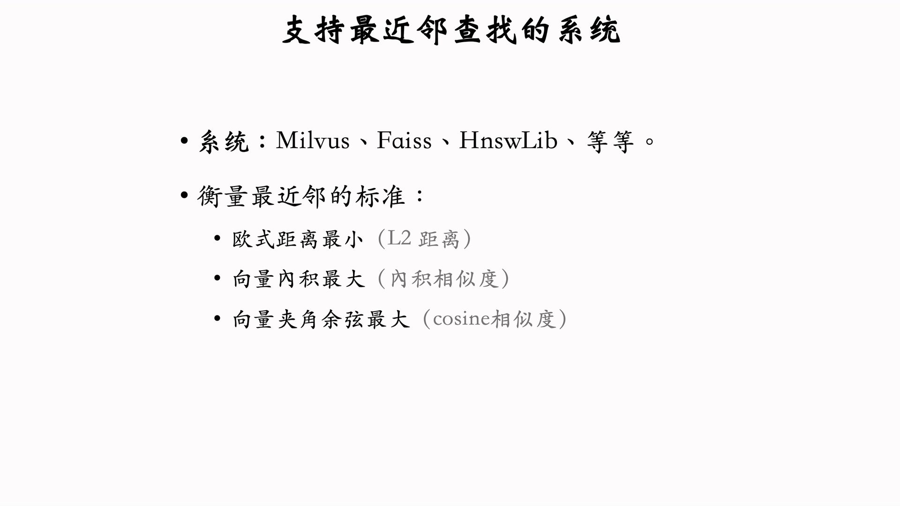
我们提前把数据库中的物品进行聚类，给每个分区一个索引（对于余弦相似度，分区就是扇形的；对于L2距离，分区就是正方形的？）。

那么在寻找a的近邻时，只需要在分区内查找就行了。

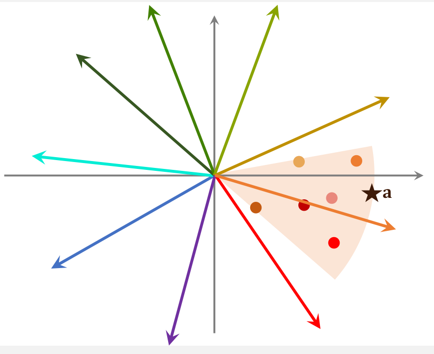
