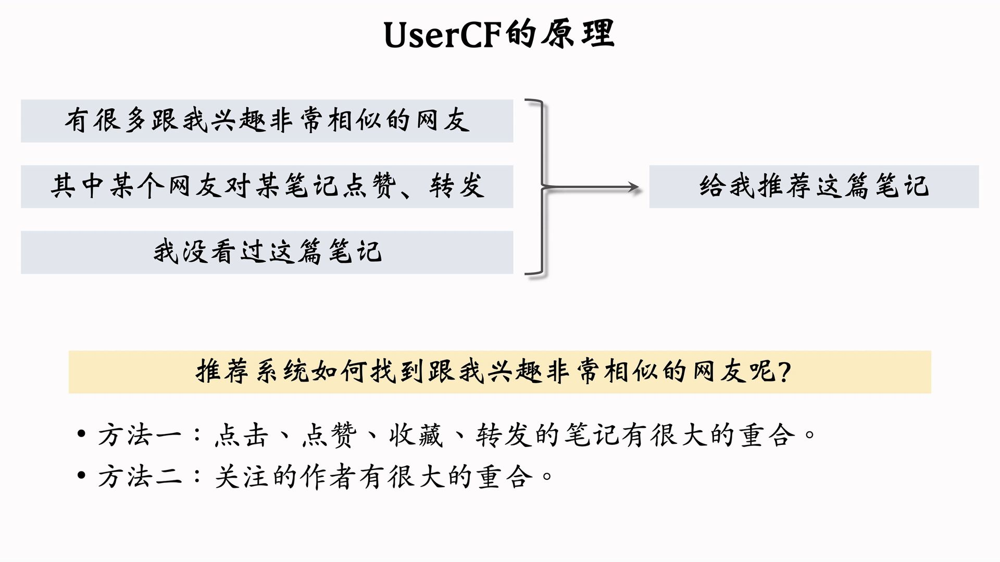
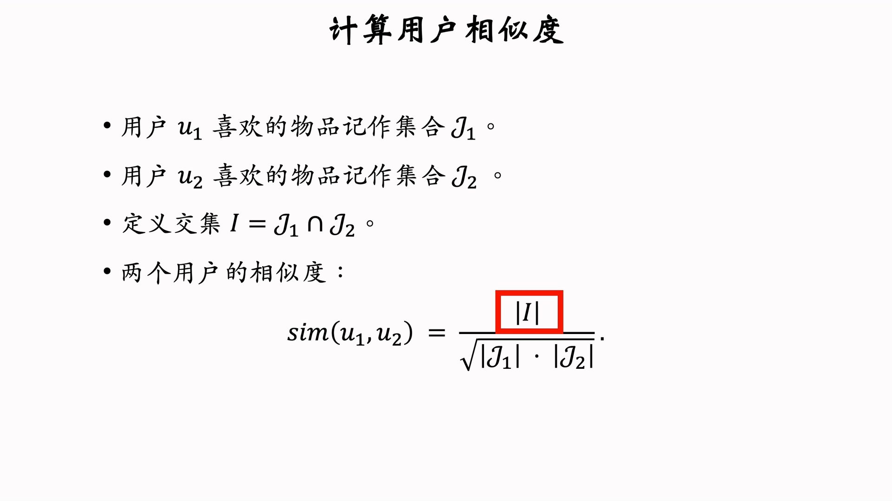
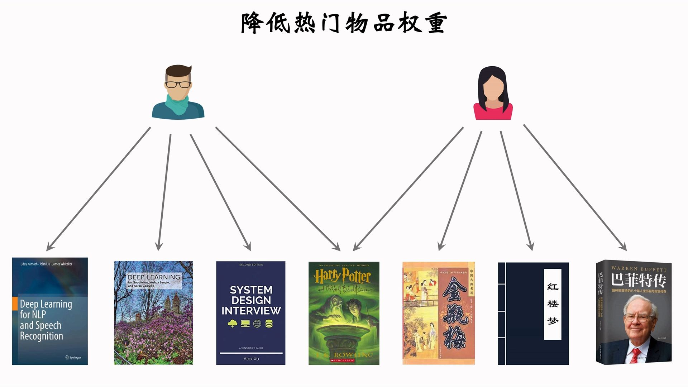
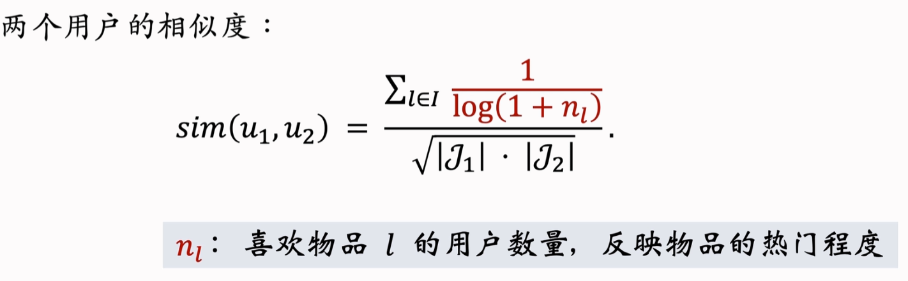
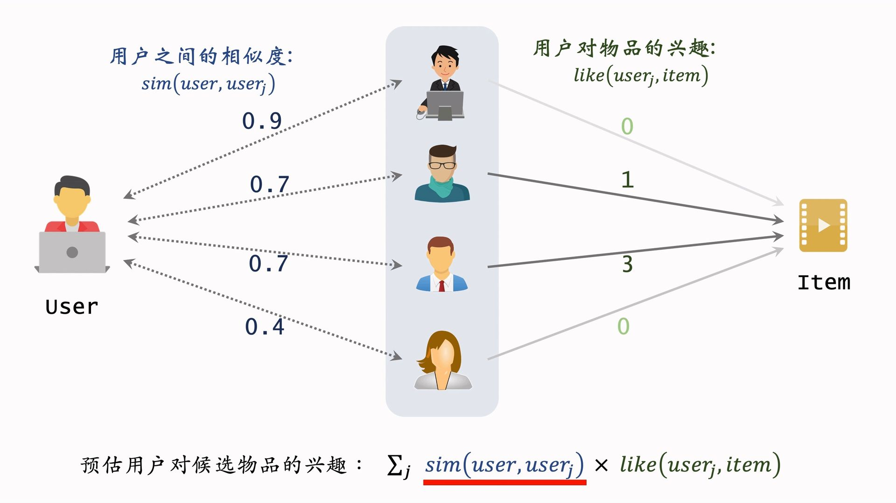
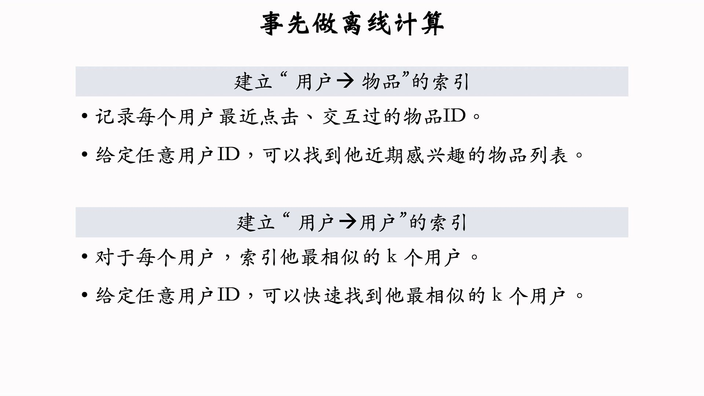
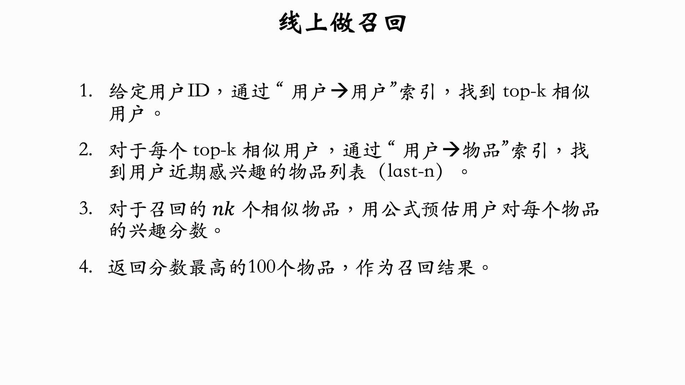
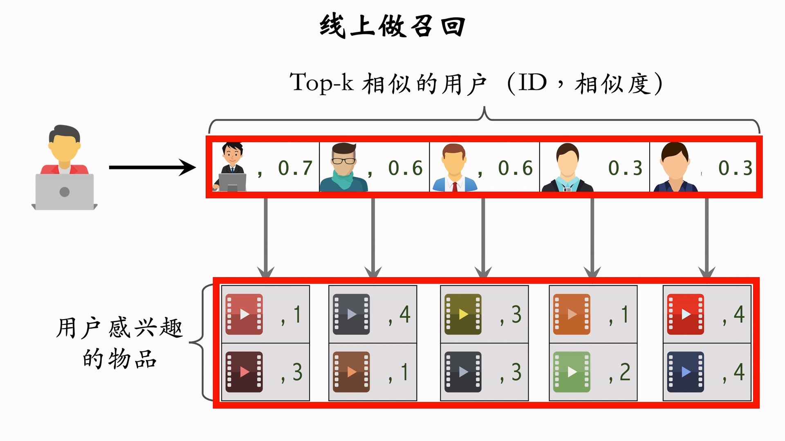

---
tags:
- Alg
- Papers
- 推荐
- 召回
---

# 召回3：UserCF

核心想法：基于用户之间的相似性，给相似的用户推荐相似的内容

## 用户相似度的计算

基于共同喜欢的物体来计算相似度：

**热门的物品**对计算相似度没有贡献，所以我们需要降低这些物品的权重：

修正后：

## 召回方法

## 算法部署流程

召回的过程其实比较直观：

