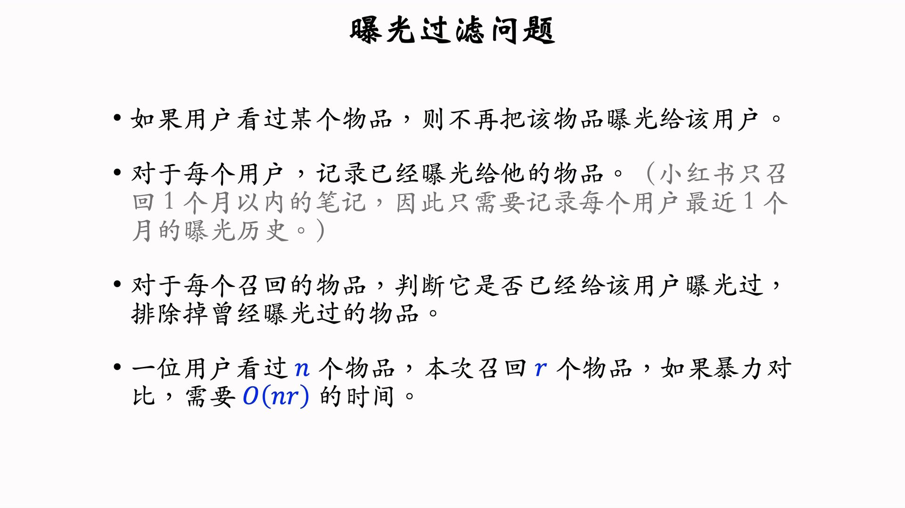
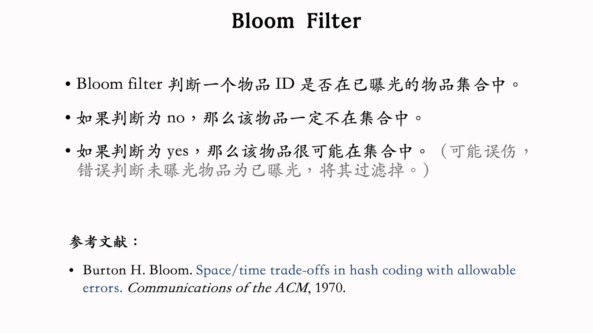
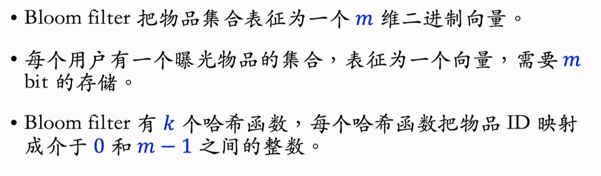
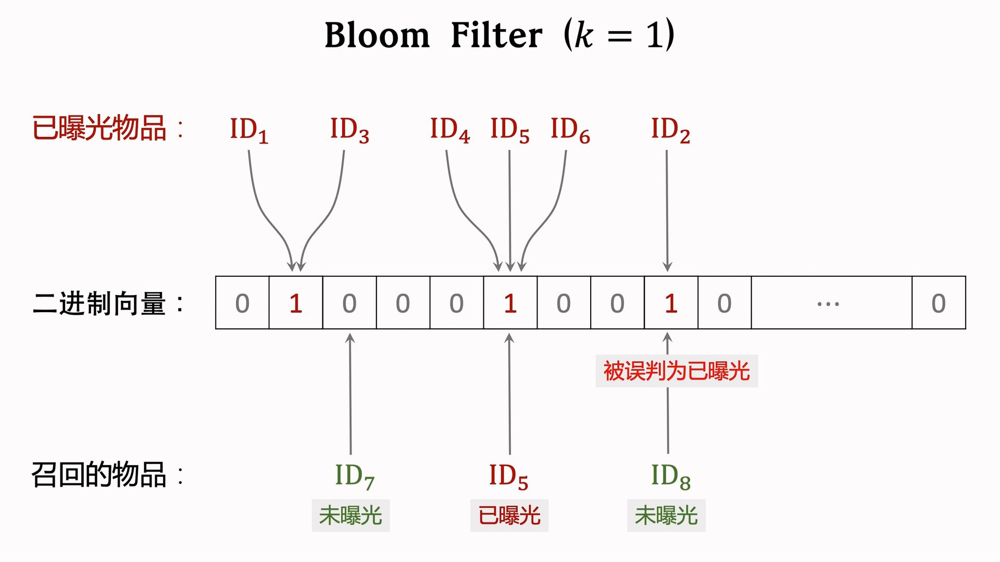
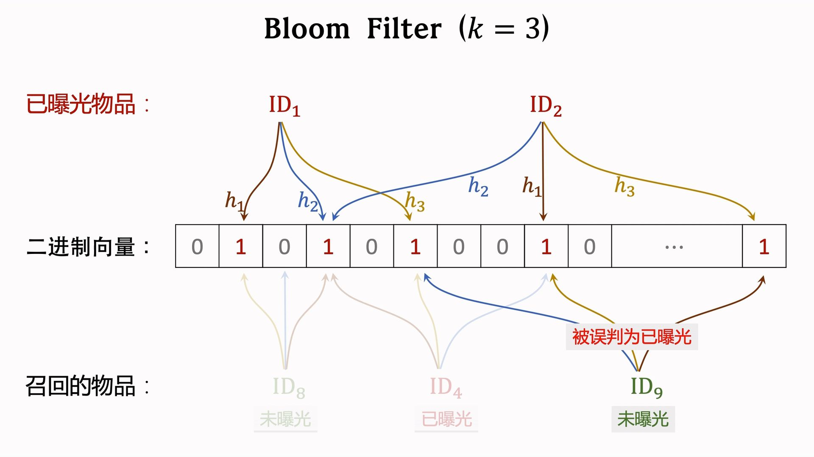
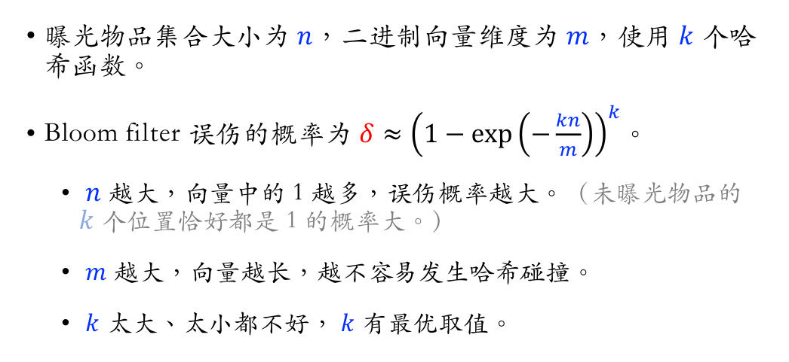
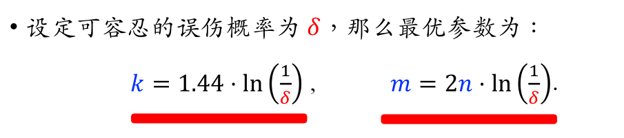
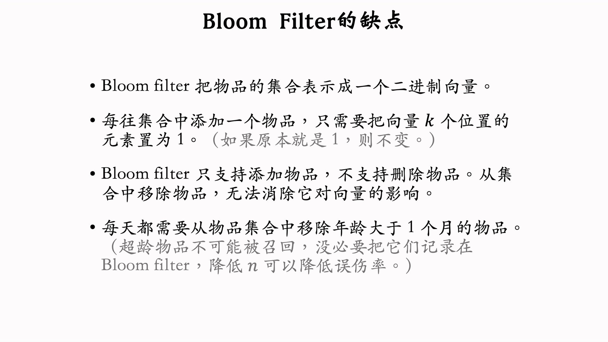
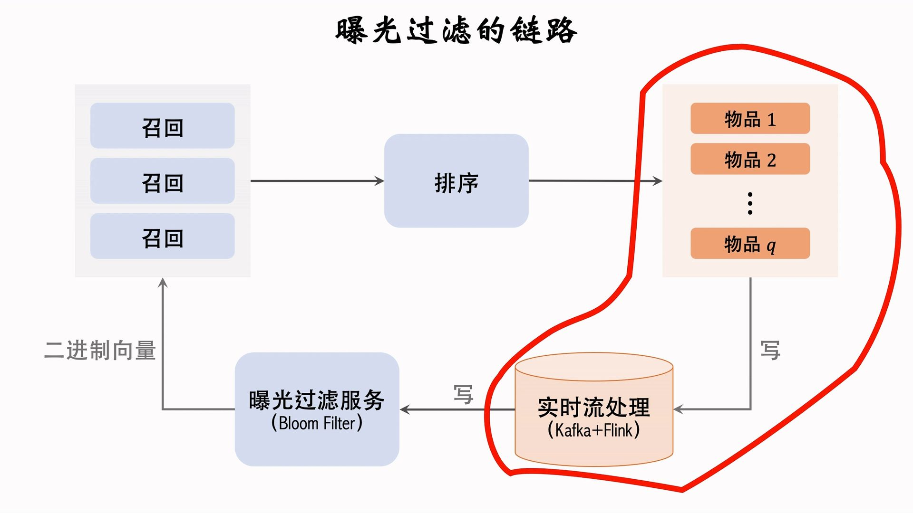

---
tags:
- Alg
- Papers
- 推荐
- 召回
---

# 召回8：曝光过滤

> YouTube不使用曝光过滤！！所以老是刷到重复的视频。

## bloom filter

[bloom filter](https://dl.acm.org/doi/10.1145/362686.362692)是一种专门为此设计的算法：

### 算法

其实就是把物品ID通过hash函数映射到一个二进制。最简单的情况就是使用一个hash函数：

使用多个hash，只要有一个0就说明没有曝光过：

### 误判的概率

### 缺点

最大的问题就是无法删除指定的物品：

> 小红书规则：不会刷到超过一个月的笔记？
>
## 曝光过滤的链路

处理必须要快，因为用户刷新很快。需要用实时流处理，否则会出现重复曝光的情况：

