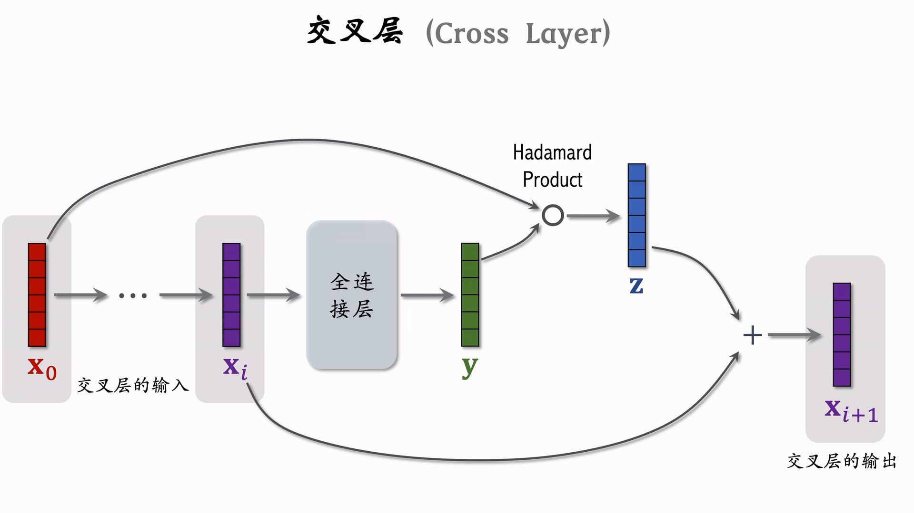
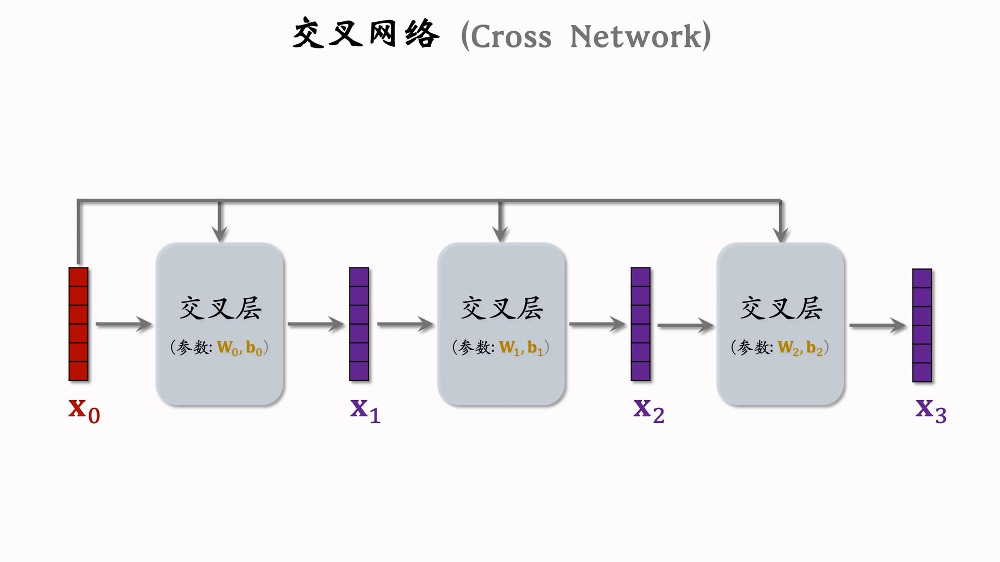
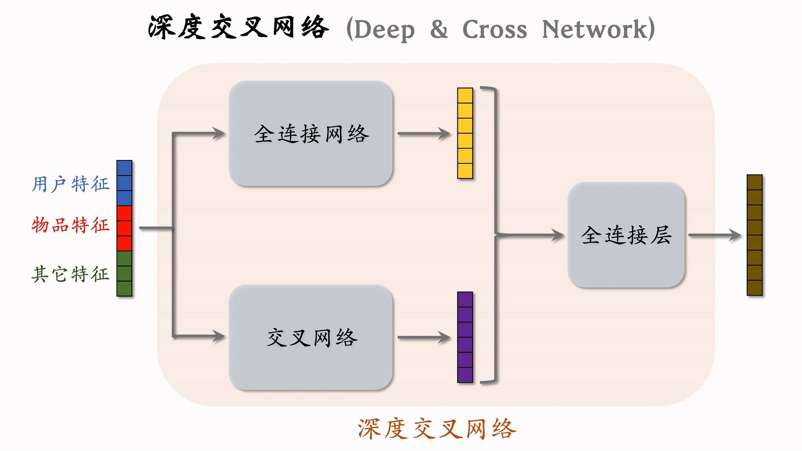

---
tags:
- Alg
- Papers
- 推荐
- 特征工程
---

# 特征交叉2：DCN
>
> 深度交叉网络

此前的召回模型、排序模型中有非常多的神经网络组件（例如双塔模型的两个塔），实际上可以使用任意类型的神经网络。最简单的就是全连接，在推荐系统中使用本节介绍的DCN效果要好得多。

## 交叉层

交叉层类似ResNet中的跳连，可以防止梯度消失：

## 交叉网络
>
> 感觉这个很像是transformer，也有点像是RNN

- [DCN](https://dl.acm.org/doi/abs/10.1145/3124749.3124754)是在2017年ADKDD会议上提出的。
- [DCN V2](https://dl.acm.org/doi/abs/10.1145/3442381.3450078)是在2021年WWW会议上提出的改进版。

老版本的交叉网络基本没人用了。

## 深度交叉网络

DCN已经被工业界广泛认可并且使用。

