---
tags:
- Alg
- Papers
- 推荐
- 召回
---

# 召回6：Deep Retrieval

来自[字节](https://arxiv.org/abs/2007.07203)，和向量召回不同，Deep Retrieval把物品映射为路径。

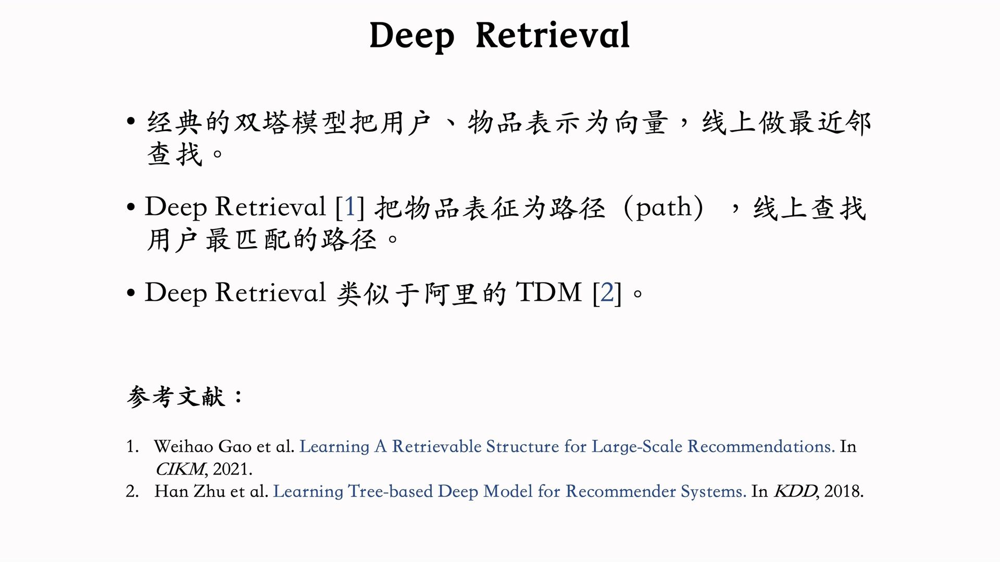

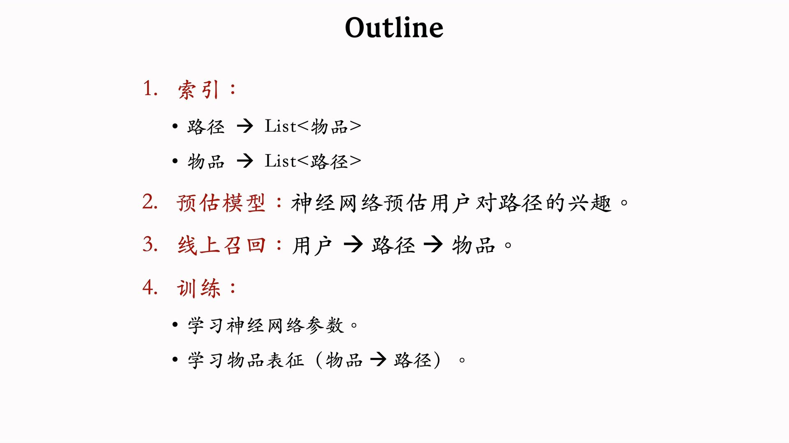

## 索引

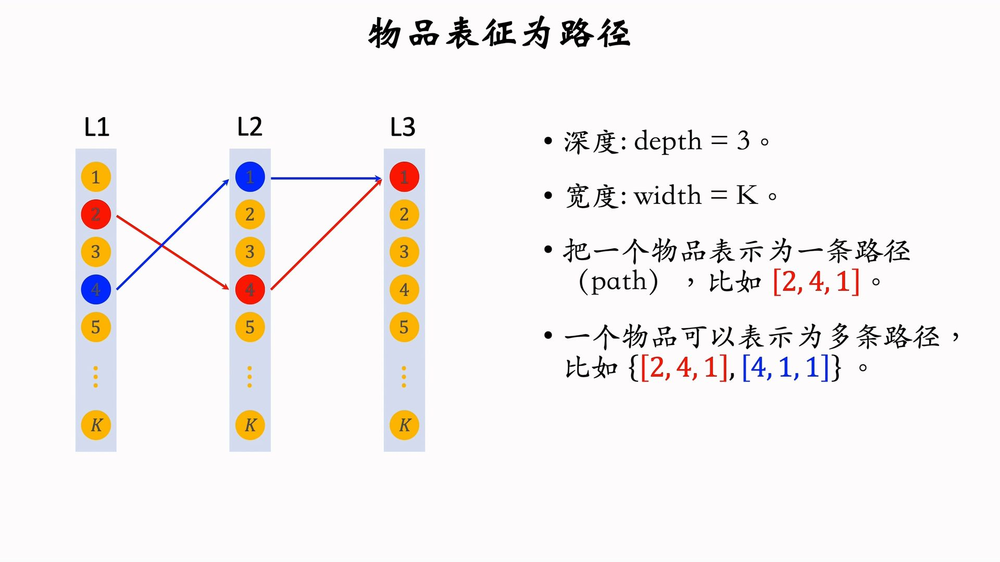

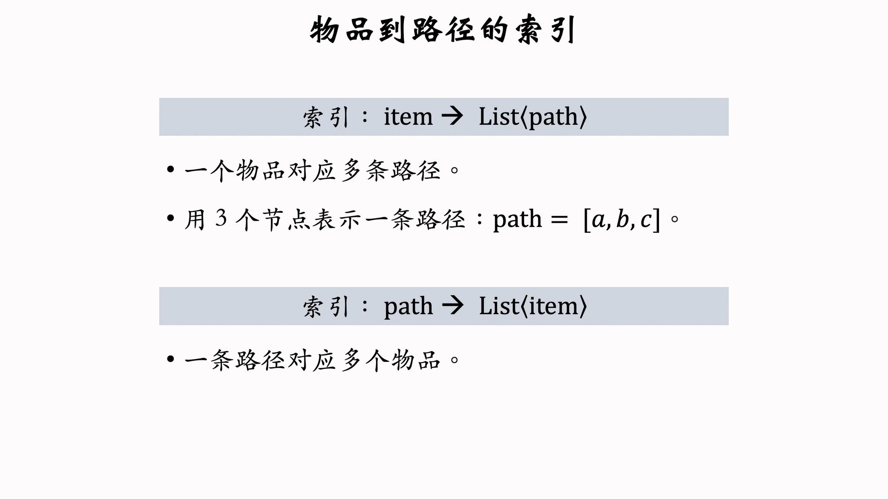
一条路径对应多个物品，就作为线上召回的结果。

> 为什么要搞路径？因为这是字节的文章！**抖音的视频推荐**就是一条路径。

## 预估模型

假设路径长度是3

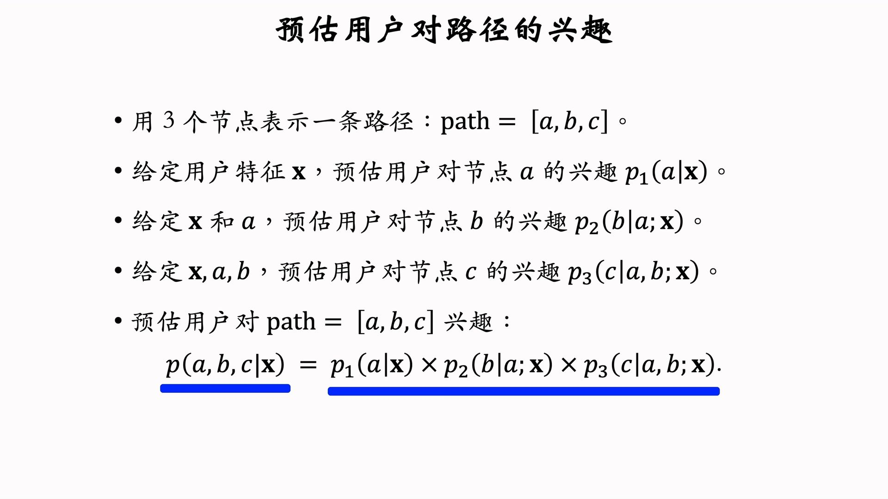
等式右侧的三个条件概率都用神经网络来计算：

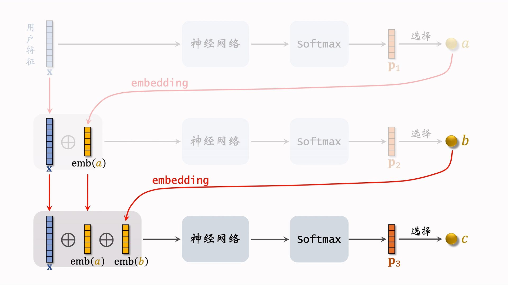

## 线上召回

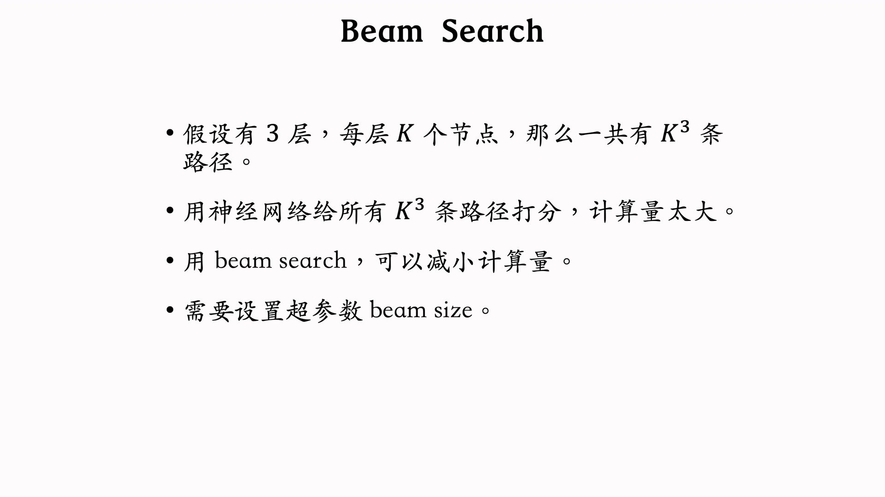

### beam search size=1

相当于贪心算法，每次都考虑最大的一个节点

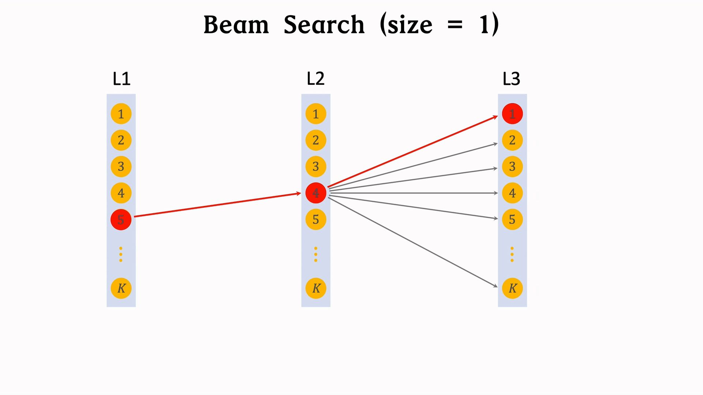

#### beam search size=4

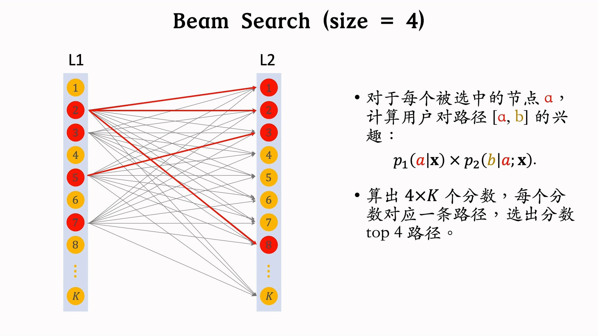

## 模型训练

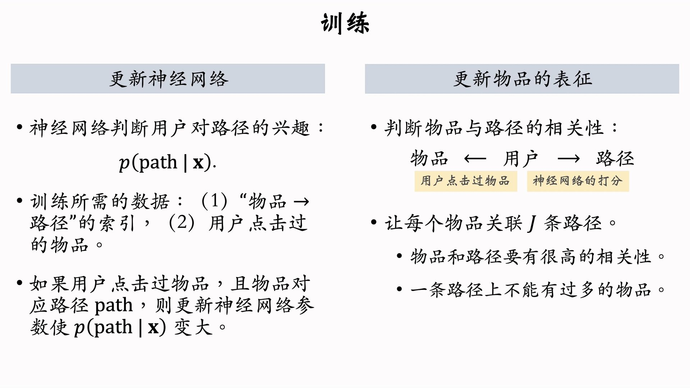

### 神经网络

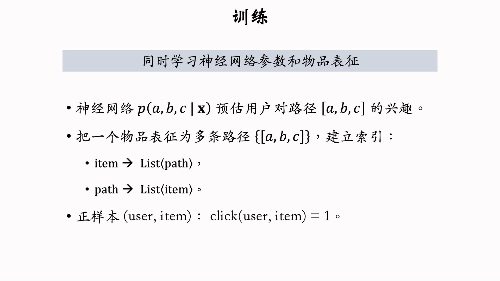

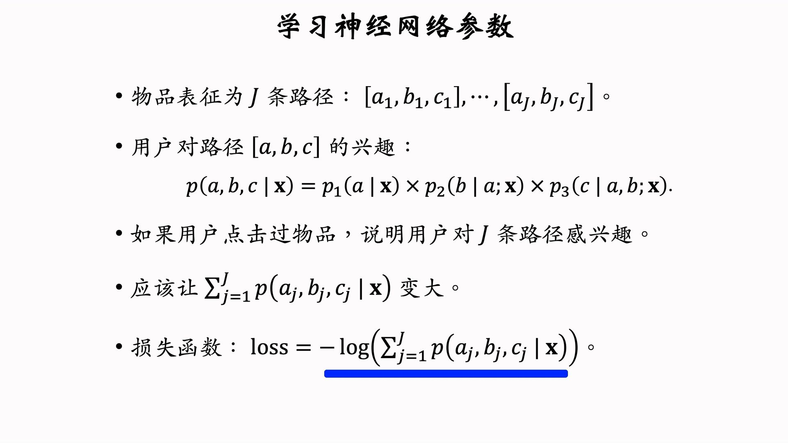

### 物品表征

什么乱七八糟的：

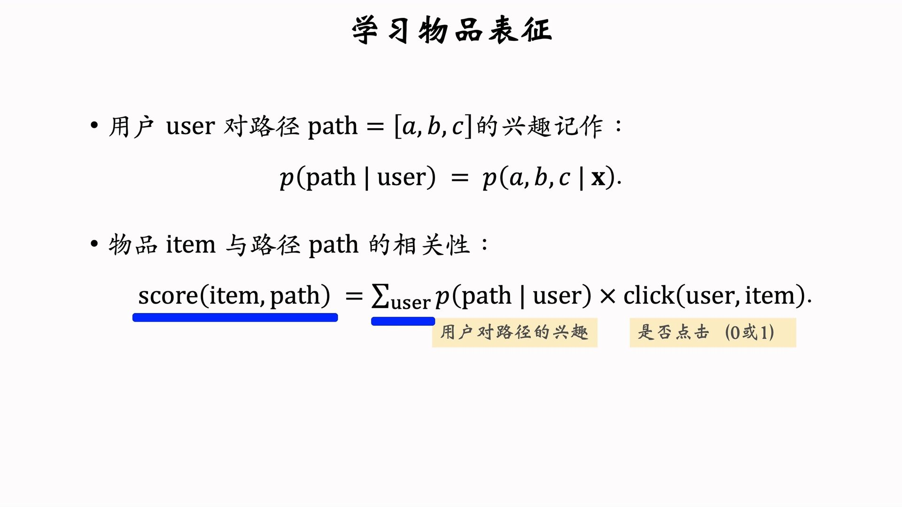

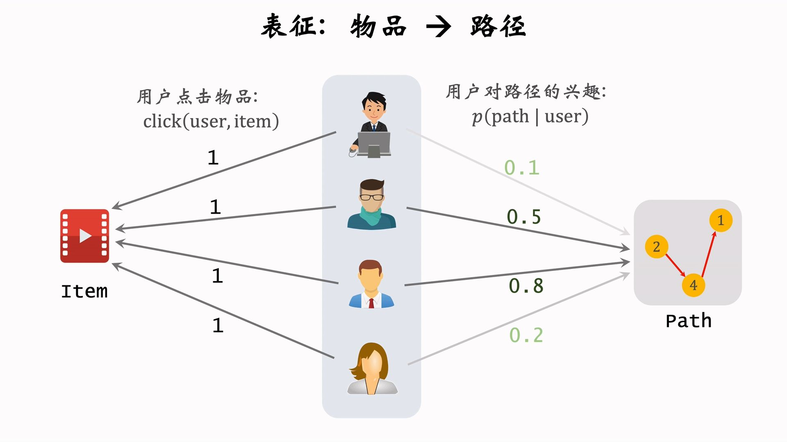

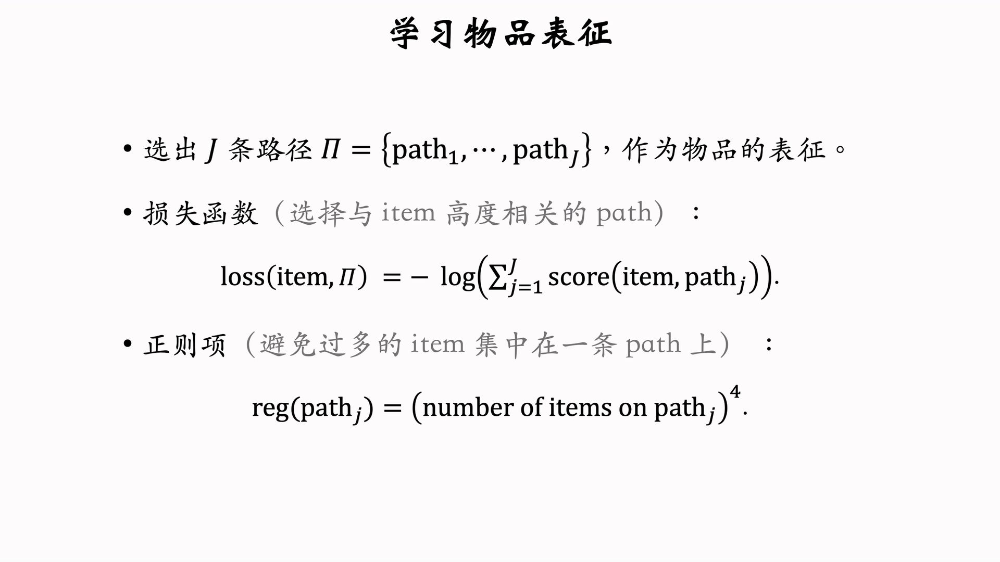
