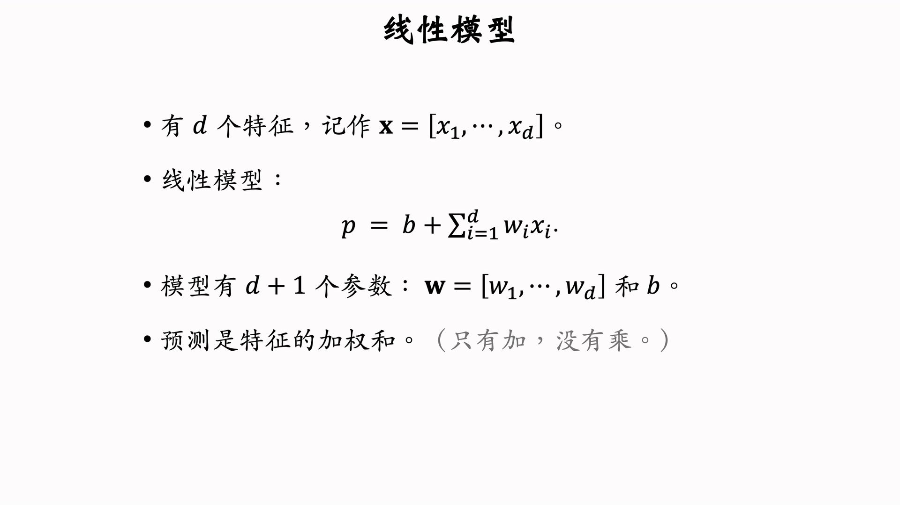
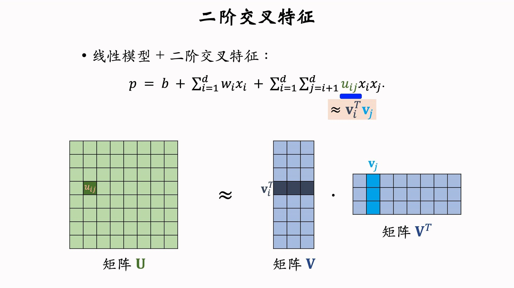
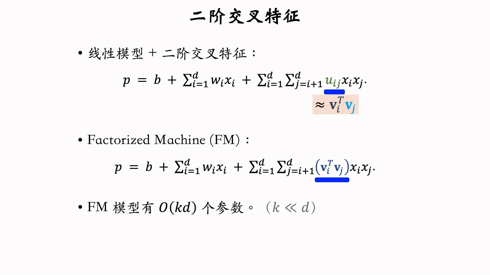
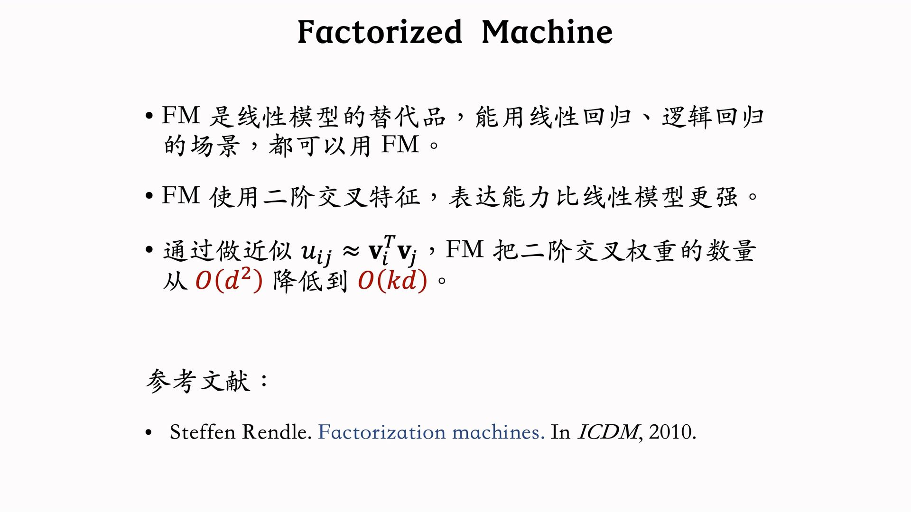

---
tags:
- Alg
- Papers
- 推荐
- 特征工程
include:
- math
---

# 特征交叉1：FM
>
> FM现在不咋用了，了解一下。
特征交叉是把各种特征融合的方法，通过交叉可以引入非线性从而提高模型的精度。特征交叉在召回和排序中都可以应用。

## 线性

## 二阶交叉

直接二阶交叉参数太多了$\mathcal{O}(d^2)$。

参数矩阵U是对称矩阵，用低秩近似。于是我们得到了FM：

[Factorization Machines](https://ieeexplore.ieee.org/abstract/document/5694074)是2010年提出的，想法和做法都比较简单。那个时代的模型还都是线性回归和逻辑回归。

