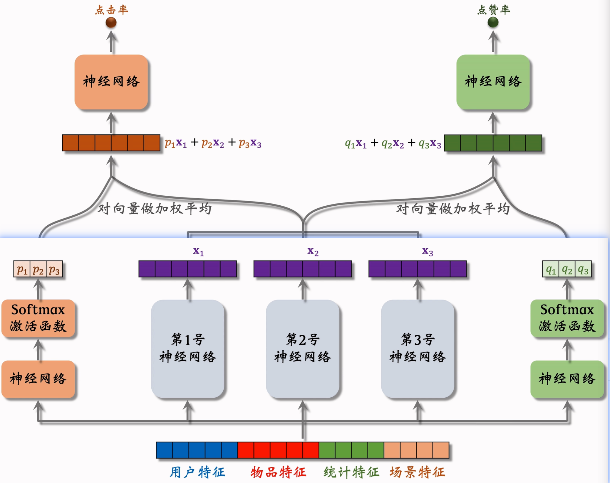
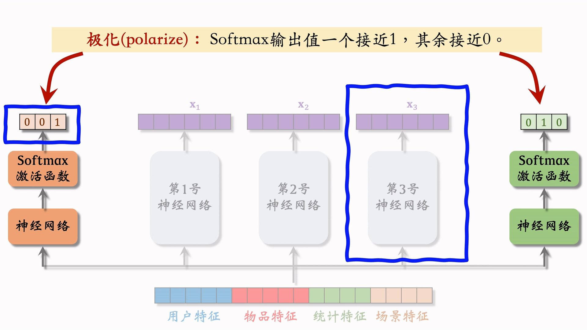
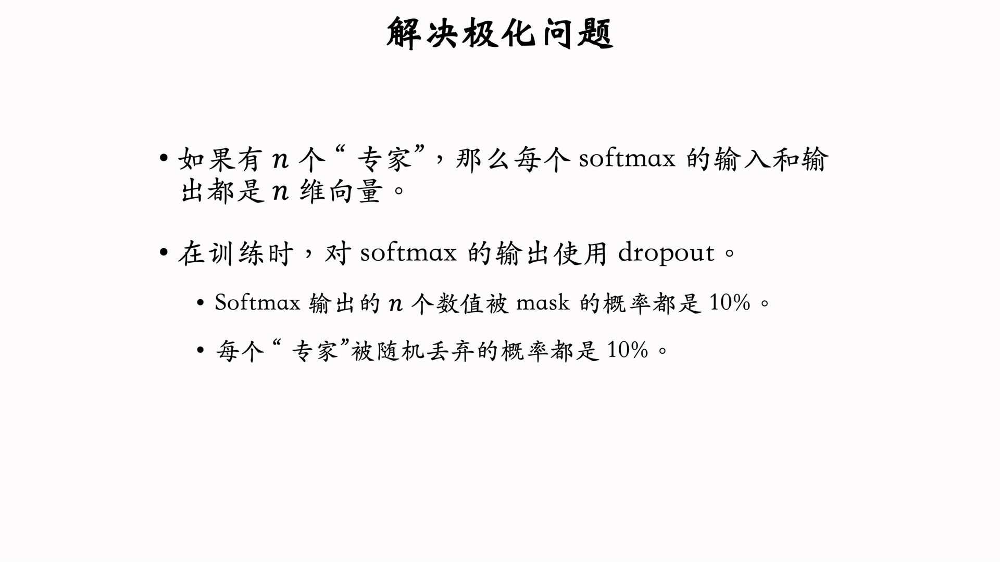

---
tags:
- Alg
- Papers
- 推荐
- 排序
---

# 排序2：MMoE
>
> 多任务混合专家模型！

来自[google](https://research.google/pubs/modeling-task-relationships-in-multi-task-learning-with-multi-gate-mixture-of-experts/)2018年在KDD上的文章：

使用多个专家神经网络提取特征，然后使用加权的特征来预测点击率等指标。

## 极化现象

> 极化现象是2019年[YouTube](https://dl.acm.org/doi/abs/10.1145/3298689.3346997)在RecSys会议上提出的

某个任务可能会趋向于只使用一个神经网络，而不是混合的。

解决方案：dropout

