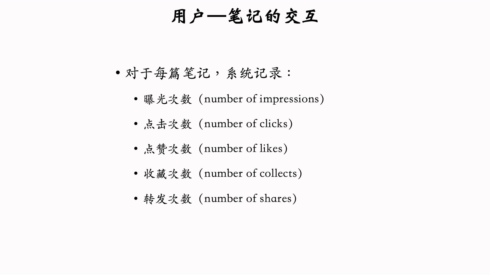
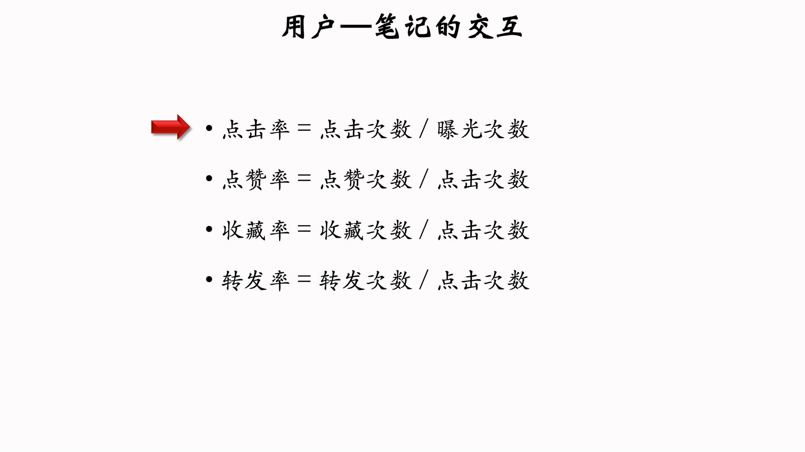
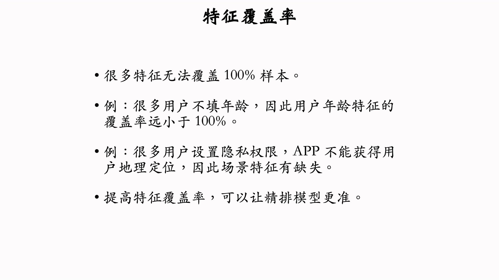

---
tags:
- Alg
- Papers
- 推荐
- 排序
---

# 排序1：多目标排序

## 排序的依据

排序主要依据用户和笔记的交互，因为这是我们推荐的目标。
次数型：

比率型：

排序模型**预估点击率、点赞率、收藏率、转发率**等多种分数，然后融合这些分数。然后根据融合的分数做排序和截断。
融合的方式可以是加权平均，权重就用AB测试调出来。

## 排序用到的特征

特征可以是本来就有的属性（性别），也可以是算法评估的指标（图片美学）。离散特征通常处理为embedding来计算。连续特征有多种处理方式。

> 在实践中，同一个指标的多种变换都会用到。例如对数变换的曝光数和平滑的曝光率会同时作为特征输入模型。
>
### 用户画像

### 物品画像

### 统计特征

### 场景特征

### 特征覆盖率
>
> 其实就是缺失值问题

缺失值的填充也需要考虑。例如年龄、性别的缺失很容易用算法预测进行补齐。

## 多目标模型

使用神经网络提取特征，然后基于特征计算多个输出。

损失函数：交叉熵

## 训练

训练中可能存在非常多的陷阱。例如类别不均衡：

## 校准

为什么需要校准：我们训练的时候降采样会使得模型高估点击率

校准公式：

## 线上服务

线上数据库中，用户画像的压力很小（每次只需要查询一个），但是物品画像的压力很大（每次需要查询数百条）。

