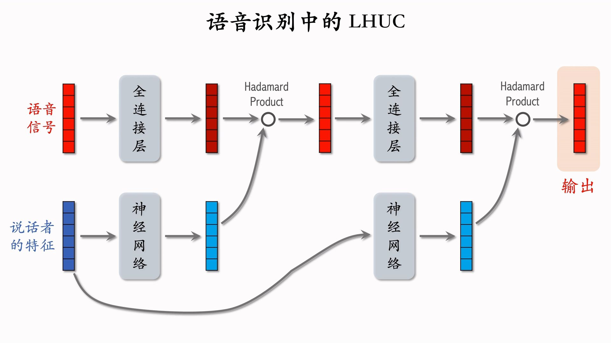
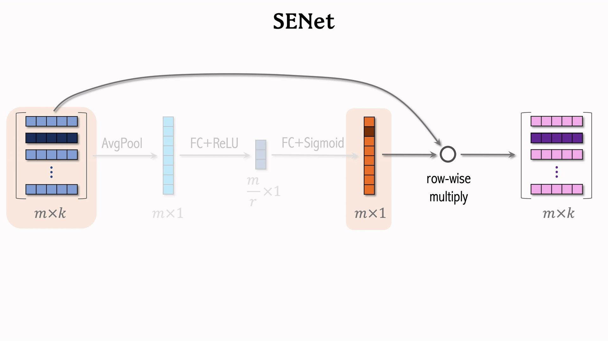
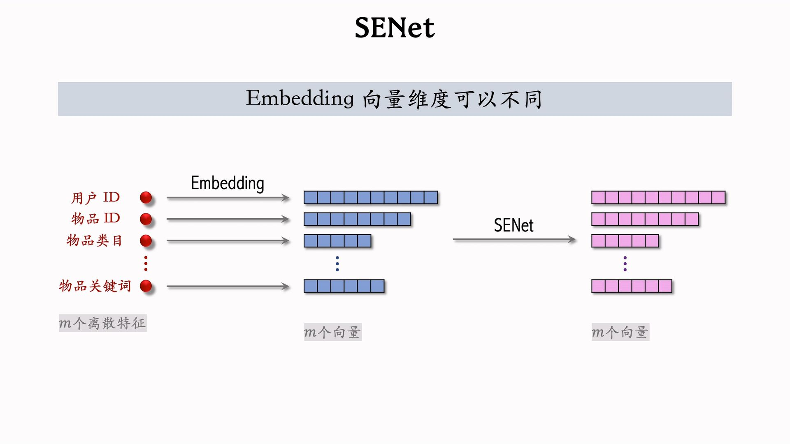
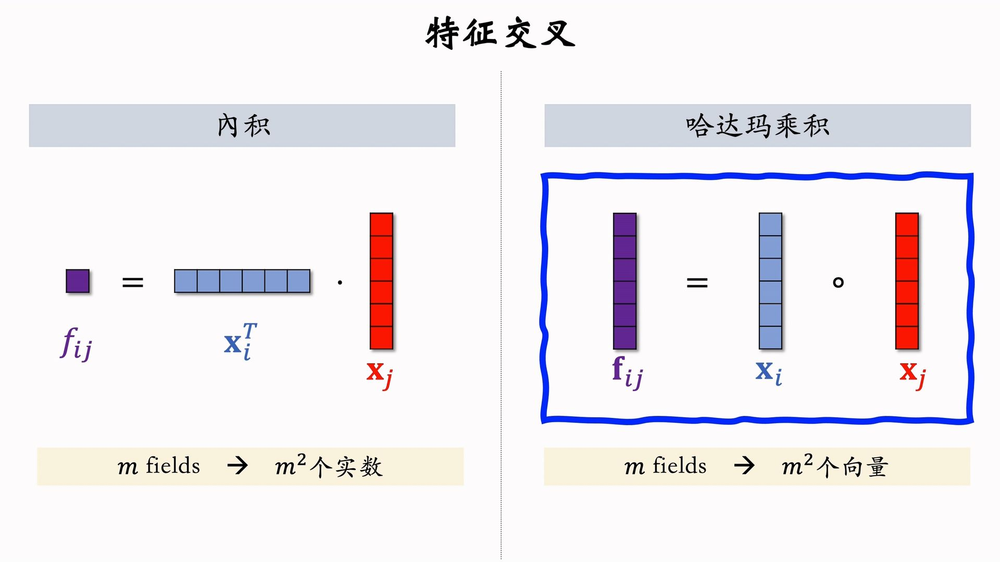
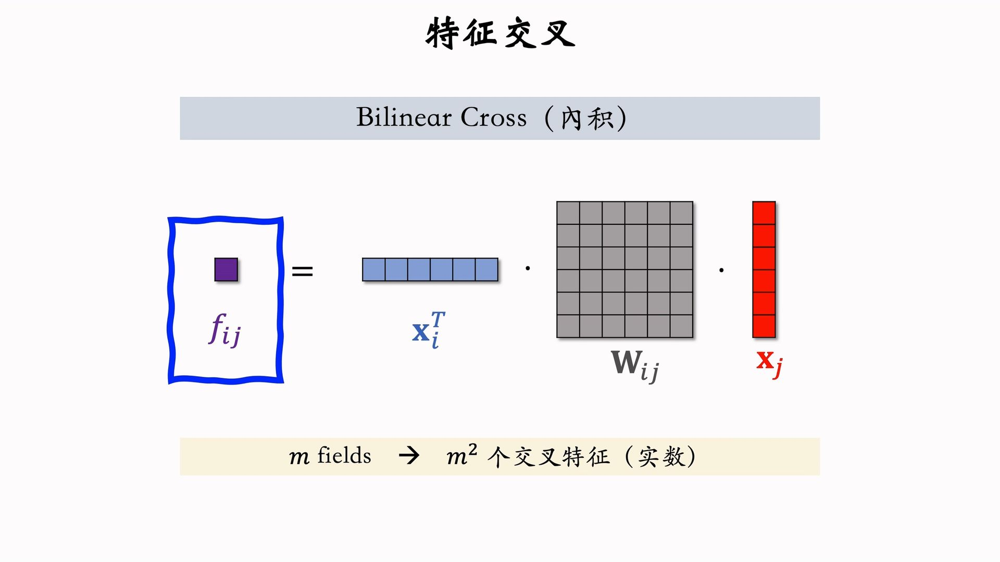
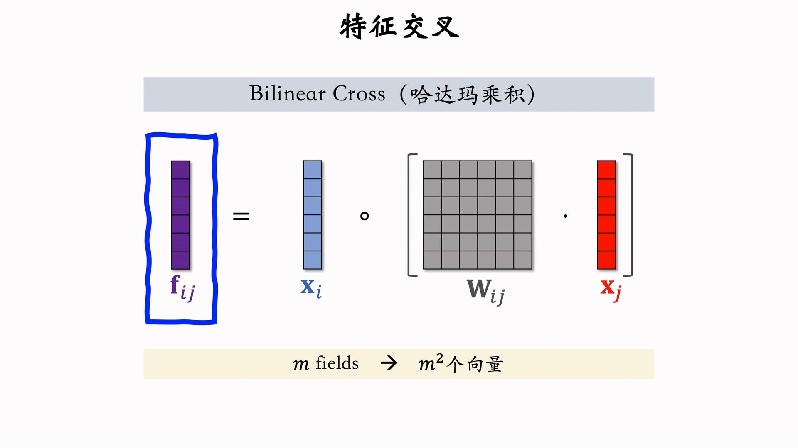
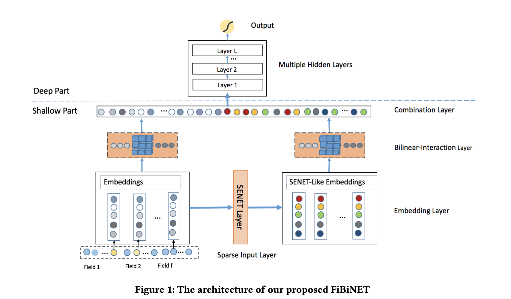

---
tags:
- Alg
- Papers
- 推荐
- 特征工程
---

# 特征交叉3：LHUC、SENet、FiBiNet

## LHUC
>
> LHUC一般只用在精排。最早是语音识别领域的工作。后来快手把它引入到推荐系统中。
图中的神经网络中激活函数使用**sigmoid * 2**，从而在后续的Hadamard乘积中实现对语音信号特征**放大缩小**的效果。

在推荐系统中，只需要把

- 语音信号替换为物品特征
- 说话者特征替换为用户特征
即可实现一个排序模型。

## SENet
>
> SENet最早是CV领域的工作。后来被引入到推荐系统中。

实际上就是一种自适应加权（或者叫缩放其实更合适），用深度学习的方法来计算特征的权重（缩放系数）。

SENet是一种Field wise的加权，一个特征的所有维度获得相同的权重。

## Field间交叉

内积和Hadamard乘积要求向量维度相同：

Bilinear Cross不要求（其实就是非标准内积，二次型，双线性变换）：

另外一个版本：

## FiBiNet
>
> FiBiNet发表于2019年，结合了SENet和Bilinear Cross。

把离散特征的embedding用多种方式处理（concat、bilinear cross、SENet），然后同时输入到下层网络。
