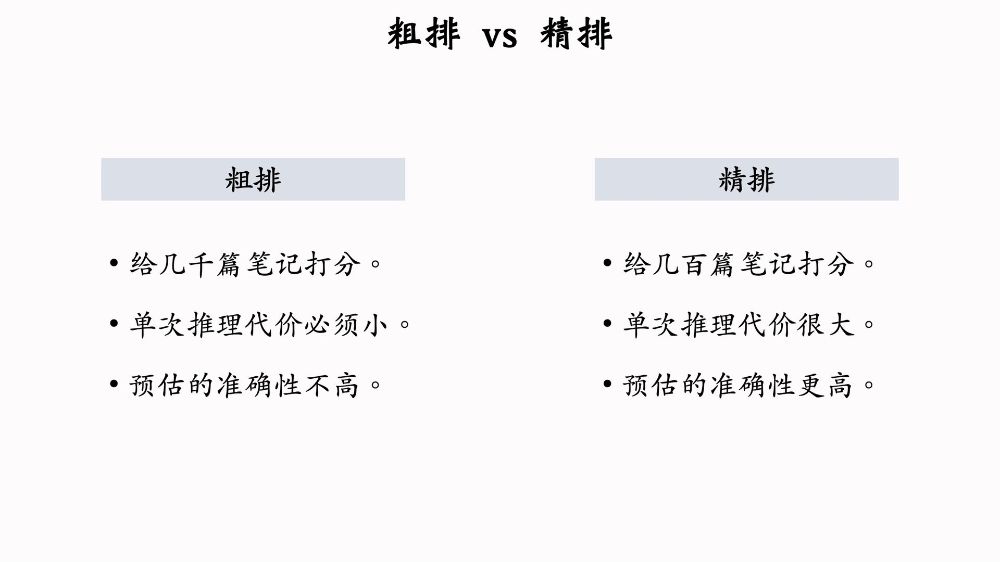
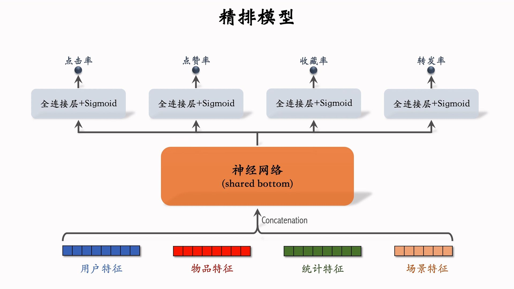
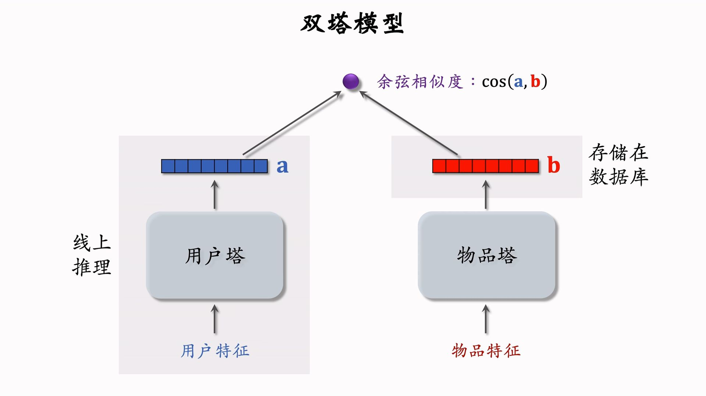
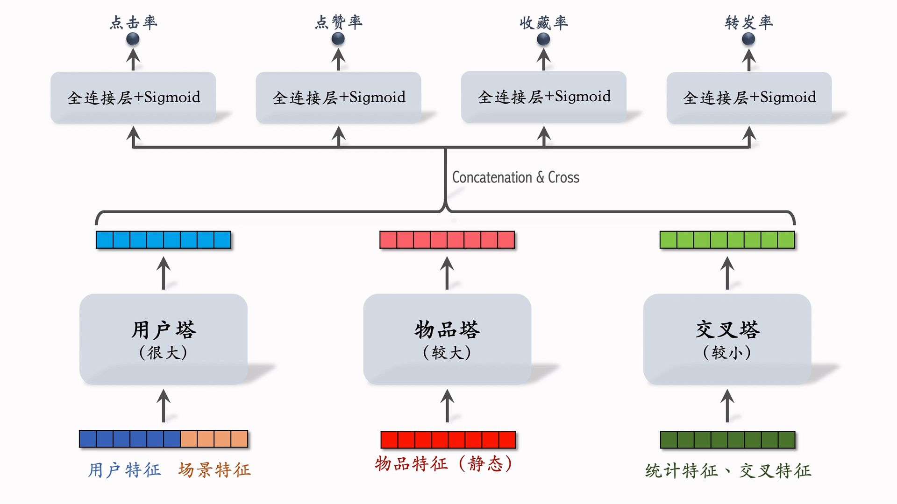
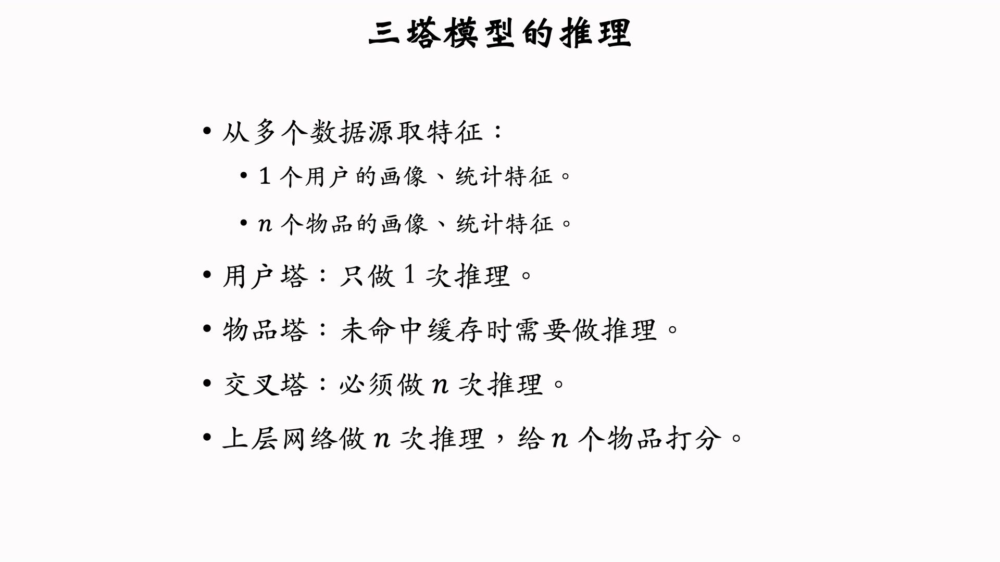
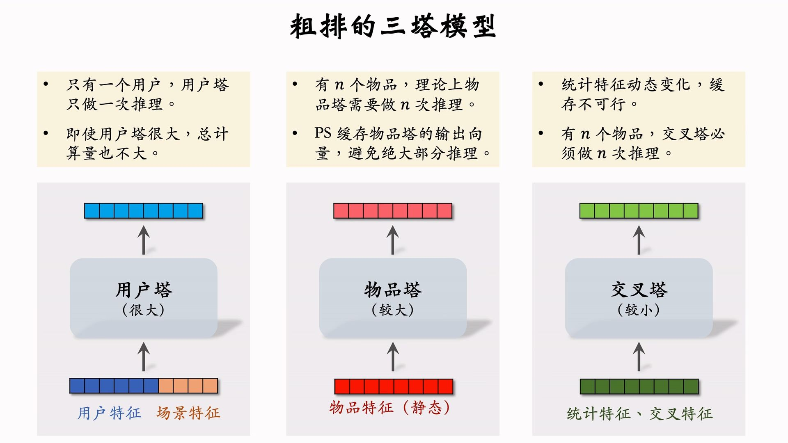
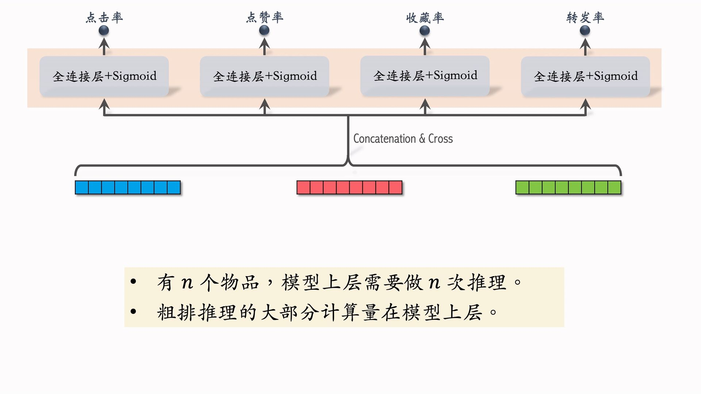

---
tags:
- Alg
- Papers
- 推荐
- 排序
---

# 排序5：粗排
>
> 之前介绍的模型没有区分粗排和精排，实际上更侧重精排一些。

## 精排模型

**前期融合**，特征提取器很大，线上计算量大：

## 粗排模型

**后期融合**，用户和物品的特征不融合。线上计算量小：

> 把召回中双塔模型最后一层改为特征融合而不是余弦相似度（例如用全连接层预测点击率）就变成了粗排模型。
>
## 三塔模型

小红书的实践主要参考阿里妈妈的论文。

为什么要设计成三塔？三种特征在线上的计算压力是不同的，因此可以设计成不同的大小。

### 三塔底层

### 三塔上层

