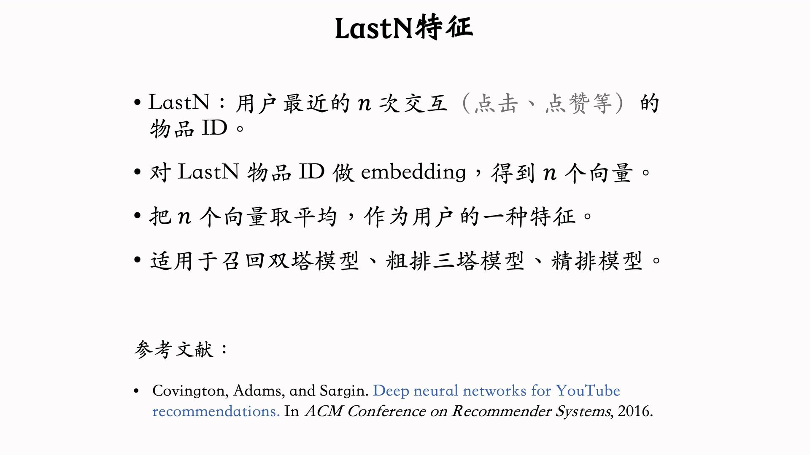
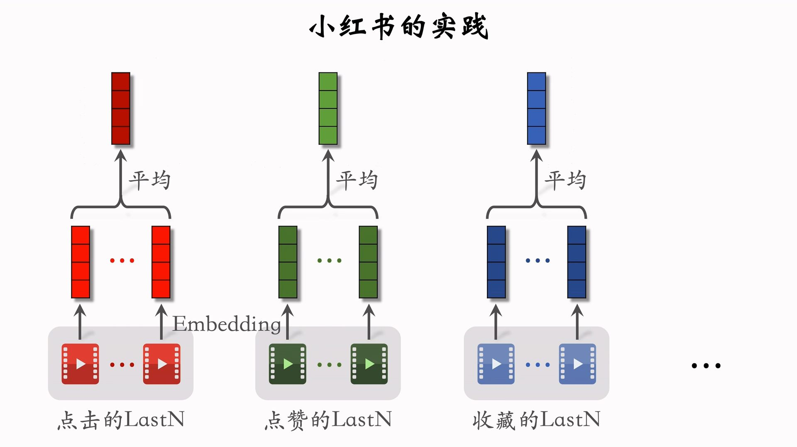
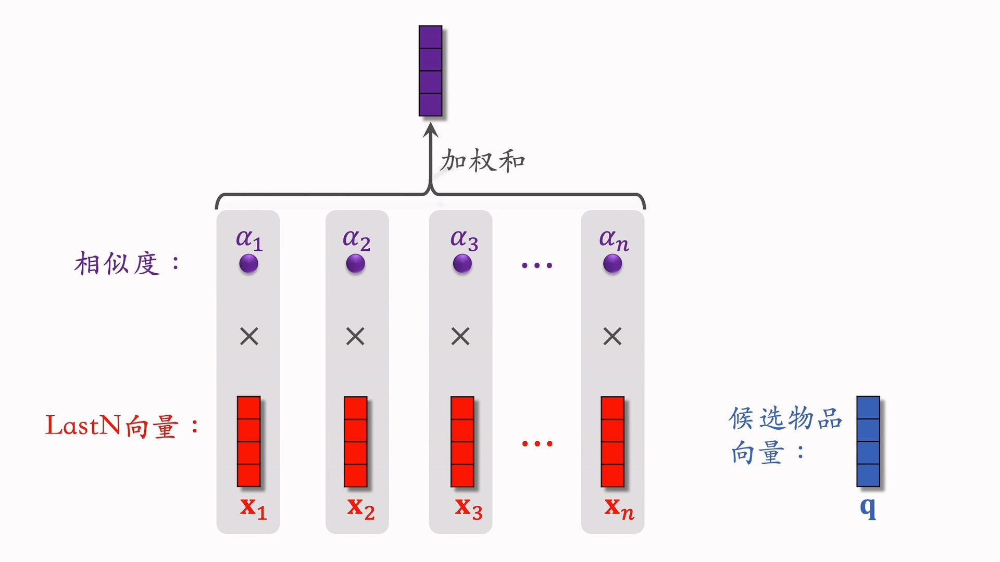
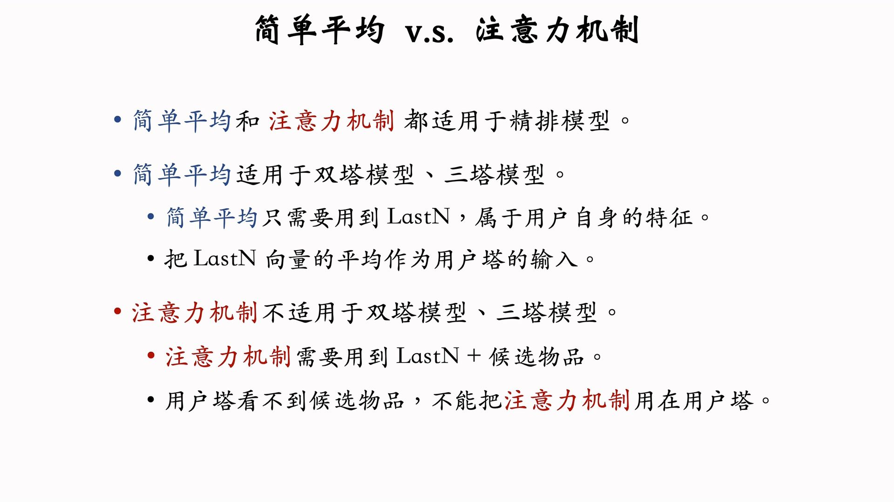
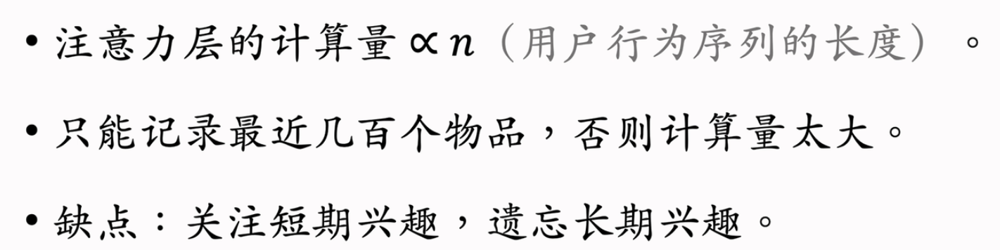
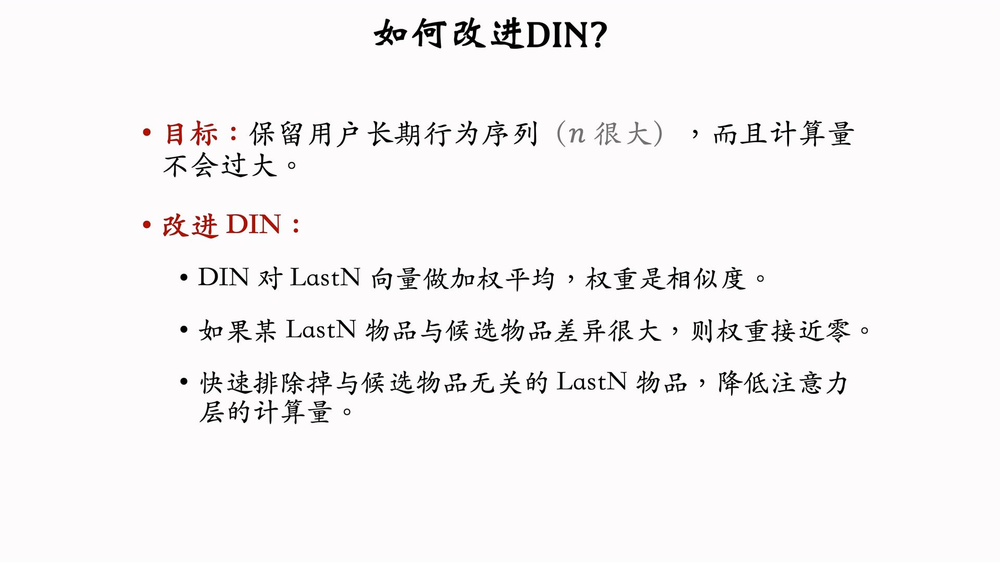
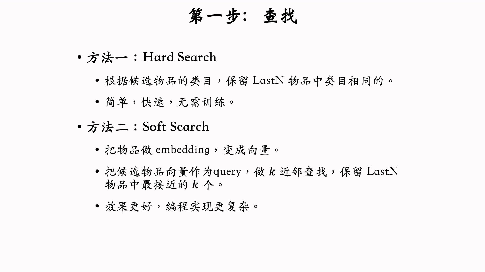
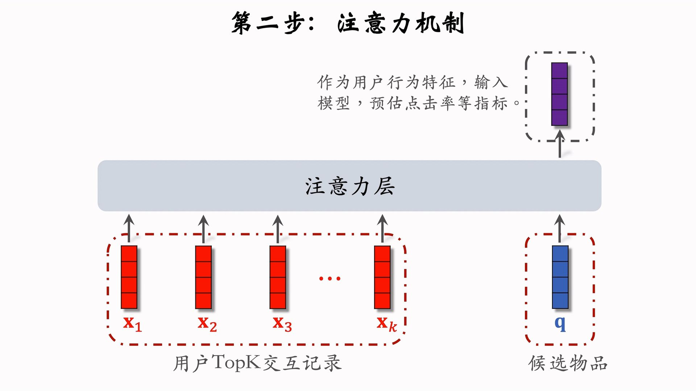
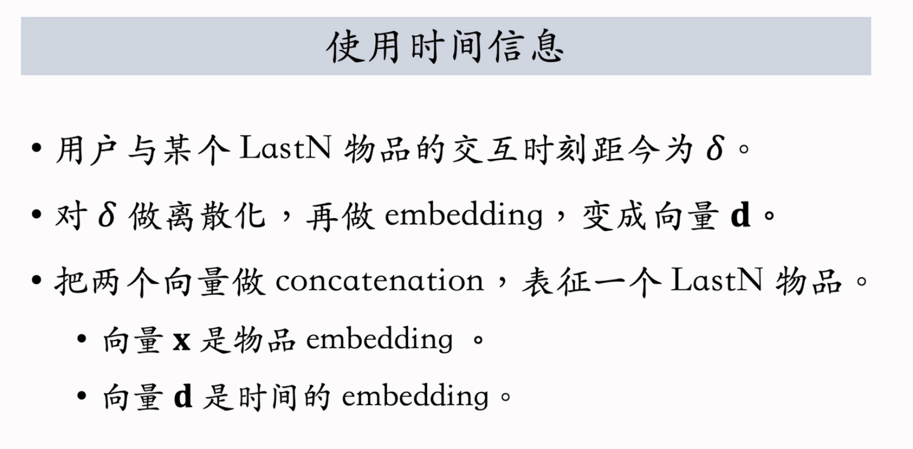
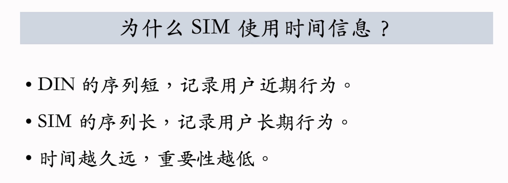

---
tags:
- Alg
- Papers
- 推荐
- 特征工程
---

# 用户行为序列

## 简单平均

用户的[LastN行为](https://dl.acm.org/doi/abs/10.1145/2959100.2959190)就是用户行为序列。

想法很简单，小红书的实践如下：

实际使用的时候，不仅使用ID、还会使用其他特征。

## 注意力机制：DIN

[DIN](https://dl.acm.org/doi/abs/10.1145/3219819.3219823)是阿里巴巴在2018年提出的。它用加权平均代替平均，也就是注意力机制。权重就是候选物品和LastN物品的相似度。

DIN需要知道候选物品的特征，因此无法用于双塔模型、三塔模型（LastN是一种用户特征，和物品特征是分开的）；通常用于精排模型：

DIN有如下缺点：

## 长期行为：SIM
>
> [SIM](https://dl.acm.org/doi/abs/10.1145/3340531.3412744)是阿里巴巴在2020年发表的文章。
保留用户更加长期的行为可以提高推荐系统的指标，但是暴力增加n可能会导致计算量过大。我们可以想办法改进一下DIN：

使用SIM的情况下，可以保留用户几千个历史行为，否则只能是几百。
SIM不会直接计算所有历史物品的相似度，而是先进行筛选：

然后再做TOP K的注意力：

一个小trick：引入时间信息（类似于positional embedding！！！）

这是非常必要的，因为SIN考虑的历史行为比较长。

