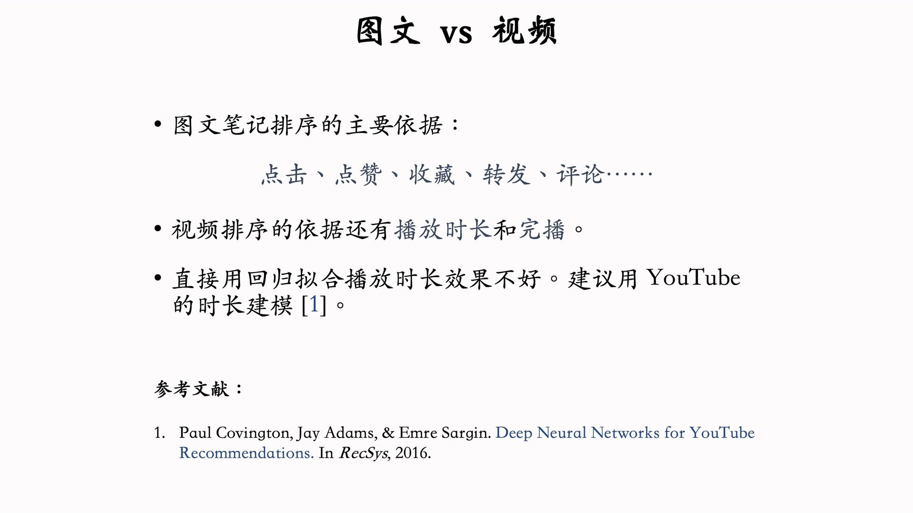
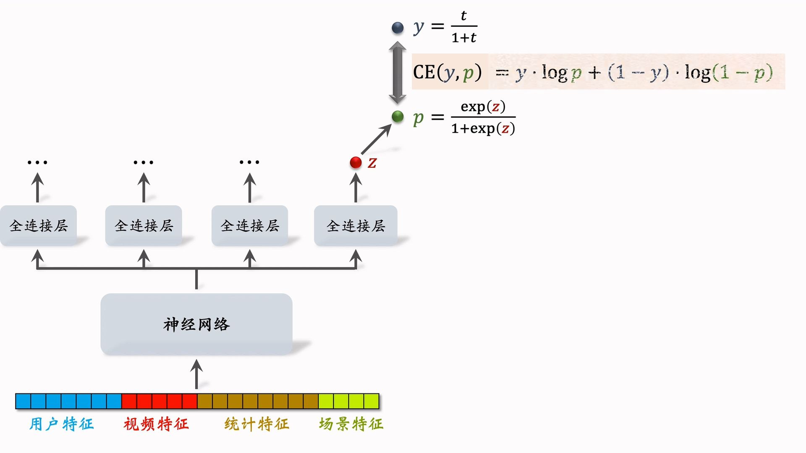
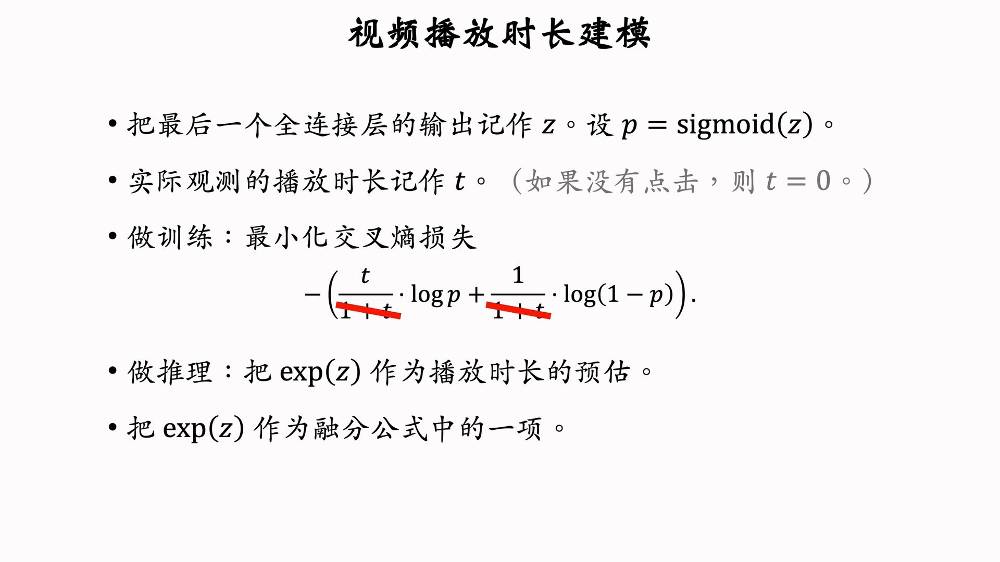
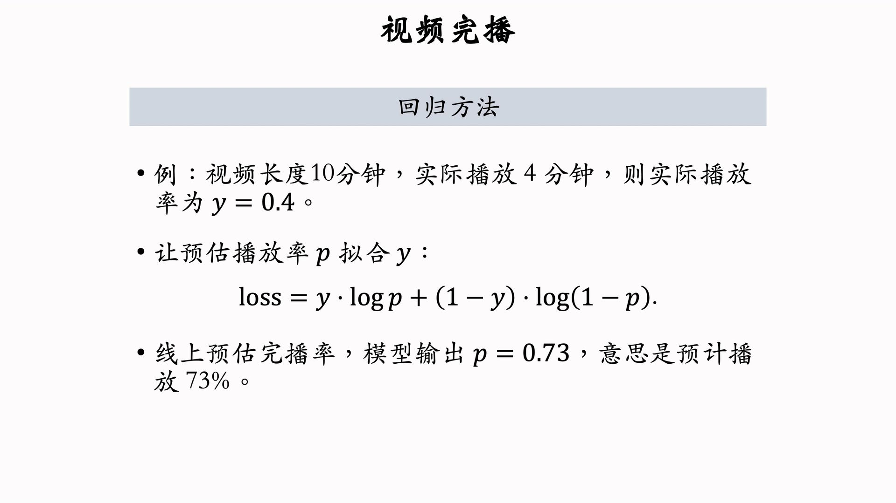
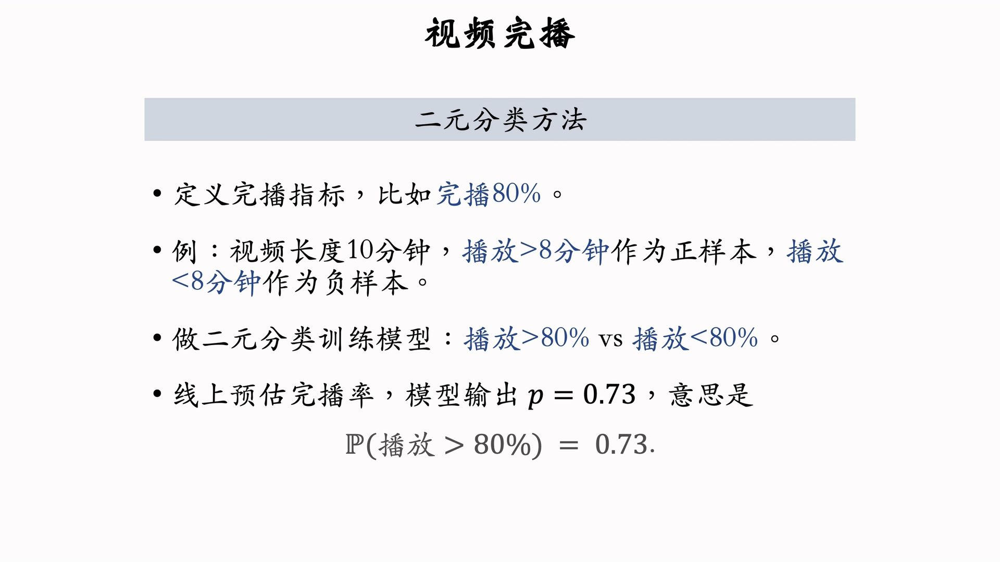
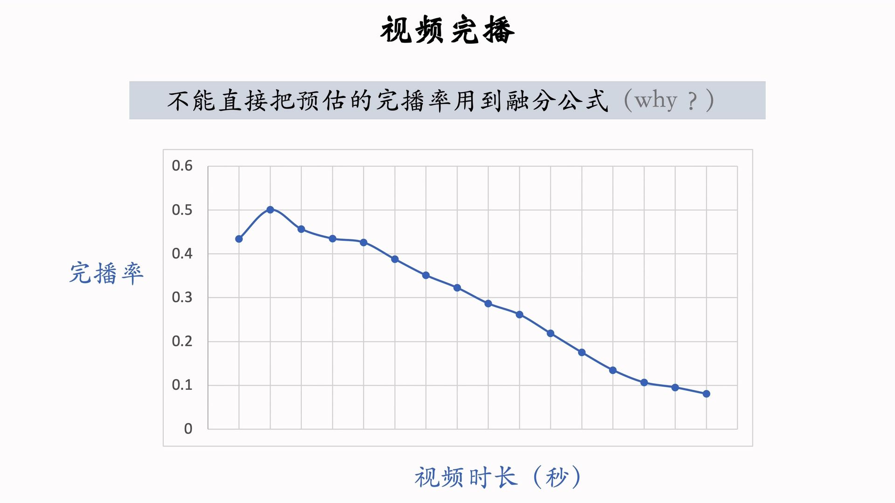
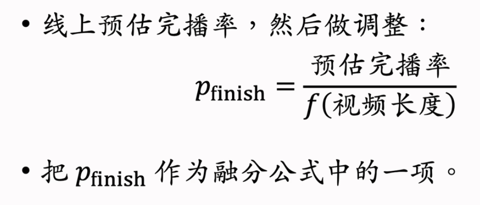

---
tags:
- Alg
- Papers
- 推荐
- 排序
include:
- math
---

# 排序4：视频播放建模

## 播放时长

直接回归拟合效果不好，基于[YouTube的论文](https://dl.acm.org/doi/abs/10.1145/2959100.2959190)改进（修正偏差）的方法：

trick：训练的时候不直接预测播放时长，而是预测$t/(1+t)$。

实际上，在使用sigmoid函数的情况下$\exp(z)$就是预估出来的播放时长。所以在线上推理的时候直接用指数函数就行了。

## 完播

### 直接回归

### 二元分类

### 陷阱

完播率对长视频不公平！视频越长完播率肯定越低：

所以线上预估完播率的时候可以进行一个直方图均衡。用预测的完播率除以这个视频时长下的**平均完播率**。

