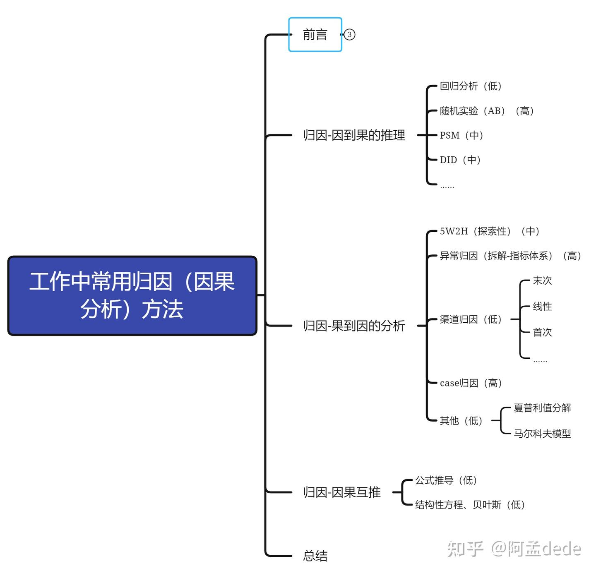
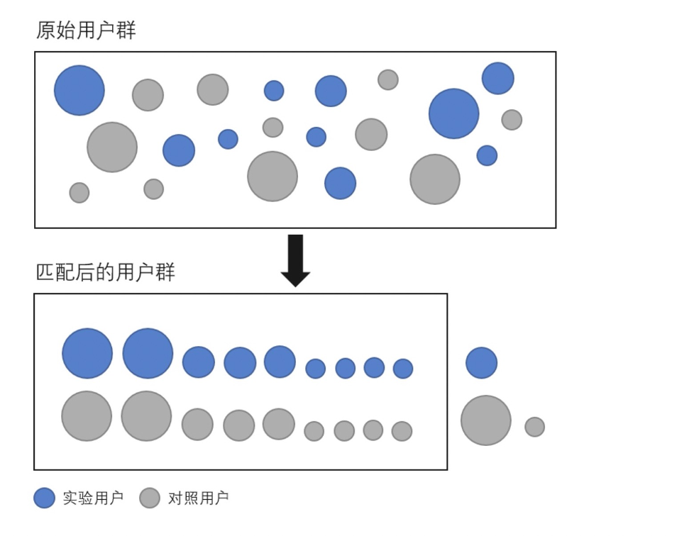
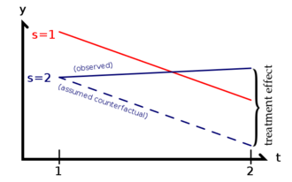
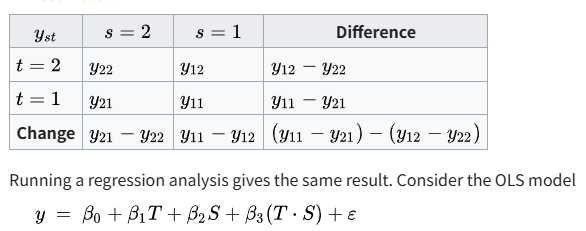
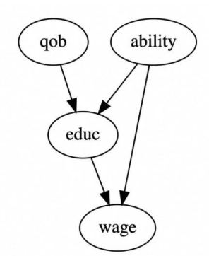

---
tags:
- DA
- 统计学
---

# 常用的因果推断方法

> 图源：[https://zhuanlan.zhihu.com/p/652667154](https://zhuanlan.zhihu.com/p/652667154)

<figure markdown>

 {width=400}

</figure>

## 基于试验的方法

### RCT 方法

**随机对照试验**是因果推断的金标准。最理想的试验莫过于<u>平行时空</u>：同一个人在平行时空分别接受干预和不接受干预，一段时间之后来研究干预的效应。当然这是不可能实现的。

根据大数定律，样本量充足的时候随机对照试验也可以近似平行时空：<u>实验组和对照组分布近似一致</u>。

RCT 中因果推断的方法就是统计推断，通过实验组和对照组的<u>配对样本假设检验</u>来判断因果是否存在。

不过 RCT 成本很高，很多时候我们会做**准试验设计**：

- 非随机分配：样本并不是被随机分配到处理组或对照组。
- 前后测设计：通过在处理前后进行测量来评估处理的效果。
- 匹配设计：将处理组和对照组的参与者按某些特征进行匹配，以减少混杂变量的影响。

以及不进行试验：

- 观察设计：与实验设计不同，观察设计中研究者不干预或操控研究对象，而是通过观察和记录数据来分析和推断因果关系。

## 基于回归的方法

回归是统计学的老本行了，不过一般情况下回归分析只能提供相关性。想做因果分析需要做一些调整。

### PSM 方法

参考：

- [causal-inference-with-python-a-guide-to PSM](https://towardsdatascience.com/causal-inference-with-python-a-guide-to-propensity-score-matching-b3470080c84f/)
- [wiki-Propensity_score_matching](https://en.wikipedia.org/wiki/Propensity_score_matching)

<figure markdown>

{width=400}
</figure>

**Idea**: 不过很多时候我们无法实施随机对照试验，例如吸烟致癌的问题，试验是不人道的。因此我们<u>只能基于观测数据进行事后分析和归因</u>。针对这种问题有一类方法是做数据的**匹配：**通过找到实验组和对照组之间相似的个体，从而达到近似平行时空的效果。

1983 年 Paul R. Rosenbaum 和 Donald Rubin 提出的 PSM 就是一种匹配方法，它基于 Propensity Score 来做匹配（定义为 P(接受干预 | 其他变量)，一般使用 logistic 回归来估计），直观的想法就是寻找那些<u>接受干预概率</u>相近的人，从而消除这种倾向带来的偏差。

**Procedure**:（以吸烟是否致癌这个问题为例）

- 收集数据，包括
    - Y: 是否接受了干预（是否吸烟）
    - X: 其他可能相关的变量（混杂变量, confounding variables：年龄、受教育程度、男女等等）
    - Z: 希望研究的效应（是否患癌症）
- 计算 Propensity score
    - 逻辑回归： Y~sigmoid(a^T X)
- 匹配
    - 可以有多种匹配方法，最简单的就是 K 近邻
- 检验
    - 检验匹配完之后混杂变量的分布是否均匀了（例如吸烟和不吸烟的人群男女比例一致、年龄分布一致）
    - 如果不一致就重新进行匹配
- 计算效应量
      - 使用匹配之后的癌症率差值作为干预效应的一个估计

**Disadvantages:**

- 当然 PSM 也存在一些问题
- 最显而易见的是，它只建模了观测到了混杂变量，没有考虑可能存在的隐变量

### DID 方法

<figure markdown>

</figure>

**Idea**: 如果我们<u>在干预前后都有观测</u>就可以考虑 DID 方法。DID 假设实验组和对照组发展趋势相同（平行时空！）。在 t=1 时刻，实验组实施干预。到了 t=2 时刻，计算实验组指标变化量和对照组指标变化量之间的差值（双重差分，也就是 DID）。按照假设，这个值应该和 0 接近。收集样本之后做假设检验即可，如果 DID 显著大于零，就说明干预对指标有正向的作用。

**Procedure:**

DID 可以用回归来计算，下面的回归系数中 beta_3 就是 DID 的估计值。

<figure markdown>

</figure>

**Disadvantages:**

- 不一定干预前后都有观测
- 假设不一定成立

### FEM 方法

如果可以观测到更多时间节点的数据，可以使用 FEM 方法。

固定效应模型（Fixed Effects Model，简称 FEM）又称固定效应回归模型，是一种用于面板数据分析的方法。面板数据（Panel Data，也称纵向数据）多了时间维度信息，不论是个体或是实体（如国家），所收集的数据都包含不同时间点至少两次以上的状态信息。

### IV 方法

<figure markdown>

</figure>

**Idea:** IV 方法主要是为了解决内生性的问题。所谓的内生性指的是回归变量和误差项存在相关性。例如 y~ X+e，一般来说这个回归要求 X 和随机误差 e 是独立的，至少是不相关的。这时候我们说误差是<u>外生的</u>；反之如果误差和回归变量相关，就说存在<u>内生性</u>。内生性的产生可能有很多原因，包括但不限于：

- 变量选择偏差：例如上图中的受教育程度和工资之间，他们可能都收到个人能力的影响。
- 样本选择偏差：样本在某个维度上有偏
- 测量误差
- 双向因果：例如<u>考试前复习时间（X）</u>对<u>考试成绩（Y）</u>的影响。显然他们是互相影响的，复习时间长可能考试成绩就会好一些；反之，考试成绩好的人可能不需要复习特别长的时间。

我们就考虑图里受教育程度和工资之间的关系。由于缺少个人能力这个变量，如果我们直接做回归可能存在内生性的问题。所以我们可以使用 IV 方法：

**Procedure:**

- 引入工具变量（和 X 相关但是和 Y 无关，例如出生的月份，玄学一点可以叫星座：Z）。星座和教育是有关系的，因为它会直接影响入学年份、从而导致大家上学的时候年龄是有差异的。并且星座和个人能力无关，并不会出现特定月份出生的人能力显著高的情况。
- 两阶段最小二乘
    - 先回归工具变量和 X：OLS(X ~ Z)
    - 然后再用估计出的 X_hat 来回归 Y：OLS(Y ~ X_hat)
    - 这时候 X_hat 是用星座预测出来的，可以认为剔除了个人能力的影响。从而达到了消除内生性的目的。

### SCM 方法

合成控制法适用于观察性研究，如比较案例研究(comparative case studies)，其干预(treatment, intervention)是 binary 情况下的进行因果推断的统计模型。其我们<u>通过对与干预组(treatment group)相似的其他若干组进行线性加权，构造出一个虚拟的对照组</u>，用构造出来的虚拟对照组用来近似模拟干预组(treatment group)未接受到干预的情况。这个想法和 PSM 有些类似，但更加激进。不是做 Matching 而是直接做 Synthesizing。

## 基于图的方法

有向无环图（DAG）很适合用来表征因果关系。例如我们之前展示的：

<figure markdown>

</figure>

因此派生了一些基于 DAG 的因果推断方法。例如贝叶斯网络、Do calculus。
