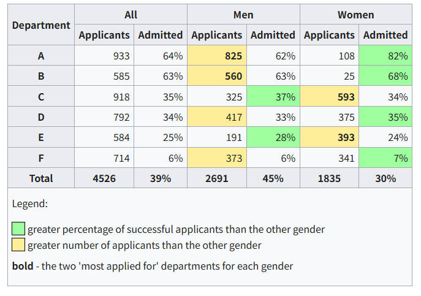
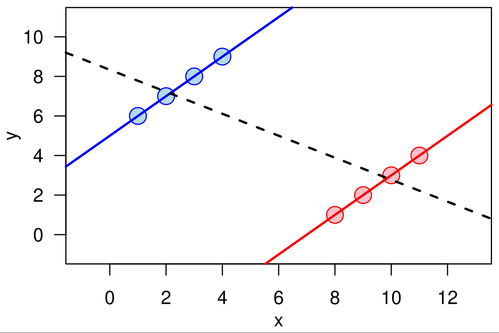

---
tags:
- DA
- Statistics
title: 辛普森悖论
include: 
- math
---

# 统计究竟能否研究因果问题？

!!! quote "统计学史拾遗"

    > 来自：<https://cosx.org/2012/03/causality1-simpson-paradox/>

    天才的高斯在研究天文学时，首次引进了最大似然和最小二乘的思想，并且导出了正态分布（或称高斯分布）。其中最大似然有些争议，比如 Arthur Dempster 教授说，其实高斯那里的似然，有贝叶斯或者信仰推断（fiducial inference）的成分。高斯那里的 “统计” 是关于 “误差” 的理论 ，因为他研究的对象是 “物理模型” 加“随机误差”。

    大约在 100 多年前，Francis Galton 研究了父母身高和子女身高的 “关系”，提出了“（向均值）回归” 的概念。众所周知，他用的是线性回归模型。此时的模型不再是严格意义的“物理模型”，而是“统计模型” — 用于刻画变量之间的关系，而不一定是物理机制。
    
    之后，Karl Pearson 提出了“相关系数”（correlation coefficient）。后世研究的统计，大多是关于 “相关关系” 的理论。 但是关于 “因果关系” 的统计理论，非常稀少。
    
    据 Judea Pearl 说，Karl Pearson 明确地反对用统计研究因果关系；有意思的是，后来因果推断为数不多的重要文章（如 Rosenbaum and Rubin 1983; Pearl 1995）都发表在由 Karl Pearson 创刊的 Biometrika 上。

统计学一直以来研究的都是相关性问题，**用它来研究因果是比较危险的**。

相关性不等于因果性，相关性不等于因果性，相关性不等于因果性！！！重要的事情说三遍！

否则，会有很多荒唐的结论，这个网站[Correlation is NOT Causation](https://www.tylervigen.com/spurious-correlations)收集了一些spurious correlations。

例如，缅因的离婚率和美国的人造黄油消耗高度相关：

## 辛普森悖论

另一个著名的例子是[辛普森悖论](https://zh.wikipedia.org/wiki/%E8%BE%9B%E6%99%AE%E6%A3%AE%E6%82%96%E8%AE%BA)（Yule Simpson's paradox）：

UC Berkeley在1973的招生情况如下：

||男|女|
|--|--|--|
|录取|3714|1512|
|未录取|4728|2809|
|录取率|44%|33%|

可以看到，男性的录取率高达44%，比女性的33%高了九个百分点，这难道不是**性别歧视**？集美们这能忍？？

然而当我们把视角转换到院系（上图展示了六个人数最多的院系），就可以发现在大多数的院系（A、B、D、F），女生的录取率都更高。在整个UC Berkeley的85和院系中，有4个院系女性的录取率显著地低于男性，有6个院系男性的录取率显著地低于女性。

这难道不是**性别歧视**？集帅们这能忍？？

## 原因

那么到底存不存在`性别 -> 录取`的因果关系呢？如果不存在，为什么会造成这样现象呢？

答案自然是不存在性别歧视。之所以出现了男性总体录取率更高的原因是：**男性偏向于选择那些录取率更高的院系**。

仔细观看分院院系的录取情况你会发现，录取率排名第一和第二的院系，女性申请者反而很少。录取率低得多的CDEF院系，女性申请者反而很多。

原来是有另外一个变量（院系选择）在捣鬼，造成了虚假相关性。这被称为混杂效应。

现实世界中，这种情况无处不在。从纯粹的数学上来看，这就是一个初等的不等式性质：

$$
\frac{a}{b} \lt \frac{c}{d}\quad \frac{a'}{b'} \lt \frac{c'}{d'}
$$
然而
$$
\frac{a+a'}{b+b'} \gt \frac{c+c'}{d+d'}
$$

维基百科上有一张图，也可以很直观地帮助我们理解辛普森悖论的产生：

可以看到，xy在红色数据集和蓝色数据集中都**各自呈现正相关**，然而**总体上却呈现负相关**。背后就是“红蓝分组”这个变量在作祟。

## 如何寻找因果

从上面的例子可以看到，简单的**列联表统计**是不能给出具有说服力的因果关系的，反而会带来一些令人迷惑的悖论。

**线性回归**也不可靠，甚至可能得出相反的结论。

> 这俩工具没了，传统统计学一半的理论都无用了。

因此想要探究因果关系，需要非常小心的建模、考证。请看下一节，常用的[因果推断方法](./causal_models.md)。
