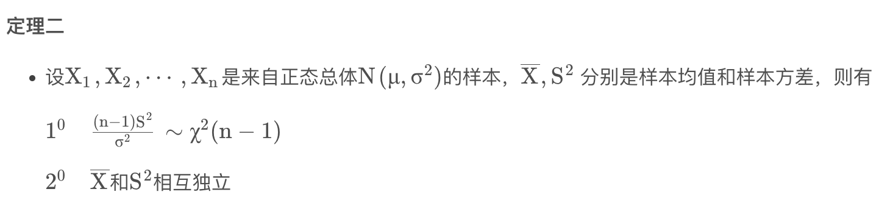

---
tags:
- DA
- 笔试
- SQL
- Leetcode
---

# 0309 ant

> 42分综合选择题+3分数据挖掘选择题+15分数据挖掘编程题+40分SQL+算法编程题

## 综合选择题

考察知识：

- 概率论（较为简单）
- 统计学（参数估计、卡方分布）
    - 考了经典定理：
        <figure markdown>
        
        <figurecaption>我还真忘了😭</figurecaption>
        </figure>
- Python（分析代码的输出结果）
- Hadoop、Yarn
- MapReduce
- SQL（主要考了JOIN方式、聚合函数）
- RandomForest模型训练问题

## 数据挖掘选择题

考了训练集、验证集、测试集的设计。

## 数据挖掘编程题

Pandas处理数据。

1. 从标准输入读取数据
2. 处理空值，数值类型填充为均值、字符类型填充为众数
3. 数值类型标准化
4. 字符类型One-Hot化
5. 格式化输出

## SQL+算法编程题

### SQL

没复习，完全不会写，所以题目也不记清了。

大概是一个贷款记录的表。需要找出贷款次数超过一次的人。和其他的表JOIN一下什么的。

感觉复习过应该不难做。

### 算法

列表`p,q`都是1~n的一个排列。考虑下述染色问题：

每次染色需要选取一个下标`i`，把`p[i]`和`q[i]`同时染色。

要求`p,q`中被染色的数字不能有重复。

问：最多可以染色多少组？染色哪些下标？（任意输出一个方案即可）

输入示例：

```python
n = 3
p = [1,2,3,4,5]
q = [1,3,5,2,4]
```

输出示例：

```text
2
1 4 # 或者23
```
