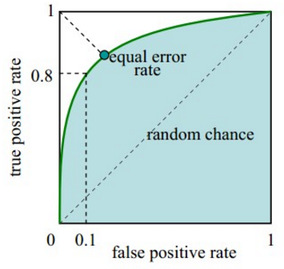
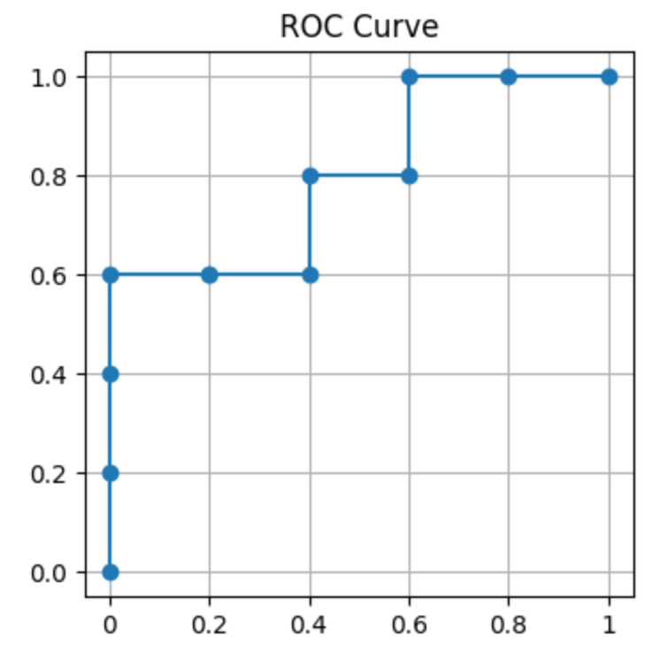

---
tags:
- DA
- 面试
include:
- math
---

# 0514 du

比较简单的暑期面试，一次面试直接决定是否通过，比较干净利落。

> 同时也会觉得有点水

先问了基本情况，介绍了我做的项目。

然后问了一道概率论：

> A、B两个队伍进行BO7比赛，两队实力相当胜率相同。前三局A赢了两局输了一局，问最终A获胜的概率？

最后还问了问机器学习，分类模型。出了一个AUC的计算问题：

> 假设随着分类模型输出的logit从小到大排列之后，他们的真实标签分别为0010100111，问AUC是多少？

## AUC

### ROC曲线

AUC（Area Under Curve）是定义在ROC（Receiver Operating Characteristic）曲线上的，它衡量ROC曲线从0-1积分的大小：

而ROC曲线的定义是：

$$
\left\\{(x,y) \mid x = \mathrm{fpr}, y=\mathrm{tpr} \right\\}
$$

生成这些点的方式是：

对于一个分类模型$f(x)$，它输出一个0-1的得分（或者叫概率），我们取不同的阈值$t$，只有$f(x)>t$的时候才认为是正样本。

这样在阈值$[0,1]$中取值，我们就得到了ROC曲线。

### AUC的计算

$$
\mathrm{fpr} = \frac{\mathrm{FP}}{\mathrm{FP}+\mathrm{TN}} = \frac{\mathrm{FP}}{\mathrm{Negative}}
$$
代表所有负样本中错误预测为正样本的概率，假警报率；

$$
\mathrm{tpr} = \frac{\mathrm{TP}}{\mathrm{TP}+\mathrm{FN}}= \frac{\mathrm{TP}}{\mathrm{Positive}}
$$
代表所有正样本中预测正确的概率，命中率（也叫召回率、查全率）。

对于0010100111这样的真实标签，正负样本都是5个。我们可以描点绘制ROC曲线：

|阈值分割|fpr|tpr|
|--|--|--|
|`0010100111-`|0|0|
|`001010011-1`|0|1/5|
|`00101001-11`|0|2/5|
|`0010100-111`|0|3/5|
|`001010-0111`|1/5|3/5|
|`00101-00111`|2/5|3/5|
|`0010-100111`|2/5|4/5|
|`001-0100111`|3/5|4/5|
|`00-10100111`|3/5|1|
|`0-010100111`|4/5|1|
|`-0010100111`|1|1|

> 实际上只需要找到fpr发生变化的点即可，图像一定是一个阶梯函数。

描点得到：

每个格子是0.04，ROC曲线下方一共20个格子，所以AUC值为$20\cdot 0.04 = 0.8$

### 简便计算

当然，如果只需要计算AUC，我们有一个比较简单的计算方法。

我们只需要挨个找正样本的位置，然后数一下在他前面的负样本个数即可。

> 0010100111

|正样本位置|在它前面的负样本个数|
|--|--|
|3|2（位置1,2）|
|5|3（位置1,2,4）|
|8|5（1,2,4,6,7）|
|9|5|
|10|5|

正样本得分高的次数：$ 2 + 3 + 5 + 5 + 5 = 20$

总共正负样本对数：$5 \times 5 = 25$

所以AUC值为$20/25 = 0.8$。

这其实就是AUC的第二种理解：

$$
\mathrm{AUC} = \mathrm{P}(s_{P} \gt s_{N})
$$

也就是正样本比负样本得分高的概率。

所以本质上我们是在**计算所有的正负样本对中，正样本得分高的频率**。
