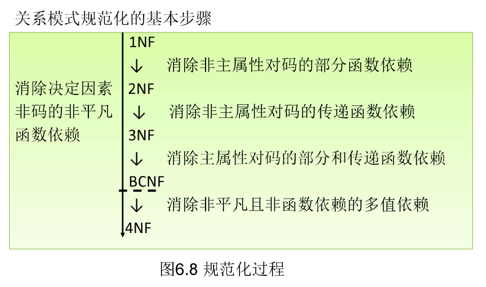

---
tags:
- DA
- SQL
---

# 关系数据库

!!! chatgpt-summary "GPT"
    本文内容部分由GPT生成，请注意甄别。

    另有部分内容来自`复旦大学.管理学院.数据库与企业数据管理`课程。

    其他内容来自互联网。

## DBMS

数据库（DB）是长期储存在计算机中，**有组织、可共享**的**大量**数据的集合。

数据库管理系统（DBMS）是管理数据库的软件，位于用户和操作系统之间，旨在科学高效地维护、获取、组织数据。

### DBMS的功能

DBMS主要有以下功能：

1. 数据定义：
    - 提供数据定义语言（DDL）
    - 定义数据库中的数据对象
2. 数据操纵：
    - 提供数据操纵语言（DML）
    - 实现对数据库的增删改查
3. 数据库的建立和维护
4. 其他功能
    - 和其他软件系统的通信
    - 数据转换

### SQL和NoSQL

主流的DBMS有：

- **MySQL**（开源）
- PostgreSQL（开源）
- SQL Server（微软）
- Oracle（甲骨文）
- DB2（IBM）
- SQLite（轻量化）

当然以上都是SQL数据库，也就是我们主要介绍的**关系数据库**。也存在一些NoSQL数据库，使用**非关系型**的数据存储：

- **Redis**（键值数据库）
- DynamoDB（键值数据库）
- **MongoDB**（文档数据库）
- Couchbase（文档数据库）
- Apache Cassandra（列族数据库）
- Neo4J（图数据库）
- Milvus（向量数据库）

当然，NoSQL = Not Only SQL，这些数据库也都支持一定程度的SQL查询。

## 数据模型

数据模型描述了数据库的组成对象以及对象之间的联系。常见的数据模型有：

- 层次模型 (Hierarchical Model)
- 网状模型 (Network Model)
- 关系模型 (Relational Model)
- 面向对象模型 (Object-Oriented Model)
- 文档模型 (Document Model)
- 图模型 (Graph Model)
- 列族模型 (Column-Family Model)
- 键值模型 (Key-Value Model)

实际上前面介绍的SQL数据库和NoSQL数据库都是基于这些数据模型设计的。

### 关系模型

我们主要关注关系模型（1970年IBM公司提出），它将数据存储在表格中，每个表格由行和列组成。每一行表示一个记录，每一列表示记录的属性。通过键（如主键、外键）来建立表之间的关系。

- 应用：广泛应用于数据库管理系统（如 MySQL、PostgreSQL、Oracle等），特别适用于**结构化数据**。
- 优点：简单易懂，支持复杂的查询和数据操作。
- 缺点：对于非常复杂的数据结构或大规模数据，性能可能不如其他模型。

关系模型的数据结构包含以下内容：

- 关系：关系对应着一张二维表
- 关系模式：对关系的描述，表头
- 元组：表中的一行
- 属性：表中的一列
- 主码：唯一确定一行
- 域：属性的取值范围
- 分量：元组中的一个属性值

关系可以分为三类：

- 基本表：实际存在的表，是实际存储文件（**内模式**）的逻辑表示（**模式**）。
- 视图表：由基本表导出的逻辑表（**外模式**），不实际存在。
- 查询表：从视图和基本表派生的查询结果。

<figure markdown>

{width=400}

<figurecaption>内外模式</figurecaption>
</figure>

### 关系完整性

关系需要满足三类完整性约束：

1. 实体完整性：
    - 实体完整性约束确保关系中的每个元组（行）都有唯一的标识符，即**主键**（Primary Key）。每个表的主键必须是唯一的，且不能为空（NULL）。
2. 参照完整性：
    - 参照完整性约束确保表与表之间的**外键**关系是有效的，即外键值必须指向另一个表中的有效记录。外键是一种指向其他表主键的字段，用来建立表与表之间的关联。
3. 用户定义的完整性（域完整性）：
    - 域完整性约束保证每个字段的值都属于某个预定义的合法值范围（即域）。这些值必须符合数据类型、长度、格式等约定。

不同关系之间可能存在对应关系：

1. 一对一关系
    - 一对一关系可以通过**引入外键**来实现，只需要把其中一个表的主键引入为外键即可。
2. 一对多关系
    - 一对多的关系同样可以通过**引入外键**来实现，只需要在“多”的那个表中引入“一”的主键作为外键即可。
    - 例如，每个`学生`都属于唯一一个班级，但是一个`班级`有多个学生。只需要在学生的表中加入`班级号`作为外键即可。
3. 多对多关系
    - 多对多关系需要**引入中间表**才能实现。通过**两个一对多关系**就可以实现多对多啦。
    - 例如，每个`老师`都可能教学多个班级，每个`班级`也可能有多个老师。这时候只需要一个`老师-班级`中间表（类似笛卡尔积）记录对应关系即可实现多对多。

### 关系代数

关系的操作（其实就是对表的操作）分为两类：

- 数据查询
- 数据更新：插入、删除、修改

插入、删除、修改比较简单。

而数据查询较为复杂，可以用**关系代数**来描述。关系代数是一种抽象的查询语言，它用关系的运算来表达查询。它包含下列运算符：

| 运算符     | 名称       | 作用                                                   |
|------------|------------|--------------------------------------------------------|
| **σ**      | 选择       | 从关系中选择满足条件的元组（行）。                     |
| **π**      | 投影       | 从关系中选择特定的属性（列）。                         |
| **⨝**      | 连接       | 连接两个关系，基于共同属性。                           |
| **÷**      | 除法       | 返回在一个关系中存在，且在另一个关系中全部存在的元组。 |
| **ρ**      | 重命名     | 为关系或属性命名，通常用于简化查询。                   |
| **∪**      | 并         | 将两个关系的所有元组合并，去掉重复的元组。             |
| **∩**      | 交         | 将两个关系的所有元组合并，只取重复的元组。           |
| **−**      | 差         | 返回一个关系中有但另一个关系中没有的元组。             |
| **×**      | 笛卡尔积   | 将两个关系的所有元组进行组合，生成新关系。             |

具体来说：

1. **选择 (Selection, σ)**
    - 作用：从关系中选择满足某些条件的元组（行）。
    - 语法：`σ_condition(R)`
    - 示例：`σ(年龄 > 20)(员工)` 表示选择所有年龄大于20的员工。

2. **投影 (Projection, π)**
    - 作用：从关系中选择特定的属性（列），即去除不需要的列。
    - 语法：`π_attribute1, attribute2, ... (R)`
    - 示例：`π(姓名, 年龄)(员工)` 表示只选择员工表中的姓名和年龄列。

3. **连接 (Join, ⨝)**
    - 作用：连接两个关系，基于一个共同的属性。常见的连接包括**内连接、外连接**等。
    - 语法：`R1 ⨝_condition R2`
    - 示例：`员工 ⨝ 部门` 表示通过匹配员工表和部门表中的共同属性（如部门ID）来连接两个表。

4. **除法 (Division, ÷)**
    - 作用：返回在一个关系中存在，且在另一个关系中全部存在的元组。
    - 语法：`R1 ÷ R2`
    - 示例：`项目 ÷ 员工` 表示列出参与了所有项目的员工。

5. **重命名 (Renaming, ρ)**
    - 作用：为关系或属性命名，通常用于简化查询。
    - 语法：`ρ(new_name, R)`
    - 示例：`ρ(新员工, 员工)` 表示将员工表重命名为“新员工”。

6. **并 (Union, ∪)**
    - 作用：将两个关系的所有元组合并，去掉重复的元组。两个关系必须有相同的属性。
    - 语法：`R1 ∪ R2`
    - 示例：`员工 ∪ 合作伙伴` 表示合并员工表和合作伙伴表中的所有记录。

7. **交 (Intersection, ∩)**
    - 作用：只留下重复的元组。两个关系必须有相同的属性。
    - 语法：`R1 ∩ R2`
    - 示例：`员工 ∩ 合作伙伴` 表示即在员工中又在合作伙伴中的元组。

8. **差 (Difference, −)**
    - 作用：返回一个关系中有但另一个关系中没有的元组。两个关系必须有相同的属性。
    - 语法：`R1 − R2`
    - 示例：`员工 − 合作伙伴` 表示列出在员工表中但不在合作伙伴表中的记录。

9. **笛卡尔积 (Cartesian Product, ×)**
    - 作用：将两个关系的所有元组进行组合，生成一个新的关系。返回的关系的元组数为两个关系元组数的乘积。
    - 语法：`R1 × R2`
    - 示例：`员工 × 部门` 表示生成员工和部门表的笛卡尔积。

## 关系数据理论

### 规范化

<figure markdown>

{width=400}

<figurecaption>关系模式规范化</figurecaption>
</figure>

### 数据依赖公理系统

### 模式分解

## 数据库设计

### 需求分析

### 概念结构设计

### 逻辑结构设计

### 物理结构设计

TBC: 关系数据库理论
