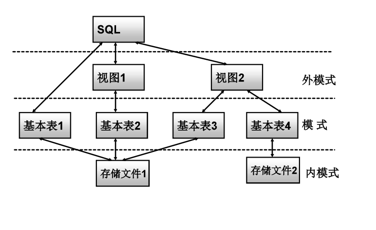
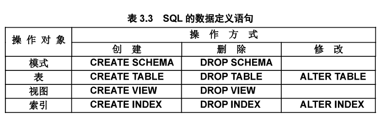

---
tags:
- DA
- SQL
---

# 数据库

!!! chatgpt-summary "GPT"
    本文内容部分由GPT生成，请注意甄别。

    另有部分内容来自`复旦大学.管理学院.数据库与企业数据管理`课程。

    其他内容来自互联网。

数据是一切分析的起点，而SQL就是从数据库中提取这些数据的工具。

## 关系数据库

数据库（DB）是长期储存在计算机中，**有组织、可共享**的**大量**数据的集合。

数据库管理系统（DBMS）是管理数据库的软件，位于用户和操作系统之间，旨在科学高效地维护、获取、组织数据。

### DBMS

DBMS主要有以下功能：

1. 数据定义：
    - 提供数据定义语言（DDL）
    - 定义数据库中的数据对象
2. 数据操纵：
    - 提供数据操纵语言（DML）
    - 实现对数据库的增删改查
3. 数据库的建立和维护
4. 其他功能
    - 和其他软件系统的通信
    - 数据转换

主流的DBMS有：

- **MySQL**（开源）
- PostgreSQL（开源）
- SQL Server（微软）
- Oracle（甲骨文）
- DB2（IBM）
- SQLite（轻量化）

当然以上都是SQL数据库，也就是我们主要介绍的**关系数据库**。也存在一些NoSQL数据库，使用**非关系型**的数据存储：

- **Redis**（键值数据库）
- DynamoDB（键值数据库）
- **MongoDB**（文档数据库）
- Couchbase（文档数据库）
- Apache Cassandra（列族数据库）
- Neo4J（图数据库）
- Milvus（向量数据库）

当然，NoSQL = Not Only SQL，这些数据库也都支持一定程度的SQL查询。

### 关系模型

数据模型描述了数据库的组成对象以及对象之间的联系。常见的数据模型有：

- 层次模型 (Hierarchical Model)
- 网状模型 (Network Model)
- 关系模型 (Relational Model)
- 面向对象模型 (Object-Oriented Model)
- 文档模型 (Document Model)
- 图模型 (Graph Model)
- 列族模型 (Column-Family Model)
- 键值模型 (Key-Value Model)

实际上前面介绍的SQL数据库和NoSQL数据库都是基于这些数据模型设计的。

我们主要关注关系模型（1970年IBM公司提出），它将数据存储在表格中，每个表格由行和列组成。每一行表示一个记录，每一列表示记录的属性。通过键（如主键、外键）来建立表之间的关系。

- 应用：广泛应用于数据库管理系统（如 MySQL、PostgreSQL、Oracle等），特别适用于**结构化数据**。
- 优点：简单易懂，支持复杂的查询和数据操作。
- 缺点：对于非常复杂的数据结构或大规模数据，性能可能不如其他模型。

关系模型的数据结构包含以下内容：

- 关系：关系对应着一张二维表
- 关系模式：对关系的描述，表头
- 元组：表中的一行
- 属性：表中的一列
- 主码：唯一确定一行
- 域：属性的取值范围
- 分量：元组中的一个属性值

关系可以分为三类：

- 基本表：实际存在的表，是实际存储文件（**内模式**）的逻辑表示（**模式**）。
- 视图表：由基本表导出的逻辑表（**外模式**），不实际存在。
- 查询表：从视图和基本表派生的查询结果。

<figure markdown>

{width=400}

<figurecaption>内外模式</figurecaption>
</figure>

### 关系完整性

关系需要满足三类完整性约束：

1. 实体完整性：
    - 实体完整性约束确保关系中的每个元组（行）都有唯一的标识符，即**主键**（Primary Key）。每个表的主键必须是唯一的，且不能为空（NULL）。
2. 参照完整性：
    - 参照完整性约束确保表与表之间的**外键**关系是有效的，即外键值必须指向另一个表中的有效记录。外键是一种指向其他表主键的字段，用来建立表与表之间的关联。
3. 用户定义的完整性（域完整性）：
    - 域完整性约束保证每个字段的值都属于某个预定义的合法值范围（即域）。这些值必须符合数据类型、长度、格式等约定。

不同关系之间可能存在对应关系：

1. 一对一关系
    - 一对一关系可以通过**引入外键**来实现，只需要把其中一个表的主键引入为外键即可。
2. 一对多关系
    - 一对多的关系同样可以通过**引入外键**来实现，只需要在“多”的那个表中引入“一”的主键作为外键即可。
    - 例如，每个`学生`都属于唯一一个班级，但是一个`班级`有多个学生。只需要在学生的表中加入`班级号`作为外键即可。
3. 多对多关系
    - 多对多关系需要**引入中间表**才能实现。通过**两个一对多关系**就可以实现多对多啦。
    - 例如，每个`老师`都可能教学多个班级，每个`班级`也可能有多个老师。这时候只需要一个`老师-班级`中间表（类似笛卡尔积）记录对应关系即可实现多对多。

### 关系代数

关系的操作（其实就是对表的操作）分为两类：

- 数据查询
- 数据更新：插入、删除、修改

插入、删除、修改比较简单。

而数据查询较为复杂，可以用**关系代数**来描述。关系代数是一种抽象的查询语言，它用关系的运算来表达查询。它包含下列运算符：

| 运算符     | 名称       | 作用                                                   |
|------------|------------|--------------------------------------------------------|
| **σ**      | 选择       | 从关系中选择满足条件的元组（行）。                     |
| **π**      | 投影       | 从关系中选择特定的属性（列）。                         |
| **⨝**      | 连接       | 连接两个关系，基于共同属性。                           |
| **÷**      | 除法       | 返回在一个关系中存在，且在另一个关系中全部存在的元组。 |
| **ρ**      | 重命名     | 为关系或属性命名，通常用于简化查询。                   |
| **∪**      | 并         | 将两个关系的所有元组合并，去掉重复的元组。             |
| **∩**      | 交         | 将两个关系的所有元组合并，只取重复的元组。           |
| **−**      | 差         | 返回一个关系中有但另一个关系中没有的元组。             |
| **×**      | 笛卡尔积   | 将两个关系的所有元组进行组合，生成新关系。             |

具体来说：

1. **选择 (Selection, σ)**
    - 作用：从关系中选择满足某些条件的元组（行）。
    - 语法：`σ_condition(R)`
    - 示例：`σ(年龄 > 20)(员工)` 表示选择所有年龄大于20的员工。

2. **投影 (Projection, π)**
    - 作用：从关系中选择特定的属性（列），即去除不需要的列。
    - 语法：`π_attribute1, attribute2, ... (R)`
    - 示例：`π(姓名, 年龄)(员工)` 表示只选择员工表中的姓名和年龄列。

3. **连接 (Join, ⨝)**
    - 作用：连接两个关系，基于一个共同的属性。常见的连接包括**内连接、外连接**等。
    - 语法：`R1 ⨝_condition R2`
    - 示例：`员工 ⨝ 部门` 表示通过匹配员工表和部门表中的共同属性（如部门ID）来连接两个表。

4. **除法 (Division, ÷)**
    - 作用：返回在一个关系中存在，且在另一个关系中全部存在的元组。
    - 语法：`R1 ÷ R2`
    - 示例：`项目 ÷ 员工` 表示列出参与了所有项目的员工。

5. **重命名 (Renaming, ρ)**
    - 作用：为关系或属性命名，通常用于简化查询。
    - 语法：`ρ(new_name, R)`
    - 示例：`ρ(新员工, 员工)` 表示将员工表重命名为“新员工”。

6. **并 (Union, ∪)**
    - 作用：将两个关系的所有元组合并，去掉重复的元组。两个关系必须有相同的属性。
    - 语法：`R1 ∪ R2`
    - 示例：`员工 ∪ 合作伙伴` 表示合并员工表和合作伙伴表中的所有记录。

7. **交 (Intersection, ∩)**
    - 作用：只留下重复的元组。两个关系必须有相同的属性。
    - 语法：`R1 ∩ R2`
    - 示例：`员工 ∩ 合作伙伴` 表示即在员工中又在合作伙伴中的元组。

8. **差 (Difference, −)**
    - 作用：返回一个关系中有但另一个关系中没有的元组。两个关系必须有相同的属性。
    - 语法：`R1 − R2`
    - 示例：`员工 − 合作伙伴` 表示列出在员工表中但不在合作伙伴表中的记录。

9. **笛卡尔积 (Cartesian Product, ×)**
    - 作用：将两个关系的所有元组进行组合，生成一个新的关系。返回的关系的元组数为两个关系元组数的乘积。
    - 语法：`R1 × R2`
    - 示例：`员工 × 部门` 表示生成员工和部门表的笛卡尔积。

## SQL

结构化查询语言（SQL）是关系数据库的标准语言。它有以下特点：

1. **综合统一**：它集数据定义语言（DDL）、数据操纵语言（DML）、数据查询语言（DQL）的功能于一体。可以独立完成数据库生命周期中的全部活动：
    - 表的定义、修改和删除
    - 增删改查
    - 数据库重构和维护
    - 数据库安全性、完整性控制、事务控制
2. **标准化**：SQL 是一个广泛接受的标准，并且有不同的数据库系统实现，但基本语法和功能是相似的。
3. **高度过程化**：SQL 让用户声明他们希望从数据库中得到什么结果，而不是如何得到这个结果。存取路径的选择和SQL操作过程由DBMS自动完成。
4. **基于集合**：SQL 的操作是基于集合理论（关系代数），能有效处理表与表之间的关系。

SQL有以下常见关键字：

| 关键字         | 说明                                                       |
|----------------|------------------------------------------------------------|
| **SELECT**     | 从数据库中查询数据                                           |
| **FROM**       | 指定查询的数据表或视图                                       |
| **WHERE**      | 用于指定查询的条件，过滤记录                                 |
| **INSERT INTO**| 向表中插入新的记录                                         |
| **VALUES**     | 在 `INSERT` 语句中指定插入的值                               |
| **UPDATE**     | 更新表中已存在的记录                                         |
| **SET**        | 指定更新记录时设置的字段和值                                |
| **DELETE**     | 删除表中的记录                                             |
| **CREATE TABLE**| 创建新的表                                                 |
| **ALTER TABLE**| 修改现有表的结构（如添加、删除列）                           |
| **DROP TABLE** | 删除表及其所有数据                                           |
| **PRIMARY KEY**| 定义表中的主键，确保列值唯一且不为空                         |
| **FOREIGN KEY**| 定义外键，建立与其他表的关联                               |
| **REFERENCES** | 用于指定外键约束的目标表和列                               |
| **JOIN**       | 用于连接多个表（如 `INNER JOIN`, `LEFT JOIN`, `RIGHT JOIN`）|
| **ON**         | 指定连接条件                                                 |
| **GROUP BY**   | 按照一个或多个列分组，常与聚合函数如 `COUNT`, `SUM` 一起使用|
| **HAVING**     | 用于过滤分组后的记录（通常与 `GROUP BY` 配合使用）          |
| **ORDER BY**   | 按照指定的列对结果集排序（`ASC` 或 `DESC`）                  |
| **LIMIT**      | 限制查询返回的记录数                                        |
| **DISTINCT**   | 用于去重，返回唯一的记录                                    |
| **AND**        | 用于连接多个条件，表示“与”操作                              |
| **OR**         | 用于连接多个条件，表示“或”操作                              |
| **NOT**        | 用于条件的“非”操作                                          |
| **IN**         | 用于指定多个值中的一个条件                                 |
| **BETWEEN**    | 用于指定一个范围条件                                         |
| **LIKE**       | 用于进行模糊匹配                                             |
| **IS NULL**    | 用于判断列值是否为 NULL                                      |
| **EXISTS**     | 检查子查询是否返回结果                                       |
| **UNION**      | 将两个查询结果合并，去除重复记录                           |
| **INTERSECT**  | 返回两个查询结果的交集（公共部分）                           |
| **EXCEPT**     | 返回第一个查询结果中存在而第二个查询结果中不存在的记录       |

### 数据定义（DDL）

<figure markdown>

{width=400}

<figurecaption>数据定义语句</figurecaption>
</figure>

- 创建基本表：

```sql
CREATE TABLE statistics (
    id BIGINT NOT NULL AUTO_INCREMENT,
    class_id BIGINT NOT NULL UNIQUE,
    average DOUBLE NOT NULL,
    PRIMARY KEY (id) -- 设置主键
);
```

> 在定义基本表的时候可以引入一些完整性约束。

- 修改基本表：

```sql
ALTER TABLE students ADD INDEX idx_score (score); -- 增加index
ALTER TABLE students DROP COLUMN birthday;        -- 删除列
```

- 删除基本表：

```sql
DROP TABLE students;
```

### 索引

建立索引可以加快查询的速度。关系数据库中常见的索引有：

- 顺序文件的索引
- B+树索引：**动态平衡**
- 散列索引（Hash）：**索引速度快**
- 位图索引

??? chatgpt-summary "Ask GPT: B+树索引和Hash索引？"

    在数据库中，**B+树索引** 和 **哈希索引** 是两种常见的索引类型，用于加速数据检索。它们各自有不同的工作原理、优缺点和适用场景。

    <h3>**B+树索引**</h3>

    #### 工作原理：
    - **B+树** 是一种自平衡的树数据结构，适用于对大量数据进行快速查找、插入、删除等操作。B+树是 B 树的变种，它保持了所有叶子节点在同一层，并且每个节点只存储键值（而不是数据）。
    - 在 B+ 树中，数据存储在叶子节点，而非叶子节点只存储键值，用来引导查询路径。叶子节点通过链表连接，可以进行范围查询。

    #### 特点：
    - **顺序存储**：B+树的叶子节点通过链表相互连接，支持范围查询，适合用于区间查找。
    - **自平衡**：树的高度保持平衡，查找、插入和删除操作的时间复杂度为 `O(log N)`。
    - **支持范围查询**：因为叶子节点是按顺序排列的，可以高效地进行范围查找（例如查找所有在某个范围内的记录）。

    #### 创建 B+ 树索引：
    在 SQL 中，你可以通过 `CREATE INDEX` 创建 B+树索引（大多数数据库系统默认使用 B+树作为索引实现）。
    ```sql
    CREATE INDEX index_name ON table_name (column1, column2, ...);
    ```

    #### 优点：
    - **支持范围查询**：B+ 树特别适合进行范围查询（如 `BETWEEN`, `>` 或 `<`）。
    - **高效的查找、插入和删除**：由于树的平衡结构，查找、插入和删除操作的复杂度为 `O(log N)`。
    - **顺序访问**：叶子节点链表支持顺序访问，可以高效地进行范围查询和排序。

    #### 缺点：
    - **空间消耗大**：由于每个节点都要存储指针，B+树的空间消耗相对较大。
    - **更新操作较慢**：插入、删除操作需要重新平衡树，可能会较慢。

    #### 适用场景：
    - 适用于对 **范围查询** 和 **排序** 高效要求的场景，如 **大规模的数据检索** 和 **多列的联合查询**。

    ---

    <h3>**哈希索引**</h3>

    #### 工作原理：
    - **哈希索引** 使用哈希函数将索引键映射到一个固定大小的哈希表中。哈希函数根据键值生成一个哈希码，该哈希码直接指向数据的位置，从而实现快速查找。
    - 哈希索引只支持等值查询（即 `=` 操作），不支持范围查询（如 `>`、`<`、`BETWEEN`）。

    #### 特点：
    - **精确匹配**：哈希索引非常适合等值查询（例如查找某个特定值）。
    - **查找速度快**：通过哈希表的直接访问，查找时间通常为常数时间 `O(1)`。
    - **不支持范围查询**：哈希索引不适合用于范围查询，不能支持排序操作。

    #### 创建哈希索引：
    在支持哈希索引的数据库（如 MySQL）中，可以通过 `CREATE INDEX` 使用哈希索引类型（通常是使用 `HASH`）。
    ```sql
    CREATE INDEX index_name ON table_name (column_name) USING HASH;
    ```
    在 MySQL 中，默认的索引类型是 B+树索引。如果要创建哈希索引，可以通过 `USING HASH` 指定。

    #### 优点：
    - **高效的等值查询**：哈希索引在进行等值查询时非常高效，查询时间是常数时间 `O(1)`。
    - **快速查找**：在查找操作时，哈希索引直接通过哈希函数定位记录，不需要遍历数据。

    #### 缺点：
    - **不支持范围查询**：由于哈希表中的数据是按哈希值分布的，无法进行范围查询（例如，找出所有大于某个值的记录）。
    - **哈希冲突**：如果多个键值被哈希到相同的位置（哈希冲突），则需要处理冲突，这可能会影响性能。
    - **不适用于排序操作**：哈希索引无法按顺序访问数据，因此不能用来支持排序操作。

    #### 适用场景：
    - **等值查询**：适用于需要进行大量等值查找的场景，如通过主键或唯一键查找记录。
    - **快速定位**：哈希索引适用于频繁使用 `=` 操作的查询，且不需要排序或范围查询的场景。

    ---

    <h3>**B+树索引 vs 哈希索引**</h3>

    | 特性                 | **B+树索引**                               | **哈希索引**                          |
    |----------------------|--------------------------------------------|--------------------------------------|
    | **查询类型**         | 支持等值查询和范围查询                    | 仅支持等值查询（`=`）                 |
    | **查找速度**         | `O(log N)`，根据树的高度查找              | `O(1)`，通过哈希直接定位              |
    | **支持范围查询**     | 是，适合用于 `BETWEEN`、`>`、`<` 等操作   | 否，不支持范围查询                    |
    | **空间消耗**         | 较大，需要存储键值和指针                  | 较小，只存储哈希值和数据指针          |
    | **更新速度**         | 较慢，涉及树的重新平衡                    | 快，插入和删除操作较为简单            |
    | **排序**             | 支持排序，叶子节点按顺序排列               | 不支持排序                            |
    | **适用场景**         | 大规模数据检索，范围查询，排序            | 精确查找，主键和唯一键索引，性能要求高 |

    总结：
    - **B+树索引** 是最常见的索引类型，适用于需要 **范围查询** 和 **排序** 的场景，虽然它的性能在等值查询上不如哈希索引，但在多种查询类型中表现更为全面。
    - **哈希索引** 在进行等值查询时具有非常高的性能，适用于 **高效的精确查找**，但不适合范围查询和排序操作。

    根据实际需求选择合适的索引类型，可以显著提高数据库查询的效率。

索引由数据库的管理员创建，由DBMS自动维护，在查询的时候DBMS自动选取合适的索引来查询。用户无法显式选择索引。

- 创建索引：

```sql
CREATE INDEX index_name ON table_name (column1, column2, ...);
```

- 更改索引：

> `ALTER INDEX`似乎并不存在

```sql
-- MySQL 5.7 引入
ALTER TABLE RENAME INDEX old_index_name TO new_index_name
```

- 删除索引：

```sql
DROP INDEX index_name;
```

### 增删改查

- 增加数据：

```sql
INSERT 
INTO students (class_id, name, gender, score) 
VALUES (2, '大牛', 'M', 80);
```

- 删除数据：

```sql
DELETE FROM students WHERE id=1;
```

- 更新数据：

```sql
UPDATE students SET name='大牛', score=66 WHERE id=1;
```

- 查询数据：

```sql
SELECT * FROM students WHERE score >= 80;
```

### 空值处理

在域定义中，如果有`NOT NULL`约束，那么这个属性就不会为空。并且加了`UNIQUE`约束的属性也不能取空。此外，码属性显然不能取空。

可以使用`IS NULL`和`IS NOT NULL`来判断一个值是否为空。

空值和其他值的算术运算结果依然是`NULL`，比较运算的结果为`UNKNOWN`。

这样一来，SQL的逻辑结构就不再是二值（`TRUE-FALSE`）的，而是三值逻辑：

- `TRUE`
- `FALSE`
- `UNKNOWN`

他们的运算规则如下：

| A       | B       | A AND B | A OR B  | NOT A  |
|---------|---------|---------|---------|--------|
| TRUE    | TRUE    | TRUE    | TRUE    | FALSE  |
| TRUE    | FALSE   | FALSE   | TRUE    | FALSE  |
| TRUE    | UNKNOWN | UNKNOWN | TRUE    | FALSE  |
| FALSE   | TRUE    | FALSE   | TRUE    | TRUE   |
| FALSE   | FALSE   | FALSE   | FALSE   | TRUE   |
| FALSE   | UNKNOWN | FALSE   | UNKNOWN | TRUE   |
| UNKNOWN | TRUE    | UNKNOWN | TRUE    | UNKNOWN|
| UNKNOWN | FALSE   | FALSE   | UNKNOWN | UNKNOWN|
| UNKNOWN | UNKNOWN | UNKNOWN | UNKNOWN | UNKNOWN|

!!! info "MySQL的UNKNOWN"
    在MySQL中，不会显式使用`UNKNOWN`，而是直接使用`NULL`，但是上述的三值逻辑规则依然适用。

### 视图操作

视图是从基本表派生的逻辑表（外模式）。使用视图可以：

1. 视图能简化用户的查询操作
2. 适当利用视图可以更清晰地表达查询
3. 提供多种视角看待同一数据
4. 对重构数据库提供了一定程度的逻辑独立性
5. 能一定程度保护机密数据，对不同用户可以定义不同视图

- 创建视图

```sql
CREATE VIEW 视图名 AS SELECT 查询语句;
```

- 删除视图

```sql
DROP VIEW 视图名;
```

- 查询视图

```sql
SELECT * FROM 视图名;
```

- 更新视图

```sql
-- 修改视图
UPDATE 视图名 SET 列名 = 新值 WHERE 条件;

-- 删除数据
DELETE FROM 视图名 WHERE 条件;

-- 插入数据
INSERT INTO 视图名 (列名1, 列名2, ...) VALUES (值1, 值2, ...);
```

> 和`INDEX`类似，`VIEW`也不存在`ALTER`操作。

!!! warning "同步修改"
    对视图的修改会转化为对基本表的修改。但是不同的DBMS转化规则是不同的。

    例如，现在有一个`Sdept=IS`的视图`IS_Student`（信息系学生），我想要添加一个新的学生：
    ```sql
    INSERT INTO IS_Student VALUES ('20250125', '阿三', 20);
    ```
    一般情况下，他会转化为：
    ```sql
    INSERT INTO IS_Student (Sno, Sname, Sage, Sdept) VALUES ('20250125', '阿三', 20, 'IS');
    ```
    但是在SQL Server和MySQL中，都会转化为：
    ```sql
    INSERT INTO IS_Student (Sno, Sname, Sage, Sdept) VALUES ('20250125', '阿三', 20, NULL);
    ```
    还是挺坑的？

## 花式查询

!!! info "MySQL"
    上一节的大部分内容对SQL是通用的，而这一节的内容则完全来自MySQL 8.4的文档，可能对其他的DBMS不适用。

    另外这节部分例子会在廖雪峰SQL教程网站[在线执行](https://liaoxuefeng.com/books/sql/sql-online/index.html)。我会把部分输出结果展示出来方便大家理解。

    ```sql
    SELECT * FROM students, classes WHERE students.class_id == classes.id
    ```
    output:
    ```text
    id class_id name gender score id name
    1 1 小明 M 90 1 一班
    2 1 小红 F 95 1 一班
    3 1 小军 M 88 1 一班
    4 1 小米 F 73 1 一班
    5 2 小白 F 81 2 二班
    6 2 小兵 M 55 2 二班
    7 2 小林 M 85 2 二班
    8 3 小新 F 91 3 三班
    9 3 小王 M 89 3 三班
    10 3 小丽 F 88 3 三班
    ```

### [WITH语句](https://dev.mysql.com/doc/refman/8.4/en/with.html)

> 生成Common table expression (CTE)，用于后续查询

```sql
WITH [RECURSIVE]
    cte_name [(col_name [, col_name] ...)] AS (subquery)
    [, cte_name [(col_name [, col_name] ...)] AS (subquery)] ...
```

例如：

```sql
WITH
  cte1 AS (SELECT a, b FROM table1),
  cte2 AS (SELECT c, d FROM table2)
SELECT b, d FROM cte1 JOIN cte2
WHERE cte1.a = cte2.c;
```

### [SELECT语句](https://dev.mysql.com/doc/refman/8.4/en/select.html)

`SELECT`是使用频率最高的语句，它的结构如下：

```sql
SELECT
    -- 查询选项
    [ALL | DISTINCT | DISTINCTROW ]
    [HIGH_PRIORITY]
    [STRAIGHT_JOIN]
    [SQL_SMALL_RESULT] [SQL_BIG_RESULT] [SQL_BUFFER_RESULT]
    [SQL_NO_CACHE] [SQL_CALC_FOUND_ROWS]
    -- 可以多个表达式
    select_expr [, select_expr] ... 
    [into_option]
    -- FROM子句
    [FROM table_references
      [PARTITION partition_list]]
    -- WHERE子句
    [WHERE where_condition]
    -- GROUP子句
    [GROUP BY {col_name | expr | position}, ... [WITH ROLLUP]]
    -- HAVING字句
    [HAVING where_condition]
    -- 窗口函数
    [WINDOW window_name AS (window_spec)
        [, window_name AS (window_spec)] ...]
    -- ORDER字句
    [ORDER BY {col_name | expr | position}
      [ASC | DESC], ... [WITH ROLLUP]]
    -- 输出限制
    [LIMIT {[offset,] row_count | row_count OFFSET offset}]
    [into_option]
    -- 锁
    [FOR {UPDATE | SHARE}
        [OF tbl_name [, tbl_name] ...]
        [NOWAIT | SKIP LOCKED]
      | LOCK IN SHARE MODE]
    [into_option]
```

其中

```sql
into_option: {
    INTO OUTFILE 'file_name'
        [CHARACTER SET charset_name]
        export_options
  | INTO DUMPFILE 'file_name'
  | INTO var_name [, var_name] ...
}

export_options:
    [{FIELDS | COLUMNS}
        [TERMINATED BY 'string']
        [[OPTIONALLY] ENCLOSED BY 'char']
        [ESCAPED BY 'char']
    ]
    [LINES
        [STARTING BY 'string']
        [TERMINATED BY 'string']
    ]
```

### 查询选项

- `ALL / DISTINCT / DISTINCTROW`：控制是否去重。
- `HIGH_PRIORITY`：提高查询的优先级。
- `STRAIGHT_JOIN`：强制按照指定顺序连接表。
- `SQL_SMALL_RESULT / SQL_BIG_RESULT`：指定查询结果集的大小，用于优化`GROUP`等操作。
- `SQL_BUFFER_RESULT`：将结果存储在内存中的临时表中。
- `SQL_NO_CACHE`：禁止查询缓存。
- `SQL_CALC_FOUND_ROWS`：计算总行数但不受 LIMIT 影响。

### 查询表达式

#### `*`的用法

- 可以单独使用
- 也可以放在表名后面：`table.*`

```sql
-- 单表
SELECT * FROM t1
SELECT id, t1.* FROM t1
SELECT AVG(score), t1.* FROM t1
-- 多表
SELECT t1.*, t2.* FROM t1 INNER JOIN t2
```

#### 别名

在查询表达式中可以使用各种函数，计算结果可以使用别名（alias）：

```sql
SELECT CONCAT(last_name,', ',first_name) AS full_name
  FROM mytable ORDER BY full_name;
-- 等同于
SELECT CONCAT(last_name,', ',first_name) full_name
  FROM mytable ORDER BY full_name;
```

#### 常用的函数

| 函数名称            | 描述                                                           | 示例                                                     |
|---------------------|----------------------------------------------------------------|----------------------------------------------------------|
| `COUNT()`           | 计算行数，返回结果集中的行数                                   | `SELECT COUNT(*) FROM employees;`                        |
| `SUM()`             | 计算某列的总和                                                 | `SELECT SUM(salary) FROM employees;`                     |
| `AVG()`             | 计算某列的平均值                                               | `SELECT AVG(salary) FROM employees;`                     |
| `MIN()`             | 获取某列的最小值                                               | `SELECT MIN(salary) FROM employees;`                     |
| `MAX()`             | 获取某列的最大值                                               | `SELECT MAX(salary) FROM employees;`                     |
| `GROUP_CONCAT()`    | 将多行数据合并为一个字符串                                     | `SELECT GROUP_CONCAT(name) FROM employees;`               |
| `CONCAT()`          | 将多个字符串连接成一个字符串                                   | `SELECT CONCAT(first_name, ' ', last_name) FROM employees;`|
| `CONCAT_WS()`       | 按指定分隔符连接多个字符串                                     | `SELECT CONCAT_WS('-', '2025', '03', '10');`             |
| `LENGTH()`          | 返回字符串的字节数                                             | `SELECT LENGTH('Hello');`                                |
| `CHAR_LENGTH()`     | 返回字符串的字符数                                             | `SELECT CHAR_LENGTH('Hello');`                            |
| `LOWER()`           | 将字符串转换为小写                                           | `SELECT LOWER('HELLO');`                                  |
| `UPPER()`           | 将字符串转换为大写                                           | `SELECT UPPER('hello');`                                  |
| `TRIM()`            | 去除字符串两边的空格                                          | `SELECT TRIM('   Hello   ');`                             |
| `ROUND()`           | 对数字进行四舍五入                                             | `SELECT ROUND(price, 2) FROM products;`                   |
| `NOW()`             | 返回当前的日期和时间                                         | `SELECT NOW();`                                           |
| `CURDATE()`         | 返回当前的日期（不包含时间）                                   | `SELECT CURDATE();`                                       |
| `CURTIME()`         | 返回当前的时间（不包含日期）                                   | `SELECT CURTIME();`                                       |
| `DATE()`            | 从日期时间中提取日期部分                                     | `SELECT DATE(NOW());`                                     |
| `TIME()`            | 从日期时间中提取时间部分                                     | `SELECT TIME(NOW());`                                     |
| `DATE_FORMAT()`     | 按指定格式返回日期或时间                                     | `SELECT DATE_FORMAT(NOW(), '%Y-%m-%d');`                  |
| `IFNULL()`          | 如果表达式为 `NULL`，则返回指定的替代值                        | `SELECT IFNULL(salary, 0) FROM employees;`                |
| `COALESCE()`        | 返回第一个非 `NULL` 的值                                      | `SELECT COALESCE(phone, 'N/A') FROM employees;`           |
| `IF()`              | 根据条件返回不同的值                                         | `SELECT IF(salary > 5000, 'High', 'Low') FROM employees;` |
| `CAST()`            | 转换数据类型                                                 | `SELECT CAST(price AS DECIMAL(10,2)) FROM products;`      |
| `CONVERT()`         | 转换数据类型                                                 | `SELECT CONVERT(price, CHAR) FROM products;`              |
| `DATE_ADD()`        | 给日期增加指定的时间间隔（如天、月、年等）                   | `SELECT DATE_ADD(NOW(), INTERVAL 1 DAY);`                 |
| `DATE_SUB()`        | 从日期中减去指定的时间间隔                                   | `SELECT DATE_SUB(NOW(), INTERVAL 1 MONTH);`               |
| `DATEDIFF()`        | 返回两个日期之间的天数差异                                   | `SELECT DATEDIFF(NOW(), '2025-01-01');`                  |
| `EXTRACT()`         | 提取日期/时间的部分（如年、月、日等）                        | `SELECT EXTRACT(YEAR FROM NOW());`                        |

### CASE语句

在查询表达式中，可以嵌套`CASE`语句来达到if-else的输出效果：

```sql
SELECT
    id,
    class_id,
    name,
    (CASE WHEN score < 60 THEN '不及格'
        WHEN score >= 60 AND score < 80 THEN '及格'
        WHEN score >= 80 THEN '优秀'
        ELSE '异常' END) AS REMARK
FROM
    students
ORDER BY REMARK
```

output:

```text
id class_id name REMARK
6 2 小兵 不及格
1 1 小明 优秀
2 1 小红 优秀
3 1 小军 优秀
5 2 小白 优秀
7 2 小林 优秀
8 3 小新 优秀
9 3 小王 优秀
10 3 小丽 优秀
4 1 小米 及格
```

### [FROM子句](https://dev.mysql.com/doc/refman/8.4/en/join.html)

一个特殊的表：

```sql
SELECT 1 + 1 FROM DUAL;
-- 等同于
SELECT 1 + 1;
```

> 这个设计类似Linux中的`/dev/null`

### [WHERE子句](https://dev.mysql.com/doc/refman/8.4/en/expressions.html)

### GROUP子句

### HAVING子句

### ORDER子句

### 窗口函数

### 输出限制

### 锁

### 集合查询

## 关系数据理论

### 范式

### 模式分解
