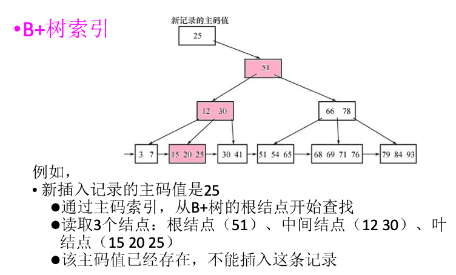
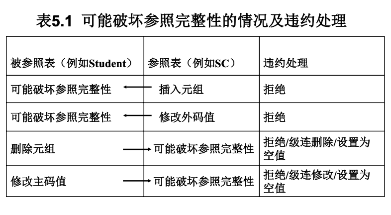

---
tags:
- DA
- SQL
---

# SQL

!!! chatgpt-summary "GPT"
    本文内容部分由GPT生成，请注意甄别。

    另有部分内容来自`复旦大学.管理学院.数据库与企业数据管理`课程。

    其他内容来自互联网。

数据是一切分析的起点，而SQL就是从数据库中提取这些数据的工具。

## SQL的特点

结构化查询语言（SQL）是关系数据库的标准语言。它有以下特点：

1. **综合统一**：它集数据定义语言（DDL）、数据操纵语言（DML）、数据查询语言（DQL）的功能于一体。可以独立完成数据库生命周期中的全部活动。
2. **标准化**：SQL 是一个广泛接受的标准，并且有不同的数据库系统实现，但基本语法和功能是相似的。
3. **高度过程化**：SQL 让用户声明他们希望从数据库中得到什么结果，而不是如何得到这个结果。存取路径的选择和SQL操作过程由DBMS自动完成。
4. **基于集合**：SQL 的操作是基于集合理论（关系代数），能有效处理表与表之间的关系。

## SQL的基本功能

SQL包含以下功能：

| **类别**     | **SQL 关键字** | **用途** |
|-------------|--------------|---------|
| **数据查询 (DQL)** | `SELECT` | 查询数据库中的数据 |
| **数据操作 (DML)** | `INSERT` | 插入数据到表中 |
|             | `UPDATE` | 修改表中的数据 |
|             | `DELETE` | 删除表中的数据 |
| **数据库定义 (DDL)** | `CREATE` | 创建数据库对象（如表、视图等） |
|             | `DROP` | 删除数据库对象 |
|             | `ALTER` | 修改表结构 |
|             | `TRUNCATE` | 清空表数据（不可回滚） |
| **权限控制 (DCL)** | `GRANT` | 授予权限 |
|             | `REVOKE` | 撤销权限 |
| **事务控制 (TCL)** | `COMMIT` | 提交事务 |
|             | `ROLLBACK` | 回滚事务 |
|             | `SAVEPOINT` | 设置事务保存点 |
| **其他**     | `EXPLAIN` | 分析SQL执行计划 |
|             | `SHOW` | 显示数据库信息 |

### 基本表操作

- 创建基本表：

```sql
CREATE TABLE statistics (
    id BIGINT NOT NULL AUTO_INCREMENT,
    class_id BIGINT NOT NULL UNIQUE,
    average DOUBLE NOT NULL,
    PRIMARY KEY (id)
);
```

- 修改基本表：

```sql
ALTER TABLE students ADD INDEX idx_score (score); -- 增加index
ALTER TABLE students DROP COLUMN birthday;        -- 删除列
```

- 删除基本表：

```sql
DROP TABLE students;
```

!!! note "MySQL"
    MySQL中并不强调Schema这个概念。所以没有专门的操作。

### 完整性约束

在创建表的时候可以建立一些完整性约束，来保障数据库的完整性。

#### 实体完整性

创建表的时候需要定义PRIMARY KEY。

这个定义可以是**列级**或者**表级**。如果是单属性作为主键，那么列级和表级都可以；如果是多属性作为主键，那么只能在表级进行定义。

```sql
CREATE TABLE statistics (
    stu_id CHAR(9),
    class_id CHAR(2),
    score DOUBLE NOT NULL,
    PRIMARY KEY (stu_id) -- 表级设置主键
);
```

```sql
CREATE TABLE statistics (
    stu_id CHAR(9) PRIMARY KEY, -- 列级设置主键
    class_id CHAR(2),
    score DOUBLE NOT NULL,
);
```

```sql
CREATE TABLE statistics (
    stu_id CHAR(9),
    class_id CHAR(2),
    score DOUBLE NOT NULL,
    PRIMARY KEY (stu_id, class_id) -- 表级设置多属性主键
);
```

违约处理：主键不唯一，或者主键属性存在空值的情况下，拒绝此次操作。

这个过程需要进行索引：

<figure markdown>

{width=400}

<figurecaption>B+树索引处理违约</figurecaption>
</figure>

#### 参照完整性

在创建表的时候，

- 使用`FOREIGN KEY`定义外键
- 使用`REFERENCES`指明外键参考哪些表的主键

违约处理：

<figure markdown>

{width=400}

<figurecaption>参照完整性的违约处理</figurecaption>
</figure>

#### 用户定义的完整性

在创建表的时候，我们还可以自定义一些完整性约束。

首先是属性约束：

- `NOT NULL`：非空
- `UNIQUE`：唯一
- `CHECK expr`：自定义表达式

例如，我们可以要求`sex`必须取值为男女：

```sql
CREATE TABLE statistics (
    stu_id CHAR(9),
    sex CHAR(2) CHECK (sex IN ('男', '女'))
);
```

其次是元组约束：依然是使用`CHECK`关键字，可以在表级定义元组约束条件。

例如，要求名字以`Ms.`开头的学生不能是男性：

```sql
CREATE TABLE statistics (
    stu_id CHAR(9),
    stu_name CHAR(12),
    sex CHAR(2) CHECK (sex IN ('男', '女')),
    CHECK(sex='女' OR stu_name NOT LIKE 'Ms.%')
);
```

#### CONSTRAINT子句

当然，我们也可以通过CONSTRAINT子句来表述约束，并且给约束加上名称，方便后续进行更改。

例如：

```sql
CREATE TABLE statistics (
    stu_id CHAR(9),
    stu_name CHAR(12),
    sex CHAR(2) CHECK (sex IN ('男', '女')),
    CONSTRAINT C1 CHECK(sex='女' OR stu_name NOT LIKE 'Ms.%')
);
```

后续就可以修改这个约束：

```sql
ALTER TABLE statistics DROP CONSTRAINT C1;
```

### 触发器

触发器是用户定义在表上的**事件驱动**的特殊过程：

- 触发器保存在数据库服务器中
- 任何用户对表的增删改查都会激活相应的触发器
- 触发器可以实施更为复杂的检查和操作，具有更精细和更强大的数据控制能力

触发器有以下属性：

- 触发时机：
    - BEFORE：在数据操作（如INSERT、UPDATE、DELETE）执行前触发。
    - AFTER：在数据操作执行后触发。
- 触发事件：
    - INSERT：插入数据时触发。
    - UPDATE：更新数据时触发。
    - DELETE：删除数据时触发。
- 作用对象：
    - 触发器绑定到具体的表，且每个触发器仅关联一个表。
- 执行粒度：
    - FOR EACH ROW：每行数据变更都会触发一次（MySQL仅支持行级触发器）。

#### 语法

- 创建触发器：

```sql
CREATE TRIGGER trigger_name
{BEFORE | AFTER} {INSERT | UPDATE | DELETE}
ON table_name
FOR EACH ROW
BEGIN
    -- 触发器逻辑（使用NEW和OLD访问数据）
END;
```

- 查看触发器

```sql
SHOW TRIGGERS FROM database_name;
-- 或查询information_schema
SELECT * FROM information_schema.triggers 
WHERE trigger_schema = 'database_name';
```

- 删除触发器

```sql
DROP TRIGGER [IF EXISTS] trigger_name;
```

### 索引操作

建立索引可以加快查询的速度。关系数据库中常见的索引有：

- 顺序文件的索引
- B+树索引：**动态平衡**
- 散列索引（Hash）：**索引速度快**
- 位图索引

??? chatgpt-summary "Ask GPT: B+树索引和Hash索引？"

    在数据库中，**B+树索引** 和 **哈希索引** 是两种常见的索引类型，用于加速数据检索。它们各自有不同的工作原理、优缺点和适用场景。

    <h3>**B+树索引**</h3>

    #### 工作原理：
    - **B+树** 是一种自平衡的树数据结构，适用于对大量数据进行快速查找、插入、删除等操作。B+树是 B 树的变种，它保持了所有叶子节点在同一层，并且每个节点只存储键值（而不是数据）。
    - 在 B+ 树中，数据存储在叶子节点，而非叶子节点只存储键值，用来引导查询路径。叶子节点通过链表连接，可以进行范围查询。

    #### 特点：
    - **顺序存储**：B+树的叶子节点通过链表相互连接，支持范围查询，适合用于区间查找。
    - **自平衡**：树的高度保持平衡，查找、插入和删除操作的时间复杂度为 `O(log N)`。
    - **支持范围查询**：因为叶子节点是按顺序排列的，可以高效地进行范围查找（例如查找所有在某个范围内的记录）。

    #### 创建 B+ 树索引：
    在 SQL 中，你可以通过 `CREATE INDEX` 创建 B+树索引（大多数数据库系统默认使用 B+树作为索引实现）。
    ```sql
    CREATE INDEX index_name ON table_name (column1, column2, ...);
    ```

    #### 优点：
    - **支持范围查询**：B+ 树特别适合进行范围查询（如 `BETWEEN`, `>` 或 `<`）。
    - **高效的查找、插入和删除**：由于树的平衡结构，查找、插入和删除操作的复杂度为 `O(log N)`。
    - **顺序访问**：叶子节点链表支持顺序访问，可以高效地进行范围查询和排序。

    #### 缺点：
    - **空间消耗大**：由于每个节点都要存储指针，B+树的空间消耗相对较大。
    - **更新操作较慢**：插入、删除操作需要重新平衡树，可能会较慢。

    #### 适用场景：
    - 适用于对 **范围查询** 和 **排序** 高效要求的场景，如 **大规模的数据检索** 和 **多列的联合查询**。

    ---

    <h3>**哈希索引**</h3>

    #### 工作原理：
    - **哈希索引** 使用哈希函数将索引键映射到一个固定大小的哈希表中。哈希函数根据键值生成一个哈希码，该哈希码直接指向数据的位置，从而实现快速查找。
    - 哈希索引只支持等值查询（即 `=` 操作），不支持范围查询（如 `>`、`<`、`BETWEEN`）。

    #### 特点：
    - **精确匹配**：哈希索引非常适合等值查询（例如查找某个特定值）。
    - **查找速度快**：通过哈希表的直接访问，查找时间通常为常数时间 `O(1)`。
    - **不支持范围查询**：哈希索引不适合用于范围查询，不能支持排序操作。

    #### 创建哈希索引：
    在支持哈希索引的数据库（如 MySQL）中，可以通过 `CREATE INDEX` 使用哈希索引类型（通常是使用 `HASH`）。
    ```sql
    CREATE INDEX index_name ON table_name (column_name) USING HASH;
    ```
    在 MySQL 中，默认的索引类型是 B+树索引。如果要创建哈希索引，可以通过 `USING HASH` 指定。

    #### 优点：
    - **高效的等值查询**：哈希索引在进行等值查询时非常高效，查询时间是常数时间 `O(1)`。
    - **快速查找**：在查找操作时，哈希索引直接通过哈希函数定位记录，不需要遍历数据。

    #### 缺点：
    - **不支持范围查询**：由于哈希表中的数据是按哈希值分布的，无法进行范围查询（例如，找出所有大于某个值的记录）。
    - **哈希冲突**：如果多个键值被哈希到相同的位置（哈希冲突），则需要处理冲突，这可能会影响性能。
    - **不适用于排序操作**：哈希索引无法按顺序访问数据，因此不能用来支持排序操作。

    #### 适用场景：
    - **等值查询**：适用于需要进行大量等值查找的场景，如通过主键或唯一键查找记录。
    - **快速定位**：哈希索引适用于频繁使用 `=` 操作的查询，且不需要排序或范围查询的场景。

    ---

    <h3>**B+树索引 vs 哈希索引**</h3>

    | 特性                 | **B+树索引**                               | **哈希索引**                          |
    |----------------------|--------------------------------------------|--------------------------------------|
    | **查询类型**         | 支持等值查询和范围查询                    | 仅支持等值查询（`=`）                 |
    | **查找速度**         | `O(log N)`，根据树的高度查找              | `O(1)`，通过哈希直接定位              |
    | **支持范围查询**     | 是，适合用于 `BETWEEN`、`>`、`<` 等操作   | 否，不支持范围查询                    |
    | **空间消耗**         | 较大，需要存储键值和指针                  | 较小，只存储哈希值和数据指针          |
    | **更新速度**         | 较慢，涉及树的重新平衡                    | 快，插入和删除操作较为简单            |
    | **排序**             | 支持排序，叶子节点按顺序排列               | 不支持排序                            |
    | **适用场景**         | 大规模数据检索，范围查询，排序            | 精确查找，主键和唯一键索引，性能要求高 |

    总结：
    - **B+树索引** 是最常见的索引类型，适用于需要 **范围查询** 和 **排序** 的场景，虽然它的性能在等值查询上不如哈希索引，但在多种查询类型中表现更为全面。
    - **哈希索引** 在进行等值查询时具有非常高的性能，适用于 **高效的精确查找**，但不适合范围查询和排序操作。

    根据实际需求选择合适的索引类型，可以显著提高数据库查询的效率。

索引由数据库的管理员创建，由DBMS自动维护，在查询的时候DBMS自动选取合适的索引来查询。用户无法显式选择索引。

- 创建索引：

```sql
CREATE INDEX index_name ON table_name (column1, column2, ...);
```

- 更改索引：

> `ALTER INDEX`似乎并不存在

```sql
-- MySQL 5.7 引入
ALTER TABLE RENAME INDEX old_index_name TO new_index_name
```

- 删除索引：

```sql
DROP INDEX index_name;
```

### 增删改查

- 增加数据：

```sql
INSERT 
INTO students (class_id, name, gender, score) 
VALUES (2, '大牛', 'M', 80);
```

- 删除数据：

```sql
DELETE FROM students WHERE id=1;
```

- 更新数据：

```sql
UPDATE students SET name='大牛', score=66 WHERE id=1;
```

- 查询数据：

```sql
SELECT * FROM students WHERE score >= 80;
```

### 空值处理

在域定义中，如果有`NOT NULL`约束，那么这个属性就不会为空。并且加了`UNIQUE`约束的属性也不能取空。此外，码属性显然不能取空。

可以使用`IS NULL`和`IS NOT NULL`来判断一个值是否为空。

空值和其他值的算术运算结果依然是`NULL`，比较运算的结果为`UNKNOWN`。

这样一来，SQL的逻辑结构就不再是二值（`TRUE-FALSE`）的，而是三值逻辑：

- `TRUE`
- `FALSE`
- `UNKNOWN`

他们的运算规则如下：

| A       | B       | A AND B | A OR B  | NOT A  |
|---------|---------|---------|---------|--------|
| TRUE    | TRUE    | TRUE    | TRUE    | FALSE  |
| TRUE    | FALSE   | FALSE   | TRUE    | FALSE  |
| TRUE    | UNKNOWN | UNKNOWN | TRUE    | FALSE  |
| FALSE   | TRUE    | FALSE   | TRUE    | TRUE   |
| FALSE   | FALSE   | FALSE   | FALSE   | TRUE   |
| FALSE   | UNKNOWN | FALSE   | UNKNOWN | TRUE   |
| UNKNOWN | TRUE    | UNKNOWN | TRUE    | UNKNOWN|
| UNKNOWN | FALSE   | FALSE   | UNKNOWN | UNKNOWN|
| UNKNOWN | UNKNOWN | UNKNOWN | UNKNOWN | UNKNOWN|

!!! info "MySQL的UNKNOWN"
    在MySQL中，不会显式使用`UNKNOWN`，而是直接使用`NULL`，但是上述的三值逻辑规则依然适用。

### 视图操作

视图是从基本表派生的逻辑表（外模式）。使用视图可以：

1. 视图能简化用户的查询操作
2. 适当利用视图可以更清晰地表达查询
3. 提供多种视角看待同一数据
4. 对重构数据库提供了一定程度的逻辑独立性
5. 能一定程度保护机密数据，对不同用户可以定义不同视图

- 创建视图

```sql
CREATE VIEW 视图名 AS SELECT 查询语句;
```

- 删除视图

```sql
DROP VIEW 视图名;
```

- 查询视图

```sql
SELECT * FROM 视图名;
```

- 更新视图

```sql
-- 修改视图
UPDATE 视图名 SET 列名 = 新值 WHERE 条件;

-- 删除数据
DELETE FROM 视图名 WHERE 条件;

-- 插入数据
INSERT INTO 视图名 (列名1, 列名2, ...) VALUES (值1, 值2, ...);
```

> 和`INDEX`类似，`VIEW`也不存在`ALTER`操作。

!!! warning "同步修改"
    对视图的修改会转化为对基本表的修改。但是不同的DBMS转化规则是不同的。

    例如，现在有一个`Sdept=IS`的视图`IS_Student`（信息系学生），我想要添加一个新的学生：
    ```sql
    INSERT INTO IS_Student VALUES ('20250125', '阿三', 20);
    ```
    一般情况下，他会转化为：
    ```sql
    INSERT INTO IS_Student (Sno, Sname, Sage, Sdept) VALUES ('20250125', '阿三', 20, 'IS');
    ```
    但是在SQL Server和MySQL中，都会转化为：
    ```sql
    INSERT INTO IS_Student (Sno, Sname, Sage, Sdept) VALUES ('20250125', '阿三', 20, NULL);
    ```
    还是挺坑的？

## 花式查询

作为打工人，说实话根本没什么机会自己设计、创建数据库，日常都是增删改查。甚至，日常都是查询数据库，增删改的权限都没有😭

所以我们重点学习查询的方法。

!!! info "MySQL"
    上一节的大部分内容对SQL是通用的，而这一节的内容则完全来自MySQL 8.4的文档，可能对其他的DBMS不适用。

    另外这节部分例子会在廖雪峰SQL教程网站[在线执行](https://liaoxuefeng.com/books/sql/sql-online/index.html)。我会把部分输出结果展示出来方便大家理解。

    === "查询"

        ```sql
        SELECT * FROM students, classes WHERE students.class_id == classes.id
        ```
    
    === "output"

        ```text
        id class_id name gender score id name
        1 1 小明 M 90 1 一班
        2 1 小红 F 95 1 一班
        3 1 小军 M 88 1 一班
        4 1 小米 F 73 1 一班
        5 2 小白 F 81 2 二班
        6 2 小兵 M 55 2 二班
        7 2 小林 M 85 2 二班
        8 3 小新 F 91 3 三班
        9 3 小王 M 89 3 三班
        10 3 小丽 F 88 3 三班
        ```

### [WITH语句](https://dev.mysql.com/doc/refman/8.4/en/with.html)

> 生成Common table expression (CTE)，用于后续查询

```sql
WITH [RECURSIVE]
    cte_name [(col_name [, col_name] ...)] AS (subquery)
    [, cte_name [(col_name [, col_name] ...)] AS (subquery)] ...
```

例如：

```sql
WITH
  cte1 AS (SELECT a, b FROM table1),
  cte2 AS (SELECT c, d FROM table2)
SELECT b, d FROM cte1 JOIN cte2
WHERE cte1.a = cte2.c;
```

### [SELECT语句](https://dev.mysql.com/doc/refman/8.4/en/select.html)

`SELECT`是使用频率最高的语句，它的结构如下：

```sql
SELECT
    -- 查询选项
    [ALL | DISTINCT | DISTINCTROW ]
    [HIGH_PRIORITY]
    [STRAIGHT_JOIN]
    [SQL_SMALL_RESULT] [SQL_BIG_RESULT] [SQL_BUFFER_RESULT]
    [SQL_NO_CACHE] [SQL_CALC_FOUND_ROWS]
    -- 可以多个表达式
    select_expr [, select_expr] ... 
    [into_option]
    -- FROM子句
    [FROM table_references
      [PARTITION partition_list]]
    -- WHERE子句
    [WHERE where_condition]
    -- GROUP子句
    [GROUP BY {col_name | expr | position}, ... [WITH ROLLUP]]
    -- HAVING字句
    [HAVING where_condition]
    -- 窗口函数
    [WINDOW window_name AS (window_spec)
        [, window_name AS (window_spec)] ...]
    -- ORDER字句
    [ORDER BY {col_name | expr | position}
      [ASC | DESC], ... [WITH ROLLUP]]
    -- 输出限制
    [LIMIT {[offset,] row_count | row_count OFFSET offset}]
    [into_option]
    -- 锁
    [FOR {UPDATE | SHARE}
        [OF tbl_name [, tbl_name] ...]
        [NOWAIT | SKIP LOCKED]
      | LOCK IN SHARE MODE]
    [into_option]
```

其中

```sql
into_option: {
    INTO OUTFILE 'file_name'
        [CHARACTER SET charset_name]
        export_options
  | INTO DUMPFILE 'file_name'
  | INTO var_name [, var_name] ...
}

export_options:
    [{FIELDS | COLUMNS}
        [TERMINATED BY 'string']
        [[OPTIONALLY] ENCLOSED BY 'char']
        [ESCAPED BY 'char']
    ]
    [LINES
        [STARTING BY 'string']
        [TERMINATED BY 'string']
    ]
```

### 查询选项

- `ALL / DISTINCT / DISTINCTROW`：控制是否去重。
- `HIGH_PRIORITY`：提高查询的优先级。
- `STRAIGHT_JOIN`：强制按照指定顺序连接表。
- `SQL_SMALL_RESULT / SQL_BIG_RESULT`：指定查询结果集的大小，用于优化`GROUP`等操作。
- `SQL_BUFFER_RESULT`：将结果存储在内存中的临时表中。
- `SQL_NO_CACHE`：禁止查询缓存。
- `SQL_CALC_FOUND_ROWS`：计算总行数但不受 LIMIT 影响。

### 查询表达式

#### `*`的用法

- 可以单独使用
- 也可以放在表名后面：`table.*`

```sql
-- 单表
SELECT * FROM t1
SELECT id, t1.* FROM t1
SELECT AVG(score), t1.* FROM t1
-- 多表
SELECT t1.*, t2.* FROM t1 INNER JOIN t2
```

#### 别名

在查询表达式中可以使用各种函数，计算结果可以使用别名（alias）：

```sql
SELECT CONCAT(last_name,', ',first_name) AS full_name
  FROM mytable ORDER BY full_name;
-- 等同于
SELECT CONCAT(last_name,', ',first_name) full_name
  FROM mytable ORDER BY full_name;
```

#### 常用的函数

聚合函数：

```sql
COUNT()
SUM()
AVG()
MAX()
MIN()
GROUP_CONCAT()
STDDEV()
STDDEV_POP()
STDDEV_SAMP()
VARIANCE()
VAR_POP()
VAR_SAMP()
BIT_AND()
BIT_OR()
BIT_XOR()
JSON_ARRAYAGG()
JSON_OBJECTAGG()
```

非聚合的函数：

```sql
-- 数学函数
ABS()
CEIL()
FLOOR()
ROUND()
MOD()
POW()
SQRT()
EXP()
LOG()
RAND()
TRUNCATE()

-- 字符串函数
CONCAT()
CONCAT_WS()
LENGTH()
CHAR_LENGTH()
SUBSTRING()
LEFT()
RIGHT()
LOWER()
UPPER()
TRIM()
REPLACE()
LOCATE()
INSTR()
LPAD()
RPAD()
REVERSE()

-- 日期和时间函数
NOW()
CURDATE()
CURTIME()
DATE()
TIME()
YEAR()
MONTH()
DAY()
HOUR()
MINUTE()
SECOND()
DATE_ADD()
DATE_SUB()
TIMESTAMPDIFF()
TIMESTAMPADD()
STR_TO_DATE()
DATE_FORMAT()

-- 控制流函数
IF()
IFNULL()
NULLIF()
COALESCE()

-- 加密和哈希函数
MD5()
SHA1()
SHA2()
PASSWORD()
UUID()

-- JSON 函数
JSON_EXTRACT()
JSON_UNQUOTE()
JSON_OBJECT()
JSON_ARRAY()
JSON_CONTAINS()
JSON_LENGTH()

-- 其他实用函数
VERSION()
DATABASE()
USER()
CONNECTION_ID()
SESSION_USER()
CURRENT_USER()
```

### [OVER子句](https://dev.mysql.com/doc/refman/8.4/en/window-functions-usage.html)

MySQL中还有一类特殊的函数，必须要搭配OVER子句使用，那就是窗口函数：

```sql
CUME_DIST()
DENSE_RANK()
FIRST_VALUE()
LAG()
LAST_VALUE()
LEAD()
NTH_VALUE()
NTILE()
PERCENT_RANK()
RANK()
ROW_NUMBER()
```

OVER子句的语法是：

```sql
over_clause:
    {OVER (window_spec) | OVER window_name}
```

也就是说，要么OVER一个已经定义的窗口，要么直接在OVER之后定义一个新的窗口。

例如最常见的RANK函数，不难理解，想要计算排序就必须指明**对哪些人**进行排序、**按照什么标准**进行排序。

=== "查询"

    ```sql
    SELECT class_id, name, RANK() OVER (
            PARTITION BY
                class_id
            ORDER BY score DESC
        ) AS rank, score
    FROM students;
    ```

=== "output"
    输出班级内分数排名：

    ```text
    class_id|name|rank|score
    1|小红|1|95
    1|小明|2|90
    1|小军|3|88
    1|小米|4|73
    2|小林|1|85
    2|小白|2|81
    2|小兵|3|55
    3|小新|1|91
    3|小王|2|89
    3|小丽|3|88
    ```

当然，不是窗口函数也可以搭配OVER子句使用。

例如:

=== "查询"

    ```sql
    SELECT class_id, name, MAX(score) OVER (
            PARTITION BY
                class_id
            ORDER BY score DESC
        ) AS top_score, score
    FROM students;
    ```

=== "output"
    输出的时候带着每个班的最高分：
    ```text
    class_id|name|top_score|score
    1|小明|95|90
    1|小红|95|95
    1|小军|95|88
    1|小米|95|73
    2|小白|85|81
    2|小兵|85|55
    2|小林|85|85
    3|小新|91|91
    3|小王|91|89
    3|小丽|91|88
    ```

### [WINDOW子句](https://dev.mysql.com/doc/refman/8.4/en/window-functions-named-windows.html)

WINDOW子句可以定义一个named-window，在复用这个窗口的时候简化代码。它的语法是：

```sql
WINDOW window_name AS (window_spec)
    [, window_name AS (window_spec)] ...

window_spec:
    [window_name] [partition_clause] [order_clause] [frame_clause]

partition_clause:
    PARTITION BY expr [, expr] ...

order_clause:
    ORDER BY expr [ASC|DESC] [, expr [ASC|DESC]] ...
```

[frame_clause](https://dev.mysql.com/doc/refman/8.4/en/window-functions-frames.html)比较复杂：

```sql
frame_clause:
    frame_units frame_extent

frame_units:
    {ROWS | RANGE}

frame_extent:
    {frame_start | frame_between}

frame_between:
    BETWEEN frame_start AND frame_end

frame_start, frame_end: {
    CURRENT ROW
  | UNBOUNDED PRECEDING
  | UNBOUNDED FOLLOWING
  | expr PRECEDING
  | expr FOLLOWING
}
```

例如：

=== "查询"

    ```sql
    SELECT 
        class_id, 
        name, 
        MAX(score) OVER cls, 
        MIN(score) OVER cls, 
        score 
    FROM students 
    WINDOW cls AS (PARTITION BY class_id);
    ```

=== "output"
    带上每个班级的最高分和最低分：
    ```text
    1|小明|95|73|90
    1|小红|95|73|95
    1|小军|95|73|88
    1|小米|95|73|73
    2|小白|85|55|81
    2|小兵|85|55|55
    2|小林|85|55|85
    3|小新|91|88|91
    3|小王|91|88|89
    3|小丽|91|88|88
    ```

当然，在复用的时候还可以进一步更改：

=== "查询"

    ```sql
    SELECT 
        class_id, 
        name, 
        MAX(score) OVER cls, 
        RANK() OVER (cls ORDER BY score), 
        score 
    FROM students 
    WINDOW cls AS (PARTITION BY class_id);
    ```

=== "output"
    输出的时候带上每个班级的最高分和学生的分数排名：

    ```text
    1|小米|95|1|73
    1|小军|95|2|88
    1|小明|95|3|90
    1|小红|95|4|95
    2|小兵|85|1|55
    2|小白|85|2|81
    2|小林|85|3|85
    3|小丽|91|1|88
    3|小王|91|2|89
    3|小新|91|3|91
    ```

### [CASE语句](https://dev.mysql.com/doc/refman/8.4/en/case.html)

> 案例来自博客文章：[SQL - 利用Case When Then Else End 多条件判断](https://www.cnblogs.com/gengyufei/p/12614387.html)

在查询表达式中，可以嵌套`CASE`语句（类似if-else）来达到定制化的输出效果：

=== "查询"

    ```sql
    SELECT
        id,
        class_id,
        name,
        (CASE WHEN score < 60 THEN '不及格'
            WHEN score >= 60 AND score < 80 THEN '及格'
            WHEN score >= 80 THEN '优秀'
            ELSE '异常' END) AS REMARK
    FROM
        students
    ORDER BY REMARK
    ```

=== "output"

    ```text
    id class_id name REMARK
    6 2 小兵 不及格
    1 1 小明 优秀
    2 1 小红 优秀
    3 1 小军 优秀
    5 2 小白 优秀
    7 2 小林 优秀
    8 3 小新 优秀
    9 3 小王 优秀
    10 3 小丽 优秀
    4 1 小米 及格
    ```

再比如，我想统计每个班级男生、女生的平均分数：

=== "查询"

    ```sql
    SELECT 
    class_id,
    ROUND(AVG(CASE WHEN gender = "M" THEN score ELSE NULL END), 2) AS M_avg,
    ROUND(AVG(CASE WHEN gender = "F" THEN score ELSE NULL END), 2) AS F_avg
    FROM students
    GROUP BY class_id;
    ```

=== "output"

    ```text
    class_id M_avg F_avg
    1 89 84
    2 70 81
    3 89 89.5
    ```

我合理猜测，2班是文科班。女生成绩比男生好太多了！

### [FROM子句](https://dev.mysql.com/doc/refman/8.4/en/join.html)

一个特殊的表：

```sql
SELECT 1 + 1 FROM DUAL;
-- 等同于
SELECT 1 + 1;
```

> 这个设计类似Linux中的`/dev/null`

当然我们也可以连接多个表，进行多表查询。连接的语法如下：

```sql
joined_table: {
    table_reference {[INNER | CROSS] JOIN | STRAIGHT_JOIN} table_factor [join_specification]
  | table_reference {LEFT|RIGHT} [OUTER] JOIN table_reference join_specification
  | table_reference NATURAL [INNER | {LEFT|RIGHT} [OUTER]] JOIN table_factor
}
join_specification: {
    ON search_condition
  | USING (join_column_list)
}
```

#### 笛卡尔积（CROSS JOIN）

如果直接用逗号连接两个表，就相当于从他们笛卡尔积的结果里进行查询：

=== "查询"

    ```sql
    SELECT * FROM classes, students;
    -- 等同于
    SELECT * FROM classes CROSS JOIN students;
    ```

=== "output"
    一般情况下笛卡尔积的结果没什么意义：

    ```text
    id class_id name gender score id name
    1 1 小明 M 90 1 一班
    1 1 小明 M 90 2 二班
    1 1 小明 M 90 3 三班
    1 1 小明 M 90 4 四班
    2 1 小红 F 95 1 一班
    2 1 小红 F 95 2 二班
    2 1 小红 F 95 3 三班
    2 1 小红 F 95 4 四班
    3 1 小军 M 88 1 一班
    3 1 小军 M 88 2 二班
    3 1 小军 M 88 3 三班
    3 1 小军 M 88 4 四班
    4 1 小米 F 73 1 一班
    4 1 小米 F 73 2 二班
    4 1 小米 F 73 3 三班
    4 1 小米 F 73 4 四班
    5 2 小白 F 81 1 一班
    5 2 小白 F 81 2 二班
    5 2 小白 F 81 3 三班
    5 2 小白 F 81 4 四班
    6 2 小兵 M 55 1 一班
    6 2 小兵 M 55 2 二班
    6 2 小兵 M 55 3 三班
    6 2 小兵 M 55 4 四班
    7 2 小林 M 85 1 一班
    7 2 小林 M 85 2 二班
    7 2 小林 M 85 3 三班
    7 2 小林 M 85 4 四班
    8 3 小新 F 91 1 一班
    8 3 小新 F 91 2 二班
    8 3 小新 F 91 3 三班
    8 3 小新 F 91 4 四班
    9 3 小王 M 89 1 一班
    9 3 小王 M 89 2 二班
    9 3 小王 M 89 3 三班
    9 3 小王 M 89 4 四班
    10 3 小丽 F 88 1 一班
    10 3 小丽 F 88 2 二班
    10 3 小丽 F 88 3 三班
    10 3 小丽 F 88 4 四班
    ```

通常笛卡尔积连接会搭配**WHERE子句**使用。

#### 内连接（INNER JOIN）

内连接返回两个表中匹配条件的行（交集），使用`ON`（需要写连接条件，可以写复合条件）或者`USING`（仅用于列名相同的情况，可以同时指定多个列名）指定连接条件。

如果省略条件则退化为`CROSS JOIN`。

此外`INNER`其实可以省略，MySQL默认的`JOIN`行为就是内连接。

=== "查询"

    ```sql
    -- 按照班级号来匹配
    SELECT * FROM classes INNER JOIN students ON classes.id = students.class_id;

    -- 等同于
    SELECT * FROM classes JOIN students ON classes.id = students.class_id;
    ```

=== "output"

    ```text
    id name id class_id name gender score
    1 一班 1 1 小明 M 90
    1 一班 2 1 小红 F 95
    1 一班 3 1 小军 M 88
    1 一班 4 1 小米 F 73
    2 二班 5 2 小白 F 81
    2 二班 6 2 小兵 M 55
    2 二班 7 2 小林 M 85
    3 三班 8 3 小新 F 91
    3 三班 9 3 小王 M 89
    3 三班 10 3 小丽 F 88
    ```

#### STRAIGHT_JOIN

这是MySQL的优化选项，STRAIGHT_JOIN的效果和INNER JOIN相同，但是不会改变表的左右顺序。

> STRAIGHT_JOIN is similar to JOIN, except that the left table is always read before the right table. This can be used for those (few) cases for which the join optimizer processes the tables in a suboptimal order.

#### 外连接（OUTER JOIN）

外连接分为左外连接（LEFT OUTER JOIN）、右外连接（RIGHT OUTER JOIN）和全外连接（FULL OUTER JOIN，FULL通常不用写）。

其中全外连接就是返回INNER JOIN的所有结果、外加两侧为匹配成功的结果。未匹配成功的行通常会出现NULL。

=== "查询"

    ```sql
    -- 先增加一个属于第五班的学生
    INSERT INTO students (class_id, name, gender, score) values (5, '新生', 'M', 88);

    -- 全外连接
    SELECT * FROM classes OUTER JOIN students ON classes.id = students.class_id;
    ```

=== "output"

    ```text
    id class_id name gender score id name
    1 1 小明 M 90 1 一班
    2 1 小红 F 95 1 一班
    3 1 小军 M 88 1 一班
    4 1 小米 F 73 1 一班
    5 2 小白 F 81 2 二班
    6 2 小兵 M 55 2 二班
    7 2 小林 M 85 2 二班
    8 3 小新 F 91 3 三班
    9 3 小王 M 89 3 三班
    10 3 小丽 F 88 3 三班
    11 5 新生 M 88 NULL NULL
    NULL NULL NULL NULL NULL 4 四班
    ```

左外连接就是只包含左侧未匹配的行：

=== "查询"

    ```sql
    -- 左外连接
    SELECT * FROM classes LEFT OUTER JOIN students ON classes.id = students.class_id;
    ```

=== "output"

    ```text
    id name id class_id name gender score
    1 一班 1 1 小明 M 90
    1 一班 2 1 小红 F 95
    1 一班 3 1 小军 M 88
    1 一班 4 1 小米 F 73
    2 二班 5 2 小白 F 81
    2 二班 6 2 小兵 M 55
    2 二班 7 2 小林 M 85
    3 三班 8 3 小新 F 91
    3 三班 9 3 小王 M 89
    3 三班 10 3 小丽 F 88
    4 四班 NULL NULL NULL NULL NULL
    ```

右外连接同理：

=== "查询"

    ```sql
    -- 右外连接
    SELECT * FROM classes RIGHT OUTER JOIN students ON classes.id = students.class_id;
    ```

=== "output"

    ```text
    id name id class_id name gender score
    1 一班 1 1 小明 M 90
    1 一班 2 1 小红 F 95
    1 一班 3 1 小军 M 88
    1 一班 4 1 小米 F 73
    2 二班 5 2 小白 F 81
    2 二班 6 2 小兵 M 55
    2 二班 7 2 小林 M 85
    3 三班 8 3 小新 F 91
    3 三班 9 3 小王 M 89
    3 三班 10 3 小丽 F 88
    NULL NULL 11 5 新生 M 88
    ```

#### 自然连接（NATURAL JOIN）

自然连接就是自动按照**同名同类型列**进行连接。

所以自然连接包括此前所有的连接方式：

- 自然内连接（NATURAL INNER JOIN）
- 自然左外连接（NATURAL LEFT OUTER JOIN）
- 自然右外连接（NATURAL RIGHT OUTER JOIN）
- 自然全外连接（NATURAL OUTER JOIN）

#### 自连接（self JOIN）

值得一提的是，在连接的时候不一定非要是不同的表进行连接。也可以进行自连接（自己和自己连接）。

例如：

=== "查询"

    ```sql
    SELECT * FROM students s1 CROSS JOIN students s2
    WHERE s1.score=s2.score AND s1.id != s2.id;
    ```

=== "output"
    可以查询得到所有分数相同的二人组：

    ```text
    id class_id name gender score id class_id name gender score
    3 1 小军 M 88 10 3 小丽 F 88
    3 1 小军 M 88 11 5 新生 M 88
    10 3 小丽 F 88 3 1 小军 M 88
    10 3 小丽 F 88 11 5 新生 M 88
    11 5 新生 M 88 3 1 小军 M 88
    11 5 新生 M 88 10 3 小丽 F 88
    ```

#### 嵌套查询

并且FROM的对象不一定非要是表，也可以是另外一个查询结果，这就是嵌套查询:

```sql
-- 从子查询中查询
SELECT ... FROM (subquery) [AS] tbl_name ...
-- JSON_TABLE也会生成一个表，可以进行查询
SELECT * FROM JSON_TABLE(arg_list) [AS] tbl_name ...
-- 可以指定列名
SELECT ... FROM (subquery) [AS] tbl_name (col_list) ...
```

例如：

=== "查询"

    ```sql
    SELECT * 
    FROM (SELECT * FROM students WHERE students.score>85) AS tmp 
    WHERE tmp.gender="M";
    ```

=== "output"

    ```text
    id|class_id|name|gender|score
    1|1|小明|M|90
    3|1|小军|M|88
    9|3|小王|M|89
    ```

嵌套查询的外层称为父查询，内层称为子查询。**一般情况下**子查询不要使用ORDER BY子句，因为它只是中间结果，排序了没什么意义。当然也不是不能用：

=== "查询"

    ```sql
    SELECT COUNT(*) 
    FROM (SELECT * FROM students WHERE students.score>85 ORDER BY score DESC LIMIT 3) AS tmp 
    WHERE tmp.gender="M";
    ```

=== "output"
    高于85分的前三名中，男生的数量：

    ```text
    1
    ```

### [WHERE子句](https://dev.mysql.com/doc/refman/8.4/en/expressions.html)

WHERE子句可以对查询的结果进行筛选，只输出满足条件的行。例如：

=== "查询"

    ```sql
    SELECT * FROM students s WHERE s.score>90;
    ```
    
=== "output"

    ```text
    id class_id name gender score
    2 1 小红 F 95
    8 3 小新 F 91
    ```

WHERE语句后面需要加上一个表达式，它的语法为：

```sql
expr:
    expr OR expr
  | expr || expr
  | expr XOR expr
  | expr AND expr
  | expr && expr
  | NOT expr
  | ! expr
  | boolean_primary IS [NOT] {TRUE | FALSE | UNKNOWN}
  | boolean_primary

boolean_primary:
    boolean_primary IS [NOT] NULL
  | boolean_primary <=> predicate
  | boolean_primary comparison_operator predicate
  | boolean_primary comparison_operator {ALL | ANY} (subquery)
  | predicate

comparison_operator: = | >= | > | <= | < | <> | !=

predicate:
    bit_expr [NOT] IN (subquery)
  | bit_expr [NOT] IN (expr [, expr] ...)
  | bit_expr [NOT] BETWEEN bit_expr AND predicate
  | bit_expr SOUNDS LIKE bit_expr
  | bit_expr [NOT] LIKE simple_expr [ESCAPE simple_expr]
  | bit_expr [NOT] REGEXP bit_expr
  | bit_expr

bit_expr:
    bit_expr | bit_expr
  | bit_expr & bit_expr
  | bit_expr << bit_expr
  | bit_expr >> bit_expr
  | bit_expr + bit_expr
  | bit_expr - bit_expr
  | bit_expr * bit_expr
  | bit_expr / bit_expr
  | bit_expr DIV bit_expr
  | bit_expr MOD bit_expr
  | bit_expr % bit_expr
  | bit_expr ^ bit_expr
  | bit_expr + interval_expr
  | bit_expr - interval_expr
  | simple_expr

simple_expr:
    literal
  | identifier
  | function_call
  | simple_expr COLLATE collation_name
  | param_marker
  | variable
  | simple_expr || simple_expr
  | + simple_expr
  | - simple_expr
  | ~ simple_expr
  | ! simple_expr
  | BINARY simple_expr
  | (expr [, expr] ...)
  | ROW (expr, expr [, expr] ...)
  | (subquery)
  | EXISTS (subquery)
  | {identifier expr}
  | match_expr
  | case_expr
  | interval_expr
```

还是挺复杂的。比较常用的是：

- join expression:
    - `AND, OR, XOR, NOT`或者对应的`&&, ||, !`
    - `IS`和`IS NOT`
- logic primary:
    - `IS NULL`和`IS NOT NULL`
    - 谓词：
        - `IN`
        - `BETWEEN`
        - `LIKE`
        - `SOUNDS LIKE`
        - `EXISTS`
    - 比较：
        - `>, <, =, <>, !=, >=, <=`
    - 量词（需要和比较运算符搭配使用）：
        - `ALL`
        - `ANY`
        - 例如:去掉最低分

            ```sql
            SELECT * FROM students 
            WHERE score > ANY(SELECT score FROM students);
            ```

并且在这里也可以嵌套子查询，例如：

=== "查询"

    ```sql
    SELECT * FROM students s WHERE s.score > (SELECT AVG(score) FROM students);
    ```

=== "output"
    高于平均分的学生：
    ```text
    id class_id name gender score
    1 1 小明 M 90
    2 1 小红 F 95
    3 1 小军 M 88
    7 2 小林 M 85
    8 3 小新 F 91
    9 3 小王 M 89
    10 3 小丽 F 88
    ```

那就更复杂了。

### GROUP BY子句

GROUP BY子句可以按照特定的列来把表中的记录进行分组，搭配**聚合函数**可以快速处理分组查询问题。

例如：

=== "查询"

    ```sql
    SELECT class_id, gender, AVG(score), COUNT(score) num
    FROM students GROUP BY gender,class_id;
    ```

=== "output"
    按照班级和性别分组的平均分：
    ```text
    class_id gender AVG(score) num
    1 M 89 2
    1 F 84 2
    2 F 81 1
    2 M 70 2
    3 F 89.5 2
    3 M 89 1
    ```

> MySQL中，在GORUP子句后还有一个`WITH ROLLUP`选项，可以在聚合的时候显示一个滚动统计。

### HAVING子句

HAVING 子句与 WHERE 子句类似，都是用于指定筛选条件。

WHERE 子句用于指定选择列表中列的条件，但不能引用聚合函数。而 HAVING 子句用于指定对分组的条件，可以使用聚合函数，这些分组通常是由 GROUP BY 子句形成的。

查询结果只包含满足 HAVING 条件的分组。（如果没有使用 GROUP BY，所有行会隐式地形成一个单独的聚合组。）

例如：

=== "查询"

    ```sql
    SELECT class_id, ROUND(AVG(score),2) avg_score
    FROM students GROUP BY class_id HAVING MAX(score)>90;
    ```

=== "output"
    依然按照班级分组，但是只显示有90分以上同学的班级：

    ```text
    class_id avg_score
    1 86.5
    3 89.33
    ```

### ORDER BY子句

ORDER BY子句就是对查询的结果进行排序。可以选择升序`ASC`或者降序`DESC`。

还可以指定多个列进行排序，例如：

=== "查询"

    ```sql
    SELECT class_id, name, score
    FROM students ORDER BY class_id ASC, score DESC;
    ```

=== "output"
    先按照班级排序，班级内部按照分数排序：

    ```text
    class_id name score
    1 小红 95
    1 小明 90
    1 小军 88
    1 小米 73
    2 小林 85
    2 小白 81
    2 小兵 55
    3 小新 91
    3 小王 89
    3 小丽 88
    ```

### LIMIT-输出限制

LIMIT选项可以限制输出的行数，还可以指定一个offset。

```sql
SELECT * FROM t LIMIT 3;
-- 等同于
SELECT * FROM t LIMIT 0, 3;
```

### [FOR-加锁](https://dev.mysql.com/doc/refman/8.4/en/innodb-locking-reads.html)

#### FOR UPDATE（排他锁）

对查询结果集加排他锁（X锁），其他事务无法对这些行加任何锁（包括共享锁或排他锁），直到当前事务提交或回滚。

例如：

```sql
START TRANSACTION;
-- 加锁查询
SELECT * FROM accounts WHERE id = 1 FOR UPDATE;
-- 执行更新操作（如转账）
UPDATE accounts SET balance = balance - 100 WHERE id = 1;
COMMIT;
```

#### FOR SHARE（共享锁）

> `FOR SHARE` 和 `LOCK IN SHARE MODE`效果一致，后者是旧版本的方式，不支持`NOWAIT`、`SKIP LOCKED`、`OF`等额外选项。无特殊情况建议使用`FOR SHARE`。

对查询结果集加共享锁（S锁），允许其他事务也加共享锁，但阻止其他事务加排他锁（即不能修改数据）。

例如：

```sql
START TRANSACTION;
SELECT * FROM products WHERE stock > 0 FOR SHARE;
-- 其他事务可以同时加共享锁，但不能修改库存
COMMIT;
```

#### 额外选项

OF子句可以指定加锁的表：

```sql
SELECT * FROM orders o
JOIN customers c ON o.customer_id = c.id
FOR UPDATE OF orders;
-- 仅锁定orders表的行，customers表不受影响
```

另外还有`NOWAIT`和`SKIP LOCKED`:

!!! quote "MySQL 8.4 select"
    NOWAIT causes a FOR UPDATE or FOR SHARE query to execute immediately, returning an error if a row lock cannot be obtained due to a lock held by another transaction.

    SKIP LOCKED causes a FOR UPDATE or FOR SHARE query to execute immediately, excluding rows from the result set that are locked by another transaction.

    NOWAIT and SKIP LOCKED options are unsafe for statement-based replication.

### [INTO子句](https://dev.mysql.com/doc/refman/8.4/en/select-into.html)

一个SELECT查询可以最多包含一个INTO子句：

```sql
into_option: {
    INTO OUTFILE 'file_name'
        [CHARACTER SET charset_name]
        export_options
  | INTO DUMPFILE 'file_name'
  | INTO var_name [, var_name] ...
}
```

但是位置不一定（详见SELECT的语法）：

```sql
-- 在FROM之前
SELECT * INTO @myvar FROM t1;
-- 在FROM之后，加锁之前
SELECT * FROM t1 INTO @myvar FOR UPDATE;
-- 在加锁之后
SELECT * FROM t1 FOR UPDATE INTO @myvar;
```

在加锁之后（也就是查询语句的最后）是推荐的位置。

INTO有多种输出方式：

- `SELECT ... INTO var_list` selects column values and stores them into variables.
- `SELECT ... INTO OUTFILE` writes the selected rows to a file. Column and line terminators can be specified to produce a specific output format.
- `SELECT ... INTO DUMPFILE` writes a single row to a file without any formatting.

不过现在大家一般都用DB软件（例如[DBeaver](https://dbeaver.io/)）了，很少直接写INTO子句。

### [集合操作](https://dev.mysql.com/doc/refman/8.4/en/set-operations.html)

最后，SELECT的结果还可以进行集合操作，语法也很简单：

```sql
query_block [set_op query_block] [set_op query_block] ...

query_block:
    SELECT | TABLE | VALUES

set_op:
    UNION | INTERSECT | EXCEPT
```

例如：

=== "查询"

    ```sql
    SELECT * FROM students WHERE score>90
    INTERSECT 
    SELECT * FROM students WHERE gender="F";
    ```

=== "output"
    超过90分的女生：

    ```text
    id|class_id|name|gender|score
    2|1|小红|F|95
    8|3|小新|F|91
    ```
