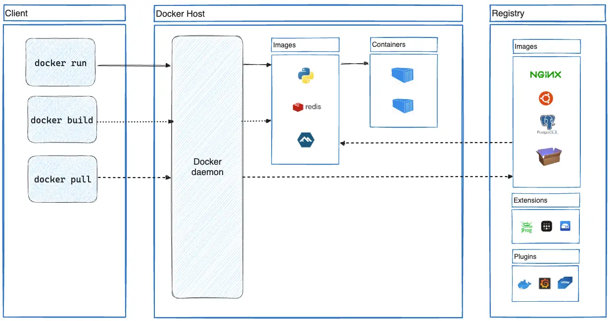

---
tags:
- Docker
---

# Docker简介

!!! cite "Official intro"
    Docker is an open platform for **developing, shipping, and running applications**. Docker enables you to separate your applications from your infrastructure so you can deliver software quickly. 

我们知道，操作系统的核心之一就是虚拟化技术。Docker正是利用这一技术提供了一个便捷高效的开发平台。

## 能干什么

在虚拟化环境中开发、承载、运行你的程序。

## Docker的组件


如上图所示，Docker可以分成三个部分：

- client（客户端）
    - 最简单的client就是命令行工具`docker`
    - 也有一些图形client，例如[Portainer](https://www.portainer.io/)就是一个很好用的Docker webui。
    - 客户端会按照规定发出docker api call，例如`docker run`、`docker pull`。
- host（服务端）
    - Docker daemon (dockerd)是服务端最重要的组件，他充当操作系统的角色，负责处理docker的api call。
    - dockerd还负责管理Docker的一切虚拟化资源，诸如`images`, `containers`, `networks`, 和 `volumes`。
- registry
    - Docker registry存储着Docker images，例如[Docker hub](https://hub.docker.com/)就是官方的Container Image Library
    - 之前国内也有很多的大型镜像站，例如清华、南大、中科大。但是现在几乎全被封禁了。只剩下几个小站可用。

??? question "Docker hub镜像被封？"
    消息来自：<https://pincong.rocks/article/72972>，读者自行甄别

    v2ex网友在docker hub开源的习近平语音合成器 <https://hub.docker.com/r/xijinping615/xi-jinping-tts> 目前获得了几千次下载，近日中共当局发布禁令，全网封禁docker镜像，避免中国网民获取习近平语音合成器，造成政治影响。

## 工作流程
Docker的基本工作流程就是

- `docker pull`从registery下载镜像文件
- `docker run`使用镜像文件创建一个容器，并且运行
- `docker stop`停止正在运行的容器

例如，我们想在`Python 3.11.5`的Linux环境上运行一些代码。

### docker pull
首先需要载image文件（我们这里使用了镜像网站<https://dockerpull.com/>）：

<div class='console'>

```console
$ docker pull dockerpull.com/python:3.11.5-alpine
3.11.5-alpine: Pulling from python
579b34f0a95b: Pull complete
00152206209d: Pull complete
0352034cc298: Pull complete
007744e5d86c: Pull complete
dd9ec8077f18: Pull complete
Digest: sha256:cd311c6a0164f34a7edbf364e05258b07d66d3f7bc155139dcb9bef88a186ded
Status: Downloaded newer image for dockerpull.com/python:3.11.5-alpine
dockerpull.com/python:3.11.5-alpine

```

</div>

### docker images
我们可以查看所有下载的image：

<div class='console'>

```console
$ docker images
REPOSITORY  TAG IMAGE ID    CREATED SIZE
dockerpull.com/python   3.11.5-alpine   65c818edda78    11 months ago   57.5MB


```

</div>

### docker run

然后就可以运行这个容器：

<div class='console'>

```console
$ docker run -it 65c818edda78
Python 3.11.5 (main, Sep 29 2023, 00:21:23) [GCC 12.2.1 20220924] on linux
Type "help", "copyright", "credits" or "license" for more information.
>>> 
```

</div>

我们这里使用的选项是`docker run -it`，意味着iteratively、terminal，所以会打开一个`python3.11.5`的终端。

我们也可以直接运行一些代码：

<div class='console'>

```console
$ docker run 65c818edda78 python -m this
The Zen of Python, by Tim Peters

Beautiful is better than ugly.
Explicit is better than implicit.
Simple is better than complex.
Complex is better than complicated.
Flat is better than nested.
Sparse is better than dense.
Readability counts.
Special cases aren't special enough to break the rules.
Although practicality beats purity.
Errors should never pass silently.
Unless explicitly silenced.
In the face of ambiguity, refuse the temptation to guess.
There should be one-- and preferably only one --obvious way to do it.
Although that way may not be obvious at first unless you're Dutch.
Now is better than never.
Although never is often better than *right* now.
If the implementation is hard to explain, it's a bad idea.
If the implementation is easy to explain, it may be a good idea.
Namespaces are one honking great idea -- let's do more of those!

```

</div>