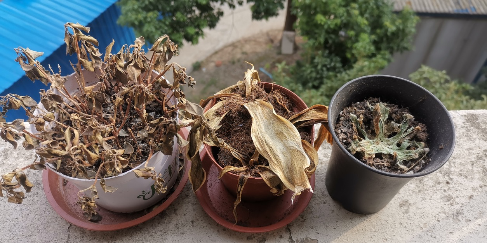
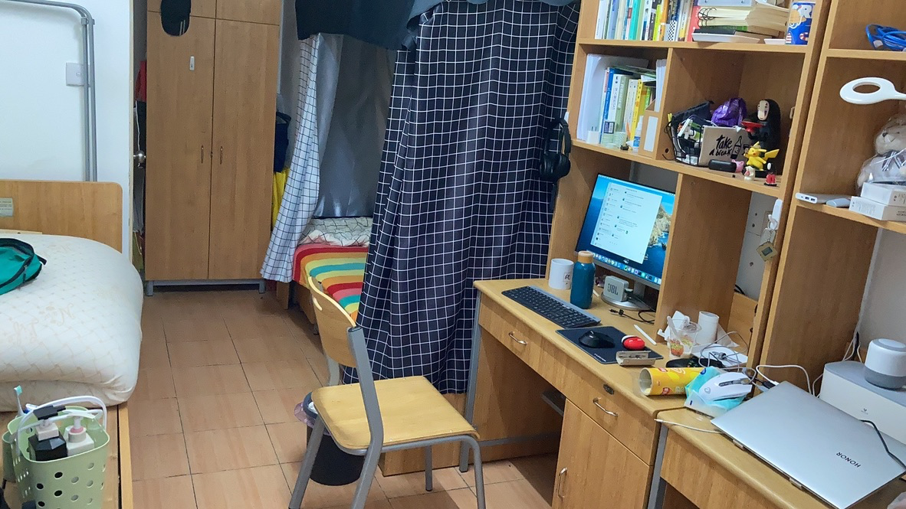
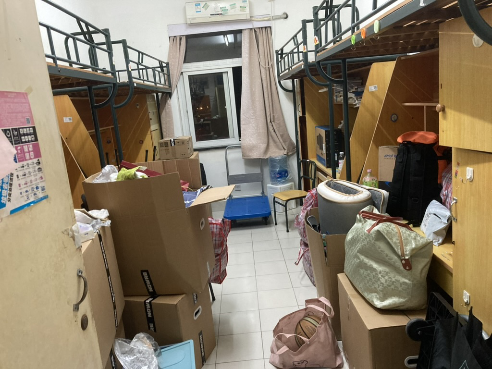
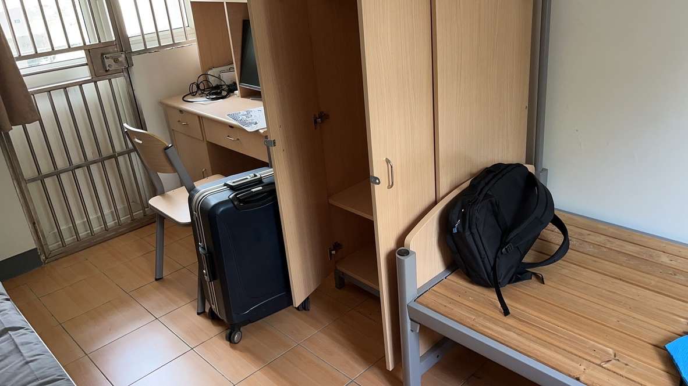

# 复旦生活<s>指南</s>回忆录

本来是想面向新生写一篇指南，写着写着发现。

其一，时效性太差。本站本就没什么人看，等被Google、Baidu等收录了、有人看了，很多信息就都已经失效了。**新生还是直接去问学长学姐更方便**。

其二，我还是想写回忆录，写给自己看罢。

## 我在复旦
我是19年入学的，本硕加起来到现在已经在复旦呆了五年有余。

### 大一
大一的记忆已经越发模糊了，那是疫情时代之前的校园生活。似乎明亮又灰暗。

那时候我们住在北区，饭卡充钱是需要去机器上操作的；洗澡是需要时刻注意**水控小钱包**的，我至今都没搞懂水控钱包的逻辑；北区食堂是还在装修的，我们都是蹭**济光学院**的饭；18号线是在建的，我们满怀期待地见证复旦的第一个地铁站开挖，<s>可惜还没挖好我们就搬走了</s>。<s>最可气的是就算18号线开通了，到现在2024年了校内的1号口还是不开！</s>

然后，放寒假了，COVID-19席卷而来。这个寒假直接连到了下一个暑假。

### 大二
好在，大二还是顺利开学了。只不过我的多肉永远地死去了。

<figure markdown>

{width=400}

</figure>

很快2020年的初雪来了，我的初恋也结束了。

好在，我们很快就被赶出了北区这个伤心地。因为本科生不配拥有四室一厅一卫的研究生宿舍，我们当初被分配过来是“权宜之计”。

再见了，我的独居快乐小屋：

<figure markdown>

{width=400}

</figure>

你好，东区：

<figure markdown>

{width=400}

</figure>

算是独一份吧，19级的复旦本科生都是在大三军训的。而且是和20级一起军训（正常来说复旦就是大二军训，19级因为😷延后了）。

可惜的是，实弹训练被取消了。我大概错失了我此生唯一的打枪机会。军训的合唱曲目倒是印象深刻些：

<iframe frameborder="no" border="0" marginwidth="0" marginheight="0" width=330 height=86 src="//music.163.com/outchain/player?type=2&id=41602866&auto=0&height=66"></iframe>

其他的什么也没记住。

### 大三
大三就在军训中拉开帷幕了，然后疫情又来了😠😡😠😡。我被困在了东区牢房，抢着学生超市限量销售的速溶咖啡、吃着上门的盒饭度过了大三。

<figure markdown>

 {width=300}

<figurecaption>
头发的长度正比于坐牢时间
</figurecaption>
</figure>

没有疫情的东区生活还是不错的，**五角场**就在身后、**大学路**就在脚边、**三号湾**也是抬头就能看见。吃吃喝喝，倒也快哉。

彼时的校园生活也发生了很大的改变。校园卡系统直接改天换地：e-card小程序几乎取代了线下的一卡通机器，复旦联名交通卡成为大家主要的支付方式。十八号线已经开通，虽然从哪个宿舍区过去都很远（北区离上海财经大学站、江湾镇站更近，南区有国权路站，东区和本部有江湾体育场站）。

不过**如果复旦大学站的1号口开通了**，一切都将改变，可惜开不得。等了一年又一年，1号口就是不开😠😡😠😡。

### 大四
意料之中，情理之中。只会吃喝玩乐LOL的我，职业发展规划一塌糊涂。在大学这所迷宫里，我晕头转向。大四的当下我已无路可走，只能选择发挥自己最后的余热，考个研吧。

彼时正是我们放弃和COVID-19抗争的时候，不幸的是我在考前染上了病，只能去阳性考场，陪大家一起边咳嗽边考试。万幸的是哥们运气不错，学校扩招了一个居然把我录取了。

### 研一
我写下本文的时间，正是研一期末刚结束的时刻。

这一年我又回到了北区，住上了熟悉的三室一厅两人间。和室友到处吃喝玩乐，偶尔旅游，尝试恋爱，努力科研。虽然到头来一事无成，但总感觉挺忙的。

<figure markdown>

 {width=400}
<figurecaption>
三室一厅的C房间是真小啊
</figurecaption>
</figure>

我在机缘巧合、脑袋一热之下加入了ZMIC，认识了很多新朋友，和不发工资的导师。工位从新金博搬到材料二楼，条件一落千丈但距离近了很多。我努力减少在宿舍的时间，增加在工位的时间。但是到头来花在PS5和床上的时间还是很多。

既往不咎，继续努力吧。

## 我想说

### 把握好自由
复旦的生活是很自由的。宿舍没有宵禁，想几点回去几点回去。学校也没有门禁，24小时都可以进出。绝大部分的课都不咋点名，就算被点到了没去也不会有辅导员来找你。拥有几乎完全的自由，也就意味着**你需要完全对自己负责**。

### 你需要更多朋友
朋友是必要的，这无需多言。是否多多益善就有待商榷了。

在我看来，核心朋友总归是只有那么几个。然而点赞之交，上课之友也是极有价值的。和不同人的交流，拓宽自己的视野和信息渠道是在大学这个迷宫里生存的必胜法宝。

### 上路吧
三山五岳、日韩欧美，想去哪玩就赶紧去。没钱就去做做家教、搞搞兼职，恰点米。说走就走的旅游是独属于大学生的娱乐，过时不候。当时只道是寻常啊～

## 补充细节

??? cite "一份生活质量问卷"
    > 来自<https://t.me/RiNGNiR/3571>

    一些很多人填报志愿时候不会问但是真的很影响大学生活质量的问题

    - 宿舍是上床下桌吗
    - 教室和宿舍有没有空调
    - 有独立卫浴吗？没有独立浴室的话，澡堂离宿舍多远
    - 有早自习、晚自习吗
    - 有晨跑吗
    - 每学期跑步打卡的要求是多少公里，可以骑车吗
    - 寒暑假放多久，每年小学期有多长
    - 学校允许点外卖吗，取外卖的地方离宿舍楼多远
    - 学校交通便利吗，有地铁吗，在市区吗，不在的话进城要多久
    - 宿舍楼有洗衣机吗
    - 校园网怎么样
    - 每天断电断网吗，几点开始断
    - 食堂价格贵吗，会吃出异物吗
    - 洗澡热水供应时间
    - 校园内可以骑电瓶车吗，电池在哪能充电
    - 宿舍限电情况，会没收违禁电器吗
    - 通宵自习有去处吗
    - 大一能带电脑吗
    - 学校里面用什么卡，饭堂怎样消费
    - 学校会给学生发银行卡吗
    - 学校的超市怎么样
    - 学校的收发快递政策怎么样，能发哪些快递，快递点离宿舍多远，快递点上下班时间
    - 学校里面的共享单车数目与种类如何
    - 现阶段学校的门禁情况如何
    - 宿舍晚上查寝吗，封寝吗，晚归能回去吗

[大学生活质量指北](https://colleges.chat)收集了一些匿名问卷，请看：

- <https://colleges.chat/universities/fu-dan-da-xue/>