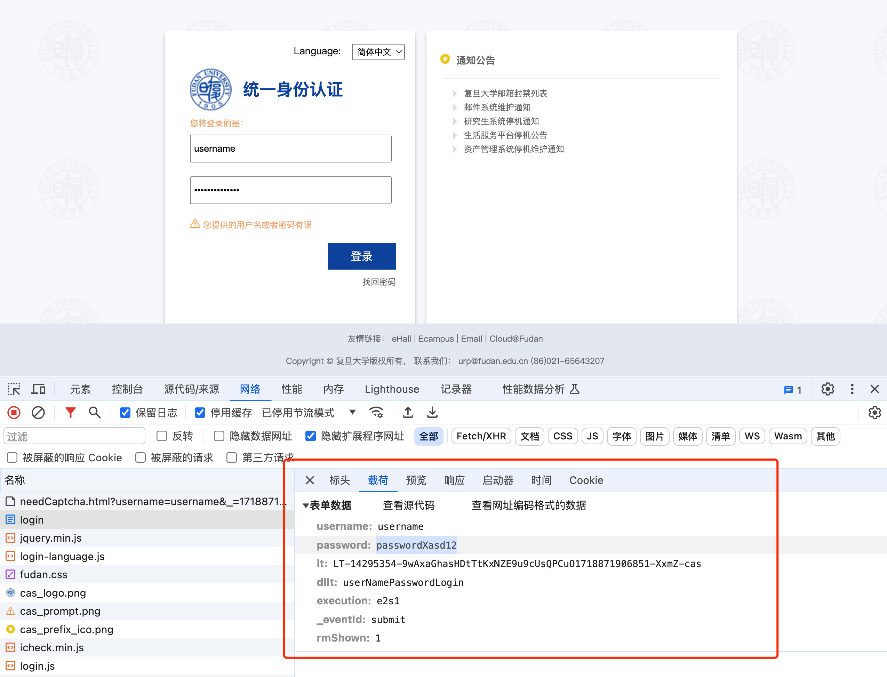
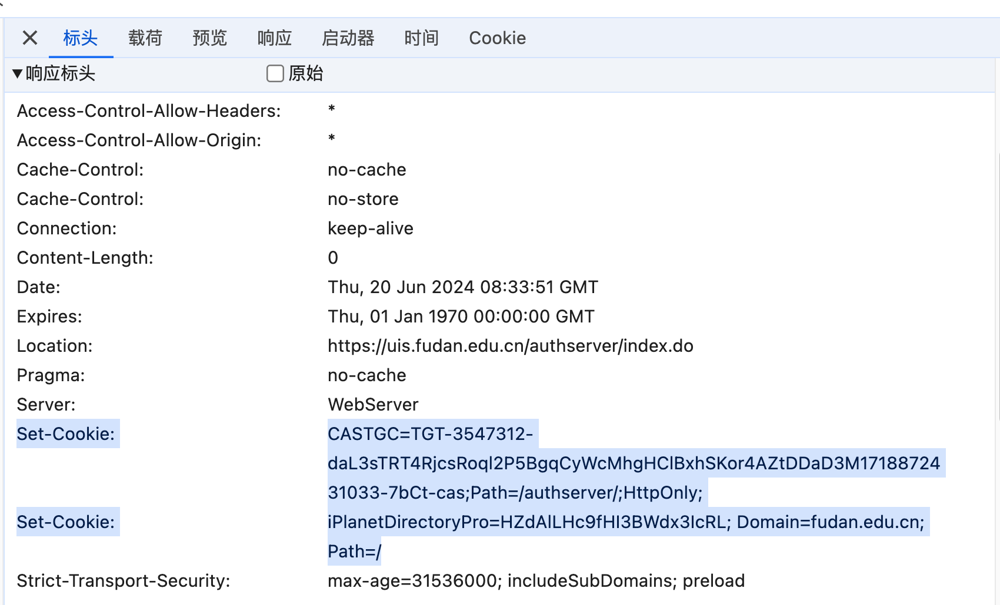
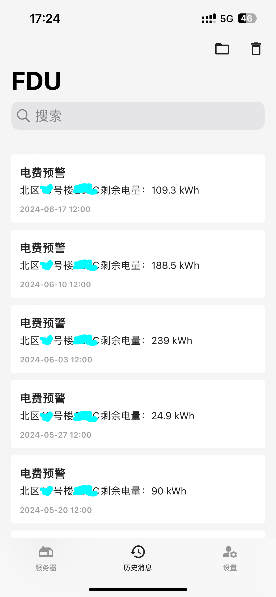

---
tags:
- FDU
- 爬虫
---

# 复旦的自动化生活

## UIS
众所周知，复旦几乎所有的服务都通过统一身份认证（UIS）来授权。所以如果你想写点脚本自动化完成一些工作，首先就需要完成自动化UIS。

<figure markdown>

{width=500}

</figure>

### 分析
打开<https://uis.fudan.edu.cn/authserver/login>网页，输入账号密码，简单一看。发现登陆就是一个POST请求。向服务器了下面的内容：

```bash
username: username
password: passwordXasd12
lt: LT-14295890-ojKGMfRZqtrrf5PRxGpV0fCbQHM2UG1718872213582-XxmZ-cas
dllt: userNamePasswordLogin
execution: e2s1
_eventId: submit
rmShown: 1
```

实际上，除了账号密码，其他的参数都是写在前端的：
```html
<input type="hidden" name="lt" value="LT-14295890-ojKGMfRZqtrrf5PRxGpV0fCbQHM2UG1718872213582-XxmZ-cas"/>
<input type="hidden" name="dllt" value="userNamePasswordLogin"/>
<input type="hidden" name="execution" value="e2s1"/>
<input type="hidden" name="_eventId" value="submit"/>
<input type="hidden" name="rmShown" value="1">
```

这其实是很常见的[CAS(Center Authentication Service)](https://developers.yale.edu/cas-central-authentication-service)，它是Yale大学开发的一款开源的单点登录项目，主要为web项目提供单点登录实现。

如果多次登陆失败还会触发图片验证码，需要额外提交验证码的内容：
```
captchaResponse: xxxx
```

登陆成功之后，服务器会给我们设置Cookie：

<figure markdown>

{width=500}

</figure>


拿着这个Cookie就可以访问其他网站啦。

### 模拟请求

- 设置环境变量：
```bash
export fudan_username=xxx
export fudan_password=xxx
```

- UIS认证
```python title="Python requests"
import os
from requests import Session
from parsel import Selector
# 构造请求Session
se = Session()
# GET请求，拿到页面的HTML
res = se.get('https://uis.fudan.edu.cn/authserver/login')
# 解析HTML，找到需要提交的值
sel = Selector(res.text)
hidden_input = dict(zip(
    sel.css('#casLoginForm > input[type=hidden]::attr(name)').getall(),
    sel.css('#casLoginForm > input[type=hidden]::attr(value)').getall()
))
# POST请求，发送表单
res = se.post(
    url='https://uis.fudan.edu.cn/authserver/login',
    data={
        "username": os.getenv('fudan_username'),
        "password": os.getenv('fudan_password'),
        **hidden_input
    }
)
# 如果登陆成功，页面上会有“安全退出”字样
assert '安全退出' in res.text, '登陆失败'
```

## 一卡通余额

然后你就可以做很多事情啦，比如我们来查一下一卡通的余额：

> 继续使用上面的`se`对象

```python
se.post(
    'https://my.fudan.edu.cn/data_tables/ykt_xx.json'
).json()
```

就可以得到一卡通的信息啦：

```json
{'draw': 0,
 'recordsTotal': 1,
 'recordsFiltered': 1,
 'data': [[
    'xxxxxxxxxxx',  // 学号
   '张杨',                              
   '正常',
   '是(江湾;枫林;张江;邯郸)',
   '2026-07-15',
   '12.96']]}
```

## 宿舍用电情况

直接请求：
```python
se.post(
    url='https://my.fudan.edu.cn/data_tables/ykt_xszsqyydqk.json',
    json={
        "draw": "1",
        "columns[0][data]": "0",
        "columns[0][name]": "",
        "columns[0][searchable]": "true",
        "columns[0][orderable]": "false",
        "columns[0][search][value]": "",
        "columns[0][search][regex]": "false",
        "columns[1][data]": "1",
        "columns[1][name]": "",
        "columns[1][searchable]": "true",
        "columns[1][orderable]": "false",
        "columns[1][search][value]": "",
        "columns[1][search][regex]": "false",
        "columns[2][data]": "2",
        "columns[2][name]": "",
        "columns[2][searchable]": "true",
        "columns[2][orderable]": "false",
        "columns[2][search][value]": "",
        "columns[2][search][regex]": "false",
        "start": "0",
        "length": "20",
        "search[value]": "",
        "search[regex]": "false",
    }
).json()
```
可以返回最近的用电情况：
```json
{'draw': 1,
 'recordsTotal': 8,
 'recordsFiltered': 8,
 'data': [
  ['邯郸/北区/999号楼/999', '2024-05-09', '5.9'],
  ['邯郸/北区/999号楼/999', '2024-05-08', '4.9'],
  ['邯郸/北区/999号楼/999', '2024-05-07', '7.0'],
  ['邯郸/北区/999号楼/999', '2024-05-06', '3.7'],
  ['邯郸/北区/999号楼/999', '2024-05-05', '5.9'],
  ['邯郸/北区/999号楼/999', '2024-05-04', '2.2'],
  ['邯郸/北区/999号楼/999', '2024-05-03', '2.1'],
  ['邯郸/北区/999号楼/999', '2024-05-02', '1314.5']]}
```

## 手机通知

建议搭配软件Bark使用：

<figure markdown>

[](https://github.com/Finb/Bark)

</figure>

可以实现宿舍电量预警，再也不怕写代码写到一半被断电啦！

<figure markdown>

{width=300}

</figure>


## 更多API

能干的事情还有很多，我就不再一一列举了，授人以渔吧。

一方面你可以去<https://ehall.fudan.edu.cn>、<https://my.fudan.edu.cn>等网站看看，可以找到很多api。

另外一方面，你可以去GitHub上看看已有的项目，例如旦夕：

<figure markdown>

[](https://github.com/DanXi-Dev/DanXi)

</figure>

他们已经收集了很多好用的api。

例如：

- 校车查询
- 空教室查询
- 教务处公告查询

等等。

## 脚本选课？

**我劝你不要干**，查查电费啥的学校发现也就发现了，估计没啥事。脚本选课则大概率是触及红线的。