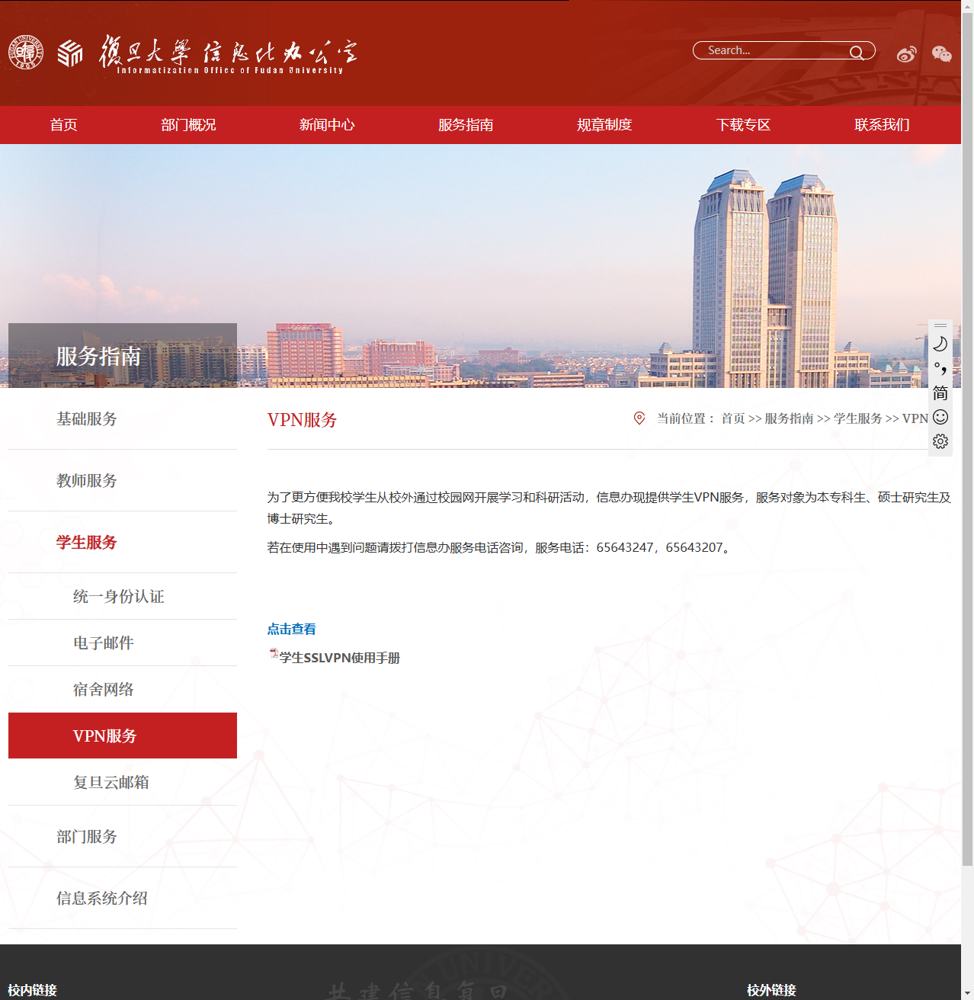
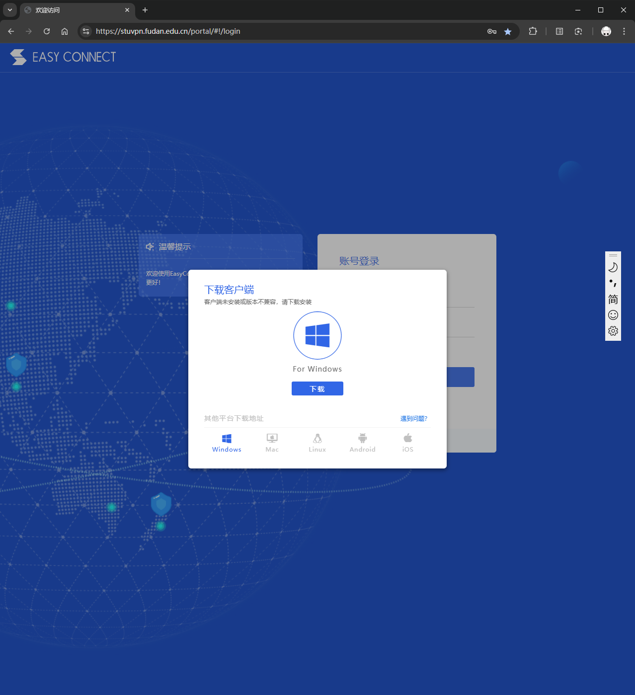
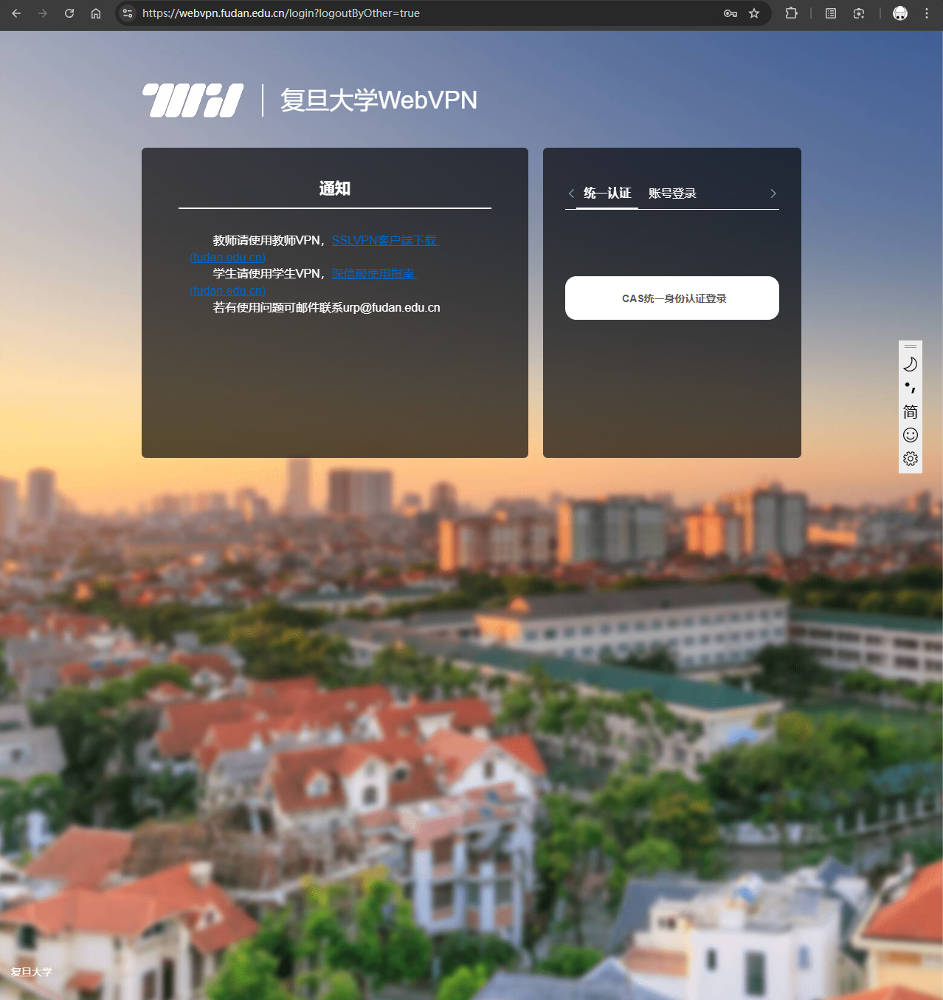
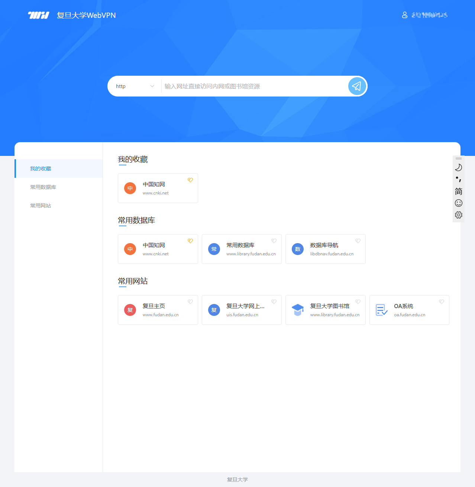

---
tags:
- FDU
- VPN
- Docker
---

# 复旦校园网VPN

## stuvpn

复旦为**学生**提供了[VPN服务](https://ecampus.fudan.edu.cn/wwwfw_33126/list.htm)，以便在校外可以访问校内的资源：



实际上也就是<https://stuvpn.fudan.edu.cn>这个服务器：



你可以按照页面上的指示下载对应的客户端，简单几步就可以连上了。

### 万恶的EasyConnect

然后这个客户端并不是很好用。

一方面他会强制接管所有的流量，开了之后有些基于局域网的软件就没法用了（例如LocalSend）。

另外一方面，作为一个网络工具、它实在是有点流氓。网上喷它的帖子还是很多的[^1]。

我之前也发现我的Mac有一个常驻进程，一搜才发现就是EasyConnect的服务，很多人都吐槽过：
!!! quote "Lufs's Blog：EasyConnect你想干甚？"
    > from <https://blog.isteed.cc/post/fuck-easyconnect-on-macos/>
    
    学校的 VPN 是用深信服的 EasyConnect，

    Mac 上安装时提示你安装证书，安装完成后我就赶紧去 钥匙串访问 里删掉这家伙的证书，之后登录过一次帐号就没再管它了……

    今天闲来无事翻看 活动监视器，发现一直有两非 ARM的进程在后台，停还停不掉，一查发现这玩意是深信服 EasyConnect 的常驻进程，强迫症表示马上就干掉它（

    ...

### docker-easyconnect
对于这样的流氓软件，Docker容器可谓是最好的监狱。

一搜就发现，先辈们早就搞定了，伟大：

<figure markdown>

[](https://github.com/docker-easyconnect/docker-easyconnect)

</figure>

按照它的文档，只需要一行代码[^2]就可以在命令行中开启一个Proxy服务器了：

```bash
touch ~/.easyconn # 创建一个文件用于存放持久化身份验证信息
docker run -d\
    --device /dev/net/tun \
    --cap-add NET_ADMIN \
    -v $HOME/.easyconn:/root/.easyconn \
    -p 127.0.0.1:1080:1080 \ # socks5 proxy
    -p 127.0.0.1:8888:8888 \ # http proxy
    -e EC_VER=7.6.7 \
    -e CLI_OPTS="-d stuvpn.fudan.edu.cn -u USERNAME -p PASSWORD"\
    hagb/docker-easyconnect:cli
```

然后就可以使用docker容器提供的proxy服务器了：

<div class='console'>

```console
$ http_proxy=127.0.0.1:8888 curl 10.138.46.1
```

</div>

### SSH代理配置

如果你要借助这个代理服务器来连接校园网内的服务器（我就是这个用途），你可以添加这样的ssh代理配置：
```bash title="Windows配置" hl_lines="5"
Host example
    HostName 1.1.1.1
    User root
    Port 22
    ProxyCommand "c:\Program Files\Git\mingw64\bin\connect.exe" -H 127.0.0.1:8888 %h %p
```
注意这里的`c:\Program Files\Git`是我的Git安装路径。

MacOS就可以直接使用`nc`命令了：
```bash title="MacOS配置" hl_lines="5"
Host example
    HostName 1.1.1.1
    User root
    Port 22
    ProxyCommand nc -X connect -x 127.0.0.1:8888 %h %p
```

## webvpn
当然，如果你只是想简单上个网页，还可以使用学校提供的[webvpn服务](https://webvpn.fudan.edu.cn)：



登录之后可以直接通过这个网页访问校园内网：



这个也是很方便的。
> 据我观察，知名的校内软件：**旦夕**就是用了这个服务来实现宿舍电费、教务通知、教室空位等内网信息的查询。

[^1]: 例如知乎：[sangfor文件如何彻底删除？](https://www.zhihu.com/question/333699380)
[^2]: 代码来自：[将 Sangfor EasyConnect 校园 VPN 关进 Docker 里](https://naiv.fun/Ops/sangfor-in-docker.html)，又是一个在骂Easy Connect的